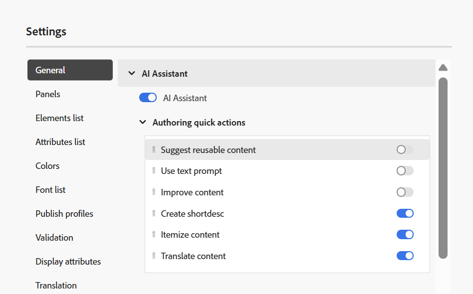

# 2025.08.0版的新增功能（2025年8月）

本文介紹2025.08.0版Adobe Experience Manager Guides as a Cloud Service所推出的新功能和增強功能。

有關此版本中的問題修正清單，請查看 [2025.08.0 版本中修正的問題](fixed-issues-2025-08-0.md)。

瞭解2025.08.0版[的](../release-info/upgrade-instructions-2025-08-0.md)升級指示。

## 增強的稽核工作流程

透過此版本，稽核工作流程已大幅提升，以更好地支援作者與稽核者之間的無縫溝通。 主要更新包括：

- 包含可操作通知的任務管理工作流程
- 標籤使用者以立即引起注意的功能
- 從檢閱面板存取專案和任務詳細資料以方便使用

透過這些增強功能，使用者現在可以預期：

- 有效率且即時的審查週期
- 減少意見交換期間的手動操作

如需詳細資訊，請檢視[檢閱簡介](../user-guide/review.md)

## 編輯器設定中可設定的AI助理動作

最新的更新引進了在AI Assistant中&#x200B;**製作快速動作**&#x200B;的增強設定，使管理員能夠根據特定的工作流程和偏好設定自訂製作環境。

啟用&#x200B;**AI小幫手**&#x200B;切換功能後，系統管理員可以選擇性地選擇可在&#x200B;**製作**&#x200B;標籤下看到哪些快速動作，以協助簡化作者互動。 這些可見度設定是每個資料夾設定檔專屬的。

在Experience Manager Guides的編輯器設定[中進一步瞭解](../cs-install-guide/workspace-settings.md#general)AI助理。

{width="350" align="left"}

## 改善建立和使用DITAVAL檔案的體驗

此更新引進了數項增強功能，可簡化建立、管理和套用DITAVAL檔案的程式，以便更妥善地控制各項輸出的條件式內容和樣式。

主要重點如下：

- **編寫DITAVAL檔案的增強標籤支援：** Experience Manager Guides提供新功能，可透過DITAVAL檔案的增強標籤支援來自訂內容發佈。 您現在可以在特定內容（包括影像）周圍套用開始和結束標幟，並透過粗體、斜體等格式選項豐富標幟的區段。 若要處理條件重疊，可以設定&#x200B;**樣式衝突**，包括設定預設背景和文字色彩，以確保輸出內容清晰一致。 原生PDF產生已完全支援這些標幟，而且產生的輸出會準確且全面反映所有套用的樣式元素。
如需詳細資訊，請檢視[使用DITAVAL編輯器](../user-guide/ditaval-editor.md)。

  {width="350" align="left"}

- **原生PDF支援多個DITAVAL檔案：**&#x200B;對於原生PDF，現在可以新增多個DITAVAL檔案，每個檔案都顯示為標籤專案，以便輕鬆識別和移除，為PDF輸出中的條件式內容提供更大的彈性和控制能力

  此外，此更新透過啟用跨格式的可編輯DITAVAL欄位來增強輸出預設集建立，允許使用者手動指定DITAVAL路徑。

  如需更多詳細資料，請檢視[瞭解Experience Manager Guides中的輸出預設集](../user-guide/generate-output-understand-presets.md)。

## 改善輸出產生記錄檔篩選

此版本引進了輸出產生記錄篩選功能的UI改善。 您現在可以更篩選所有四個不同層級的輸出產生記錄；**資訊**、**警告**、**錯誤** （包括錯誤和例外）以及&#x200B;**致命**；使用改良且直覺式的顏色編碼指示器，簡化分析並銳利化整個記錄資料流的可見度。 這項改善可讓您更有效率地瀏覽記錄檔，並精準找出重要問題。

如需詳細資訊，請檢視[基本疑難排解](../user-guide/generate-output-basic-troubleshooting.md)。

{align="left"}

## 已發佈輸出的暫存檔案，現在會在新設定檔中加入作者與發佈URL

Experience Manager Guides的最新發佈增強功能現在將新的`system_config.xml`檔案新增至使用DITA-OT以及原生PDF輸出發佈HTML、PDF和JSON輸出時產生的暫存檔案。 此檔案會自動包含在發佈作業中，而且當您啟用預設集的&#x200B;**保留暫存檔案**&#x200B;選項並產生輸出時，也可以透過暫存檔案存取。

`system_config.xml`檔案包含AEM執行個體詳細資訊，包括作者URL、本機URL和發佈URL，可提供更清楚的上下文，並改善下載URL的可追蹤性。

如需更多詳細資料，請檢視[瞭解輸出預設集](../user-guide/generate-output-understand-presets.md)。

## 新的輸出路徑變數支援輸出產生

此更新針對原生PDF、DITA-OT PDF、JSON、HTML5和自訂等輸出預設集引入動態`output path`設定。 使用者現在可以在安裝期間使用`${base_output_path}`變數來定義輸出位置，而不使用固定路徑，提供更大的彈性。 先前的預設路徑`/content/dam/fmdita-outputs`不再是強制性的。

與全域資料夾設定檔預設集關聯的所有輸出路徑都會自動移轉，以利用新的基本輸出路徑變數。 不過，對於自訂資料夾設定檔，移轉不會自動進行；建議您聯絡客戶成功團隊以尋求協助。

如需更多詳細資料，請檢視[瞭解輸出預設集](../user-guide/generate-output-understand-presets.md)。

## 編輯器工具列和使用者偏好設定中的UI改良

在此版本中，已重新建構首頁上「一般」和「外觀」標籤的&#x200B;**使用者偏好設定**&#x200B;中的設定。 這包括重新命名標籤&#x200B;**開啟對映的偏好設定**，以及將不斷行空格切換移動至編輯器工具列。

此外，在編輯器工具列中，啟用或停用追蹤變更、標籤和不中斷空間的一些快速存取切換現在會分組到功能表下拉式清單中的&#x200B;**顯示**&#x200B;選項下，以提升可用性。

如需詳細資訊，請在編輯器中檢視[工具列](../user-guide/web-editor-toolbar.md#menu-dropdown)。
