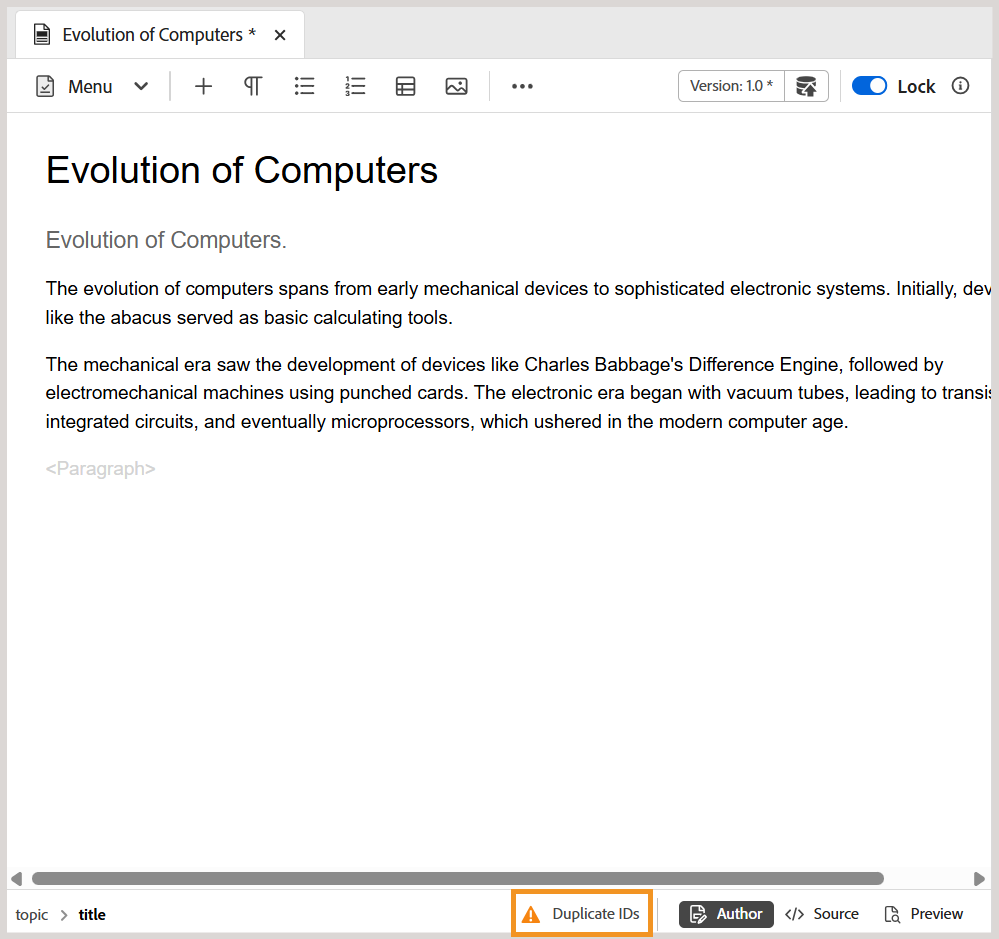

# 2025.10.0版（2025年10月）的新增功能

本文介紹2025.10.0版Adobe Experience Manager Guides as a Cloud Service所推出的新功能和增強功能。

有關此版本中的問題修正清單，請查看 [2025.10.0 版本中修正的問題](fixed-issues-2025-10-0.md)。

瞭解2025.10.0 [版的](../release-info/upgrade-instructions-2025-10-0.md)升級指示。

## 編輯器設定現已重新命名為Workspace設定，並可從首頁存取

為了改善導覽和可用性，已引入以下增強功能：

- Experience Manager Guides中的&#x200B;**編輯器設定**&#x200B;已重新命名為&#x200B;**Workspace設定**。
- **更多動作**&#x200B;功能表（三點功能表），以前只能在[編輯器]與[地圖]主控台介面中使用，現在可從[首頁](../user-guide/intro-home-page.md)存取。

  

## 在作者檢視中輕鬆識別和修正主題和地圖中的重複ID

Experience Manager Guides現在於編輯器中包含了&#x200B;**重複ID**&#x200B;按鈕，可協助您快速識別及修正單一主題或地圖中存在的重複ID。 偵測到重複的ID時，此按鈕會出現在&#x200B;**作者**&#x200B;檢視中Editor介面的左下角。 選取按鈕後，彈出視窗中會顯示具有重複ID的所有執行個體清單。 選取執行個體會反白標示主題或地圖中的對應內容，讓您從右側面板中尋找並修正重複的ID。

如需詳細資訊，請在編輯器中檢視[其他功能](../user-guide/web-editor-other-features.md)。

{width="350" align="left"}

## 儲存庫和報告篩選器的增強功能

存放庫中的進階篩選器下方的&#x200B;**鎖定者**&#x200B;篩選器和DITA map報告中的&#x200B;**作者**&#x200B;篩選器現在會在您捲動時逐漸載入使用者清單，而不是一次全部載入。 此分頁載入可提升速度，並讓處理大型使用者資料集的效率更高、更順暢。

## 直接從檢閱面板存取檢閱任務的狀態

作為稽核任務的發起者，您現在可以直接從「稽核」面板檢查稽核任務的狀態。 透過最新的增強功能，檢閱面板中的&#x200B;**更新任務**&#x200B;對話方塊包含新的&#x200B;**檢查檢閱狀態**&#x200B;選項。 選取此選項會直接將您帶到稽核儀表板，您可以在其中檢視每個稽核者的工作狀態，讓您無需切換前後關聯即可更快速地存取工作進度。

如需更多詳細資料，請檢視[要求重新檢閱或關閉檢閱工作作為作者](../user-guide/review-close-review-task.md)。

{width="350" align="left"}

## 用於追蹤資料夾或資產後處理狀態的API

新API現在可用於追蹤個別資產和資料夾的後處理狀態。 這對使用自動化工作流程的團隊特別有用，因為團隊只需在完全處理內容後發佈內容。 API提供確認整備的可靠方式，降低因處理不完整而導致發佈失敗的風險。

如需詳細資訊，請檢視[API以追蹤資料夾或資產的後續處理狀態](../api-reference/track-post-processing-status.md)。

