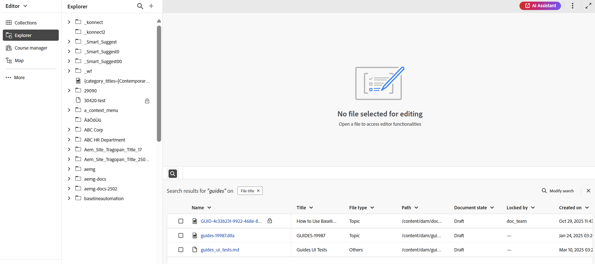

# 2025.11.0版（2025年11月）的新增功能

本文介紹2025.11.0版Adobe Experience Manager Guides as a Cloud Service所推出的新功能和增強功能。

有關此版本中的問題修正清單，請查看 [2025.11.0 版本中修正的問題](fixed-issues-2025-11-0.md)。

瞭解2025.11.0版[的](../release-info/upgrade-instructions-2025-11-0.md)升級指示。

## 首頁上推出新存放庫和增強型搜尋體驗

存放庫現在可直接從首頁存取，可作為中央空間，以改善資料夾和檔案的探索能力。 它具有專用的&#x200B;**資料夾導覽面板**&#x200B;以及可自訂的&#x200B;**存放庫**&#x200B;的表格檢視。 改版的搜尋和篩選體驗大幅簡化尋找和尋找檔案的程式。 如需詳細資訊，請檢視[瞭解存放庫介面](../user-guide/home-page-repository-view.md)。

{align="left"}

在編輯器中，檔案的搜尋和篩選體驗現在與首頁一致。 已引入位於編輯器介面底部的新[搜尋面板](../user-guide/search-panel-explorer.md)以顯示搜尋結果。 此外，存放庫現在在編輯器中重新命名為&#x200B;**Explorer**，可讓您像之前一樣瀏覽資料夾和檔案。

{align="left"}

## AI助理中智慧型建議的增強索引

您現在可以使用新的狀態指示器，在AI Assistant中輕鬆追蹤智慧型建議每次索引嘗試的狀態：索引已完成、不同步、進行中，以及索引失敗。 最後索引時間戳記現在會記錄在資料夾設定檔層級，以便更佳追蹤。 此外，當為索引指定資料夾或檔案路徑時，會強制執行父子資料夾限制。

如需更多詳細資料，請檢視[設定AI助理以進行智慧說明和編寫](../cs-install-guide/conf-folder-level.md#configure-ai-assistant-for-smart-help-and-authoring)。

## 效能改良

### 自動化B樹狀結構清理以獲得最佳效能

為了維持系統效率並防止資源阻塞，新的背景程式會定期清理系統層級B樹狀結構。 這可確保不再存在或暫時新增的資產不會佔用不必要的空間。

系統會聰明地識別要清理的候選專案，並執行自動移除。 此外，此功能也是可設定的，可讓管理員根據營運需求控制其行為。

如需詳細資訊，請檢視[設定B樹狀結構清理](../cs-install-guide/configure-btree-cleanup-cs.md)。

### 改善處理具有大量索引鍵的DITA map

您現在可以順暢地使用包含大量金鑰的DITA map。 此增強功能可確保更快的載入速度並改善效能，讓您更輕鬆地在不中斷的情況下管理複雜的地圖。

組建版本升級後，系統可能會遇到暫時性的負載增加，導致新上傳資料的後處理延遲。 這是因為自動的一次性指令碼(OTS)在背景執行。 指令碼完成後，系統效能將恢復正常。

### 改善資產處理功能

引入自動化程式，以使`/content/dam`中的資產保持最新。 系統每15分鐘觸發一次資產重新處理。 在每個週期中，系統都會挑選最近15分鐘間隔內新增或維持未處理的資產，並重新處理，進而改善內容存放庫的效率和一致性。

如需詳細資訊，請檢視[處理資產](../user-guide/asset-processor.md)。

