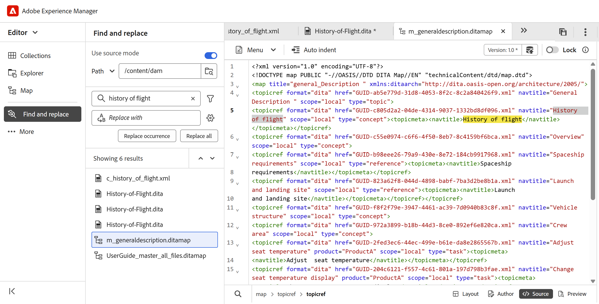
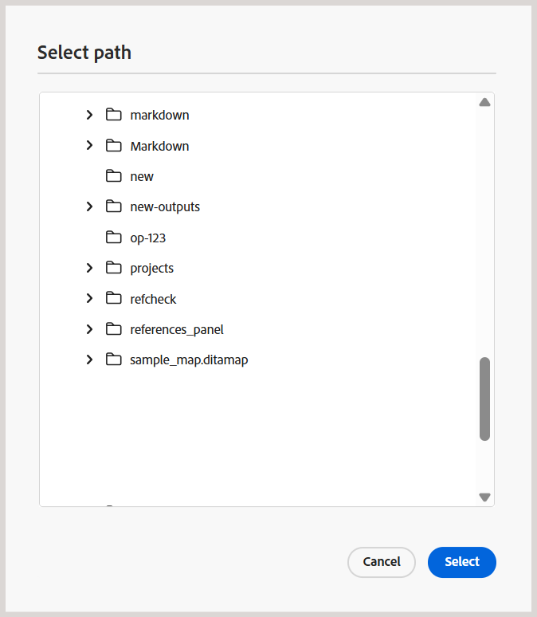
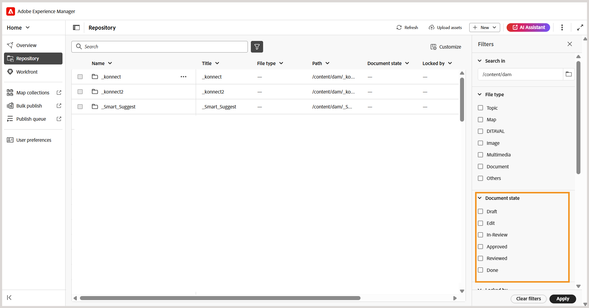
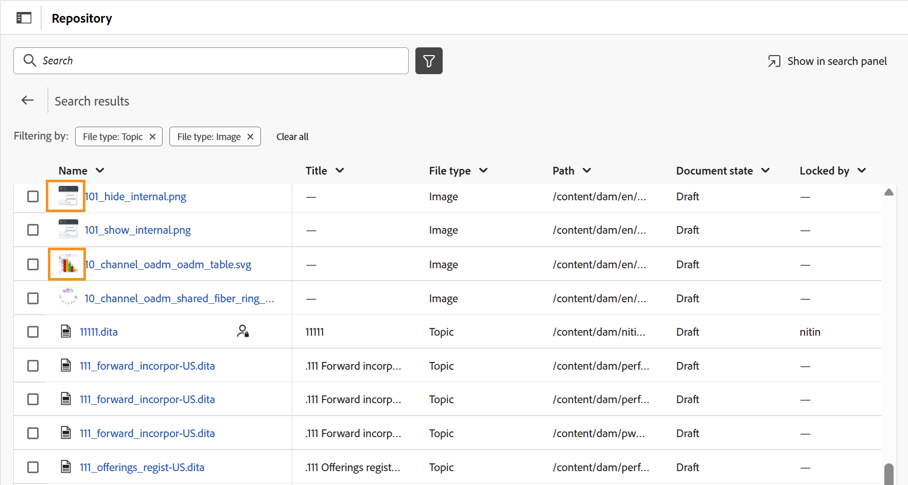
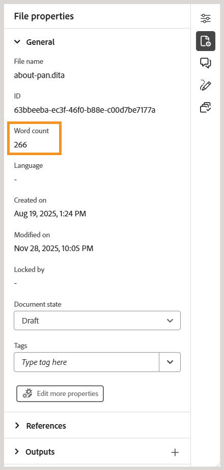
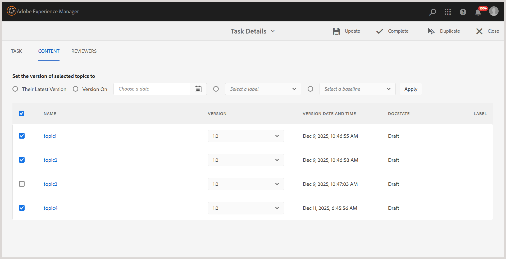

# 2026.01.0版（2026年2月）的新增功能

本文介紹2026.01.0版Adobe Experience Manager Guides as a Cloud Service所推出的新功能和增強功能。

有關此版本中的問題修正清單，請查看 [2026.01.0 版本中修正的問題](fixed-issues-2026-01-0.md)。

瞭解2026.01.0版[的](../release-info/upgrade-instructions-2026-01-0.md)升級指示。

## 在「尋找和取代」中介紹Source模式搜尋

Experience Manager Guides在編輯器介面的左側面板中，推出了數個尋找和取代功能的增強功能。 除了改善UI以提升使用性，此版本還在&#x200B;**尋找和取代**&#x200B;面板中引入了新的&#x200B;**使用來源模式**&#x200B;切換。

啟用此模式時，您不僅可以對可見內容執行全域搜尋，還可以對搜尋字串的基礎來源內容（XML結構，包括元素、標籤和屬性值）執行全域搜尋。 此模式可確保在整個內容中進行全面搜尋。

{width="650" align="left"}

在此模式中，您可以套用篩選器，依檔案型別、檔案狀態、上次修改日期等縮小搜尋範圍。 您也可以在執行「全部取代」操作後下載詳細的CSV報表，此操作會提供所執行的所有取代操作及其成功和失敗狀態的快照。

如需更多詳細資料，請在編輯器[的](../user-guide/web-editor-left-panel.md#find-and-replace)左側面板中檢視&#x200B;_尋找及取代_&#x200B;區段。

>[!NOTE]
>
> 針對[尋找和取代]面板中的&#x200B;**使用來源模式**&#x200B;功能，必須先完成自訂索引部署。 建立索引後，請聯絡您的客戶成功團隊以啟用此功能。

## 增強的檔案和資料夾瀏覽體驗

此發行版本推出更乾淨、更直覺的介面，以便在Experience Manager Guides中瀏覽檔案和資料夾路徑。

瀏覽檔案時，改版的&#x200B;**選取檔案**&#x200B;對話方塊現在提供具有兩個檢視的索引標籤版面配置 — **存放庫**&#x200B;用於以表格格式瀏覽整個內容存放庫，以及&#x200B;**集合**&#x200B;用於快速存取常用主題、地圖和影像。

{width="650" align="left"}

主要增強功能包括：

- 檔案和資料夾的表格檢視，供組織導覽使用。
- 階層連結和資料夾導覽面板，可輕鬆在資料夾中移動。
- 支援可重複使用內容、主題參考、結構描述、輸出預設集（使用DITAVAL）和Workfront的多檔案選取。
- 預覽選取的檔案以方便檢閱；若是多個選取專案，請視需要預覽所有檔案並從「預覽」面板中移除任何檔案。
- 搜尋和篩選選項可依名稱、標題、檔案型別、檔案狀態和標籤來縮小結果的範圍。

**選取路徑**&#x200B;對話方塊也提供改良的樹狀結構檢視，用於資料夾導覽，以確保在內容存放庫中選取路徑時更井然有序、更有效率。

{width="350" align="left"}

如需詳細資訊，請在編輯器的[其他功能](../user-guide/web-editor-other-features.md#browse-files-and-folders-in-experience-manager-guides)中檢視&#x200B;_在Experience Manager Guides_&#x200B;區段中瀏覽檔案和資料夾。

## 儲存庫搜尋和篩選增強功能

### 支援檔案狀態篩選

現在，根據檔案的目前檔案狀態來篩選存放庫搜尋結果。 使用新的&#x200B;**檔案狀態**&#x200B;篩選器，您可以使用資料夾設定檔內`ui_config.json`檔案中定義的可用篩選器值來縮小搜尋範圍。

{align="left"}

「檔案」狀態可用的預設篩選值為：「草稿」、「編輯」、「稽核中」、「已核准」、「已稽核」和「完成」。 如需自訂預設檔案狀態篩選值的詳細資訊，請檢視[設定檔案狀態篩選](../cs-install-guide/config-doc-state-filters.md)。

>[!NOTE]
>
> 如果您正在使用`ui_config.json`的自訂設定，請務必在升級前備份這些設定。 更新後，請檢閱並調整您的設定，以符合最新版本中推出的變更。

### 多媒體的縮圖圖示

所有多媒體檔案現在都會以縮圖圖示顯示，讓您更輕鬆地在&#x200B;**存放庫**&#x200B;內以視覺方式識別及尋找影像。 此增強功能也適用於在&#x200B;**搜尋面板**&#x200B;中搜尋檔案時，協助您快速區分多媒體資產與其他檔案型別。

{align="left"}

## 編輯器增強功能

此版本已進行下列編輯器增強功能：

### 在預覽模式下重新整理主題或地圖

正在引入已在預覽模式中開啟之地圖的新&#x200B;**重新整理**&#x200B;功能。 有了這項新功能，您就可以輕鬆重新整理整個地圖的內容或其中出現的個別主題。

- 為了重新整理整個地圖（包括所有主題），編輯器左上角引進了新的&#x200B;**重新整理**&#x200B;按鈕。

  {width="600" align="left"}

- 為了重新整理個別主題的內容，在內容功能表中引進了新的&#x200B;**重新整理主題**&#x200B;選項。

  {width="600" align="left"}

如需詳細資訊，請檢視[對應編輯器功能](../user-guide/map-editor-advanced-map-editor.md)。

### 中繼資料變更的工作復本指標

對&#x200B;**檔案屬性**&#x200B;下可用的中繼資料欄位所做的任何變更，現在都會觸發工作復本指標。 當您新增、刪除或修改任何預設或自訂中繼資料欄位時，檔案版本會標示為&#x200B;_dirty (*)_。 此增強功能可確保準確追蹤所有中繼資料變更，進而提高檔案版本的可見度與控制能力。

### 主題和地圖的字數

您現在可以追蹤地圖或主題檔案中出現的字數。 右側面板中的新&#x200B;**字數**&#x200B;欄位會顯示主題（或地圖）中存在的字數總計，其中以空格分隔的字會計為個別的字數。 每次儲存變更時，它都會自動重新整理。 對於互動參照，只包含顯示文字，而排除鍵。

{width="350" align="left"}

如需詳細資訊，請在編輯器[中檢視](../user-guide/web-editor-right-panel.md#file-properties)右側面板。

### 改善唯讀檔案的處理

現在，針對&#x200B;**唯讀**&#x200B;模式的檔案，編輯檔案內容受到限制。 如果檔案已由其他使用者鎖定（可在唯讀模式下使用），則您無法變更任何中繼資料屬性，不論是從[右側面板](../user-guide/web-editor-right-panel.md#file-properties)、檔案&#x200B;**的**&#x200B;內容功能表中的[屬性](../user-guide/web-editor-other-features.md#context-menu-functions-on-a-files-tab)選項，還是[中繼資料報表](../user-guide/reports-web-editor.md#metadata-report)。 這有助於防止唯讀檔案意外變更。

## 檢閱增強功能

### 從進行中的稽核任務新增或移除主題

現在，您可以將新主題新增到進行中的稽核任務中（如果先前未傳送這些主題以供稽核），或從進行中的稽核任務中移除主題，而不會影響稽核工作流程。

在&#x200B;**工作詳細資訊**&#x200B;頁面上，您只需選取或取消選取主題即可修改主題清單。 檢閱者會透過AEMAEM和電子郵件通知，收到有關其指派之主題的任何變更通知。 如需詳細資訊，請檢視[傳送主題以供檢閱](../user-guide/review-send-topics-for-review.md)。

{width="650" align="left"}

## 翻譯增強功能

### 已傳送以進行翻譯的未建立版本資產的指標

管理翻譯時，在傳送內容以進行處理之前，請務必確認所有內容皆已建立版本。 為了協助解決此問題，Experience Manager Guides現在為已儲存變更但尚未建立版本的主題提供明確指標。

如果檔案包含未建立版本的變更（未在地圖中儲存為新版本），則檔案旁邊會出現&#x200B;_資訊_&#x200B;圖示，表示存在更新。 若要快速集中處理這些檔案，請啟用「篩選器」面板中的&#x200B;**僅顯示未設定版本變更的資產**&#x200B;選項。

如需詳細資訊，請從[地圖主控台]檢視[翻譯檔案](../user-guide/translate-documents-web-editor.md)。

{width="650" align="left"}

## 發佈增強功能

### 特定輸出預設集的自訂影像轉譯

您現在可以使用`outputName`中的`renditionmapping.xml`屬性，為相同輸出型別下的個別輸出預設集設定不同的影像轉譯。 此增強功能可讓您在發佈需要針對不同情境設定不同影像解析度的內容時，擁有更大的彈性。 例如，您可能會想要讓主要HTML5輸出使用高解析度影像，同時為輕量版預設集使用較小的縮圖。

如需詳細資訊，請檢視[在輸出產生](../cs-install-guide/conf-output-generation.md#handle-image-rendition-during-output-generation)中處理影像轉譯。

### 下載所產生輸出的記錄檔

透過Assets UI產生輸出時，現在有新的&#x200B;**下載記錄**&#x200B;按鈕可供使用，讓您將記錄下載到本機裝置以更輕鬆存取和檢閱。

### 原生PDF輸出中交叉參照的語言變數

發佈原生PDF輸出時，您可以使用[語言變數](../native-pdf/native-pdf-language-variables.md)來翻譯靜態互動參照文字，例如&#x200B;_請參閱第_&#x200B;章中的&#x200B;_請參閱第_&#x200B;頁。 變數透過`xml:lang`屬性使用主題中定義的語言。

如需有關設定原生PDF輸出預設集和互動參照設定的詳細資訊，請檢視[原生PDF輸出預設集](../web-editor/native-pdf-web-editor.md)。

### 支援新AEM Sites （使用複合元件對應）發佈中的元素層級元件對應

Experience Manager Guides現在支援AEM Sites輸出中的元素層級元件對應（使用複合元件對應），可讓團隊精確控制DITA元素使用`componentmapping.json`的呈現方式。 將`topicref`、標題、影像、表格等對應至適當的AEM核心元件，可獲得更簡潔的結構，而非預設為文字元件的所有內容。 這可提供更優異的效能，並開啟更豐富、更現代的Sites體驗。

## 資產處理增強功能

此版本引進了下列資產處理增強功能：

- 在資料夾和個別檔案層級執行資產處理
- 選擇特定資產型別(例如，主題、地圖、Markdown、HTML/CSS、DITAVAL或其他支援的檔案)以僅處理您需要的檔案，藉此篩選資產。
- 套用以日期為基礎的篩選器，以限制指定時間範圍的處理範圍。
- 使用存放庫檢視和檔案總管面板中檔案和資料夾內容功能表中可用的新選項（**重新處理資產**），直接重新處理資產。

如需有關處理資產的詳細資訊，請檢視[處理資產](../user-guide/asset-processor.md)。

## API增強功能

此版本已進行下列API增強：

- 我們引進了新的API來建立新的翻譯專案並追蹤其狀態。 這些API有助於自動化翻譯流程，減少手動工作並提高效率。 如需詳細資訊，請檢視[建立翻譯專案](../api-reference/translation-project.md)
- 增強資產處理API，並改善檔案和資料夾的篩選功能。 如需詳細資訊，請檢視[處理資產](../api-reference/bulk-assets-processing.md)。

