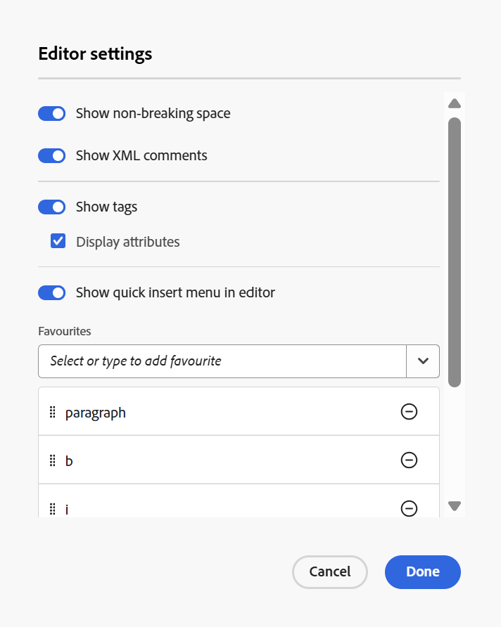
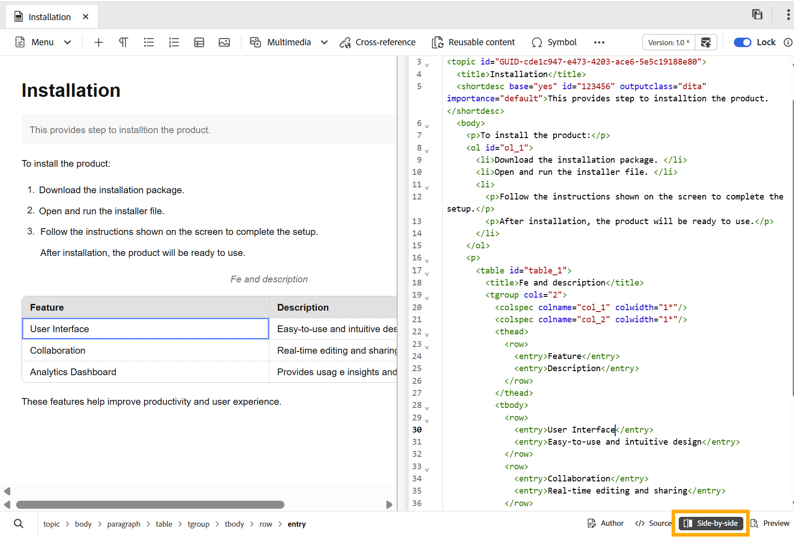

# 2026.05.0版（2026年5月）的新增功能

本文介紹2026.05.0版Adobe Experience Manager Guides as a Cloud Service所推出的新功能和增強功能。

如需此版本中修正的問題清單，請檢視[2026.05.0版本](fixed-issues-2026-05-0.md)中的已修正問題。

瞭解2026.05.0版](../release-info/upgrade-instructions-2026-05-0.md)的[升級指示。

## Editor 2.0簡介

Editor 2.0 （亦稱為New Editor）提供簡化的撰寫功能，讓您透過更直覺的體驗，更有效率地跨標籤和非標籤模式建立內容。 此版本改善了效能、頁面載入速度更快，甚至對於大型複雜主題也能進行更順暢的編輯。 此外，它還能解決關鍵的編寫空白（尤其是導覽和游標行為），提供更優異的穩定性。 此外，現代化介面提供重新整理且方便使用的UI，平衡功能與易用性。 如需詳細資訊，請檢視[編輯器簡介](../user-guide/web-editor.md)。

以下是重點說明Editor 2.0功能的概觀影片。

>[!VIDEO](https://video.tv.adobe.com/v/3484007)

>[!NOTE]
>
> 聯絡AEM Guides客戶成功團隊以在您的環境中啟用編輯器2.0。

以下增強功能可讓撰寫作業更容易、更有效率。

### 重新設計使用者介面和體驗

重新整理的介面可改善整體可用性，讓導覽和內容製作更直覺且一致。

- **在製作和預覽模式中元素的更豐富CSS**：增強元素的預設CSS在製作和預覽模式中，提供改良的樣式和更佳的視覺一致性。

  {width="650"}

- **深色佈景主題支援**：在內容編輯區域中支援深色佈景主題，可增強偏好使用深色介面的使用者的撰寫體驗。

  {width="650"}

- **整合的使用者層級編輯器設定**：新的集中式設定面板，可讓作者更好地控制編輯器行為，讓使用者更輕鬆地從單一位置管理偏好設定。 設定選項包括啟用/停用的功能：

   - 在作者模式中不間斷的空格
   - 標籤可見度設定有屬性或沒有屬性
   - 作者模式中的XML註解
   - 在編輯器中插入元素的快速插入功能表

  {width="350"}

  如需如何設定編輯器設定的詳細資訊，請檢視[編輯器設定](../user-guide/config-editor-settings.md)。

- **在作者模式中更清楚地呈現條件式內容**：在作者模式中更清楚地顯示條件式內容，有助於作者更有效識別和管理變數。 如需詳細資訊，請在編輯器的左側面板中檢視[條件](../user-guide/web-editor-left-panel.md#conditions)。

  {width="650"}

### 增強的撰寫功能

提供改良的工具和彈性，以簡化內容建立和編輯工作流程。

- **在標籤模式中檢視屬性以及元素**：作者現在可以使用標籤模式檢視元素屬性，提供更好的結構內容可視性和控制能力。 若要設定此功能，請檢視[編輯器設定](../user-guide/config-editor-settings.md)。

  {width="650"}

- **快速插入功能表**：可在以作者模式編輯時，直接在游標位置新增元素，而不需導覽至工具列。 您也可以透過「編輯器」設定在「我的最愛」區段中設定常用的元素，以加快存取速度。 如需詳細資訊，請檢視[編輯主題](../user-guide/web-editor-edit-topics.md)。

  {width="650"}

- **在作者模式中檢視、編輯和插入XML註解的功能**：讓作者直接在作者模式中檢視、編輯和插入XML註解，以便在內容中更清楚顯示。 若要設定此功能，請檢視[編輯器設定](../user-guide/config-editor-settings.md)。

  {width="650"}

- **並排模式**：允許同時檢視Author和Source模式，兩個檢視保持完全同步，以便更輕鬆比較、編輯和驗證內容變更。 如需詳細資訊，請檢視[編輯器檢視](../user-guide/web-editor-views.md)。

  {width="650"}

- **改善表格製作**：透過更直覺且有效率的互動來建立和管理表格，強化整體的表格製作體驗。

   - 流暢且直覺的互動：輕鬆插入列和欄，並支援拖放功能，可重新排序列和欄。
   - 內容工具列：直接在表格中存取表格專用動作，例如格式設定、對齊、合併和其他額外動作。
   - 設定表格：在單一動作中新增多個列或欄，減少重複步驟並提高效率。

  {width="650"}

  如需詳細資訊，請檢視[使用資料表](../user-guide/web-editor-other-features.md#work-with-tables-in-the-new-editor)。

### 改善大型主題的效能

新編輯器透過提供更快的內容呈現、更可靠的復原和重做功能，以及可清楚指出未儲存變更的髒標示，來增強處理大型複雜主題的體驗。

## 從「內容屬性」面板存取檔案中參照的路徑和UUID

現在，您可以使用&#x200B;**連結路徑**&#x200B;來檢視所選參考的相對路徑，以及使用&#x200B;**連結UUID**&#x200B;來從「內容」屬性面板檢視其唯一識別碼。 您也可以使用連結路徑和連結UUID旁的圖示，直接從介面複製完整的絕對路徑和相關聯的UUID，以便更輕鬆地追蹤和重複使用連結的資產。

如需詳細資訊，請檢視[內容內容](../user-guide/web-editor-right-panel.md#content-properties)。

## 檢閱增強功能

此版本已進行下列稽核增強功能：

- 您現在可以啟用&#x200B;**自動提醒**，在稽核工作的到期日之前和到期之後，為稽核者排程AEM通知和電子郵件提醒。 您可以為每個案例設定多個提醒，依定義的順序傳送預先到期提醒，並根據設定的提醒排程，在任務標示為逾期後觸發逾期提醒。 如需詳細資訊，請檢視[傳送主題以供檢閱](../user-guide/review-send-topics-for-review.md)。

- 檢閱者現在可以存取檢閱中主題的「版本」歷程記錄，讓他們檢視和比較先前檢閱任務中相同主題的先前檢閱和更新版本。 這可協助檢閱者驗證自先前的檢閱週期以來所做的變更，並在目前的檢閱內容中檢閱註釋、標籤及其他相關詳細資訊，以維持連續性。 如需詳細資訊，請檢視檢閱者的[版本記錄](../user-guide/review-topics.md#version-history-for-the-reviewer)。

## Experience Manager Guides中推出的新基線體驗

>[!NOTE]
>
> 聯絡AEM Guides客戶成功團隊以在您的環境中啟用新基準線。

使用&#x200B;**全新的基準線體驗** （建構在重新設計的基準線架構上），管理大型且複雜的基準線現在更快、更穩定且更易於擴展。 此更新解決長期存在的效能和可靠性挑戰，同時保留現有的工作流程。

此更新作為Beta版增強功能提供，可針對載入緩慢、基準線狀態不一致，以及管理能力有限等常見棘手問題提供解決方案，提供更快、更穩定且更可預測的基準線體驗，並增加自動化和大規模基準線作業的支援。 主要改善專案包括：

- 更優異的效能與擴充能力
- 更強大的UI和後端一致性
- 展開的篩選、導覽和相依性可見度

如需詳細資訊，請在Experience Manager Guides](../user-guide/web-editor-baseline-v2.md)中檢視[新的基準線體驗(Beta)。

