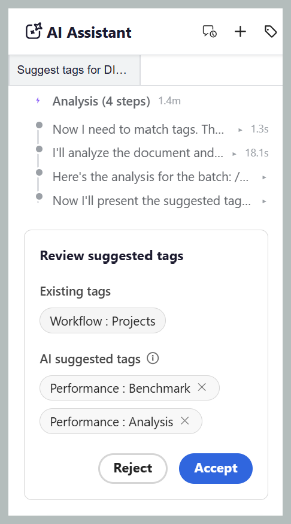
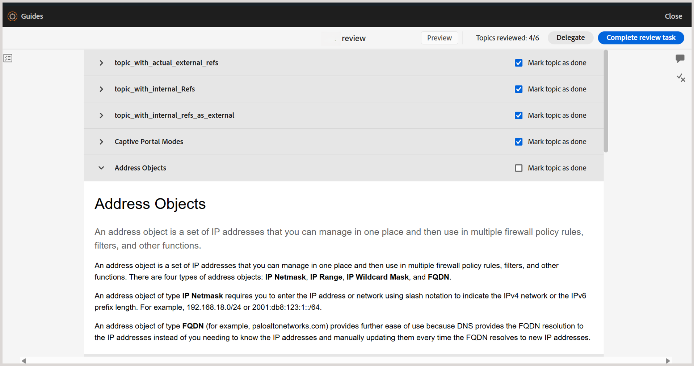
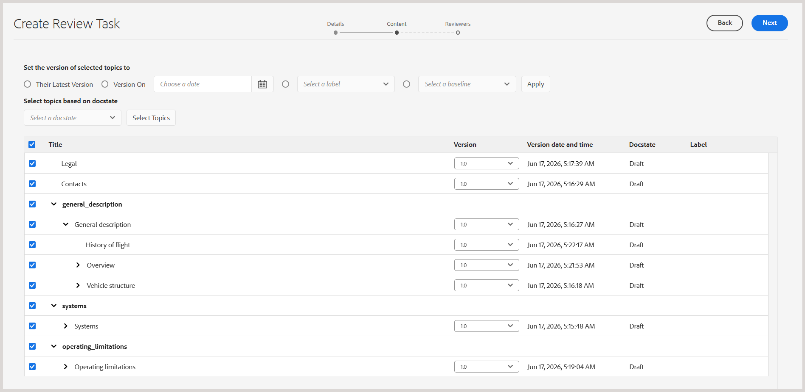
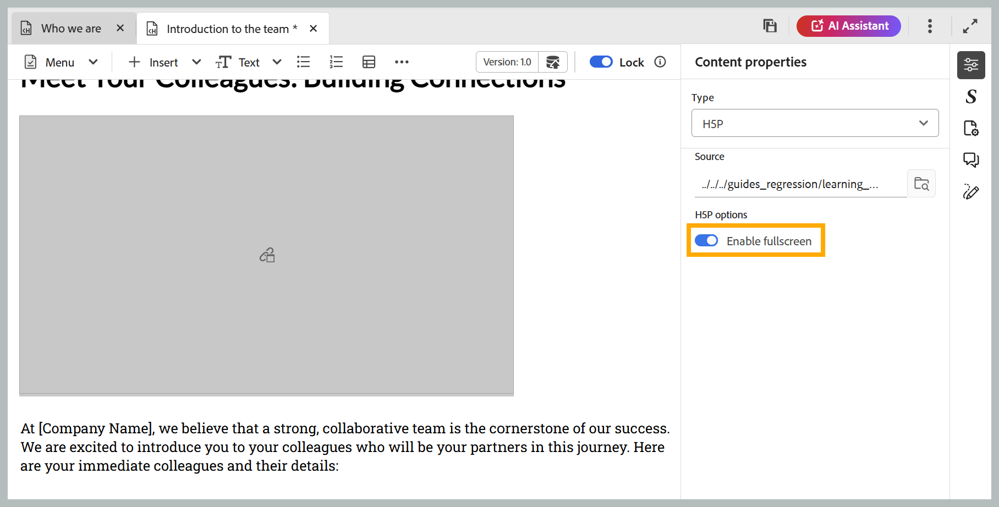
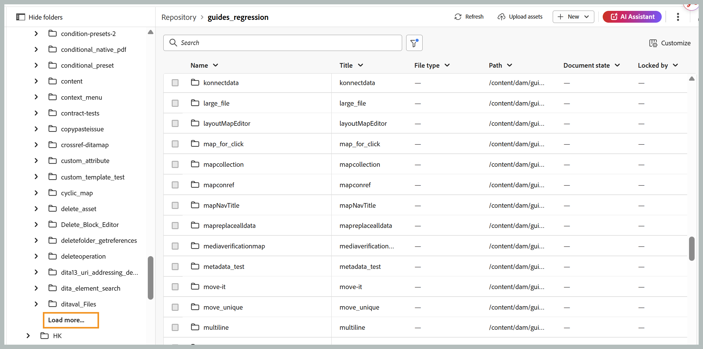

# 2026.09.0版（2026年9月）的新增功能

本文介紹2026.09.0版Adobe Experience Manager Guides as a Cloud Service所推出的新功能和增強功能。

如需此版本中修正的問題清單，請檢視[2026.09.0版本](fixed-issues-2026-09-0.md)中的已修正問題。

瞭解2026.09.0版](../release-info/upgrade-instructions-2026-09-0.md)的[升級指示。

## 在AI Assistant中引入AI支援的智慧標籤

現在，您可以使用AI助理來建議內容並新增標籤。 有了新的智慧標籤功能，作者可以要求AI助理為一個或多個主題建議標籤，這些建議由Adobe CX Enterprise Coworker提供的智慧標籤技能提供。 此技能會檢閱內容、產生標籤建議，並顯示給您進行檢閱。 確認後，建議的標籤會套用至地圖內的相關主題。

如需詳細資訊，請檢視[在代理模式中使用AI小幫手](../user-guide/ai-assistant-agentic.md)。

目前，當AI助理設定為&#x200B;**代理程式**&#x200B;模式時，智慧型標籤功能可供使用。 管理員可以選擇從執行個體的&#x200B;**Workspace設定**&#x200B;啟用&#x200B;**代理程式**&#x200B;或&#x200B;**標準**&#x200B;模式。

- **代理模式**&#x200B;為作者提供標籤建議和應用程式的智慧標籤介面。
- **標準模式**&#x200B;提供現有的AI小幫手體驗，在AI小幫手面板中有&#x200B;**說明**&#x200B;和&#x200B;**製作**&#x200B;標籤。

## 編輯器增強功能

### 防止在同時編輯期間覆寫內容

當兩個作者同時處理同一主題時，一位作者可能會開啟主題，而另一位作者鎖定主題、進行變更並儲存較新版本。 已開啟的主題可能包含過時的內容，編輯此版本可能會覆寫最新變更。

為避免此類衝突，現在當您鎖定主題時，最新儲存的版本會自動載入編輯器中。 這可確保您使用最新的內容，並防止您覆寫其他作者所做的變更。

當啟用&#x200B;**停用編輯而不鎖定檔案**&#x200B;設定時，即適用此設定。

如需詳細資訊，請檢視[防止內容在同時編輯期間覆寫](../user-guide/web-editor-edit-topics.md#prevent-content-overwrite-during-concurrent-editing)。

### 從選取的靜態基線預覽地圖內容

當對映有一或多個靜態基準線時，您現在可以根據選取的基準線來預覽對映，而不是在編輯器中根據目前的工作復本。

與所選基準線相關的所有主題、資產、影像和參照版本都會顯示在「預覽」中，在建立基準線時提供地圖內容的精確檢視。 如需詳細資訊，請檢視主題](../user-guide/web-editor-views.md#preview-content-using-baseline)的[編輯器檢視。

## 檢閱增強功能

### 在稽核任務中將個別主題標籤為完成

Experience Manager Guides為稽核者引進了主題層級進度追蹤，讓您更清楚地瞭解具有多個主題之任務的稽核進度。 身為檢閱者，您現在可以將個別主題標示為已完成，並區分您已完成的主題與仍需注意的主題。

為了支援此功能，檢閱UI的「檔案」檢視中的主題會整理成摺疊式功能表，其中包含&#x200B;**將主題標籤為完成**&#x200B;核取方塊。 您使用核取方塊標示為已稽核的主題會顯示在&#x200B;**主題**&#x200B;面板中，而頂端的&#x200B;**已稽核主題**&#x200B;計數器會顯示您指派給您的主題的進度。 這些功能可讓您清楚瞭解您所涵蓋的內容以及剩餘內容，即使在插播後返回較長的稽核任務時亦然。

如需詳細資訊，請檢視[檢閱主題](../user-guide/review-topics.md#mark-individual-topics-as-done-in-a-review-task)。

### 在評論中標籤時識別具有角色的使用者

在評論或回覆中標籤某人時，稽核者和作者現在可以檢視使用者的角色（例如稽核者、作者或擁有者）及其使用者名稱和電子郵件地址（如果可用）。 這可讓您更輕鬆地快速識別要標籤的正確使用者，尤其是在具有大量參與者的專案中。

深入瞭解[在註解中標籤使用者](../user-guide/review-topics.md#tag-task-users-in-a-comment)。

### 選取要檢閱的主題時，檢視地圖階層

當選取稽核內容時，作為稽核任務的作者或發起者，您現在可以在&#x200B;**內容**&#x200B;頁面上檢視其現有階層中的地圖、子地圖和主題，而不是以平面清單檢視所有主題。 階層式檢視可讓您更輕鬆地瞭解內容的結構，並選取個別主題或整個子地圖以供檢閱。

如需詳細資訊，請檢視[選取檢閱主題時檢視地圖階層](../user-guide/review-send-topics-for-review.md#view-the-map-hierarchy-while-selecting-topics-for-review)。

## 發佈增強功能

### 使用您地圖的語言發佈原生PDF輸出

原生PDF輸出預設集頁面現在包含新的&#x200B;**使用地圖語言**&#x200B;選項。 選取後，輸出範本變數會從根對映的`xml:lang`屬性解析其語言，而不是從預設集中明確選取的語言。 這表示在發佈翻譯的地圖時，您不再需要為每種語言維持個別的輸出預設集。 如果地圖未定義`xml:lang`，則輸出預設為英文(en_US)。

如需詳細資訊，請檢視[原生PDF預設集組態](../web-editor/native-pdf-web-editor.md)和[在輸出範本中使用語言變數](../native-pdf/native-pdf-language-variables.md#use-language-variables-in-the-output-templates)。

## 學習內容增強功能

### 在學習課程中啟用H5P內容的全熒幕檢視

作者現在可以為學習課程中使用的每個H5P元素啟用或停用全熒幕顯示。 使用&#x200B;**內容屬性**&#x200B;面板中的&#x200B;**啟用全熒幕**&#x200B;切換可控制此設定。 啟用後，學習者可以將H5P內容展開至全熒幕。 停用時，內容會內嵌在標準檢視中。 此設定會一致地套用至預覽模式和發佈的輸出。

深入瞭解產品訓練與學習內容的[插入]功能表](../learning-content/lc-other-insert-options.md)中的[其他選項。

## 效能提升

### 以分頁方式載入檔案和資料夾，提升效能

Experience Manager Guides現在支援檔案和資料夾的分頁載入，以提升瀏覽體驗，尤其是針對具有大量資產的資料夾。 資料夾不是一次載入所有內容，而是以50個資產的批次逐步載入，並在您捲動或選取「**載入更多**」時擷取其他資產（視面板或對話方塊而定）。

排序是在伺服器端執行，因此套用排序順序會擷取最新排序的結果，而非重新排序瀏覽器中已載入的資料。 重新命名、刪除、新增和移動等常見操作不會再重新載入整個資料夾。 相反地，他們只會更新受影響的專案或重新整理結果的第一個頁面。

「首頁存放庫」表格、「集合」、「總管」、「搜尋」和「範本」面板，以及「選取路徑」對話方塊都提供分頁載入。

如需詳細資訊，請檢視[檔案和資料夾的分頁載入](../user-guide/paginated-loading-assets.md)。

資料夾導覽面板的{width="650"}

