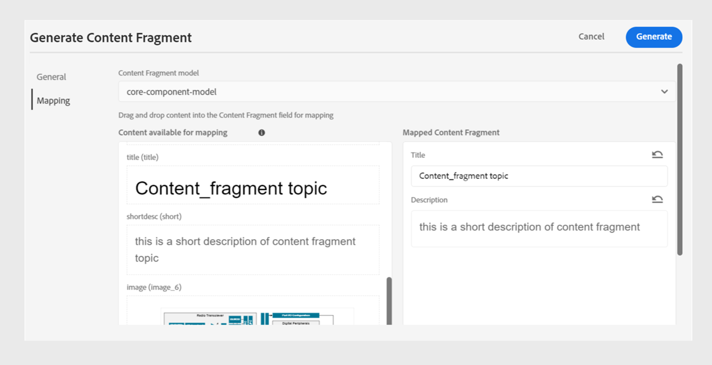
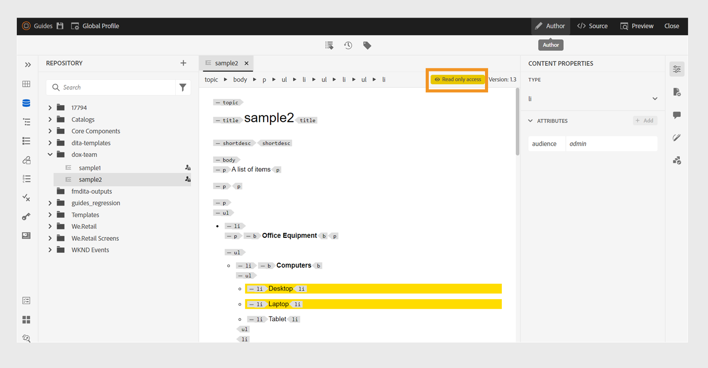

# 4.6.0版的新增功能（2024年9月）

本文介紹4.6.0版Adobe Experience Manager Guides推出的新功能和增強功能。

如需此版本中已修正的問題清單，請檢視[4.6.0版本](../release-info/fixed-issues-4-6-0.md)中已修正的問題。

瞭解4.6.0版[&#128279;](../release-info/upgrade-instructions-4-6-0.md)的升級指示。

## 發佈增強功能

4.6.0版本中已進行下列內容發佈增強功能：

### Publish體驗片段的主題或其元素

體驗片段是Adobe Experience Manager中的模組化內容單位，整合了內容和版面。 體驗片段有助於建立一致且吸引人的體驗，這些體驗可以跨多個管道進一步重複使用。 例如，您可以為頁首或頁尾建立體驗片段，並搭配品牌元素、促銷橫幅、客戶口號和活動促銷活動。

 {width="300" align="left"}

*Publish，並從&#x200B;**檔案屬性**.*&#x200B;中的&#x200B;**輸出**&#x200B;區段檢視主題的體驗片段

Experience Manager Guides現在可讓您將主題或其元素發佈至體驗片段。 您可以在主題或其元素與體驗片段範本之間建立JSON型對應。 您也可以使用條件篩選器來建立體驗片段變數。

進一步瞭解如何[Publish體驗片段](../user-guide/publish-experience-fragment.md)。

### 內容片段發佈中的增強功能

Experience Manager Guides也在內容片段中提供一些實用的增強功能：

- Experience Manager Guides可讓您將主題或其元素發佈至內容片段。

- 您可以從&#x200B;**檔案屬性**&#x200B;中的&#x200B;**輸出**&#x200B;區段，發佈並檢視主題的內容片段。

- 您可以在發佈至內容片段時，透過篩選包含條件的內容來輕鬆建立內容片段變體。

- 使用新的對應介面來輕鬆選取元素並發佈至內容片段。

現在，內容片段發佈只會取代對應的內容，而不會覆寫完整的內容片段。 此功能允許內容片段包含來自多個來源的資料，例如多個主題或內容片段編輯器。

如需詳細資訊，請檢視[Publish內容片段](../user-guide/publish-content-fragment.md)。

### 重新組織AEM Sites預設集以方便使用

設定已重新整理，以幫助您快速設定輸出預設集並產生AEM Sites輸出。
您可以在&#x200B;**新的輸出預設集**&#x200B;對話方塊中選取&#x200B;**使用舊版元件對應**&#x200B;選項，以建立現有的AEM Sites預設集。

檢視AEM Sites預設集中的&#x200B;**一般**、**內容**&#x200B;和&#x200B;**交叉對應參考**&#x200B;標籤：
- **一般**：包含產生輸出的一般組態。 您可以指定網站和輸出路徑、刪除或覆寫現有的輸出頁面、刪除先前為移除的主題產生的頁面、選取設計範本、保留暫存檔案，以及指定產生後的工作流程。
- **內容**：包含適用於輸出產生內容的設定。 您可以選取篩選器、DITA map的基準線，以及發佈的中繼資料屬性。
- **交叉對應參考**：此清單包含的主題包含範圍=&quot;peer&quot;的交叉對應參考。 您可以為其他DITA map中可用主題的scope=&quot;peer&quot;交叉對映參照清單指定發佈內容。 如果您使用Experience Manager Guides (UUID)版本，此標籤就會出現。

### 來自網頁編輯器中AEM Sites預設集的交叉對應參考

Experience Manager Guides的最新增強功能在網頁編輯器的AEM Sites預設集中引入了跨對應參照。
Experience Manager Guides中的跨地圖參照有助於改善內容導覽、增加內容重複使用率並增強使用者體驗。

您可以指定發佈前後關聯，以取得其他具有scope=&quot;peer&quot;的DITA map中可用主題的交叉對映參照清單。 例如，地圖A中的主題1包含對主題2的參照。 主題2可以出現在單一或多個地圖中。  您可以選取上層地圖和特定的預設集，或每個連結最近發佈的輸出。

如果同一主題在檔案中被參照多次，則您可以為每個執行個體新增不同的發佈內容。 這可提供更大的彈性並控制其內容。 例如，主題3同時存在於對映B和對映C中。主題1包含兩個對主題3的參照。 您可以選擇對應B作為第一個連結的父對應，選擇對應C作為第二個連結的父對應。

*從&#x200B;**AEM Sites**&#x200B;預設集的&#x200B;**交叉對應參考**&#x200B;索引標籤，指定連結主題的發佈內容。*

### 能夠將中繼資料從主題檔案屬性傳遞至原生PDF輸出

現在，Experience Manager Guides可讓您在產生原生PDF輸出時，將中繼資料從主題的檔案屬性新增到頁面配置。 使用此功能可將特定主題的中繼資料（例如標題、標籤和說明）新增至頁面配置。 您也可以根據主題的中繼資料來自訂已發佈的PDF，例如根據主題的檔案狀態在主題背景加入浮水印。

 {width="300" align="left"}

*將中繼資料新增至頁面配置中的欄位。*

瞭解如何在版面配置中[新增欄位和中繼資料](../native-pdf/design-page-layout.md#add-fields-metadata)。

### 原生PDF發佈支援Markdown檔案

Experience Manager Guides也支援原生PDF發佈中的Markdown檔案。 此功能相當實用，可協助您在DITA map中產生Markdown檔案的PDF。

如需詳細資訊，請檢視[對Markdown檔案的支援](../web-editor/native-pdf-web-editor.md#support-for-markdown-documents)。

### 透過DITA-OT產生輸出時下載暫存檔案

您也可以下載當您透過DITA-OT發佈AEM Sites、HTML、自訂、JSON或PDF輸出時產生的暫存檔案。 此功能可協助您分析輸出產生過程中可能發生的任何問題，並有效進行疑難排解。  
如果您已選取任何已傳遞給使用DITA-OT產生的輸出的中繼資料屬性，也可以下載metadata.xml檔案。 

如需預設集的詳細資訊，請檢視[瞭解輸出預設集](../user-guide/generate-output-understand-presets.md)。

### 為HTML5輸出選擇平面或巢狀檔案階層的選項

現在，Experience Manager Guides可讓您保留暫存檔的平面資料夾階層，其中整個內容會以HTML5輸出格式發佈，並儲存在單一資料夾中。
如果您不選擇平面化檔案階層，則會以巢狀資料夾階層產生HTML5輸出。 這表示內容的原始資料夾結構（其檔案會整理到子資料夾中）會在輸出中進行復寫。 此巢狀資料夾階層可以讓檔案的組織和分類更複雜，更易於管理和導覽大量資料。

深入瞭解如何[產生HTML5輸出](../user-guide/generate-output-html5.md)

## 編輯器增強功能

4.6.0版本已新增下列編輯器增強功能：

### 對鎖定檔案的作者和Source模式的唯讀存取權

如果DITA或Markdown檔案已由其他使用者鎖定或出庫，則您無法編輯或變更內容。 除了「預覽」以外，您也可以在「作者」或「Source」模式中以唯讀檔案的形式檢視它。
在唯讀模式中，您可以在&#x200B;**作者**&#x200B;或&#x200B;**Source**&#x200B;模式中檢視內容以及標籤和屬性，並編輯檔案屬性。

您也可以存取唯讀DITA map的&#x200B;**配置**&#x200B;檢視。
>[!NOTE]
>
> 您的資料夾設定檔管理員必須更新&#x200B;*ui_config.json*，以便您可以在「作者」、「Source」和「版面」模式中和諧地存取唯讀檔案。

*在[作者]和[Source]模式中檢視鎖定的檔案。*

瞭解如何[在作者和Source模式中開啟鎖定的檔案](../user-guide/web-editor-edit-topics.md#open-locked-files-in-author-and-source-modes)。

### 在作業的元素之間選取部分內容

Experience Manager Guides可增強您在網頁編輯器中跨元素選取內容的體驗。 您可以輕鬆選取不同元素的內容，並執行操作，例如使其粗體、斜體和加底線。

此功能可讓您順暢地套用或移除部分選取內容的格式。 您也可以快速刪除您跨元素選取的內容。 刪除內容後，如有需要，其餘內容會自動合併至單一有效元素下。 您也可以跨元素選取部分內容，然後以有效的DITA元素包住內容。

整體而言，這些增強功能可提供更好的體驗，並協助您在編輯檔案時提高效率。
如需詳細資訊，請檢視[跨元素](../user-guide/web-editor-edit-topics.md#partial-selection-of-content-across-elements)的部分內容選擇。

### 分隔清單，可依據其位置檢視和插入有效元素

在Web編輯器中編輯檔案時，您現在可以檢視在目前位置及目前位置以外有效的分隔元素清單。 您可以根據需求，從下列選項中選擇元素：

- **位於目前位置**&#x200B;的有效元素，您可以在目前游標位置本身插入。
- **目前位置**&#x200B;之外的有效元素，您可以在元素階層中目前元素的任何父項之後插入。

{width="300" align="left"}

*檢視有效元素的隔離清單，以在目前位置插入元素。*

此有效元素的分割清單可協助您維持內容結構並遵循DITA標準。

深入瞭解[次要工具列](../user-guide/web-editor-features.md#2051ea0j0y4)區段中的&#x200B;**插入元素**&#x200B;功能。

### 在存放庫檢視中搜尋和篩選檔案的改版體驗

現在，您有增強的篩選檔案體驗。改進的檔案篩選功能讓使用者更能輕鬆地搜尋和瀏覽檔案。

{width="300" align="left"}

*搜尋包含文字`general purpose.`* 的檔案

享受像是更快存取相關檔案和更直覺的使用者介面等優勢，使您的搜尋體驗更流暢、更有效率。

 {width="300" align="left"}

*使用快速篩選器搜尋 DITA 和非 DITA 檔案。*

>[!NOTE]
>
> 您的資料夾設定檔管理員必須更新&#x200B;*ui_config.json*，才能和諧地存取此功能。

進一步了解[左面板](../user-guide/web-editor-features.md#id2051EA0M0HS)區段中的&#x200B;**篩選器搜尋**&#x200B;功能。

### 增強內容組織的群組條件

Experience Manager Guides現在可讓您將條件分組，並以巢狀階層顯示條件，好讓您將多個條件新增至單一群組。 透過分組條件，您可在內容中更妥善地組織和套用條件。

以巢狀階層方式組織的{width="300" align="left"}

在[左側面板](../user-guide/web-editor-features.md#id2051EA0M0HS)區段中進一步瞭解&#x200B;**條件**&#x200B;功能說明。

### 使用新的使用者偏好設定UI自訂您的Web Editor體驗

網頁編輯器中的&#x200B;**使用者偏好設定**&#x200B;對話方塊現在包含新的&#x200B;**外觀**&#x200B;標籤。 此新標籤可讓您方便地在網頁編輯器介面中設定最常見的外觀喜好設定。

您可以設定為依標題或檔案名稱檢視檔案，並變更應用程式的主題和來源檢視。 它也可協助您進行設定，以在存放庫檢視中找出開啟的檔案，並處理不斷行空格。

使用者偏好設定的{width="550" align="left"}

*根據您的喜好自訂外觀。*

在[左側面板](../user-guide/web-editor-features.md#id2051EA0M0HS)區段中進一步瞭解&#x200B;**使用者偏好設定**&#x200B;功能說明。

### 在網頁編輯器的存放庫檢視中找出開啟的檔案

選取&#x200B;**使用者偏好設定**&#x200B;中的&#x200B;**永遠尋找存放庫中的檔案**&#x200B;選項，以快速瀏覽並在存放庫檢視中尋找您的檔案。 您不需要手動搜尋。

在編輯時，此功能也可協助您輕鬆檢視檔案在存放庫階層內的位置。

如需詳細資訊，請檢視[在存放庫檢視](../user-guide/web-editor-edit-topics.md#locate-an-open-file-in-the-repository-view)中找到開啟的檔案。

### 改善網頁編輯器中不間斷空格的處理方式

Experience Manager Guides可讓您在網頁編輯器中編輯檔案時顯示不斷行空格指示器。 它也能改善不中斷空格的處理方式。
它會將多個連續的空格轉換為單一空格，以保留檔案在網頁編輯器中的WYSIWYG檢視。 此功能也有助於改善檔案的整體外觀和專業性。

如需詳細資訊，請檢視網頁編輯器的[其他功能](../user-guide/web-editor-other-features.md)。

### 從元素階層檢視任何元素屬性的功能

現在，內容屬性&#x200B;**Type**&#x200B;會以下拉式功能表形式顯示。 您可以從下拉式清單中檢視並選取目前標籤的完整階層標籤。

此下拉式選單可協助您快速存取所選標籤的內容屬性。

內容屬性中的{width="300" align="left"}

*從階層中選取目前標籤的標籤。*

在[右側面板](../user-guide/web-editor-features.md#id2051eb003yk)區段中進一步瞭解&#x200B;**內容屬性**&#x200B;功能。

### 改善從地圖編輯器大量簽入檔案時的效能

Experience Manager Guides改善了從地圖編輯器簽入大量檔案功能的效能和體驗。 此項改善可協助您更快地簽入大量檔案。
您也可以從&#x200B;**另存為新版本和解除鎖定**&#x200B;對話方塊檢視檔案的簽入作業進度。 最後，成功訊息會在作業完成且所有選取的已出庫檔案都已入庫後出現。

{width="300" align="left"}

*檢視從對應編輯器大量簽入的檔案清單和狀態。*

瞭解如何[使用進階地圖編輯器](../user-guide/map-editor-advanced-map-editor.md)

## 內容生命週期管理增強功能

內容生命週期管理已透過下列方式增強：

### 能夠使用預先設定的語言群組將內容翻譯成多種語言

Experience Manager Guides 現在允許您建立語言群組並輕鬆將您的內容翻譯成多種語言。此功能可協助您根據組織的需求組織和管理翻譯。

例如，如果您需要為歐洲某些國家/地區翻譯您的內容，您可以為英語 (EN)、法語 (FR)、德語 (DE)、西班牙語 (ES) 和義大利語 (IT) 等歐洲語言建立語言群組。

{width="300" align="left"}

*選取您要翻譯檔案的語言群組或語言。*

>[!NOTE]
>
>如果某種語言的目標資料夾遺失或目標語言與原始語言相同，則會變成灰色並顯示警告標誌。

作為管理員，您可以建立語言群組並將其設定到多個資料夾設定檔中。作為作者，您可以查看資料夾設定檔中設定的語言群組。

整體而言，建立語言群組可以提高翻譯專案的效率和生產力，最終改善跨多種語言的本地化流程。

瞭解如何[從網頁編輯器](../user-guide/translate-documents-web-editor.md)翻譯檔案。

### 改善大型翻譯專案的效能與擴充性

翻譯功能比以往更快且更可擴充。 它隨附全新的架構，提供更優異的效能。 專案建立時間現在比之前快，而且處理過程中的衝突幾乎不存在。 如此提升的效能可協助您更快速地翻譯，確保即使對於大型翻譯專案也能順暢地運作。

這項改善非常有益，因為它可提升生產力和整體體驗。

深入瞭解如何[從網頁編輯器](../user-guide/translate-documents-web-editor.md)翻譯檔案。

### 在翻譯後自動刪除或停用翻譯專案

現在，作為管理員，您可以將翻譯專案設定為在完成翻譯後自動停用或刪除。 此功能可協助您有效率地使用資源，並在完成翻譯後管理檔案。

刪除專案會永久移除專案中存在的所有檔案和資料夾。 刪除翻譯專案也能讓您釋出已佔用的磁碟空間。

如果您想稍後再使用翻譯專案，可以停用這些專案。

{width="550" align="left"}

*設定翻譯專案的語言群組和清理設定。*

深入瞭解如何[自動刪除或停用翻譯專案](../user-guide/translate-documents-web-editor.md#automatically-delete-or-disable-a-completed-translation-project)。

### 在Adobe Experience Manager Assets上停用選擇性資料夾的後處理

身為管理員，您現在可以在Experience Manager Assets上停用選擇性資料夾的UUID後處理與產生。 此設定可能有所幫助，尤其是在處理許多資產或複雜的資料夾結構時。 它還有助於多位使用者同時快速上傳資產，而不會互相干擾。  

停用資料夾的後處理也會影響其所有子資料夾。 不過，Experience Manager Guides現在提供選擇性地為已忽略資料夾內的個別子資料夾啟用後處理的功能。

瞭解如何[停用資料夾](../cs-install-guide/conf-folder-post-processing.md)的後處理。

## 資料來源聯結器的增強功能

2024.4.0 版本的資料來源連接器進行了以下增強：

### 連線至Salsify、Akeneo和Microsoft Azure DevOps Boards (ADO)資料來源

除了現有的立即可用連接器之外，Experience Manager Guides 還提供適用於 Salsify、Akeneo 和 Microsoft Azure DevOps Boards (ADO) 資料來源的連接器。作為管理員，您可以下載並安裝這些連接器。然後，設定已安裝的連接器。

### 複製並貼上範例查詢以建立內容片段或主題

您可以輕鬆地在產生器中複製並貼上範例資料查詢以建立內容片段或主題。使用此功能，您不必記住語法或手動建立查詢。 不是手動輸入查詢，而是您可以複製並貼上範例查詢，加以編輯，然後用它來依您的要求撷取資料。

{width="800" align="left"}

*複製並編輯範例查詢以建立內容片段。*

### 使用檔案聯結器連線至JSON資料檔案

現在，身為管理員，您可以設定 JSON 檔案連接器以使用 JSON 資料檔案作為資料來源。使用連接器從您的電腦或 Adobe Experience Manager Assets 匯入 JSON 檔案。然後，作為作者，您可以使用產生器建立內容片段或主題。

此功能可協助您使用 JSON 檔案中儲存的資料並在各種片段中重複使用它。每當您更新 JSON 檔案時，內容也會動態更新。

### 設定聯結器的多個資源URL以建立內容片段或主題

作為管理員，您可以為某些聯結器設定多個資源URL，例如Generic REST Client、Salsify、Akeneo和Microsoft Azure DevOps Boards (ADO)。

然後，作為作者，連接資料來源以使用產生器建立內容片段或主題。此功能很方便，因為您不必為每個 URL 建立資料來源。它可協助您從單一內容片段或主題中特定資料來源的任何資源快速擷取資料。

檢視資料來源聯結器的詳細資訊，以及如何[從使用者介面](../cs-install-guide/conf-data-source-connector-tools.md)設定資料來源聯結器。

了解如何 [使用資料來源中的資料](../user-guide/web-editor-content-snippet.md)。

