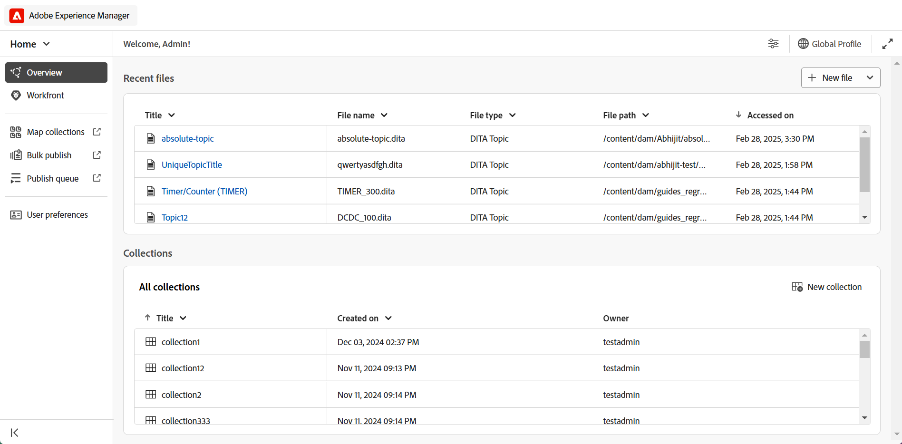
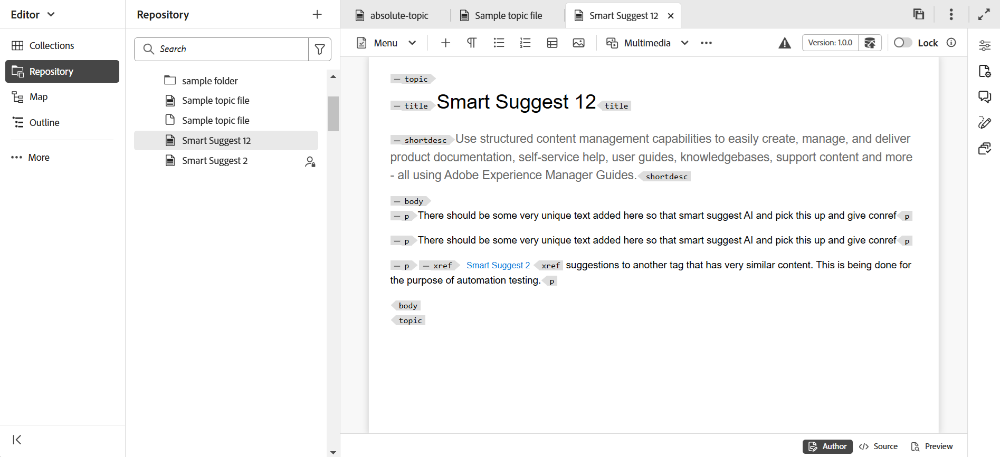
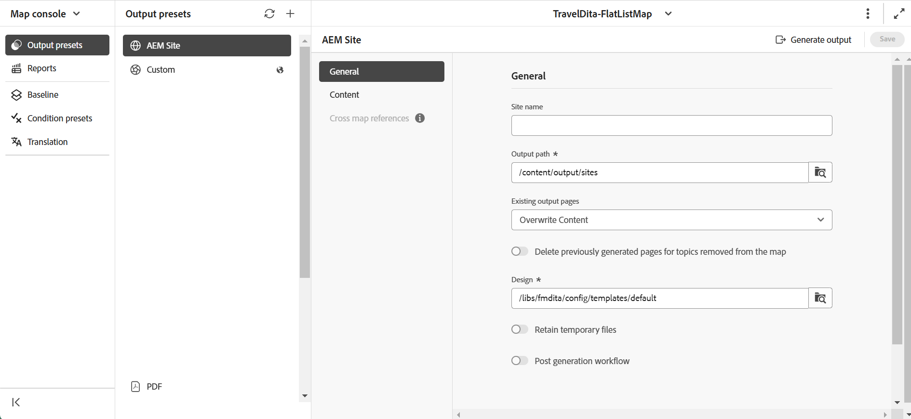
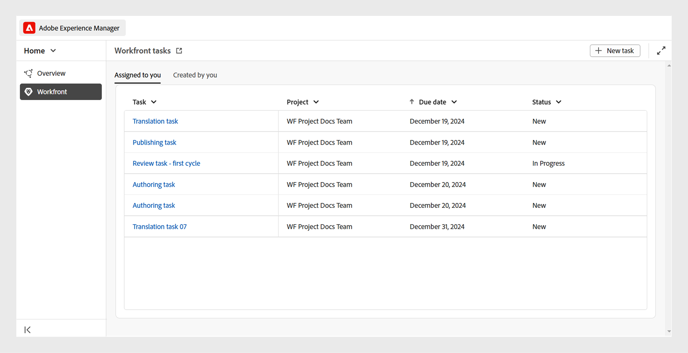
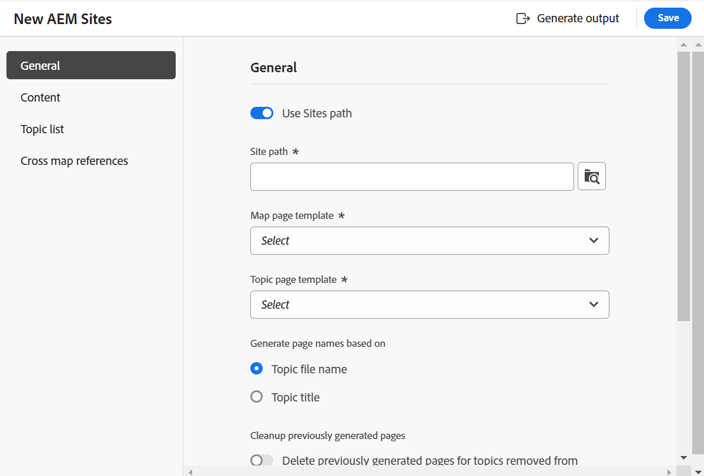
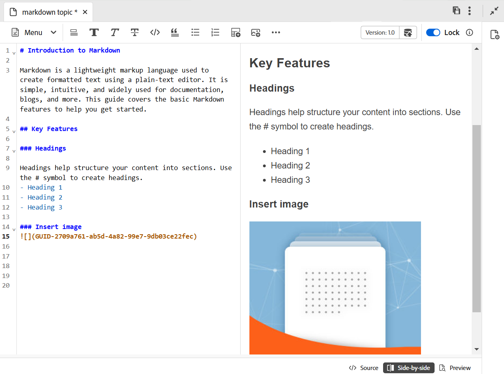
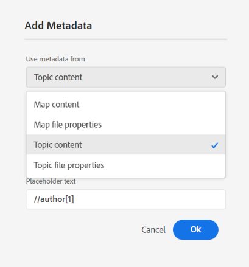
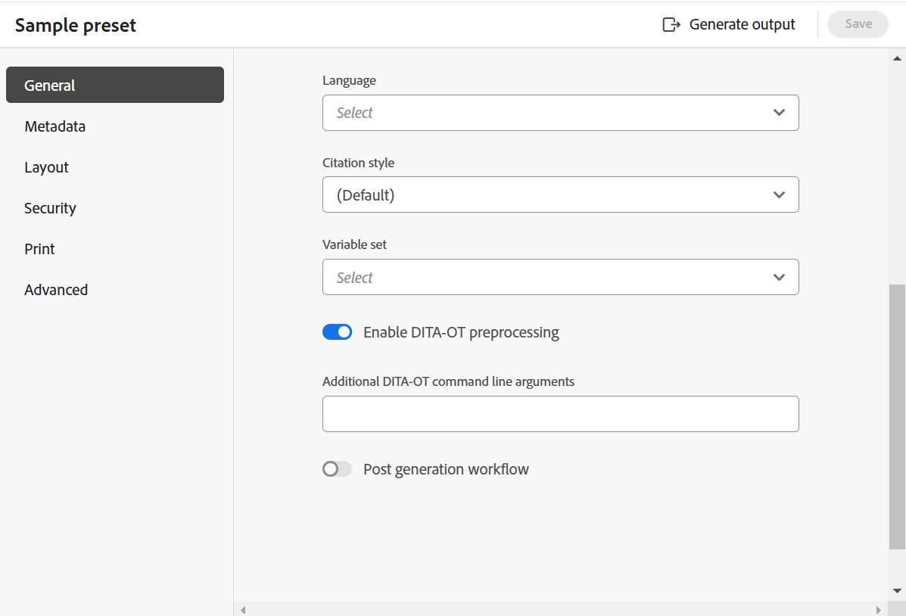

# 5.0.0版的新增功能（2025年3月）

本文介紹5.0.0版Adobe Experience Manager Guides推出的新功能和增強功能。

如需此版本中已修正的問題清單，請檢視[5.0.0版本](../release-info/fixed-issues-5-0-0.md)中已修正的問題。

瞭解5.0.0版[&#128279;](../release-info/upgrade-instructions-5-0-0.md)的升級指示。

## 改版Experience Manager Guides UI，以提升生產力及使用體驗

Adobe Experience Manager Guides現在改版設計和增強功能，協助您以前所未有的速度和效率工作。 新的UI提供直覺式且增強的使用者體驗，包含全新的首頁、更乾淨且更有組織的編輯器工具列、專屬的地圖主控台，以及增強功能。

主要重點如下：

- **首頁簡介**： Experience Manager Guides現在提供直覺式歡迎熒幕體驗的首頁，包括您最近存取的檔案快速檢視、集合等等。

  如需更多詳細資料，請檢視[Adobe Experience Manager Guides首頁體驗](../user-guide/intro-home-page.md)。

  {width="800" align="left"}

- **新的編輯器體驗**：現在，以新的外觀和風格體驗編輯器。 改版後的編輯器介面具有更簡潔且更有條理的工具列、順暢的導覽以及整體直覺式體驗，以協助更快且更有效率地撰寫檔案。

  取得[瞭解編輯器功能](../user-guide/web-editor-features.md)。

  {width="800" align="left"}

- **專屬地圖主控台**：推出地圖主控台，這是結合所有地圖管理與發佈功能的專屬主控台。 現在，您可以選擇在一個介面中產生輸出、翻譯內容、建立報告等。

  深入瞭解[地圖管理與發佈](../user-guide/map-console-overview.md)。

  {width="800" align="left"}

## 與Adobe Workfront整合，提供強大的工作管理功能

Experience Manager Guides現在與Adobe Workfront緊密整合，讓您在Experience Manager Guides核心CCMS功能之上也能存取強大的專案管理功能。

透過這項整合，您可以直接從Experience Manager Guides建立和管理Adobe Workfront工作。 例如，身為作者，您可以直接在Experience Manager Guides介面中建立稽核任務（新增一或多個DITA主題或地圖），並將其指派給稽核者。 作為稽核者，您可以在Experience Manager Guides稽核UI中處理指派的任務，並將它們帶回給具有註釋的作者。 同樣地，您可以建立發佈和翻譯任務，然後將其指派給需要在其上工作的使用者。

整合也可讓您監視工作佇列，確保您保持井然有序，掌控所有工作（指派的工作）。 它也能讓專案經理運用Adobe Workfront的強大功能，在Experience Manager Guides中進行深入的專案管理。

如需詳細資訊，請參閱[Workfront整合](../user-guide/workfront-integration.md)。

{width="800" align="left"}

## 更快速、更可擴充的全新AEM Sites發佈引擎

透過全新的發佈引擎，透過複合元件對應最佳化以更快建立及轉譯頁面，體驗更快速且可擴充地發佈至AEM Sites。 它隨附全新的、現成可用的可編輯範本，您可根據需求使用AEM範本編輯器自訂。 這些範本運用WCM核心元件和專用的Guides元件的組合，以確保您的使用者在您的AEM Sites頁面上獲得最佳體驗。 您也可以自訂現有的範本，以運用此新發佈引擎的強大功能。

深入瞭解[AEM Sites發佈](../user-guide/generate-output-aem-site-web-editor.md)。

{width="500" align="left"}

## 透過單一主題發佈，將獨立內容無縫發佈至AEM Sites

將單一主題發佈功能引入到AEM Sites頁面，可讓您直接將個別主題發佈到AEM Sites頁面，而無需發佈整個地圖。  這會簡化發佈程式，使其在處理獨立內容（例如行銷內容、技術佈告欄或任何其他獨立內容）時更有效率。 此外也簡化內容維護，因為不需要建立地圖來發佈單一主題。

如需詳細資訊，請檢視[發佈AEM Sites頁面](../user-guide/publish-aem-sites.md)。

{width="500" align="left"}

## 全新的Markdown編輯器，提供豐富的撰寫體驗

現在，您可以體驗更乾淨、更有效率、功能強大的方式，來撰寫Markdown主題。 Experience Manager Guides推出新的Markdown編輯器介面，其中包含井然有序的工具列和進階功能，包括可同時創作和預覽內容的&#x200B;**並排式**&#x200B;檢視。 此外，您也可以順暢地將地圖中的Markdown主題發佈至多個管道。

如需詳細資訊，請參閱[Markdown製作](../user-guide/web-editor-markdown-topic.md)。

{width="800" align="left"}

## 編輯器增強功能

下列編輯器增強功能已隨新發行版本一起提供：

**資料表插入的增強功能**

- 可在表格或簡單插入對話方塊中設定表頭列、本文列和欄的預設值。
- 可設定表格設定，以將從外部來源複製的表格貼上為簡易表格或表格。

  如需詳細資訊，請在[瞭解編輯器功能](../user-guide/web-editor-features.md#content-insertion-options)中檢視[表格]區段。

**增強DITA元素的易記名稱功能**

改善DITA元素的易記名稱功能。 現在，當易記名稱指派給元素時，會保留預設列舉值，而更新的名稱會反映在階層連結、內容屬性、可重複使用的內容面板、字彙表面板和其他相關位置中。

**篩選搜尋的增強體驗**

Adobe Experience Manager Guides存放庫中篩選搜尋結果的資產顯示限制已提高。 搜尋結果現在會傳回符合搜尋條件的所有相關資產或檔案。 您可以捲動清單以載入更多結果，而不需要執行重複搜尋來找出所需的資產。

**影像的替代文字現在已新增為元素**

影像現在會根據最新的DITA標準，使用`<alt>`元素作為替代文字。 不建議使用`@alt`屬性作為替代文字，但舊版DITA仍支援此功能。

**在編輯器工具列中自訂互動參照**

現在，建立&#x200B;**互動參照**&#x200B;的自訂工具列按鈕，以直接存取其中一個功能表選項。 例如，您可以設定此選項以根據需要直接跳至網頁連結、電子郵件連結、檔案參考或任何其他可用選項。

如需詳細資訊，請檢視[自訂頂列和工具列](../guides-ui-extensions/customisations/toolbar-topbar.md)。

## 檢閱增強功能

下列Review增強功能已作為新版本的一部分提供：

- 現在，在建立稽核任務時，您可以輸入專案名稱以快速找到並在專案下拉式清單中選取它。 此增強功能免除了捲動冗長的專案清單的需求，讓指派稽核任務變得更快且更有效率，尤其是在管理多個專案時。

- 在編輯器和稽核UI中，稽核&#x200B;**回覆**&#x200B;方塊現在支援多行專案。 您可以使用&#x200B;**Shift**+**Enter**&#x200B;移至下一行。 您也可以在寫入註解時展開註解方塊。

  如需詳細資訊，請檢視[檢閱主題](../user-guide/review-topics.md)。

- 現在，即使稽核任務標籤為關閉，作者仍可在編輯器中存取稽核註釋。 透過最新的增強功能，「稽核」面板會針對編輯器中的每個專案提供作用中及已關閉的稽核任務。 當您選取已關閉的稽核任務時，對應的註解會顯示在右側的「註解」面板中，以確保即使在任務關閉後，也能持續存取重要的稽核註解。

  如需詳細資訊，請檢視[瞭解編輯器功能](../user-guide/web-editor-features.md)的[檢閱]區段。

## 發佈增強功能

下列發佈增強功能已隨新發行版本一起提供：

**原生PDF的增強功能**

- 產生原生PDF輸出時，能夠將主題`prolog`元素的中繼資料（例如版權、作者和其他詳細資訊）納入頁面配置中。 這可確保產生的PDF更詳細，並提供基本的內容，讓讀者瞭解更多資訊。

  如需詳細資訊，請檢視[在頁面配置](../native-pdf/design-page-layout.md#add-fields-and-metadata-add-fields-metadata)中新增欄位和中繼資料。

  {width="300" align="left"}

- 引入選項以啟用或停用原生PDF輸出的DITA-OT前置處理。 如果您的內容在處理期間需要DITA-OT型標準化或自訂DITA-OT外掛程式，請啟用此選項。 這可讓您更深入控制為PDF產生處理內容的方式。 依預設，設定設為&#x200B;**已啟用**。

  如需詳細資訊，請檢視[使用PDF輸出預設集](../user-guide/generate-output-pdf.md)

  {width="500" align="left"}

- 產生原生PDF輸出的列印設定已從&#x200B;**範本**&#x200B;設定移至&#x200B;**原生PDF輸出預設集**，以提升使用性。 您現在可以線上上和列印PDF時，使用相同的範本，並搭配不同的列印設定（例如色彩設定檔）。

  如需詳細資訊，請檢視[原生PDF輸出預設集](../web-editor/native-pdf-web-editor.md)

- 可在原生PDF輸出中為目錄頁面新增書籤，以進行順暢的頁面導覽，尤其是在長的PDF中。

  如需詳細資訊，請檢視[在PDF輸出中新增自訂書籤](../native-pdf/add-custom-bookmark.md)。

## 內容管理增強功能

下列內容管理增強功能已作為新版本的一部分提供：

**報表中的自訂中繼資料欄位**

此功能可讓您透過&#x200B;**設定**&#x200B;設定報表的自訂中繼資料欄位。 設定之後，您可以在「報表」的「篩選器」面板的&#x200B;**欄**&#x200B;下檢視這些欄位，您可以在此選取或取消選取這些欄位，以控制其可見性。

如需詳細資訊，請參閱對應主控台[&#128279;](../user-guide/reports-web-editor.md)的DITA map報告。

翻譯UI中的&#x200B;**重新整理按鈕**

在翻譯UI中引入重新整理按鈕，可讓您使用更新的檔案和狀態重新整理翻譯儀表板。

**資產後處理工作流程的增強功能**

已透過REST API及API SDK提供資產後處理支援。 現在將觸發資產處理事件，而且可聆聽以定義進一步的工作流程。

如需詳細資訊，請檢視[後續處理事件處理常式](../api-reference/post-process-event.md)。

## 已棄用的功能

**快速產生**

Experience Manager Guides不再支援&#x200B;**快速產生**&#x200B;功能，可直接從存放庫檢視或地圖檢視產生輸出。

此功能已從「存放庫」和「地圖」檢視面板中移除。 建議對所有對應管理和發佈相關動作使用&#x200B;**對應主控台**。

如需詳細資訊，請檢視[地圖管理與發佈](../user-guide/map-console-overview.md)。

**將根對應中繼資料引數傳遞至DITA-OT命令列**

透過DITA-OT命令列傳遞根對映中繼資料引數的功能已隨著發行而淘汰。 現在，建議在預設集中使用&#x200B;**檔案屬性**&#x200B;或&#x200B;**中繼資料**&#x200B;欄位，以傳遞必要的DITA-OT中繼資料。

若要繼續在DITA-OT命令列中傳遞中繼資料，您必須更新`Config.Manager`中的`pass.metadata.args.cmd.line`。

如需詳細資訊，請檢視[設定輸出產生設定](../cs-install-guide/conf-output-generation.md#configure-the-dita-ot-command-line-argument-field-to-accept-root-map-metadata)。
