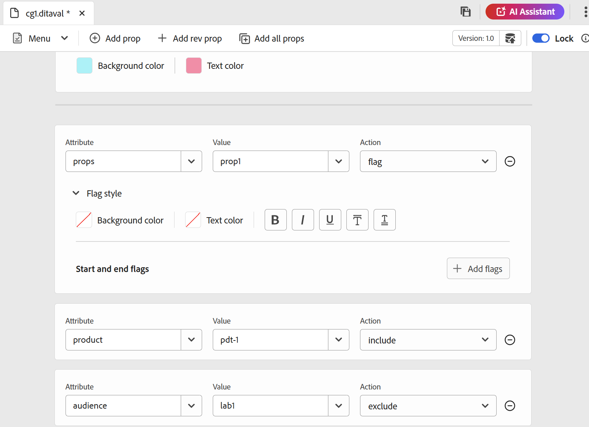
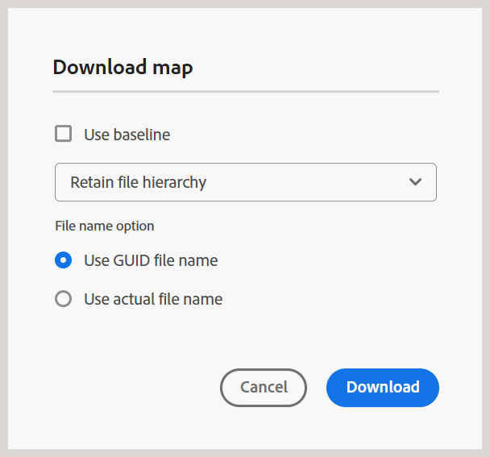
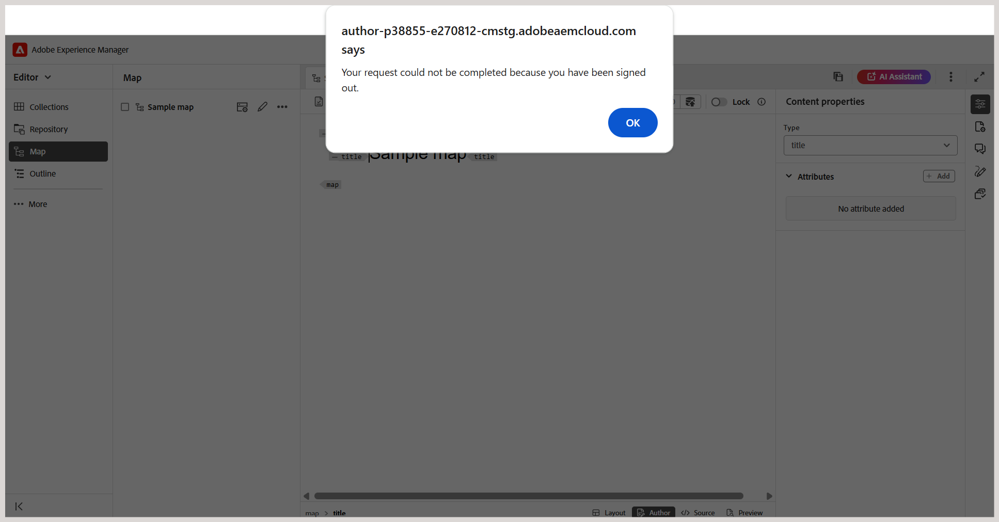

# 5.1.0版的新增功能（2025年9月）

本文介紹5.1.0版Adobe Experience Manager Guides推出的新功能和增強功能。

如需此版本中已修正的問題清單，請檢視5.1.0版本[中的](fixed-issues-5-1-0.md)已修正問題。

瞭解5.1.0版[的](../release-info/upgrade-instructions-5-1-0.md)升級指示。

## 增強的稽核工作流程

透過此版本，稽核工作流程已大幅提升，以更好地支援作者與稽核者之間的無縫溝通。 主要更新包括：

- 包含可操作通知的任務管理工作流程
- 標籤使用者以立即引起注意的功能
- 從檢閱面板存取專案和任務詳細資料以方便使用

透過這些增強功能，使用者現在可以預期：

- 有效率且即時的審查週期
- 減少意見交換期間的手動操作

如需詳細資訊，請檢視[檢閱簡介](../user-guide/review.md)

## 改善建立和使用DITAVAL檔案的體驗

此更新引進了數項增強功能，可簡化建立、管理和套用DITAVAL檔案的程式，以便更妥善地控制各項輸出的條件式內容和樣式。

主要重點如下：

- **編寫DITAVAL檔案的增強標籤支援：** Experience Manager Guides提供新功能，可透過DITAVAL檔案的增強標籤支援來自訂內容發佈。 您現在可以在特定內容（包括影像）周圍套用開始和結束標幟，並透過粗體、斜體等格式選項豐富標幟的區段。 若要處理條件重疊，可以設定&#x200B;**樣式衝突**，包括設定預設背景和文字色彩，以確保輸出內容清晰一致。 原生PDF產生已完全支援這些標幟，而且產生的輸出會準確且全面反映所有套用的樣式元素。
如需詳細資訊，請檢視[使用DITAVAL編輯器](../user-guide/ditaval-editor.md)。

  {width="350" align="left"}

- **原生PDF支援多個DITAVAL檔案：**&#x200B;對於原生PDF，現在可以新增多個DITAVAL檔案，每個檔案都顯示為標籤專案，以便輕鬆識別和移除，為PDF輸出中的條件式內容提供更大的彈性和控制能力

  此外，此更新透過啟用跨格式的可編輯DITAVAL欄位來增強輸出預設集建立，允許使用者手動指定DITAVAL路徑。

  如需更多詳細資料，請檢視[瞭解Experience Manager Guides中的輸出預設集](../user-guide/generate-output-understand-presets.md)。

## 發佈增強功能

已進行下列發佈增強功能作為新版本的一部分：

### 改善輸出產生記錄檔篩選

此版本引進了輸出產生記錄篩選功能的UI改善。 您現在可以更篩選所有四個不同層級的輸出產生記錄；**資訊**、**警告**、**錯誤** （包括錯誤和例外）以及&#x200B;**致命**；使用改良且直覺式的顏色編碼指示器，簡化分析並銳利化整個記錄資料流的可見度。 這項改善可讓您更有效率地瀏覽記錄檔，並精準找出重要問題。

如需詳細資訊，請檢視[基本疑難排解](../user-guide/generate-output-basic-troubleshooting.md)。

{align="left"}

### 已發佈輸出的暫存檔案，現在會在新設定檔中加入作者與發佈URL

Experience Manager Guides的最新發佈增強功能現在將新的`system_config.xml`檔案新增至使用DITA-OT以及原生PDF輸出發佈HTML、PDF和JSON輸出時產生的暫存檔案。 此檔案會自動包含在發佈作業中，而且當您啟用預設集的&#x200B;**保留暫存檔案**&#x200B;選項並產生輸出時，也可以透過暫存檔案存取。

`system_config.xml`檔案包含AEM執行個體詳細資訊，包括作者URL、本機URL和發佈URL，可提供更清楚的上下文，並改善下載URL的可追蹤性。

如需更多詳細資料，請檢視[瞭解輸出預設集](../user-guide/generate-output-understand-presets.md)。

### 新的輸出路徑變數支援輸出產生

此更新針對原生PDF、DITA-OT PDF、JSON、HTML5和自訂等輸出預設集引入動態`output path`設定。 使用者現在可以在安裝期間使用`${base_output_path}`變數來定義輸出位置，而不使用固定路徑，提供更大的彈性。 先前的預設路徑`/content/dam/fmdita-outputs`不再是強制性的。

與全域資料夾設定檔預設集關聯的所有輸出路徑都會自動移轉，以利用新的基本輸出路徑變數。 不過，對於自訂資料夾設定檔，移轉不會自動進行；建議您聯絡客戶成功團隊以尋求協助。

如需更多詳細資料，請檢視[瞭解輸出預設集](../user-guide/generate-output-understand-presets.md)。

### 匯出的基準線現在包含檔案狀態

「匯出基準線」功能現在包含&#x200B;**檔案狀態**&#x200B;以及基準線快照中的標題、檔案名稱、檔案型別和版本編號等索引鍵詳細資料。 此增強功能提供更完整的基準概觀，可改善基準管理。

如需詳細資訊，請檢視[從地圖主控台建立和管理基準線](../user-guide/web-editor-baseline.md#manage-baselines)。

### 支援透過地圖儀表板使用舊版元件對應針對AEM Sites輸出進行基線導向的增量發佈

已增強增量輸出產生程式，以支援使用舊版元件對應為AEM網站發佈所選基準線中定義之主題的特定版本，確保輸出內容的準確傳播。

如需詳細資訊，請檢視[增量輸出產生](../user-guide/generate-output-aem-site.md)。

## 編輯器增強功能

下列編輯器增強功能已隨新發行版本一起提供：

### 可重複使用內容面板的增強搜尋體驗

Experience Manager Guides在可重複使用的內容面板中引進了增強的搜尋體驗。 透過此更新，搜尋任何關鍵字現在會掃描所有新增為可重複使用內容的檔案，而不只是開啟的檔案，確保您在所有發生次數（無論容器是開啟或摺疊）中都能找到關鍵字的精確位置。 此外，當您清除搜尋列時，會保留所有容器的原始狀態，提供更有效率且方便使用的搜尋功能。

如需詳細資訊，請檢視[可重複使用的內容](../user-guide/web-editor-features.md#reusable-content)。

### 已針對參考連結新增「Format」屬性

Adobe Experience Manager Guides現在為編輯器中的參考連結新增&#x200B;**format**&#x200B;屬性。 此屬性會顯示在&#x200B;**Source檢視**&#x200B;中，並清楚指出檔案型別，例如：

- 對於副檔名為&#x200B;**.pdf**&#x200B;的檔案，格式將設為&#x200B;**pdf**
- 對於副檔名為&#x200B;**.html**&#x200B;的檔案，格式將設為&#x200B;**html**
- 對於具有&#x200B;**.dita**&#x200B;或&#x200B;**.ditamap**&#x200B;檔案的檔案，格式將設定為&#x200B;**dita**

此外，副檔名為&#x200B;**.xml**&#x200B;的檔案的格式也會設為&#x200B;**dita**。 對於沒有任何副檔名的檔案，格式將保留空白。 此外，對於範圍設定為&#x200B;**external**&#x200B;的任何參考連結，無論參考連結中的副檔名為何，格式將設定為&#x200B;**html**。

### 編輯器中增強型地圖下載選項

Experience Manager Guides在&#x200B;**下載地圖**&#x200B;對話方塊中引進了新的&#x200B;**使用實際檔案名稱**&#x200B;選項。 現在，當您下載地圖檔案時，您可以選擇保留其原始檔案名稱，而不是預設的UUID，以便更輕鬆地識別和管理您的檔案。 只有當您選取&#x200B;**保留檔案階層**&#x200B;時，才能使用此選項，當您選擇&#x200B;**平面化檔案階層**&#x200B;時，此選項會停用，讓您在組織下載的地圖時擁有更多彈性。

如需詳細資訊，請檢視[下載檔案](../user-guide/authoring-download-assets.md#download-a-dita-map-file-from-the-editor)。

{width="300" align="left"}

### 防止意外內容遺失的工作階段逾時提示

現在，當Adobe Experience Manager工作階段過期且您因非使用狀態而登出時，快顯訊息會通知您。 在工作階段結束後，當您嘗試在Experience Manager Guides中編輯內容時，會觸發此訊息。 此功能有助於降低遺失未儲存工作的風險，並提升體驗的整體可靠性和流動性，即使在閒置期間亦然。

深入瞭解Experience Manager Guides中的[工作階段逾時提示](../user-guide/session-timeout-prompt.md)。

### 增強編輯器中的`navref`處理

編輯器的最新增強功能改善了DITA map中`navref`元素的處理。 現在，當您將`navref`元素新增至地圖時，**選取路徑**&#x200B;對話方塊會開啟，可讓您輕鬆選擇要做為地圖導覽連結的地圖參考。 新增後，新增的地圖的標題會顯示在「作者」檢視和「版面」檢視中，以便在編寫期間提供更清楚的導覽效果。  此外，新增的`navref`元素會自動解析，以在編輯器中顯示參照的對應。

如需詳細資訊，請檢視[新增導覽參考](../user-guide/map-editor-other-features.md#add-navigation-references)。

### 編輯器工具列和使用者偏好設定中的UI改良

在此版本中，已重新建構首頁上「一般」和「外觀」標籤的&#x200B;**使用者偏好設定**&#x200B;中的設定。 這包括重新命名標籤&#x200B;**開啟對映的偏好設定**，以及將不斷行空格切換移動至編輯器工具列。

此外，在編輯器工具列中，啟用或停用追蹤變更、標籤和不中斷空間的一些快速存取切換現在會分組到功能表下拉式清單中的&#x200B;**顯示**&#x200B;選項下，以提升可用性。

如需詳細資訊，請在編輯器中檢視[工具列](../user-guide/web-editor-toolbar.md#menu-dropdown)。

