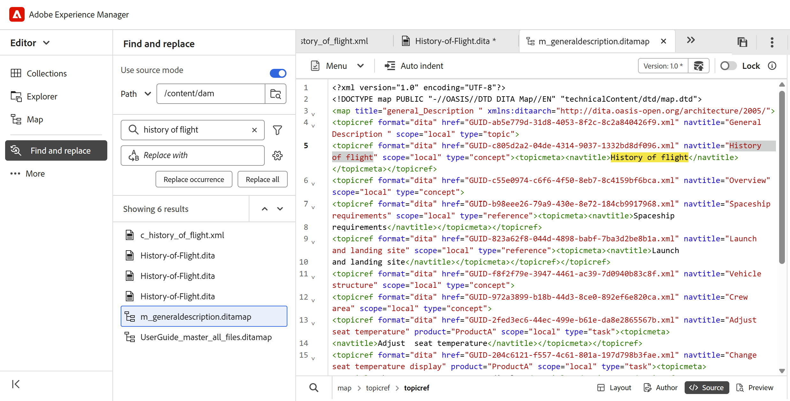

# 5.2.0版的新增功能（2026年5月）

本文介紹5.2.0版Adobe Experience Manager Guides as a Cloud Service所推出的新功能和增強功能。

如需此版本中修正的問題清單，請檢視[ 5.2.0版本](../release-info/fixed-issues-5-2-0.md)中的已修正問題。

瞭解5.2.0版](../release-info/upgrade-instructions-5-2-0.md)的[升級指示。

## Editor 2.0簡介

Editor 2.0 （亦稱為New Editor）提供簡化的撰寫功能，讓您透過更直覺的體驗，更有效率地跨標籤和非標籤模式建立內容。 此版本改善了效能、頁面載入速度更快，甚至對於大型複雜主題也能進行更順暢的編輯。 此外，它還能解決關鍵的編寫空白（尤其是導覽和游標行為），提供更優異的穩定性。 此外，現代化介面提供重新整理且方便使用的UI，平衡功能與易用性。 如需詳細資訊，請檢視[編輯器簡介](../user-guide/web-editor.md)。

以下是重點說明Editor 2.0功能的概觀影片。

>[!VIDEO](https://video.tv.adobe.com/v/3484007)

以下增強功能可讓撰寫作業更容易、更有效率。

### 重新設計使用者介面和體驗

重新整理的介面可改善整體可用性，讓導覽和內容製作更直覺且一致。

- **在製作和預覽模式中元素的更豐富CSS**：增強元素的預設CSS在製作和預覽模式中，提供改良的樣式和更佳的視覺一致性。

  {width="650"}

- **深色佈景主題支援**：在內容編輯區域中支援深色佈景主題，可增強偏好使用深色介面的使用者的撰寫體驗。

  {width="650"}

- **整合的使用者層級編輯器設定**：新的集中式設定面板，可讓作者更好地控制編輯器行為，讓使用者更輕鬆地從單一位置管理偏好設定。 設定選項包括啟用/停用的功能：

   - 在作者模式中不間斷的空格
   - 標籤可見度設定有屬性或沒有屬性
   - 作者模式中的XML註解
   - 在編輯器中插入元素的快速插入功能表

  {width="350"}

  如需如何設定編輯器設定的詳細資訊，請檢視[編輯器設定](../user-guide/config-editor-settings.md)。

- **在作者模式中更清楚地呈現條件式內容**：在作者模式中更清楚地顯示條件式內容，有助於作者更有效識別和管理變數。 如需詳細資訊，請在編輯器的左側面板中檢視[條件](../user-guide/web-editor-left-panel.md#conditions)。

  {width="650"}

### 增強的撰寫功能

提供改良的工具和彈性，以簡化內容建立和編輯工作流程。

- **在標籤模式中檢視屬性以及元素**：作者現在可以使用標籤模式檢視元素屬性，提供更好的結構內容可視性和控制能力。 若要設定此功能，請檢視[編輯器設定](../user-guide/config-editor-settings.md)。

  {width="650"}

- **快速插入功能表**：可在以作者模式編輯時，直接在游標位置新增元素，而不需導覽至工具列。 您也可以透過「編輯器」設定在「我的最愛」區段中設定常用的元素，以加快存取速度。 如需詳細資訊，請檢視[編輯主題](../user-guide/web-editor-edit-topics.md)。

  {width="650"}

- **在作者模式中檢視、編輯和插入XML註解的功能**：讓作者直接在作者模式中檢視、編輯和插入XML註解，以便在內容中更清楚顯示。 若要設定此功能，請檢視[編輯器設定](../user-guide/config-editor-settings.md)。

  {width="650"}

- **並排模式**：允許同時檢視Author和Source模式，兩個檢視保持完全同步，以便更輕鬆比較、編輯和驗證內容變更。 如需詳細資訊，請檢視[編輯器檢視](../user-guide/web-editor-views.md)。

  {width="650"}

- **改善表格製作**：透過更直覺且有效率的互動來建立和管理表格，強化整體的表格製作體驗。

   - 流暢且直覺的互動：輕鬆插入列和欄，並支援拖放功能，可重新排序列和欄。
   - 內容工具列：直接在表格中存取表格專用動作，例如格式設定、對齊、合併和其他額外動作。
   - 設定表格：在單一動作中新增多個列或欄，減少重複步驟並提高效率。

  {width="650"}

  如需詳細資訊，請檢視[使用資料表](../user-guide/web-editor-other-features.md#work-with-tables-in-the-new-editor)。

### 改善大型主題的效能

新編輯器透過提供更快的內容呈現、更可靠的復原和重做功能，以及可清楚指出未儲存變更的髒標示，來增強處理大型複雜主題的體驗。

## 首頁上推出新存放庫和增強型搜尋體驗

存放庫現在可直接從首頁存取，可作為中央空間，以改善資料夾和檔案的探索能力。 它具有專用的&#x200B;**資料夾導覽面板**&#x200B;以及可自訂的&#x200B;**存放庫**&#x200B;的表格檢視。 改版的搜尋和篩選體驗大幅簡化尋找和尋找檔案的程式。 如需詳細資訊，請檢視[瞭解存放庫介面](../user-guide/home-page-repository-view.md)。

在編輯器中，檔案的搜尋和篩選體驗現在與首頁一致。 已引入位於編輯器介面底部的新[搜尋面板](../user-guide/search-panel-explorer.md)以顯示搜尋結果。 此外，存放庫現在在編輯器中重新命名為&#x200B;**Explorer**，可讓您像之前一樣瀏覽資料夾和檔案。

### 支援檔案狀態篩選

您也可以根據檔案的目前檔案狀態來篩選存放庫搜尋結果。 使用檔案狀態篩選，您可以使用資料夾設定檔中`ui_config.json`檔案定義的可用篩選值來縮小搜尋範圍。

「檔案」狀態可用的預設篩選值為：「草稿」、「編輯」、「稽核中」、「已核准」、「已稽核」和「完成」。

<!-- For details on customizing the default document state filters values, view [Configure document state filters](../install-conf-guide/conf-doc-state-filters.md).  -->

>[!NOTE]
>
> 如果您正在使用`ui_config.json`的自訂設定，請務必在升級前備份這些設定。 更新後，請檢閱並調整您的設定，以符合最新版本中推出的變更。

### 多媒體的縮圖圖示

所有多媒體檔案都以縮圖圖示顯示，讓您更輕鬆地在&#x200B;**存放庫**&#x200B;內以視覺方式識別及尋找影像。 此增強功能也適用於在&#x200B;**搜尋面板**&#x200B;中搜尋檔案時，協助您快速區分多媒體資產與其他檔案型別。

## 在「尋找和取代」中介紹Source模式搜尋

Experience Manager Guides在編輯器介面的左側面板中，推出了數個尋找和取代功能的增強功能。 除了改善UI以提升使用性，此版本還在&#x200B;**尋找和取代**&#x200B;面板中引入了新的&#x200B;**使用來源模式**&#x200B;切換。

啟用此模式時，您不僅可以對可見內容執行全域搜尋，還可以對搜尋字串的基礎來源內容（XML結構，包括元素、標籤和屬性值）執行全域搜尋。 此模式可確保在整個內容中進行全面搜尋。

{width="650"}

在此模式中，您可以套用篩選器，依檔案型別、檔案狀態、上次修改日期等縮小搜尋範圍。 您也可以在執行「全部取代」操作後下載詳細的CSV報表，此操作會提供所執行的所有取代操作及其成功和失敗狀態的快照。

如需更多詳細資料，請在編輯器&#x200B;_的_&#x200B;左側面板中檢視[尋找及取代](../user-guide/web-editor-left-panel.md#find-and-replace)區段。

>[!NOTE]
>
> 對於[尋找和取代]面板中的&#x200B;**使用來源模式**&#x200B;功能，必須先完成重新索引。

## 增強的檔案和資料夾瀏覽體驗

此發行版本推出更乾淨、更直覺的介面，以便在Experience Manager Guides中瀏覽檔案和資料夾路徑。

瀏覽檔案時，改版的&#x200B;**選取檔案**&#x200B;對話方塊現在提供具有兩個檢視的索引標籤版面配置 — **存放庫**&#x200B;用於以表格格式瀏覽整個內容存放庫，以及&#x200B;**集合**&#x200B;用於快速存取常用主題、地圖和影像。

{width="650"}

主要增強功能包括：

- 檔案和資料夾的表格檢視，供組織導覽使用。
- 階層連結和資料夾導覽面板，可輕鬆在資料夾中移動。
- 支援可重複使用內容、主題參考、結構描述、輸出預設集（使用DITAVAL）和Workfront的多檔案選取。
- 預覽選取的檔案以方便檢閱；若是多個選取專案，請視需要預覽所有檔案並從「預覽」面板中移除任何檔案。
- 搜尋和篩選選項可依名稱、標題、檔案型別、檔案狀態和標籤來縮小結果的範圍。

**選取路徑**&#x200B;對話方塊也提供改良的樹狀結構檢視，用於資料夾導覽，以確保在內容存放庫中選取路徑時更井然有序、更有效率。

{width="350"}

如需詳細資訊，請在編輯器的&#x200B;_其他功能_&#x200B;中檢視[在Experience Manager Guides](../user-guide/web-editor-other-features.md#browse-files-and-folders-in-experience-manager-guides)區段中瀏覽檔案和資料夾。

## Authoring增強功能

此版本已進行下列製作增強功能：

### 從「內容屬性」面板存取檔案中參照的路徑和UUID

現在，您可以使用&#x200B;**連結路徑**&#x200B;來檢視所選參考的相對路徑，以及使用&#x200B;**連結UUID**&#x200B;來從「內容」屬性面板檢視其唯一識別碼。 您也可以使用連結路徑和連結UUID旁的圖示，直接從介面複製完整的絕對路徑和相關聯的UUID，以便更輕鬆地追蹤和重複使用連結的資產。

如需詳細資訊，請檢視[內容內容](../user-guide/web-editor-right-panel.md#content-properties)。

### 中繼資料變更的工作復本指標

對&#x200B;**檔案屬性**&#x200B;下可用的中繼資料欄位所做的任何變更，或套用在後端的變更，也會在檔案版本上觸發星號(*)。 當您新增、刪除或修改任何預設或自訂中繼資料欄位時，檔案版本會標示為_dirty (*)_。 為了防止系統產生的中繼資料更新影響此指標，管理員可以設定中繼資料屬性的忽略清單。 如需有關如何設定中繼資料屬性的詳細資訊，請檢視[設定中繼資料屬性的忽略清單](../install-conf-guide/conf-metadata-prop.md)。

### Schematron驗證面板的增強功能

Schematron使用者介面已進行下列增強功能，以更清楚明瞭、可用性更高，並可產生驗證結果：

- 在「驗證」面板中，若未新增Schematron檔案，則會顯示空白狀態訊息，為後續步驟提供更清楚明瞭的方向。

  {width="350"}

- 新增多個Schematron檔案時，它們會整理在合併的摺疊式功能表下，以便更清楚地檢視已設定的Schematron檔案。

  {width="350"}

- 根據Schematron檔案中定義的角色屬性，驗證結果現在分類為： `Fatal`、`Error`、`Warn`或`Info`。 每個類別都包含可見的計數以及內容相關工具提示，以便更清楚理解。

  {width="350"}

如需在Experience Manager Guides中使用Schematron檔案的詳細資訊，請檢視[Schematron檔案的支援](../user-guide/support-schematron-file.md)。

### 編輯器介面的右側面板現在提供翻譯語言副本

編輯器中之&#x200B;*檔案屬性*&#x200B;下的右側面板現在提供新的&#x200B;**翻譯**&#x200B;區段。 本節可讓您直接存取目前開啟之資產（地圖、主題、影像等）的所有可用語言副本。 您不再需要導覽至Assets UI即可檢視或存取這些語言副本。

{width="350"}

對於每個語言副本，您可以將滑鼠停留在檔案上以找出其在存放庫中的路徑，或直接選取它以在編輯器中開啟。 除了開啟檔案之外，您也可以使用&#x200B;**選項**&#x200B;功能表執行許多動作。 您可以執行的部分動作包括編輯、預覽、複製UUID、複製路徑、新增至集合和屬性。

如需更多詳細資料，請在編輯器中檢視[右側面板](../user-guide/web-editor-right-panel.md#file-properties)。

### 在預覽模式下重新整理主題或地圖

>[!NOTE]
>
>此行為僅適用於舊編輯器。 在新編輯器中，預覽內容會自動重新整理。

正在引入已在預覽模式中開啟之地圖的新&#x200B;**重新整理**&#x200B;功能。 有了這項新功能，您就可以輕鬆重新整理整個地圖的內容或其中出現的個別主題。

- 為了重新整理整個地圖（包括所有主題），編輯器左上角引進了新的&#x200B;**重新整理**&#x200B;按鈕。

  {width="600"}

- 為了重新整理個別主題的內容，在內容功能表中引進了新的&#x200B;**重新整理主題**&#x200B;選項。

  {width="600"}

如需詳細資訊，請檢視[對應編輯器功能](../user-guide/map-editor-advanced-map-editor.md)。

### 主題和地圖的字數

您現在可以追蹤地圖或主題檔案中出現的字數。 右側面板中的新&#x200B;**字數**&#x200B;欄位會顯示主題（或地圖）中存在的字數總計，其中以空格分隔的字會計為個別的字數。 每次儲存變更時，它都會自動重新整理。 對於互動參照，只包含顯示文字，而排除鍵。

{width="350"}

如需詳細資訊，請在編輯器](../user-guide/web-editor-right-panel.md#file-properties)中檢視[右側面板。

### 在作者檢視中輕鬆識別和修正主題和地圖中的重複ID

Experience Manager Guides現在於編輯器中包含了&#x200B;**重複ID**&#x200B;按鈕，可協助您快速識別及修正單一主題或地圖中存在的重複ID。 偵測到重複的ID時，此按鈕會出現在&#x200B;**作者**&#x200B;檢視中Editor介面的左下角。 選取按鈕後，彈出視窗中會顯示具有重複ID的所有執行個體清單。 選取執行個體會反白標示主題或地圖中的對應內容，讓您從右側面板中尋找並修正重複的ID。

如需詳細資訊，請在編輯器中檢視[其他功能](../user-guide/web-editor-other-features.md)。

{width="350"}

### 儲存庫和報告篩選器的增強功能

存放庫中的進階篩選器下方的&#x200B;**鎖定者**&#x200B;篩選器和DITA map報告中的&#x200B;**作者**&#x200B;篩選器現在會在您捲動時逐漸載入使用者清單，而不是一次全部載入。 此分頁載入可提升速度，並讓處理大型使用者資料集的效率更高、更順暢。

### 在所有日誌欄位中搜尋引文

現在，您可以使用&#x200B;**新增引文**&#x200B;對話方塊中的&#x200B;**Any field**&#x200B;選項，搜尋所有日誌欄位，例如&#x200B;*Title*、*Journal title*、*Author*、*Year*、*Volume*、*Number*&#x200B;和&#x200B;*Pages*。 搜尋會根據輸入的文字傳回最接近的相符引號。

如需在Experience Manager Guides中新增引文的詳細資訊，請檢視[在您的內容中新增和管理引文](../user-guide/web-editor-apply-citations.md)。

{width="350"}

### 設定現已重新命名為Workspace設定，並可從首頁存取

為了改善導覽和可用性，已引入以下增強功能：

- 編輯器中&#x200B;**其他動作**&#x200B;功能表中的&#x200B;**設定**&#x200B;已重新命名為&#x200B;**Workspace設定**。
- **更多動作**&#x200B;功能表（三點功能表），以前只能在[編輯器]與[地圖]主控台介面中使用，現在可從[首頁](../user-guide/intro-home-page.md)存取。

  

### AI助理中智慧型建議的增強索引

您現在可以使用新的狀態指示器，在AI Assistant中輕鬆追蹤智慧型建議每次索引嘗試的狀態：索引已完成、不同步、進行中，以及索引失敗。 最後索引時間戳記現在會記錄在資料夾設定檔層級，以便更佳追蹤。 此外，當為索引指定資料夾或檔案路徑時，會強制執行父子資料夾限制。

如需更多詳細資料，請檢視[設定AI助理以進行智慧說明和編寫](../install-conf-guide/conf-profiles.md#configure-ai-assistant-for-smart-help-and-authoring-only-for-cloud-service)。

## 檢閱增強功能

此版本已進行下列稽核增強功能：

### 稽核任務的自動提醒

您現在可以啟用&#x200B;**自動提醒**，在稽核工作的到期日之前和到期之後，為稽核者排程AEM通知和電子郵件提醒。 您可以為每個案例設定多個提醒，依定義的順序傳送預先到期提醒，並根據設定的提醒排程，在任務標示為逾期後觸發逾期提醒。 如需詳細資訊，請檢視[傳送主題以供檢閱](../user-guide/review-send-topics-for-review.md)。

### 版本歷史記錄

檢閱者現在可以存取檢閱中主題的「版本」歷程記錄，讓他們檢視和比較先前檢閱任務中相同主題的先前檢閱和更新版本。 這可協助檢閱者驗證自先前的檢閱週期以來所做的變更，並在目前的檢閱內容中檢閱註釋、標籤及其他相關詳細資訊，以維持連續性。 如需詳細資訊，請檢視檢閱者的[版本記錄](../user-guide/review-topics.md#version-history-for-the-reviewer)。

### 直接從檢閱面板存取檢閱任務的狀態

作為稽核任務的發起者，您現在可以直接從「稽核」面板檢查稽核任務的狀態。 透過最新的增強功能，檢閱面板中的&#x200B;**更新任務**&#x200B;對話方塊包含新的&#x200B;**檢查檢閱狀態**&#x200B;選項。 選取此選項會直接將您帶到稽核儀表板，您可以在其中檢視每個稽核者的工作狀態，讓您無需切換前後關聯即可更快速地存取工作進度。

如需更多詳細資料，請檢視[要求重新檢閱或關閉檢閱工作作為作者](../user-guide/review-close-review-task.md)。

{width="350"}

### 根據使用中專案選擇指派檢閱者

- 將稽核者指派給稽核任務現在取決於使用中的專案選擇。 在選取使用中的專案之前，*建立稽核任務*&#x200B;頁面上的&#x200B;**指派給**&#x200B;欄位保持停用狀態。 選取專案後，**指派給**&#x200B;欄位已啟用，並僅列出與該專案相關聯的使用者和使用者群組。 這可確保稽核任務僅指派給有效的專案成員，並防止稽核者意外選擇。

  

- **指派給**&#x200B;欄位現在支援預先輸入搜尋，可讓您透過輸入文字快速找到使用者或使用者群組。

這些增強功能加在一起，讓稽核者選取更準確、更有效率，並與專案特定的稽核工作流程保持一致。

如需詳細資訊，請檢視[傳送主題以供檢閱](../user-guide/review-send-topics-for-review.md)。

### 修改進行中的稽核任務

您可以將新主題新增至進行中的稽核任務（如果先前未傳送給稽核），或從進行中的稽核任務中移除主題，而不會影響稽核工作流程。 在&#x200B;**工作詳細資訊**&#x200B;頁面上，您只需選取或取消選取主題即可修改主題清單。 檢閱者會透過AEM和電子郵件通知，收到有關其指派之主題的任何變更通知。 如需詳細資訊，請檢視[傳送主題以供檢閱](../user-guide/review-send-topics-for-review.md)。

{width="650"}

## 翻譯增強功能

此版本已進行下列翻譯增強功能：

### 已傳送以進行翻譯的未建立版本資產的指標

管理翻譯時，在傳送內容以進行處理之前，請務必確認所有內容皆已建立版本。 為了協助解決此問題，Experience Manager Guides現在為已儲存變更但尚未建立版本的主題提供明確指標。

如果檔案包含未建立版本的變更（未在地圖中儲存為新版本），則檔案旁邊會出現&#x200B;_資訊_&#x200B;圖示，表示存在更新。 若要快速集中處理這些檔案，請啟用「篩選器」面板中的&#x200B;**僅顯示未設定版本變更的資產**&#x200B;選項。

如需詳細資訊，請從[地圖主控台]檢視[翻譯檔案](../user-guide/translate-documents-web-editor.md)。

{width="650"}

## 資產管理增強功能

此版本引進了資產管理的下列增強功能：

### 使用「平面化檔案階層」來下載具有原始檔案名稱和關聯中繼資料的地圖

現在，您可以使用「平面化檔案階層」選項來下載具有原始檔案名稱的對應。 此外，下載的套件包含`metadata.json`檔案，讓相關聯的中繼資料在Experience Manager Guides外部可輕鬆存取及重複使用。

如需有關在Experience Manager Guides中下載檔案的詳細資訊，請檢視[下載檔案](../user-guide/authoring-download-assets.md)。

### 唯讀檔案的中繼資料屬性無法再編輯

在此版本中，當啟用`Disable edit without locking the file`設定時，如果檔案處於&#x200B;**唯讀**&#x200B;模式，則無法再編輯檔案內容。

此限制適用於所有可修改DITA和Markdown檔案屬性的進入點，包括：

- 編輯器介面的&#x200B;**右側面板**
- 檔案內容功能表中的&#x200B;**屬性**&#x200B;選項
- 地圖的中繼資料報表
- ASSETS UI

對於非DITA資產（例如影像和多媒體），即使是在唯讀模式下，中繼資料屬性仍可編輯。

如果檔案是唯讀的，您必須先出庫檔案，才能對其屬性進行任何變更。 此變更會強制實行更嚴格的許可權控制，並確保屬性更新遵循與內容編輯相同的簽出和鎖定規則。

### 使用Regex來啟用或停用後處理

您現在可以使用Regex來啟用或停用資料夾的後處理。 此增強功能可讓管理員使用單一設定，定義套用至多個資料夾或整個資料夾階層的後處理規則，而非指定個別資料夾路徑。

如需詳細資訊，請檢視[使用Regex啟用或停用後處理](../install-conf-guide/conf-folder-post-processing.md)。

### 自動化B樹狀結構清理以獲得最佳效能

為了維持系統效率並防止資源阻塞，新的背景程式會定期清理系統層級B樹狀結構。 這可確保不再存在或暫時新增的資產不會佔用不必要的空間。

系統會聰明地識別要清理的候選專案，並執行自動移除。 此外，此功能也是可設定的，可讓管理員根據營運需求控制其行為。

如需詳細資訊，請檢視[設定B樹狀結構清理](../install-conf-guide/conf-btree-cleanup.md)。

### 改善處理具有大量索引鍵的DITA map

您現在可以順暢地使用包含大量金鑰的DITA map。 此增強功能可確保更快的載入速度並改善效能，讓您更輕鬆地在不中斷的情況下管理複雜的地圖。

組建版本升級後，系統可能會遇到暫時性的負載增加，導致新上傳資料的後處理延遲。 這是因為自動的一次性指令碼(OTS)在背景執行。 指令碼完成後，系統效能將恢復正常。

### 改善資產處理功能

- 引入自動化程式，以使`/content/dam`中的資產保持最新。 系統每15分鐘觸發一次資產重新處理。 在每個週期中，系統都會挑選最近15分鐘間隔內新增或維持未處理的資產，並重新處理，進而改善內容存放庫的效率和一致性。
- 在資料夾和個別檔案層級執行資產處理
- 選擇特定資產型別（例如，主題、地圖、Markdown、HTML/CSS、DITAVAL或其他支援的檔案）以僅處理您需要的檔案，藉此篩選資產。
- 套用以日期為基礎的篩選器，以限制指定時間範圍的處理範圍。
- 使用存放庫檢視和檔案總管面板中檔案和資料夾內容功能表中可用的新選項（**重新處理資產**），直接重新處理資產。

如需有關處理資產的詳細資訊，請檢視[處理資產](../user-guide/asset-processor.md)。

## 發佈增強功能

此版本已進行下列發佈增強功能：

### 設定特定輸出預設集的自訂影像轉譯

您現在可以使用`renditionmapping.xml`中的`outputName`屬性，為相同輸出型別下的個別輸出預設集設定不同的影像轉譯。 此增強功能可讓您在發佈需要針對不同情境設定不同影像解析度的內容時，擁有更大的彈性。 例如，您可能會想要讓主要HTML5輸出使用高解析度影像，同時為輕量版預設集使用較小的縮圖。

如需詳細資訊，請檢視[在輸出產生](../install-conf-guide/conf-output-generation.md#handle-image-rendition-during-output-generation)中處理影像轉譯。

### 下載所產生輸出的記錄檔

產生輸出並檢視記錄檔時，現在有新的&#x200B;**下載記錄檔**&#x200B;按鈕可供您下載記錄檔至本機裝置，以更輕鬆存取及檢視。

### 原生PDF輸出中交叉參照的語言變數

發佈原生PDF輸出時，您可以使用[語言變數](../native-pdf/native-pdf-language-variables.md)來翻譯靜態互動參照文字，例如&#x200B;_請參閱第_&#x200B;章中的&#x200B;_請參閱第_&#x200B;頁。 變數透過`xml:lang`屬性使用主題中定義的語言。

如需有關設定原生PDF輸出預設集和互動參照設定的詳細資訊，請檢視[原生PDF輸出預設集](../web-editor/native-pdf-web-editor.md)。

### 在AEM Sites （使用複合元件對應）發佈中支援元素層級元件對應

Experience Manager Guides現在支援AEM Sites輸出中的元素層級元件對應（使用複合元件對應），可讓團隊精確控制DITA元素使用`componentmapping.json`的呈現方式。 將`topicref`、標題、影像、表格等對應至適當的AEM核心元件，可獲得更簡潔的結構，而非預設為文字元件的所有內容。 這可提供更優異的效能，並開啟更豐富、更現代的Sites體驗。

如需詳細資訊，請檢視AEM Sites ](../install-conf-guide/component-mapping.md)的[元件對應。

## Experience Manager Guides中推出的新基線體驗

使用&#x200B;**全新的基準線體驗** （建構在重新設計的基準線架構上），管理大型且複雜的基準線現在更快、更穩定且更易於擴展。 此更新解決長期存在的效能和可靠性挑戰，同時保留現有的工作流程。

此更新作為Beta版增強功能提供，可針對載入緩慢、基準線狀態不一致，以及管理能力有限等常見棘手問題提供解決方案，提供更快、更穩定且更可預測的基準線體驗，並增加自動化和大規模基準線作業的支援。 主要改善專案包括：

- 更優異的效能與擴充能力
- 更強大的UI和後端一致性
- 展開的篩選、導覽和相依性可見度

如需詳細資訊，請在Experience Manager Guides](../user-guide/web-editor-baseline-v2.md)中檢視[新的基準線體驗(Beta)。

## API增強功能

此版本已進行下列API增強：

- 我們引進了新的API來建立新的翻譯專案並追蹤其狀態。 這些API有助於自動化翻譯流程，減少手動工作並提高效率。 如需詳細資訊，請檢視[建立翻譯專案](../api-reference/translation-project.md)
- 增強資產處理API，並改善檔案和資料夾的篩選功能。 如需詳細資訊，請檢視[處理資產](../api-reference/bulk-assets-processing.md)。
- 新API可用於追蹤個別資產和資料夾的後處理狀態。這對使用自動化工作流程的團隊特別有用，因為團隊只需在完全處理內容後發佈內容。API提供確認整備的可靠方式，降低因處理不完整而導致發佈失敗的風險。此外，隨著此API的推出，資產後處理事件不會自動引發。管理員現在可以透過`fmdita config manager`中的設定啟用此事件。
如需詳細資訊，請檢視[API以追蹤個別資產和資料夾的後處理狀態](../api-reference/track-post-processing-status.md)以及fmdita設定管理員中的[後處理事件處理常式設定](../api-reference/post-process-event.md)

## 介紹Experience Manager Guides中的產品培訓和學習內容

Experience Manager Guides中的&#x200B;**產品訓練與學習**&#x200B;內容功能可讓訓練團隊和教學設計人員直接從Experience Manager Guides介面建立互動式電子學習課程。

透過範本導向的製作、互動式課程元件和對評估的支援，團隊可以開發符合其組織目標的高品質培訓內容。

>[!NOTE]
> 
> 所有Experience Manager Guides as a Cloud Service例項都會預設停用產品培訓和學習內容功能。 管理員可以從&#x200B;**Workspace設定** > **一般**&#x200B;在資料夾設定檔層級啟用此功能。

主要功能如下：

- 集中式學習內容管理
- 範本驅動撰寫
- 支援內容重複使用
- 評估建立與管理
- Web型稽核工作流程
- 領先業界的翻譯管理
- 使用現成的SCORM和PDF輸出格式的多管道發佈

如需詳細資訊，請參閱[快速入門手冊](../learning-content/course-overview.md)和[設定指南](../lc-config-guide/introduction.md)。