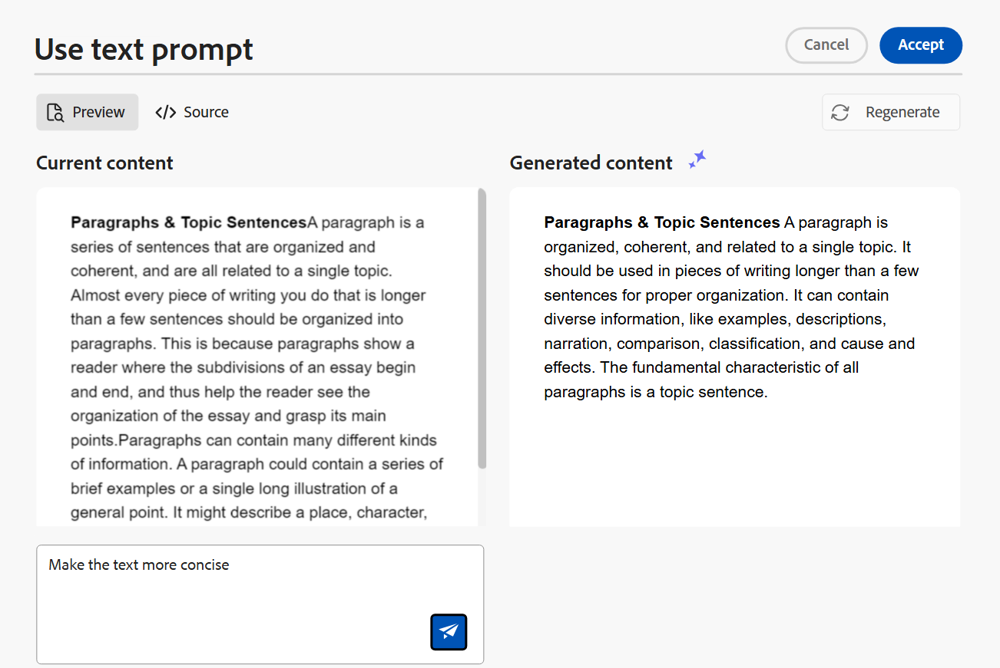
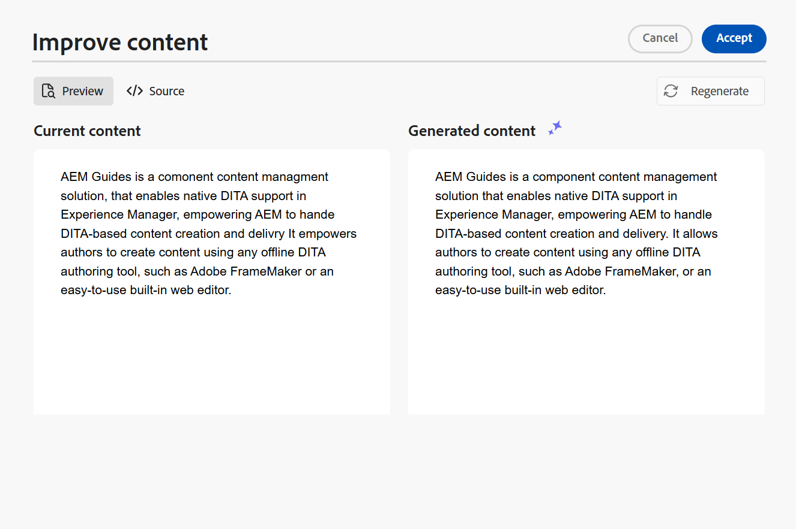
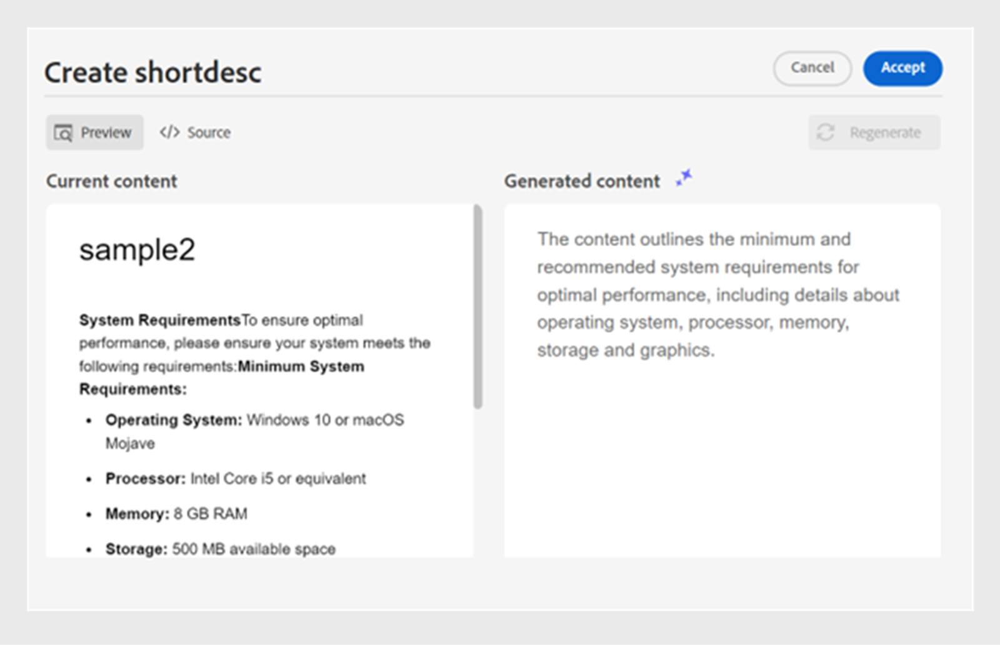
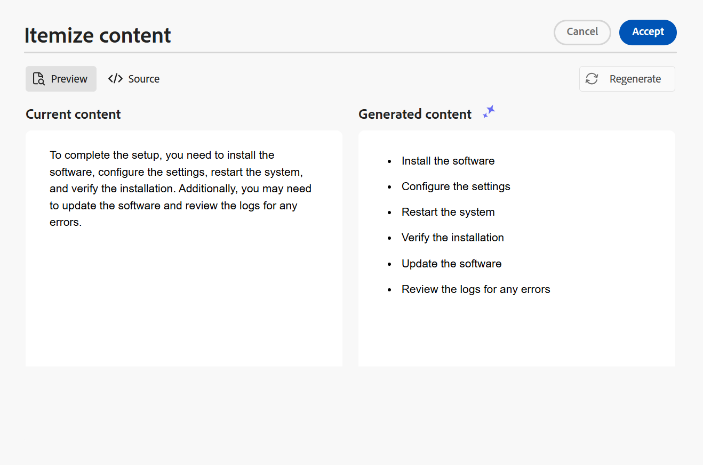
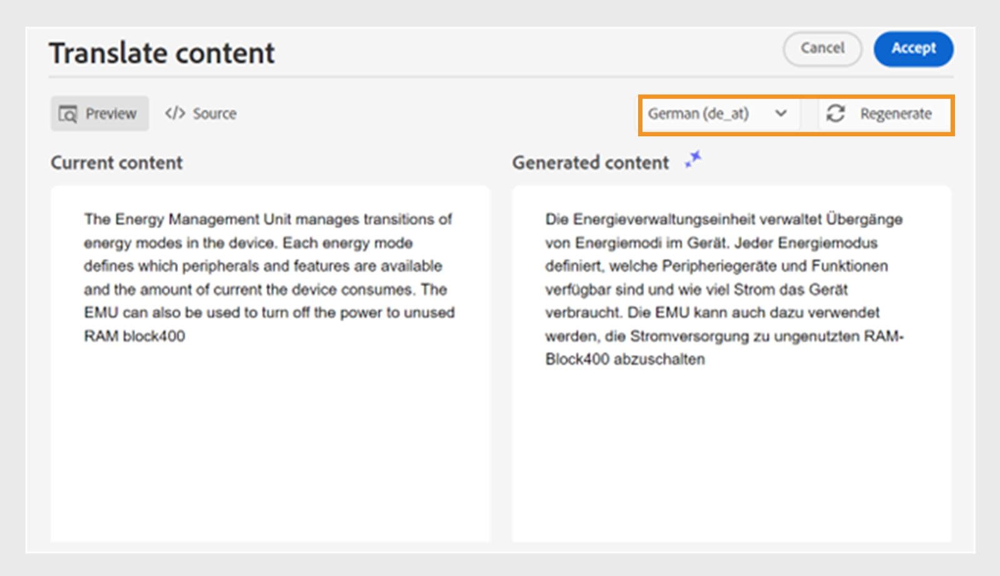

# 使用AI助理(Beta)聰明地編寫檔案

Adobe Experience Manager Guides提供AI Assistant工具，可幫助您更聰明、更快速地完成撰寫。 使用此工具，檢視智慧建議以重複使用現有內容存放庫中的內容。 使用文字提示功能，提供提示並根據您的要求變更內容。 使用AI助理將段落聰明地轉換為清單。 您可以根據選取的內容建立目前主題的簡短說明。 此功能也可協助您輕鬆改善及翻譯選取的內容。

>[!NOTE]
>
> 此編寫功能僅適用於DITA主題，且只能從編輯器介面存取。 在首頁和地圖主控台上，只顯示&#x200B;**說明**&#x200B;面板。 「編寫」功能下可用的選項由管理員使用編輯器設定在資料夾設定檔層級設定。

在主題中選取文字後，您可以選擇執行任何「AI輔助程式」動作：

{width="300" align="left"}

## 建議可重複使用的內容

使用&#x200B;**建議可重複使用的內容** 功能，以一致且正確地編寫內容。 您可以選取內容，而Experience Manager Guides會提供有關如何重複使用存放庫中現有內容的建議。
深入瞭解如何使用[AI支援的智慧型建議來編寫內容](authoring-ai-based-smart-suggestions.md)。

## 使用文字提示

文字提示是指示、問題或陳述式，可引導AI助理產生特定回應。

您可以使用文字提示來變更內容。 例如，您可以選取目前主題的內容，並使用提示&#x200B;*讓文字更簡潔*。 同樣地，您可以使用文字提示將屬性加入至所選內容中所使用的標籤。

1. 選取您要使用文字提示的文字。
1. 從&#x200B;**製作**&#x200B;面板中選取 **ai使用文字提示圖示**。
1. 以下列其中一種方式發出提示：

   - 從建議的提示中選擇提示。
   - 根據您的需求，修訂或編輯建議的提示，以建立自訂提示。

     >[!NOTE]
     >
     > 您的管理員已在`ui_config.json`中設定建議的提示。

   - 在文字方塊中輸入提示。

1. 選取&#x200B;**重新產生** ，以根據您的提示取得其他回應或輸出。

1. （選擇性）選取&#x200B;**展開** 以開啟&#x200B;**使用文字提示**&#x200B;編輯器。 它會顯示目前和產生的內容。 您可以編輯來源版面配置內容並檢查預覽。

   

   >[!NOTE]
   >
   > 系統會根據選取的內容產生回應。

1. 您也可以在編輯器中編輯提示並重新產生回應。 例如，您可以變更提示，讓文字更簡潔，大約為40個字。

1. 您可以驗證產生內容的來源，並視需要加以編輯。

1. 選取&#x200B;**接受**，將主題中選取的內容取代為產生的內容。
1. **取消**：取消文字提示動作。 返回「製作」面板。

   >[!NOTE]
   >
   > 在編寫面板中選取&#x200B;**關閉**&#x200B;圖示可讓您回到AI助理的初始狀態。

## 改善內容

使用&#x200B;**改善內容**&#x200B;功能來改善目前主題所選內容的品質。 您可以選取內容以檢查拼字、語言和文法結構，並建議更好的內容版本。 它也能提升句子的品質。

1. 選取內容。
1. 選取&#x200B;**改善內容** 以尋找改善內容的建議。
1. 選取&#x200B;**重新產生**，以取得其他改善內容的建議。

1. （選擇性）選取&#x200B;**展開**&#x200B;以開啟改良的內容編輯器。 它會顯示目前和產生的內容。 您可以在來源版面配置中編輯內容，也可以檢查預覽。

   

接受建議、在接受之前編輯來源檢視中的回應、重新產生不同的回應，或取消動作以回到先前的狀態。

## 建立簡短描述

根據約30至50字的選取內容，建立主題的簡短說明。 簡短說明可協助使用者搜尋及尋找相關內容。
例如，您可以列出系統需求並產生相應的簡短說明。

1. 選取內容。
1. 選取&#x200B;**建立簡短描述** 以建立目前主題的簡短描述。
1. 選取&#x200B;**接受**&#x200B;以建立新的簡短描述（如果簡短描述尚未出現）。 如果存在簡短說明，您需要先確認該說明，才能將其取代為新的簡短說明。

您也可以執行下列動作：

- 選取&#x200B;**重新產生**，為您的主題產生另一個簡短描述。
- 選取&#x200B;**展開**&#x200B;以開啟&#x200B;**建立shortdesc**&#x200B;編輯器。

  

## 逐項列出內容

此功能會聰明地將選取的段落轉換為清單。  它會分析內容並建立專案的邏輯清單。 您不需要手動建立專案。 例如，如果您有一個詳細說明建立使用者帳戶步驟的段落，則工具可以將其轉換為逐步清單，而無需逐一手動建立專案。

1. 選取內容。
1. 選取&#x200B;**逐項化內容** ，將選取的內容轉換為清單。
「AI助理員」面板中的「撰寫」工具會將內容聰明地轉換為專案清單。
1. （選擇性）選取&#x200B;**展開**&#x200B;以開啟&#x200B;**專案化內容**&#x200B;編輯器。
1. 清單準備就緒後，請接受所產生內容中的變更。 接著產生的內容會取代所選的內容。

## 翻譯內容

使用此智慧型功能將選取的內容翻譯成目標語言，以便在新增不同語言的附註時非常有用。 例如，您可以新增英文內容，並快速將其翻譯為阿拉伯文。

執行以下步驟來翻譯內容：

1. 選取您要翻譯的內容。
1. 從&#x200B;**製作**&#x200B;面板中選取 **ai翻譯內容圖示**。
1. 從下拉式清單中選取目標語言。 翻譯的內容會顯示在「AI助理」面板中。

1. （選擇性）選取&#x200B;**展開**&#x200B;以開啟&#x200B;**翻譯內容**&#x200B;編輯器。
1. 您也可以從下拉式選單中選取其他語言，並以所選語言重新產生內容。 例如，如果您選取[法文]，然後選取[重新產生] **&#x200B;**，內容就會轉譯成法文。

