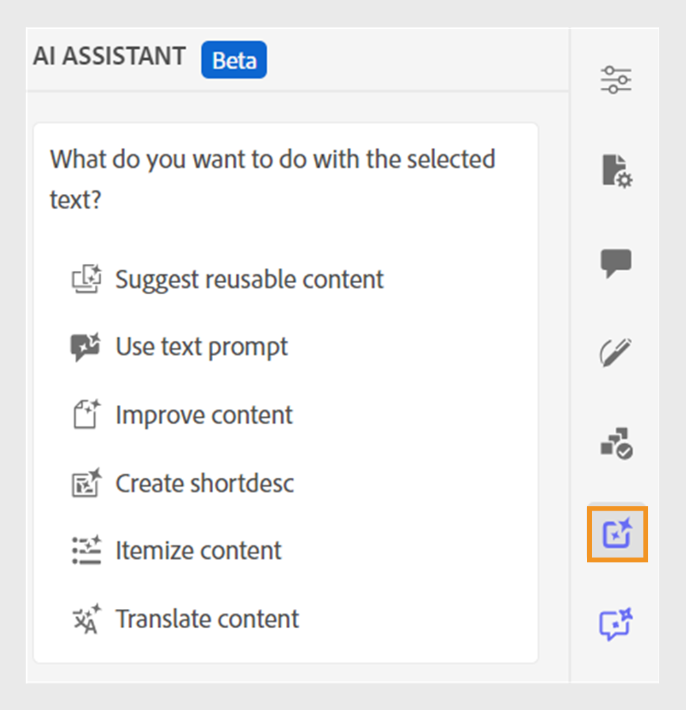
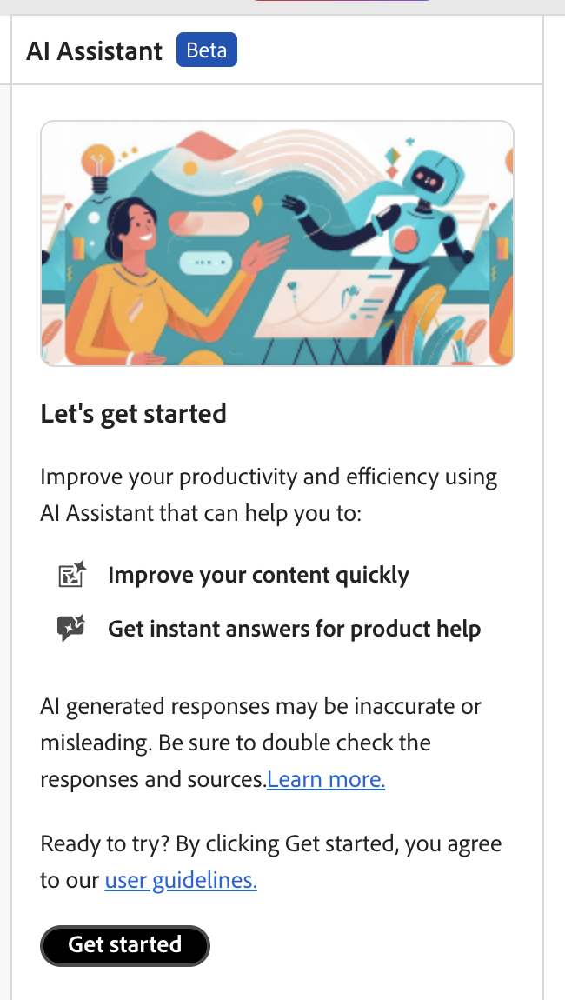

# AI助理(Beta)

Adobe Experience Manager Guides中的&#x200B;**AI Assistant**&#x200B;是功能強大的AI驅動工具，可透過智慧說明和撰寫功能提升您的生產力。 它將兩個強大的AI功能 — **製作**&#x200B;和&#x200B;**說明** — 整合到Experience Manager Guides介面中，讓您更快更有效率地編寫內容並存取Experience Manager Guides檔案中的資訊。

>[!NOTE]
>
> AI助理功能目前可供Adobe Experience Manager Guides as a Cloud Service使用。

AI Assistant中的&#x200B;**製作**&#x200B;功能可讓您更聰明、更快速地完成製作程式。 它提供多種功能，例如產生智慧型內容重複使用建議、翻譯內容、改善內容品質等，所有這些都根據您選取的內容。 此功能可提升整體撰寫體驗及作者的生產力。

如需更多詳細資料，請檢視[製作](./ai-assistant-right-panel.md)。

{align="left"}

AI Assistant中的&#x200B;**說明**&#x200B;功能是直覺式的聊天式工具，可協助您更清楚瞭解Experience Manager Guides、疑難排解問題，以及在Adobe Experience Manager Guides檔案中搜尋資訊。 您可以使用&#x200B;**說明**&#x200B;功能，快速找到查詢的相關解答，而不需搜尋使用手冊和參考檔案。 這有助於節省時間，讓您專注在內容建立上，進而提高生產力和效率。

如需詳細資訊，請檢視[說明](./ai-based-smart-help.md)。

{align="left"}

## 開始使用AI助理

第一次使用&#x200B;**AI Assistant**&#x200B;時，系統會提示您先提交同意，然後再使用Experience Manager Guides Generative AI功能。

執行以下步驟以啟動AI小幫手：

1. 登入Experience Manager Guides
1. 在首頁上，從頂端選取&#x200B;**AI助理**。   請確定您的管理員已啟用AI助理功能。

   顯示AI助理頁面，其中醒目顯示其主要功能、使用者指南連結和&#x200B;**開始使用**&#x200B;按鈕。

   {align="left"}

1. 請仔細閱讀使用者准則，然後選取&#x200B;**開始使用**&#x200B;以啟動AI小幫手。

**相關主題**

[AI Assistant安全性常見問題集](./ai-assistant-faq.md)

[Adobe Experience Manager Guides Generative AI披露](./adobe-generative-ai-disclosures.md)

[設定AI助理以提供智慧說明和編寫](../cs-install-guide/conf-smart-suggestions.md)
