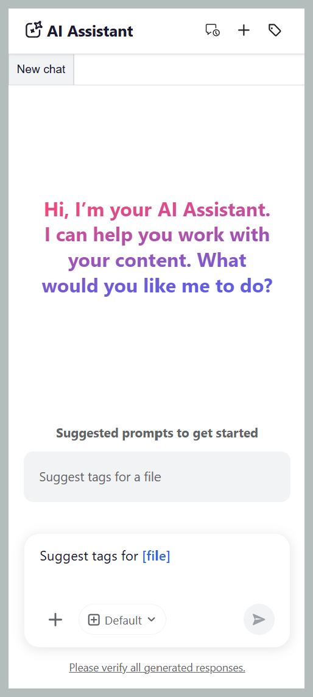
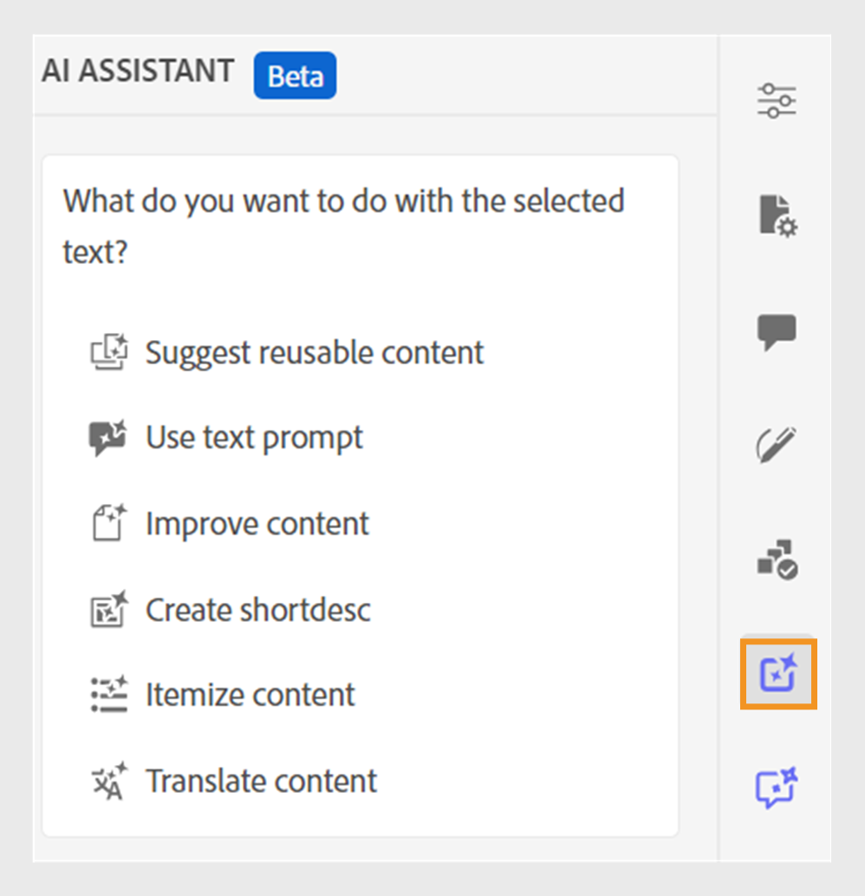
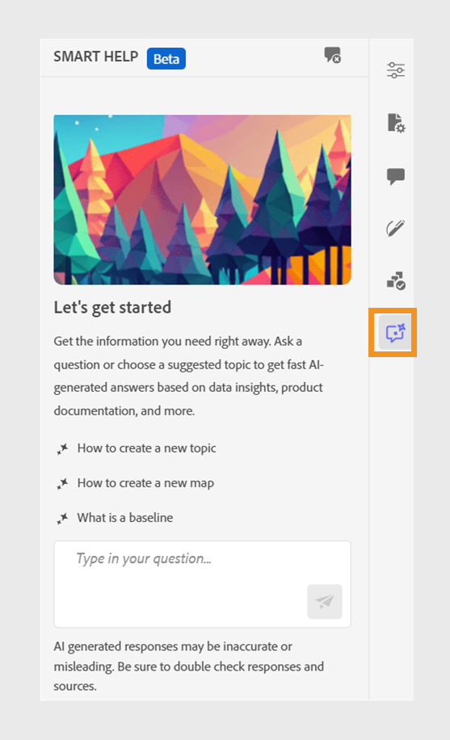
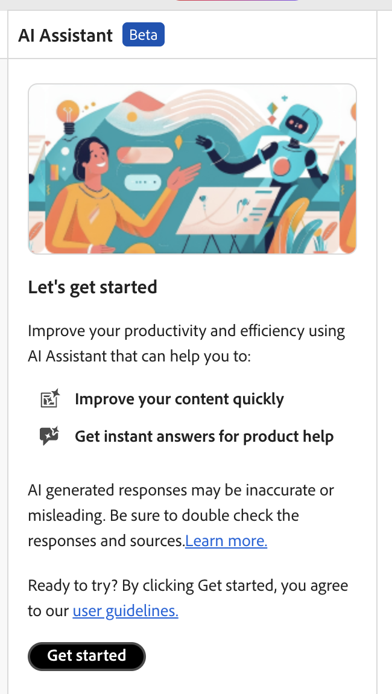

# AI助理(Beta)

Adobe Experience Manager Guides中的&#x200B;**AI Assistant**&#x200B;是一款功能強大的AI導向工具，可透過智慧說明、編寫和標籤功能，提升您的生產力。 在&#x200B;**Standard**&#x200B;模式中，它結合兩個強大的AI功能；**撰寫**&#x200B;和&#x200B;**說明**&#x200B;至Experience Manager Guides介面，讓您更快且更有效率地撰寫內容及存取Experience Manager Guides檔案中的資訊。 在&#x200B;**Agentic**&#x200B;模式中，AI小幫手改為提供&#x200B;**智慧標籤**，讓您透過對話提示視窗，詢問內容標籤建議，並套用至一或多個主題。

>[!NOTE]
>
> AI助理功能目前可供Adobe Experience Manager Guides as a Cloud Service使用。

## AI助理模式

>[!NOTE]
>
>若要針對您的環境以代理模式啟用AI助理，請聯絡客戶成功團隊。

AI助理有兩種模式可用： **Agentic**&#x200B;和&#x200B;**Standard**。 系統管理員可以從&#x200B;**Workspace設定**&#x200B;中&#x200B;**一般**&#x200B;索引標籤的&#x200B;**AI小幫手**&#x200B;區段中選擇兩種模式。 在編輯器中，AI助理面板在兩個模式中都保持相同，但可用的功能有所不同：

* **代理程式**&#x200B;模式會使用Adobe CX Enterprise Coworker的&#x200B;**智慧標籤**&#x200B;技能來分析您的內容，並根據您組織的分類法建議相關標籤。
* **標準**&#x200B;模式提供現有的AI小幫手體驗，在AI小幫手面板中有&#x200B;**說明**&#x200B;和&#x200B;**製作**&#x200B;標籤。

## 代理模式

### 智慧標籤

代理模式中的AI助理透過對話提示視窗，讓您更快且更輕鬆地標籤內容。 AI Assistant使用Adobe CX Enterprise Coworker的代理式智慧標籤技能，會在您要求內容時，為您建議相關的標籤。 您可以透過檢閱建議的標籤並選擇將其套用至一或多個主題（包括地圖中的多個主題）來保持控制。

如需詳細資訊，請檢視[開始使用Agentic AI助理](./ai-assistant-agentic.md)。

## 標準模式

### 製作

當AI助理設定為&#x200B;**標準**&#x200B;模式時，AI助理中的&#x200B;**撰寫**&#x200B;功能可讓您的撰寫程式更聰明且更快。 它提供多種功能，例如產生智慧型內容重複使用建議、翻譯內容、改善內容品質等，所有這些都根據您選取的內容。 此功能可提升整體撰寫體驗及作者的生產力。

如需更多詳細資料，請檢視[製作](./ai-assistant-right-panel.md)。

### 說明

當AI助理設定為&#x200B;**標準**&#x200B;模式時，**說明**&#x200B;功能可提供直覺式的聊天式體驗，協助您瞭解Experience Manager Guides、疑難排解問題，以及在Adobe Experience Manager Guides檔案中尋找資訊。 您可以使用&#x200B;**說明**&#x200B;功能，快速找到查詢的相關解答，而不需搜尋使用手冊和參考檔案。 這有助於節省時間，讓您專注在內容建立上，進而提高生產力和效率。

如需詳細資訊，請檢視[說明](./ai-based-smart-help.md)。

## 開始使用標準模式的AI助理

第一次在標準模式中使用&#x200B;**AI助理**&#x200B;時，系統會提示您先提交同意，然後再使用Experience Manager Guides Generative AI功能。

執行以下步驟以啟動AI小幫手：

1. 登入Experience Manager Guides。
1. 在首頁上，從頂端選取&#x200B;**AI助理**。 確保您的管理員已在所需模式下啟用AI助理功能。

AI助理顯示主要功能、使用者指南連結和&#x200B;**開始使用**&#x200B;按鈕。

請仔細閱讀使用者准則，然後選取&#x200B;**開始使用**&#x200B;以啟動AI小幫手。

**相關主題**

[AI Assistant安全性常見問題集](./ai-assistant-faq.md)

[Adobe Experience Manager Guides Generative AI披露](./adobe-generative-ai-disclosures.md)

[設定AI助理以提供智慧說明和編寫](../cs-install-guide/conf-smart-suggestions.md)
