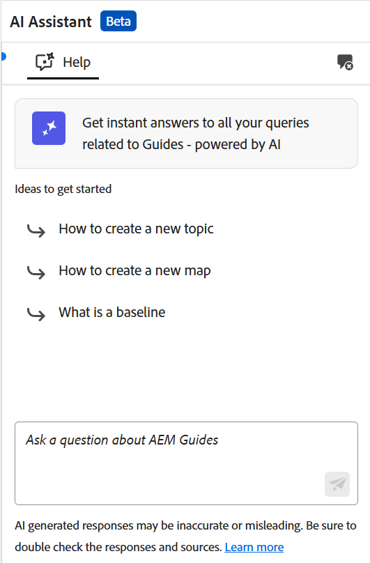
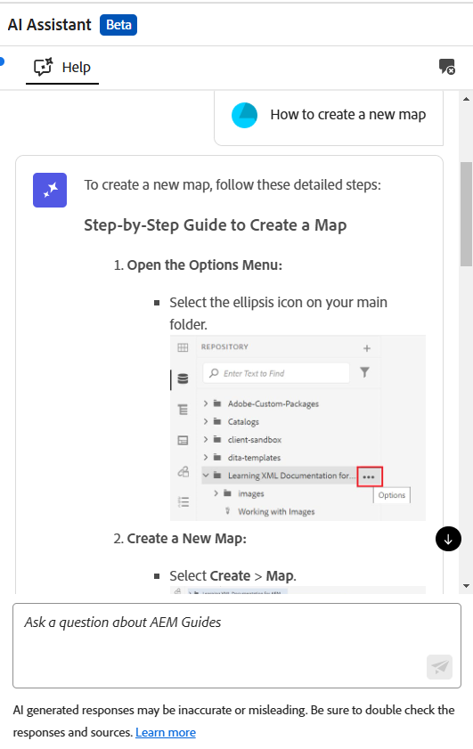
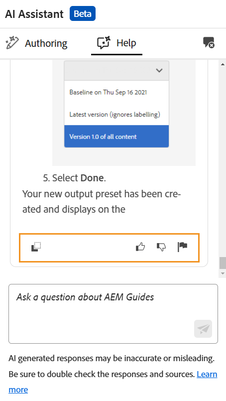

# 使用AI助理(Beta)中的智慧說明提高效率

Experience Manager Guides提供GenAI智慧型說明，這是對話式搜尋功能，可協助您從[Adobe Experience Manager Guides檔案](https://experienceleague.adobe.com/en/docs/experience-manager-guides/using/overview)尋找相關內容。

您可以透過資訊化方式詢問問題並獲得答案。 您的查詢答案取決於產品檔案中的內容。 此搜尋完全是對話式的。 您可以詢問有關Experience Manager Guides各種功能的問題，也可以選擇詢問疑難排解查詢。 您也可以根據回應提出進一步的問題。 回應也包含來原始檔的連結，您可以參閱以取得詳細資訊。

例如，您可能想問諸如&#x200B;*如何發佈地圖？*&#x200B;您收到回應，以及相關文章的連結。 然後，如果您想瞭解如何使用特定方法來發佈輸出，您可以詢問有關它的問題。 例如，*如何將地圖發佈至PDF？*

當您在[首頁]、[對應]主控台或[編輯器]上開啟&#x200B;**AI小幫手**&#x200B;時，**說明**&#x200B;面板會在右側開啟。 如果是Editor，也會顯示「編寫」面板，提供您智慧型編寫功能。 如需詳細資訊，請檢視[AI助理以聰明地編寫檔案](./ai-assistant-right-panel.md)

{width="300" align="left"}

*檢視&#x200B;**說明**&#x200B;面板。*

執行以下步驟，使用「說明」面板來尋找適當的內容並解決您的查詢：

1. 選取&#x200B;**AI小幫手**&#x200B;以開啟[說明]面板。

   >[!NOTE]
   >
   > 在[全域或資料夾層級設定檔](../cs-install-guide/conf-folder-level.md#conf-ai-guides-assistant)中，您的管理員需要定義出現在面板中的預設問題。

1. 輸入問題以在Experience Manager Guides檔案中尋找相關內容。 您可以在面板中選取預設問題，或在文字方塊中輸入問題。

1. 選取&#x200B;**傳送** 或按&#x200B;**Enter**&#x200B;檢視您問題的回應。

   根據您的問題，您可以檢視內容、適用的影像和文章連結。

   {width="300" align="left"}

   *選取範例問題並檢視內容與影像回應。*

1. 選取文章結尾的連結，並檢視關於問題答案的詳細資訊。

1. 選取&#x200B;**清除交談** 以從面板移除交談記錄。 接著，您就可以開始全新的交談，並尋找相關內容。

您可以使用&#x200B;**說明**&#x200B;功能，快速找到查詢的相關解答，而不需搜尋使用手冊和參考檔案。 這有助於節省時間，讓您專注在內容建立上，進而提高生產力和效率。

## AI助理說明回應的可用選項

當您在&#x200B;**說明**&#x200B;面板中收到AI助理的回應時，您可以與其互動或提供意見回饋，以提高其正確性和可靠性。 您的意見回饋可協助Experience Manager Guides團隊增強AI Assistant回應的準確性和關聯性，以隨著時間改進其效能。

下列選項可與AI助理&#x200B;**說明**&#x200B;面板提供的回應互動或提供回饋：

{width="300" align="left"}

- **複製**：複製回應以用於您的檔案。
- **Like**：表示回應有幫助或準確。 選取「讚」圖示來贊回應，並使用&#x200B;**告知更多**&#x200B;選項提供詳細的意見反應。
- **不喜歡**：將回應標籤為無用或不正確。 選取「不喜歡」圖示來喜歡回應，並使用&#x200B;**告知我們更多**&#x200B;選項來提供詳細的意見反應。
- **報告**：如果回應包含錯誤或不準確的內容，請將回應標幟為檢閱。 選取旗標圖示以開啟&#x200B;**報告結果**&#x200B;對話方塊。 從可用選項中選取，或提供自訂意見回饋。