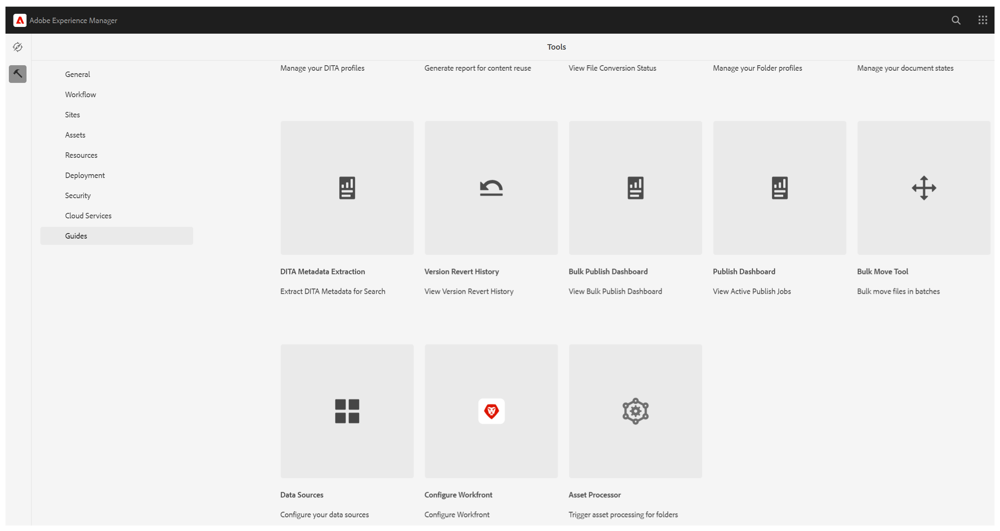
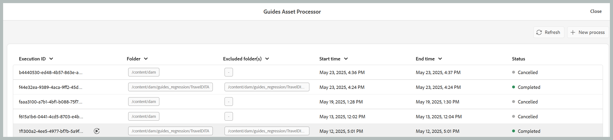
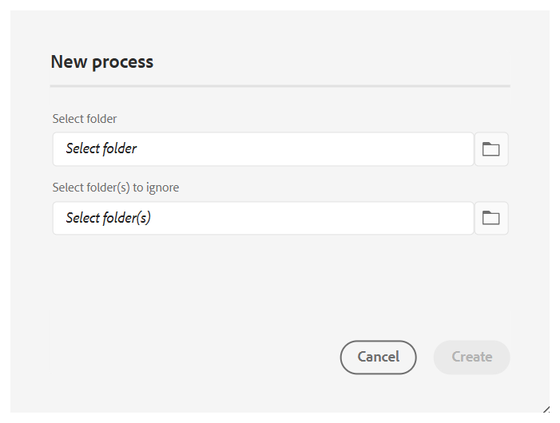
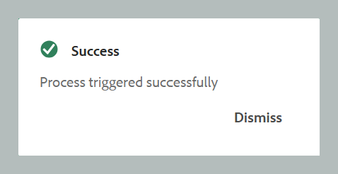
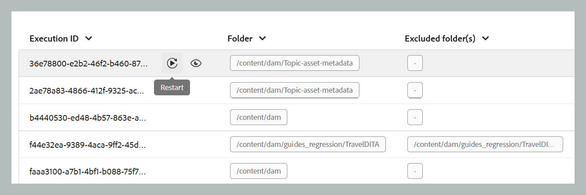
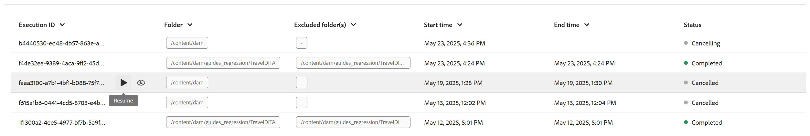
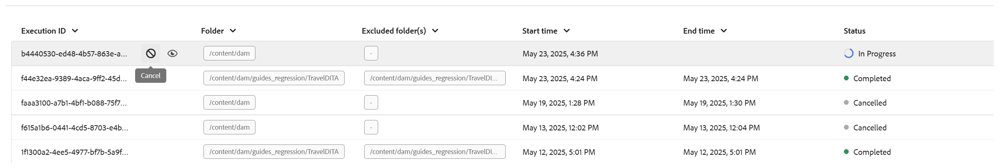

# 處理或重新處理資產

在發佈等資料密集的工作流程中，有效率的資產管理對於維持效能和可靠性至關重要。 處理或重新處理資產的程式是專為處理需要密集資料作業的特定於使用者的資產而設計的。 此方法主要處理兩種情況：在資產的初始處理發生錯誤時，或由於缺少後續處理觸發程式而完全未處理檔案時。 透過啟用目標明確的資料夾層級處理，使用者可以隔離並僅處理必要的資產，從而避免不必要的計算開銷。 此選擇性方法可大幅提升效能，縮短發布和產生報表等重要作業所需的時間。 整體而言，它有助於在處理複雜資料任務時提高效率和速度。

>[!NOTE]
>
> 針對大型資料集，最好在非尖峰時間執行處理，以免影響系統效能。 處理作業完成後，您可以複查詳細資料以分析結果。

## 處理資產

請依照下列步驟處理或重新處理資產：

1. 選取頂端的Adobe Experience Manager標誌，然後選擇&#x200B;**工具**。
1. 在&#x200B;**工具**&#x200B;面板中選取&#x200B;**參考線**。
1. 選取&#x200B;**資產處理器**&#x200B;圖磚。

   {align="left"}

1. 「指南資產處理器」視窗會開啟，其詳細資訊如下所示。 此外，此視窗上只會顯示最近五個移轉的相關資訊。

   - **執行ID**：這是您執行之每個重新處理工作的唯一ID。

   - **資料夾**：顯示選取要重新處理的資料夾。

   - **排除的資料夾**：指向要排除的資料夾，無法重新處理。

   - **開始時間：**&#x200B;顯示啟動重新處理程式的日期和時間。

   - **結束時間**：顯示重新處理程式結束的日期和時間。

   - **狀態**：指向重新處理的狀態，即[進行中]、[已完成]或[已取消]。

   {align="left"}

1. 選取視窗右上角的&#x200B;**新處理序**&#x200B;索引標籤，以開始新的處理作業。

   {width="550" align="left"}

1. 選取您要處理或重新處理的資料夾。 您也可以選取要排除或忽略的資料夾（在選取的父資料夾內）。

   >[!NOTE]
   >
   >在指定時間只能選取一個資料夾進行處理。 針對特定操作，您可以排除多個資料夾。

1. 選擇 **建立**。如程式碼片段所示，您的快顯視窗顯示&#x200B;**成功，且已成功觸發程式**。 清單會反映相同內容。 您可以在視窗中檢視重新處理工作的狀態。

   {width="550" align="left"}

## 處理任務的其他選項

處理任務啟動後，便可使用其他選項。 您可以將游標移至工作的執行ID上，以存取這些選項。 這些選項的詳細資訊如下：

- **重新啟動** ：重新啟動先前成功的資產處理工作。

  {align="left"}

- **繼續** ：繼續先前取消或失敗的資產處理工作。

  {align="left"}

- **取消** ：取消目前進行中的資產處理工作。

  {align="left"}

- **檢視記錄**：顯示資產處理工作的記錄。 對於進行中的工作，記錄會顯示詳細的處理資訊，包括預估剩餘時間和資產狀態。 此記錄清單最多可顯示500個最新專案。 可以下載完整記錄。

  {align="left"}
