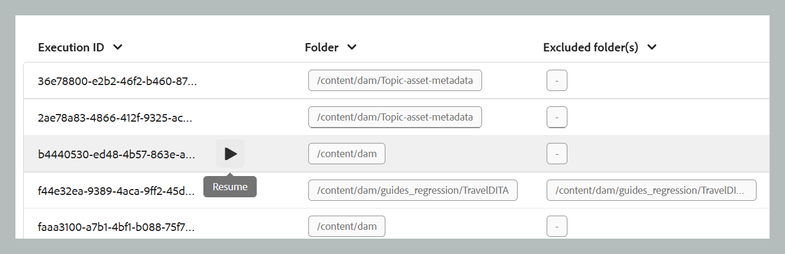
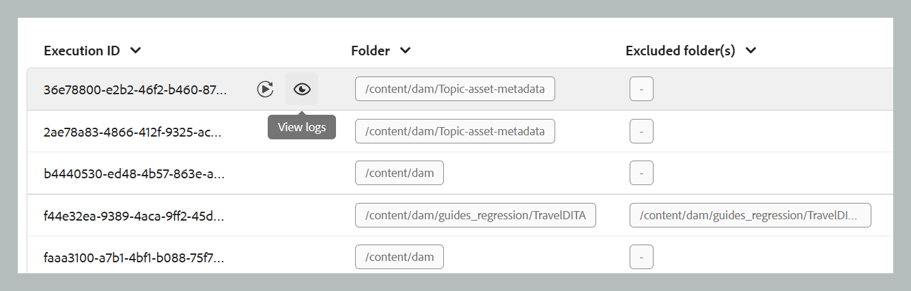

# 處理資產

在發佈等資料密集的工作流程中，有效率的資產管理對於維持效能和可靠性至關重要。 資產處理工作流程的設計目的，是為了管理需要密集資料作業的使用者特定資產。 它主要處理兩種情況：因錯誤導致初始處理失敗，或因未起始任何資產處理觸發程式而使檔案保持未處理狀態。 透過啟用目標明確的資料夾層級處理，使用者可以隔離並僅處理必要的資產，從而避免不必要的計算開銷。 此選擇性方法可大幅提升效能，縮短發布和產生報表等重要作業所需的時間。 整體而言，它有助於在處理複雜資料任務時提高效率和速度。

>[!NOTE]
>
> - 針對大型資料集，最好在非尖峰時間執行處理，以免影響系統效能。 處理工作完成後，您可以檢閱詳細資料以分析結果。 
>- 系統每15分鐘會觸發一次`/content/dam`資料夾的資產處理作業。 在每個週期中，系統都會挑選新新增或在最近15分鐘間隔內仍未處理的資產，並重新處理。 若要設定自動資產處理功能檢視，[設定資產處理功能](../cs-install-guide/configure-asset-processing-cs.md)。

## 處理資產

請依照下列步驟處理資產：

1. 選取頂端的Adobe Experience Manager標誌，然後選擇&#x200B;**工具**。
1. 在&#x200B;**工具**&#x200B;面板中選取&#x200B;**參考線**。
1. 選取&#x200B;**大量處理器**&#x200B;圖磚。

   {align="left"}

1. 「指南大量處理器」視窗會開啟，其詳細資訊如下所示。 此外，此視窗上只會顯示最近五個移轉的相關資訊。

   - **功能型別**：顯示正在執行的程式功能。

   - **執行ID**：這是您執行之每個處理工作的唯一ID。

   - **資料夾**：顯示選取要處理的資料夾。

   - **排除的資料夾**：顯示從處理中排除的資料夾。

   - **建立者**：顯示建立工作或程式的人員。 既可以是您，也可以是系統。

   - **開始時間：**&#x200B;顯示處理程式的起始日期和時間。

   - **結束時間**：顯示處理程式結束的日期和時間。

   - **狀態**：將處理狀態顯示為「進行中」、「已完成」或「已取消」。

   {align="left"}

1. 選取視窗右上角的&#x200B;**新處理序**&#x200B;索引標籤，以開始新的處理作業。

   {width="350" align="left"}

1. 選取您要處理的資料夾。 您也可以選取要排除或忽略的資料夾（在選取的父資料夾內）。

   >[!NOTE]
   >
   >在指定時間只能選取一個資料夾進行處理。 針對特定操作，您可以排除多個資料夾。

1. 選擇 **建立**。如程式碼片段所示，您的快顯視窗顯示&#x200B;**成功，且已成功觸發程式**。 清單會反映相同內容。 您可以在視窗中檢視處理作業的狀態。

   {width="350" align="left"}

## 處理任務的其他選項

處理任務啟動後，便可使用其他選項。 您可以將游標移至工作的執行ID上，以存取這些選項。 這些選項的詳細資訊如下：

- **重新啟動** ：重新啟動先前成功的資產處理工作。

  {width="650" align="left"}

- **繼續** ：繼續先前取消或失敗的資產處理工作。

  {width="650" align="left"}

- **取消** ：取消目前進行中的資產處理工作。

  {width="650" align="left"}

- **檢視記錄**：顯示資產處理工作的記錄。 對於進行中的工作，記錄會顯示詳細的處理資訊，包括預估剩餘時間和資產狀態。 此記錄清單最多可顯示500個最新專案。 可以下載完整記錄。

  {width="650" align="left"}
