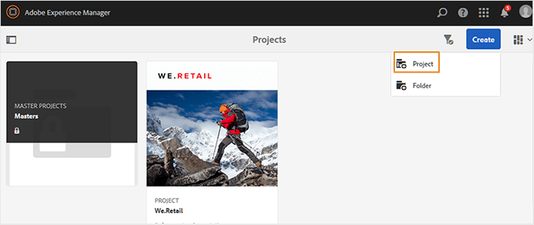

# 建立DITA專案 {#id1645HA00NM6}

Adobe Experience Manager Guides提供DITA專案範本，您可用來建立和管理稽核任務。

您可以建立DITA專案，然後使用它來啟動稽核。 專案可讓您定義截止日期，並控制完成您為其建立專案的稽核任務所需的任務和時間。

您可以將專案團隊成員新增至專案，然後為其指派各種角色 — 作者、檢閱者和發佈者。

建立DITA專案後，您可以從編輯器或Assets UI啟動稽核。 如需詳細資訊，請檢視[傳送主題以供檢閱](review-send-topics-for-review.md#)。

同樣地，每當作者啟動任何稽核工作流程，專案的選定成員都會收到電子郵件通知。 若要設定電子郵件通知，請在[安裝與設定Adobe Experience Manager Guides as a Cloud Service]中檢視&#x200B;*自訂電子郵件範本*。

執行以下步驟來建立DITA專案：

1. 開啟「專案」主控台。

   您也可以使用下列URL存取「專案」主控台：

   ```http
   http://<server name>:<port>/projects.html
   ```

1. 選取&#x200B;**建立** \> **專案**&#x200B;以啟動建立專案精靈。

   {width="650" align="left"}

1. 在建立專案頁面上，選取&#x200B;**DITA專案**&#x200B;範本，然後選取&#x200B;**下一步**。

1. 在「專案屬性」頁面上，輸入下列詳細資訊：

   **基本**&#x200B;索引標籤中的資訊：

   {width="650" align="left"}

   - 輸入專案的&#x200B;**標題**、**描述**&#x200B;和&#x200B;**到期日**。

   - 您可以選擇是否選擇專案的縮圖。

   - 依預設，您是專案的所有者。 若要新增更多使用者至此專案：

   1. 輸入或從&#x200B;**使用者**&#x200B;下拉式清單中選擇使用者。

   1. 選擇使用者型別 — 作者、檢閱者或發佈者。

      >[!NOTE]
      >
      >您將在此下拉式清單中檢視其他使用者型別，但對於DITA專案，您應該只從「作者」、「稽核者」或「發佈者」使用者型別中進行選擇。 即使您新增其他型別的使用者，該使用者將無法存取Experience Manager Guides中提供的任何DITA特定功能。

   1. 選取「**新增**」。

      >[!NOTE]
      >
      >如果您使用Experience Manager Guides 3.5版或更舊版本，您會看到可選取DITA map檔案的選項，以解析主題編輯、預覽和稽核工作流程的關鍵參照。 在3.6及更新版本中，您可以透過編輯器設定根對應。 如需詳細資訊，請在編輯器中檢視[使用者偏好設定](web-editor-features.md#id2087G0P40SB)。 設定根對映的另一種方式是在全域或資料夾層級設定檔中進行設定。 如需詳細資訊，請檢視《安裝與設定指南》中的&#x200B;*設定全域或資料夾層級的設定檔*。

   **進階**&#x200B;索引標籤中的資訊：

   - 輸入專案名稱。 此名稱用於建立此專案的URL。

1. 選取「**建立**」。

   「建立的專案」對話方塊隨即顯示。

1. 選取&#x200B;**開啟**&#x200B;以開啟您的專案頁面。


**父級主題：**&#x200B;[&#x200B;檢閱簡介](review.md)
