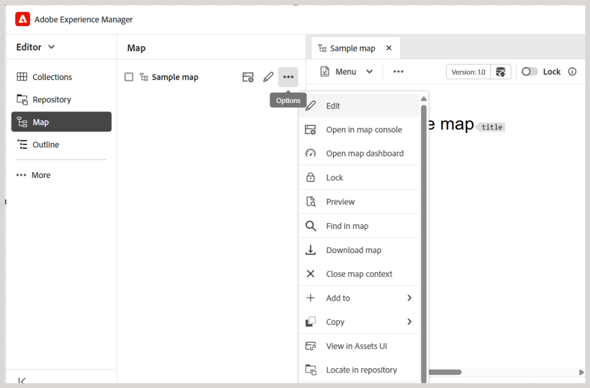
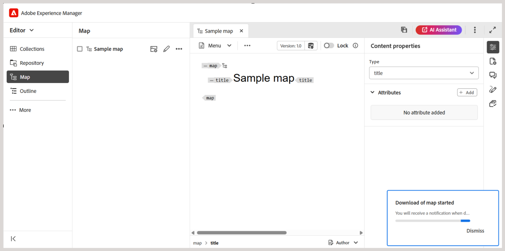
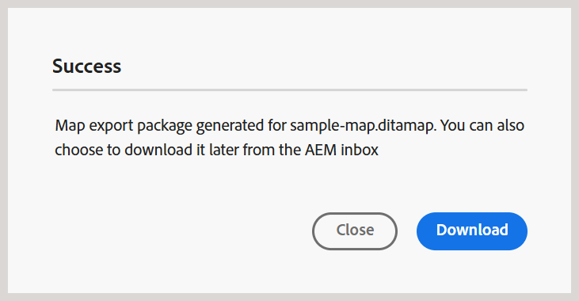

# 下載檔案 {#id216MC0H0BE8}

您可以下載資產，包括DITA和非DITA檔案。 您可以透過多種方式下載資產，有些是Adobe Experience Manager的原生方法，有些則受Adobe Experience Manager Guides支援。 如需原生Adobe Experience Manager資產下載資訊，請在Adobe Experience Manager檔案中檢視[從Adobe Experience Manager下載資產](https://experienceleague.adobe.com/docs/experience-manager-cloud-service/assets/manage/download-assets-from-aem.html?lang=zh-Hant)。 下節將說明在Experience Manager Guides中下載檔案的機制。

## 從編輯器下載DITA map檔案

執行以下步驟，從編輯器下載DITA map檔案：

1. 導覽至您要下載的DITA map。
1. 選取DITA map以在編輯器中開啟它。

1. 在「地圖」檢視中，選取&#x200B;**選項**&#x200B;圖示，然後從清單中選擇&#x200B;**下載地圖**。

   

   顯示&#x200B;**下載地圖**&#x200B;對話方塊。

   {width="300" align="left"}

1. 在「下載對應」對話方塊中，您可以選擇下列選項：

   - **使用基準線**：選取此選項可取得為DITA map建立的基準線清單。 如果您要根據特定的「基準線」下載對映檔案及其內容，請從下拉式清單中選取「基準線」。 如需使用基準線的詳細資訊，請檢視[使用基準線](generate-output-use-baseline-for-publishing.md#)。

   - **檔案階層選項**：您也可以使用檔案階層下拉式清單，選擇如何處理您下載之對應檔案的資料夾結構。 可使用的選項包括：

      - **保留檔案階層**：從下拉式清單中選取此選項，以保留已下載檔案的現有資料夾結構。

        此方法下的可用選項如下：

         - **使用GUID檔案名稱** — 以GUID下載對應檔案作為檔案名稱。

         - **使用實際的檔案名稱** — 下載具有原始檔案名稱的地圖檔案。

      - **平面化檔案階層**：從下拉式清單中選取此選項，可將所有參考的主題和媒體檔案下載到單一資料夾中。 使用此方法時，只有&#x200B;**使用GUID檔案名稱**&#x200B;選項可用於對應檔案。

   >[!NOTE]
   >
   > 您也可以在不選取任何選項的情況下下載地圖檔案。 在這種情況下，會下載參照的主題和媒體檔案的最後一個儲存版本。

1. 選取&#x200B;**下載**。

   對應下載請求已排入佇列。

   

   一旦地圖可供下載，您將會收到下列通知。

   {width="550" align="left"}

1. 選取&#x200B;**下載**&#x200B;以`.zip`格式下載對應檔。 或者，稍後再從AEM收件匣下載。

   >[!NOTE]
   >
   > 依預設，下載的地圖會在Adobe Experience Manager通知收件匣中保留五天。

## 從Map儀表板下載DITA map檔案

在Adobe Experience Manager存放庫中擁有DITA map檔案後，您就可以下載對應檔案及其相依專案。 這可讓您彈性地共用完整的對應檔案，以進行離線編輯、驗證、檢閱或只是建立備份。

執行以下步驟來下載DITA map檔案及其相依檔案：

1. 在Assets UI中，導覽至您要下載的DITA map。

1. 選取DITA map以在DITA map主控台中開啟它。

1. 選取&#x200B;**主題**&#x200B;標籤以檢視DITA map中可用的主題清單。

1. 在主工具列中選取&#x200B;**下載地圖**。

   便會顯示「下載地圖」對話方塊。

   {width="300" align="left"}

1. 選取&#x200B;**下載**。 在「下載對應」對話方塊中，您可以選擇下列選項：

   - **使用基準線**：選取此選項可取得為DITA map建立的基準線清單。 如果您要根據特定的「基準線」下載對映檔案及其內容，請從下拉式清單中選取「基準線」。 如需使用基準線的詳細資訊，請檢視[使用基準線](generate-output-use-baseline-for-publishing.md#)。

   - **平面化檔案階層**：選取此選項可將所有參考的主題和媒體檔案儲存在單一資料夾中。

   >[!NOTE]
   >
   > 您也可以在不選取任何選項的情況下下載地圖檔案。 在這種情況下，會下載參照的主題和媒體檔案的最後一個儲存版本。

1. 選取&#x200B;**下載**&#x200B;按鈕後，對應下載要求會排入佇列。 一旦地圖可供下載，您將會收到下列通知。

   {width="550" align="left"}

   - 選取&#x200B;**下載**&#x200B;以.zip格式下載對應檔。

   - 選取&#x200B;**稍後下載**&#x200B;稍後再下載對應檔。 您可以從Adobe Experience Manager通知收件匣存取下載連結。 在「收件匣」中選取產生的地圖通知，以.zip格式下載地圖。

   >[!NOTE]
   >
   > 依預設，下載的地圖會在Adobe Experience Manager通知收件匣中保留五天。

{width="300" align="left"}

下載地圖後，您可以選取地圖，並使用頂端的開啟圖示開啟選取的報表。

**父級主題：**&#x200B;[&#x200B;管理內容](authoring.md)
