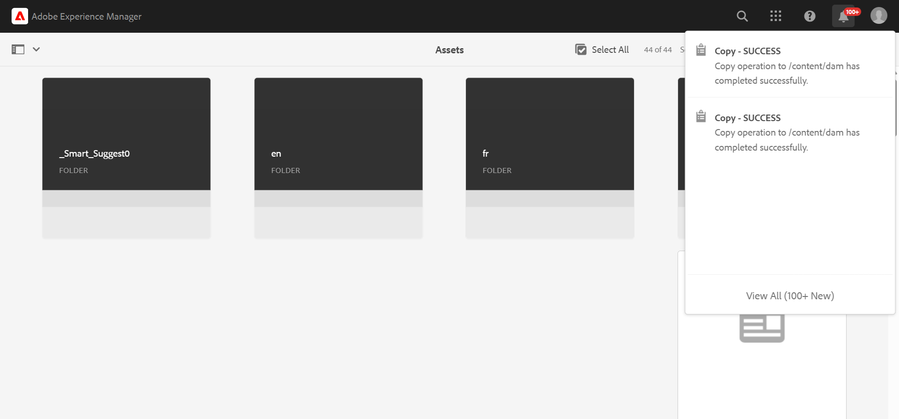
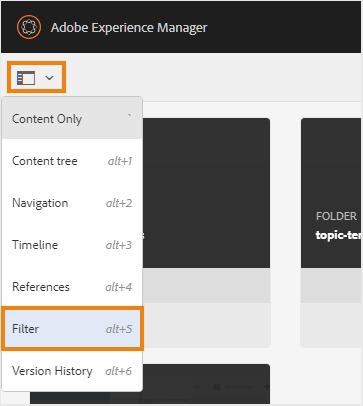
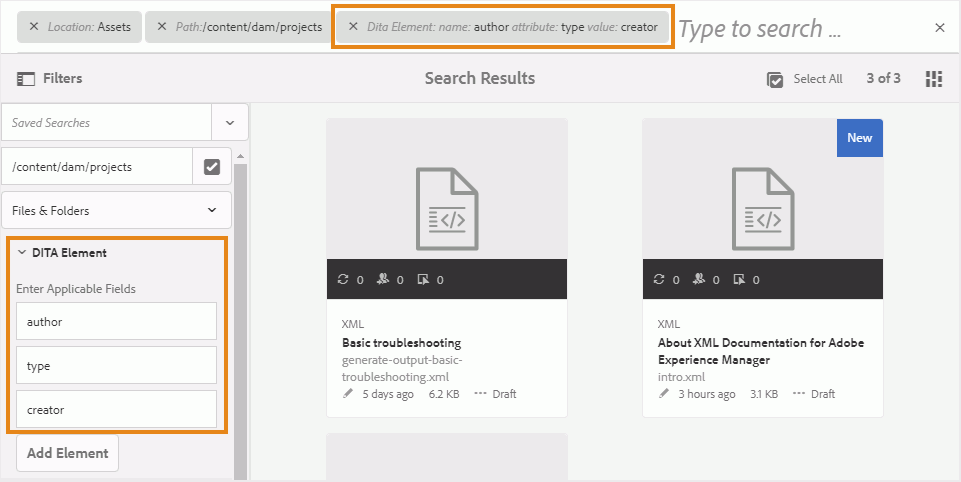

# 管理檔案和資料夾 {#id2116G0L08XA}

本節說明Adobe Experience Manager Guides如何處理基本檔案操作，例如複製、貼上、拖放和刪除檔案。 可能會出現以下情況：

## 複製並貼上檔案

**如果檔案有人類可讀的檔案名稱**

- *如果目的地資料夾中不存在相同名稱的檔案*：已建立檔案的新復本，且已為其指派UUID。 在這裡，檔案名稱與原始檔案名稱相同。
- *如果目的地資料夾中已存在相同名稱的檔案*：已建立含有尾碼\（如filename0.extension\）的新檔案復本。 UUID也會指派給新建立的檔案。

**如果檔案名稱是以UUID模式為基礎**

- *如果目的地資料夾中不存在相同名稱的檔案*：已建立檔案的新復本，且已在新位置為其指派新的UUID。 在這裡，檔案名稱與UUID相同。
- *如果目的地資料夾中已存在相同名稱的檔案*：已建立檔案的新復本，且已指派新的UUID。 檔案名稱與UUID相同。

## 複製並貼上資料夾

**在同一位置複製並貼上資料夾**

- *資料夾中有可讀取檔案名稱的檔案*：資料夾的新復本是以尾碼\（如foldername0\）建立。 新的UUID也會指派給資料夾內的檔案。 不過，檔案名稱沒有變更。

- *資料夾中有檔案名稱是以UUID模式為基礎*：資料夾的新復本是以\（如foldername0\）尾碼建立的。 新的UUID也會指派給新資料夾中的所有檔案。 檔案名稱也會變更；檔案名稱會與新的UUID相同。

**在不同位置複製並貼上資料夾**

- *資料夾中有可讀取檔案名稱的檔案*：已建立資料夾的新復本，且已將新的UUID指派給新位置資料夾中的所有檔案。 在此，資料夾或檔案名稱沒有變更。

- *資料夾中有檔案名稱是以UUID模式為基礎*：資料夾的新復本是以與原始資料夾相同的名稱建立的。 新的UUID也會指派給新資料夾中的所有檔案。 檔案名稱也會變更；檔案名稱會與新的UUID相同。

**成功訊息和通知**

Assets UI中資料夾的複製 — 貼上作業會在背景以非同步方式執行，讓您可以在系統處理請求時繼續工作。 系統會顯示快顯訊息，指出已啟動流程。

{width="350" align="left"}

作業完成後，系統會觸發成功或失敗通知，指出作業是成功還是失敗。

{width="650" align="left"}

## 拖放檔案

**使用可讀取的檔案名稱拖放**

- *在相同位置拖放*：您有&#x200B;**覆寫現有檔案\(s\)**、**保留兩個檔案\(s\)**&#x200B;的選項，以及建立現有工作復本的版本的選項。

  {width="650" align="center"}

  如果您選擇&#x200B;**覆寫現有檔案\(s\)**&#x200B;選項，則要上傳的檔案會取代原始位置現有檔案的目前工作版本。 未建立或變更UUID。

  如果您選擇&#x200B;**保留兩個檔案\(s\)**&#x200B;選項，則會以尾碼\（如filename0.extension\）建立檔案的新復本。 新的UUID也會指派給新複製的檔案。

  使用「覆寫現有檔案」選項，如果您選擇從現有的工作副本建立版本的選項，則也會從檔案的工作副本建立新版本。

  >[!NOTE]
  >
  > **您的管理員必須啟用**&#x200B;為上傳的檔案建立新版本。 如果啟用此功能，則會建立上傳檔案的新版本。 如果取消選取選項，則不會建立已上傳檔案的版本。 如需詳細資訊，請檢視「安裝與設定Adobe Experience Manager Guides as a Cloud Service」中的&#x200B;*為上傳的檔案建立新版本*&#x200B;區段。

  如果檔案已由其他使用者取出以進行編輯，而您嘗試上傳並覆寫現有檔案，則檔案會失敗並顯示錯誤。

  >[!NOTE]
  >
  >您的管理員必須停用&#x200B;**在上傳時覆寫取出檔案**&#x200B;功能。 如果啟用此功能，您可以覆寫出庫檔案。 如果未啟用該功能，則不會覆寫出庫的檔案。 如需詳細資訊，請檢視安裝與設定Adobe Experience Manager Guides as a Cloud Service中的&#x200B;*上傳時覆寫取出檔案*。

- *在不同位置拖放檔案*：已建立檔案的新復本，且已在新位置為其指派新的UUID。 在這裡，檔案名稱與原始檔案名稱相同。

**根據UUID模式以檔案名稱拖放**

*在相同位置拖放檔案*：您有&#x200B;**覆寫現有檔案\(s\)**&#x200B;的選項以及建立現有工作復本的版本。

{width="650" align="center"}

覆寫檔案時，檔案名稱或其UUID不會變更。

如果您選取&#x200B;**建立現有工作復本的版本**&#x200B;選項，則會從檔案的工作復本建立新版本；會上傳新檔案，也會建立檔案的新版本，並將其作為檔案的工作復本。

**您的管理員必須啟用**&#x200B;為上傳的檔案建立新版本。 如果啟用此功能，則會建立上傳檔案的新版本。 如果取消選取選項，則不會建立已上傳檔案的版本。 如需詳細資訊，請檢視「安裝與設定Adobe Experience Manager Guides as a Cloud Service」中的&#x200B;*為已上傳的檔案建立新版本*&#x200B;區段。

*在不同位置拖放檔案*：您有&#x200B;**覆寫現有檔案\(s\)**、**將檔案移至新位置\(s\)的選項，以及建立現有工作復本的版本的選項。**

{width="650" align="center"}

如果您選擇&#x200B;**覆寫現有檔案\(s\)**&#x200B;選項，則要上傳的檔案會取代原始位置上的現有檔案。 未建立或變更UUID。

如果您選擇&#x200B;**將檔案移動到新位置**&#x200B;選項，則現有檔案會移動到目前位置，然後會由正在上傳的檔案覆寫。 將檔案移動到新位置不會中斷來自或到檔案的任何現有參照。

透過取代或移動檔案，如果您選擇從現有副本建立版本的選項，則會從檔案的工作副本建立新版本；新檔案會在現有位置被取代或移動到新位置。

## 大量移動檔案 {#move-files-bulk}

Experience Manager Guides隨附大量移動工具，可協助管理員將具有大量檔案的資料夾從一個位置移動到另一個位置。 此工具可輕鬆地將一或多個資料夾中的檔案移至Adobe Experience Manager存放庫中的其他資料夾。 此工具的主要功能之一是，它不但會移動大量檔案，而且會維護要移動之檔案的參照與來源參照。 您可以調整可以批次移動的檔案數量，而不會妨礙編寫和發佈工作。

>[!NOTE]
>
> 「大量移動工具」只適用於資料夾層級。 如果要移動個別主題或地圖檔案，請使用Adobe Experience Manager Assets UI中的一般移動工具。

以下是「大量移動工具」所提供的部分功能：

- 您可以調整每個批次中要處理的檔案數。 在達到系統可輕鬆處理的最佳號碼之前，您可能需要執行一些測試。
- 製作和發佈服務運作順暢，不會中斷移動作業。
- 對後續\（執行\）批次程式之間的時間間隔有完全控制權。 此時間間隔可確保後續處理作業在開始下一批檔案之前完成。

- 自動處理相同名稱的資料夾。 此功能可確保即使有具有相同名稱的資料夾在移動，也不會覆寫這些資料夾。

- 自動處理要移動檔案的參照和來自要移動檔案的參照。

在執行批次處理前，您必須考慮以下幾點：

- 如果您計畫移動目前檢閱中的主題，則必須先關閉所有此類主題的檢閱程式，然後再移動它們。 不關閉稽核任務將中斷稽核流程。
- 在任何時候，您都只能在系統上執行單一大量移動作業。 這可確保正確處理要移動之主題的參照和來自該主題的參照。

若要大量移動檔案，請執行下列步驟：

1. 選取頂端的Adobe Experience Manager標誌，然後選擇&#x200B;**工具**。
1. 從工具清單中選取&#x200B;**指南**。
1. 選取&#x200B;**大量移動工具**&#x200B;圖磚。
1. 會根據您的設定顯示「大量移動工具」頁面。 在&#x200B;**大量移動工具**&#x200B;頁面上提供下列詳細資料：

   

   
 雲端服務和內部部署UUID型檔案系統 

   {width="650" align="center"}

   >[!TIP]
   >
   > 選取    靠近任何欄位可檢視其詳細資訊。

   - **新增字尾至重複的資料夾**：如果您要移動具有相同名稱的資料夾，則必須選取此選項。 例如，在上一個熒幕擷圖中，**Source路徑**&#x200B;包含要移動的資料夾名稱。 名為topic的資料夾存在於兩個不同的位置 — test-A和test-B。當您選取此選項時，資料夾將會成功移動。 第一個移動的資料夾將命名為topic，第二個資料夾將命名為topic0。 移動作業會將循序序列的後置字元\（0、1、2等）新增至相同名稱的資料夾。

     如果您要移動同名資料夾而不選取此選項，則操作將中止並出現一則訊息。

   - **Source路徑\(s\)**：指定您要移動的資料夾位置。

      - 選取&#x200B;**瀏覽資料夾**      以開啟&#x200B;**選取路徑**&#x200B;對話方塊。 選取您要移動的資料夾，然後選擇&#x200B;**選取**&#x200B;以完成程式。 您可以在路徑瀏覽器中選取放置在不同位置的多個資料夾。 所選資料夾的路徑將會保留，讓您在重新開啟對話方塊時可以輕鬆檢閱或修改它們。

      - 您也可以鍵入或複製並貼上來源位置。 按Enter將資料夾新增至清單。

        選取的資料夾會與其路徑一起列出。 將游標停留在資料夾標籤上可檢視完整路徑。
      - 您也可以選取&#x200B;**移除**，移除任何資料夾 資料夾附近的。

   - **目的地路徑**：指定您要移動來源資料夾的位置。

      - 選取&#x200B;**瀏覽資料夾** 以開啟瀏覽檔案對話方塊。 選取您要移動來源資料夾的位置。 並選擇「選取」以完成處理。
      - 您也可以輸入或複製並貼上目的地路徑。

     選取的資料夾會與其路徑一起顯示在文字方塊中。

   - 選取&#x200B;**大量移動**。

     系統開始將檔案從來源移動到目的地位置。 程式完成後，頁面右側會顯示移動程式的摘要。

     {width="650" align="center"}

   

   

   
 內部部署非UUID型檔案系統 

   {width="650" align="center"}

   >[!TIP]
   >
   > 選取    靠近任何欄位可檢視其詳細資訊。

   - **批次大小**：指定要在單一批次中移動的檔案數。 預設值（若為50個檔案）。
   - **睡眠間隔（秒）**：指定處理序在啟動下一個批次之前等待的時間（秒）。 在此休眠時間間隔內，系統會修正來自移動檔案的參照。 預設的睡眠間隔為60秒。

   - **新增字尾至重複的資料夾**：如果您要移動具有相同名稱的資料夾，則必須選取此選項。 例如，在上一個熒幕擷圖中，**Source路徑**&#x200B;包含要移動的資料夾名稱。 名為topic的資料夾存在於兩個不同的位置 — test-A和test-B。當您選取此選項時，資料夾將會成功移動。 第一個移動的資料夾將命名為topic，第二個資料夾將命名為topic0。 移動作業會將循序序列的後置字元\（0、1、2等）新增至相同名稱的資料夾。

     如果您要移動同名資料夾而不選取此選項，則操作將中止並出現一則訊息。

   - **更新已取出檔案的參照**：如果您要移動包含已取出檔案的資料夾，建議您選取此選項。 如果選取此選項，則會儲存出庫的所有檔案，並以新的修訂版本入庫。 然後，此新修訂版本會移至目的地位置。

     如果您未選取此選項，則會以相同的出庫狀態將出庫檔案移至目的地資料夾。 不過，在此移動過程中可能會遺失一些資料。

   - **Source路徑\(s\)**：指定您要移動的資料夾位置。

      - 選取&#x200B;**瀏覽資料夾**      以開啟&#x200B;**選取路徑**&#x200B;對話方塊。 選取您要移動的資料夾，然後選擇&#x200B;**選取**&#x200B;以完成程式。 您可以在路徑瀏覽器中選取放置在不同位置的多個資料夾。 所選資料夾的路徑將會保留，讓您在重新開啟對話方塊時可以輕鬆檢閱或修改它們。

      - 您也可以鍵入或複製並貼上來源位置。 按Enter將資料夾新增至清單。

        選取的資料夾會與其路徑一起列出。 將游標停留在資料夾標籤上可檢視完整路徑。
      - 您也可以選取&#x200B;**移除**，移除任何資料夾 資料夾附近的。

   - **目的地路徑**：指定您要移動來源資料夾的位置。

      - 選取&#x200B;**瀏覽資料夾** 以開啟瀏覽檔案對話方塊。 選取您要移動來源資料夾的位置。 並選擇「選取」以完成處理。
      - 您也可以輸入或複製並貼上目的地路徑。

        選取的資料夾會與其路徑一起顯示在文字方塊中。

   - 選取&#x200B;**大量移動**。

     系統開始將檔案從來源移動到目的地位置。 程式完成後，頁面右側會顯示移動程式的摘要。
     {width="650" align="center"}

## 搜尋DITA內容

依預設，Adobe Experience Manager不會辨識DITA內容，因此不會提供任何機制來搜尋其存放庫中的DITA內容。 Experience Manager Guides在Adobe Experience Manager上新增圖層，可讓Adobe Experience Manager瞭解及處理DITA內容。 Experience Manager Guides中的搜尋DITA內容功能可讓您搜尋Adobe Experience Manager存放庫中的DITA內容。

>[!NOTE]
>
>您的系統管理員可以設定&#x200B;**DITA Element**&#x200B;搜尋元件，然後您就可以從Adobe Experience Manager Assets UI使用此功能。 如需詳細資料檢視，請在安裝和設定Adobe Experience Manager Guides as a Cloud Service的Assets UI *區段中*&#x200B;新增DITA元素搜尋元件。

使用搜尋功能，您可以：

- 根據元素值搜尋DITA內容；例如，`author`= xml
- 根據屬性值搜尋DITA內容；例如，`@platform`=視窗
- 使用DITA元素和屬性值的組合；例如，`author`= xml `AND` `@platform`= windows

執行以下步驟，在Adobe Experience Manager存放庫中搜尋DITA內容：

1. 開啟Assets UI。

1. 在左側邊欄中，選取&#x200B;**篩選器**。

   {width="450" align="center"}

   內容篩選選項會顯示在左側邊欄中。 您也會找到用來篩選DITA內容的篩選選項 — DITA元素。

   {width="450" align="center"}

1. *\（選擇性\）*&#x200B;在&#x200B;**選取搜尋目錄**&#x200B;欄位中，瀏覽您要搜尋的位置。

1. 在&#x200B;**DITA元素**&#x200B;篩選中，提供&#x200B;**元素名稱**、**屬性**&#x200B;以及您要搜尋的值。 例如，若要搜尋具有`author`個元素（屬於`@type`建立者）的檔案，您必須提供如下列熒幕擷取畫面所示的資訊：

   {width="650" align="center"}

   在&#x200B;**DITA元素**&#x200B;篩選器中輸入的搜尋條件會顯示在搜尋列的頂端。 符合搜尋條件的檔案會顯示在&#x200B;**搜尋結果**&#x200B;區域中。

   指定搜尋條件時，請考慮以下幾點：

   - 若要搜尋確切的片語，請在[值]欄位中輸入片語，並加上引號`"`片語搜尋`"`。
   - 您最多可以新增3個DITA元素搜尋條件。
   - 如果您指定多個搜尋條件，則會使用AND邏輯來結合所有條件。
   - 您無法在搜尋條件中使用萬用字元。 例如，若要搜尋值為Windows的平台\(attribute\)，則無法指定\*form或Windo？

**搜尋中的簽出狀態篩選器**

除了DITA元素篩選器之外，Experience Manager Guides也可讓您根據內容的簽出狀態來搜尋內容。 如果您想要快速篩選出目前由您出庫且想要重新入庫的檔案，這會很有幫助。

執行以下步驟，根據檔案的簽出狀態來搜尋檔案：

1. 開啟Assets UI。

1. 在左側邊欄中選取&#x200B;**篩選器**。
1. 在搜尋列中輸入您的搜尋關鍵字。
1. 從左側邊欄套用所需的篩選器。

   例如，您可以套用&#x200B;**簽出狀態**&#x200B;篩選器以顯示已簽出或已簽入的主題。 您可以從「出庫者」清單中選擇使用者或群組來進一步調整此清單。

   您的搜尋結果隨即顯示。

## 刪除檔案

從Adobe Experience Manager存放庫刪除檔案是一項受限制的功能，由您的系統管理員控制。 根據設定，刪除檔案在以下情況下可能會受到限制：

- 已簽出
- 具有傳入或傳出參考

只有當您屬於具有刪除檔案許可權的特定使用者群組時，才能刪除檔案。

>[!NOTE]
>
> 如需檔案管理設定的詳細資訊，請檢視&#x200B;*防止刪除取出檔案*&#x200B;和&#x200B;*防止刪除參考的檔案*&#x200B;安裝與設定Adobe Experience Manager Guides as a Cloud Service中的區段。

如果您的管理員已將檔案刪除許可權授予所有使用者，則當您刪除包含參照的檔案時，會顯示下列訊息：

{width="650" align="center"}

在此案例中，您可以強制刪除檔案，而不從檔案中移除傳入或傳出參照。

如果將刪除許可權指定給特定使用者群組，則屬於該群組的使用者也會出現上述訊息。 不過，對於其他使用者，會顯示下列訊息：

{width="650" align="center"}

在此案例中，除非移除所有傳入和傳出的參考，否則不允許使用者刪除檔案。

## 使用媒體檔案

影像和視訊等媒體檔案是內容的必要部分。 上傳和管理內容時，您也可以使用媒體檔案。

如果您的媒體檔案已經過任何變更，您可以在&#x200B;**版本記錄**&#x200B;中找到並預覽檔案。若要瞭解不同版本的媒體檔案的變更：

1. 存取&#x200B;**Assets UI**&#x200B;中的檔案。
1. 選取您要檢視其版本記錄的檔案。
1. 在左側邊欄中，選取&#x200B;**版本記錄**&#x200B;並選取版本。
1. 您也可以在「版本記錄」下檢視不同版本的縮圖。

   {align="center"}

1. 從列出的版本中，選取您要用來作為基礎版本的版本，然後選取&#x200B;**預覽版本**。 所選版本的預覽會顯示在「版本預覽」視窗中。

   {width="650" align="center"}

**父級主題：**&#x200B;[&#x200B;管理內容](authoring.md)
