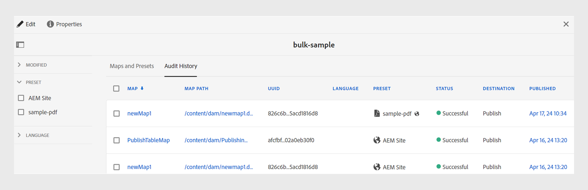

# 建立大量啟用地圖集合 {#id214GG0E90EV}

若要建立大量啟動對映集合，請執行以下步驟：

1. 選取 **指南** 工具清單中。

1. 選取頂端的Adobe Experience Manager連結，然後選擇 **工具**.

1. 選取 **大量發佈儀表板** 圖磚。

   系統首次顯示空白的集合頁面。 如果您先前已建立大量啟動集合，則會顯示在此頁面上。

1. 按一下&#x200B;**建立**。

1. 輸入大量啟用地圖集合的標題，然後按一下 **建立**.

   成功訊息會在建立大量啟用地圖集合時顯示。

1. 按一下 **開啟** 在成功訊息上。

1. 選取 **編輯** 然後選取 **新增地圖**.

1. 尋找並新增您要新增至大量啟動對映集合的DITA map。

   依預設，所有與地圖關聯的預設集和區域設定都會自動新增。

1. 透過開啟或關閉滑動按鈕來選取所需的輸出。

   您可以跨可用地區設定選擇多個輸出預設集。

1. 按一下&#x200B;**「完成」**。

DITA map檔案會新增至您的大量啟動對映集合中。

{width="800" align="left"}

## 地圖和預設集索引標籤

此 **地圖和預設集** 標籤會顯示下列欄位中的資訊：

- **地圖**：顯示DITA map檔案的標題。
- **地圖路徑**：顯示DITA map檔案的完整路徑。

- **UUID**：顯示與檔案相關聯的唯一識別碼。

- **語言**：顯示DITA map的語言代碼。
- **預設集**：顯示地圖檔案上設定的輸出預設集標題。 也會根據輸出預設集的型別顯示圖示。

  >[!NOTE]
  >
  > 小型  圖示會指出資料夾設定檔層級預設集。

- **已修改**：指出DITA map是否於上次發佈後更新。 根據此資訊，您可以決定是否要啟動此DITA map的輸出。
- **已產生**：顯示上次產生輸出的日期和時間。
- **已發佈**：顯示上次發佈（或已啟動）輸出的日期和時間。 如果您選取連結， **啟用結果** 此時會顯示頁面，其中包含記錄檔，其中包含啟動內容的根路徑相關資訊。

## [Audit History]標籤

此 **稽核歷史記錄** 索引標籤在以下欄中顯示已啟動對映輸出的相關資訊：
- **地圖**：顯示DITA map檔案的標題。
- **地圖路徑**：顯示DITA map檔案的完整路徑。
- **UUID** ：顯示與檔案相關聯的唯一識別碼。
- **語言**：顯示DITA map的語言代碼。
- **預設集**：顯示地圖檔案上設定的輸出預設集標題。 也會根據輸出預設集的型別顯示圖示。
- **狀態**：將啟動狀態顯示為成功或不成功。
- **目的地**：如果您as a Cloud Service在「Experience Manager參考線」上產生輸出，則可以「發佈」或「預覽」檢視輸出的目的地。

  >[!NOTE]
  >
  > 小型  圖示會指出資料夾設定檔層級預設集。

- **已修改**：指出DITA map是否於上次發佈後更新。 根據此資訊，您可以決定是否啟動此DITA map的輸出。
- **已發佈**：顯示上次發佈（或已啟動）輸出的日期和時間。 如果您選取連結，會顯示「啟用結果」頁面，其中包含記錄檔，內含啟用內容的根路徑相關資訊。
  {width="800" align="left"}

  *在中檢視關於已啟動地圖輸出的資訊&#x200B;**稽核歷史記錄**標籤。*

  >[!NOTE]
  >
  > 中的輸出 **稽核歷史記錄** 索引標籤是根據 **已發佈** 欄。

## 左側面板

左側面板上有以下篩選選項：

- **已修改**：您可以選取「是」或「否」。 如果您選取「是」，則只會顯示修改過的DITA map。 修改後的對應是自上次發佈後產生的對應。
- **預設集**：選取您要濾除地圖檔案的預設集。 此欄顯示地圖檔案上設定的輸出預設集標題。 例如，如果您選擇 *AEM網站* 則只會顯示具有下列專案的對映： *AEM網站* 已設定輸出預設集。
- **語言**：您可以選取任何可用的語言代碼，並在「地圖和預設集」索引標籤中僅顯示選取的語言。

當您從切換篩選器時，篩選器會更新 **地圖和預設集** 跳至 **稽核歷史記錄** 標籤，反之亦然。

**父級主題： **[大量啟用已發佈的內容](conf-bulk-activation.md)
