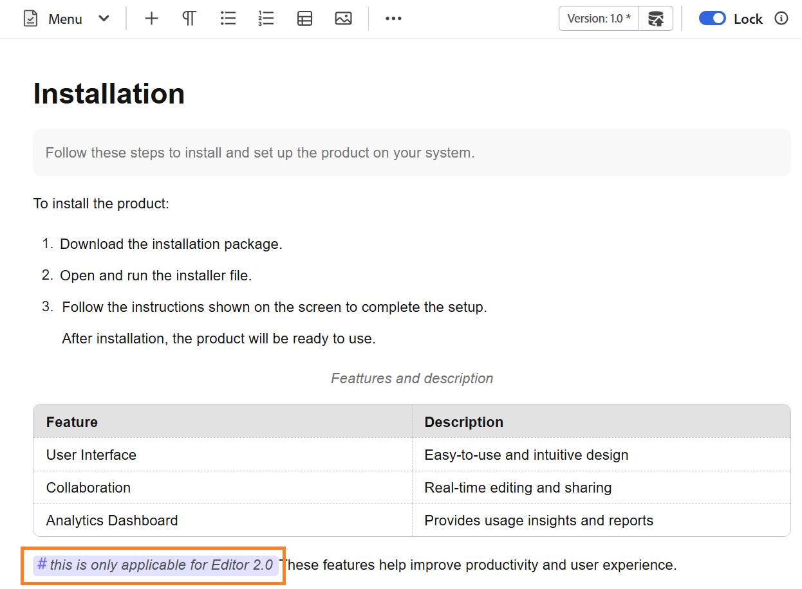
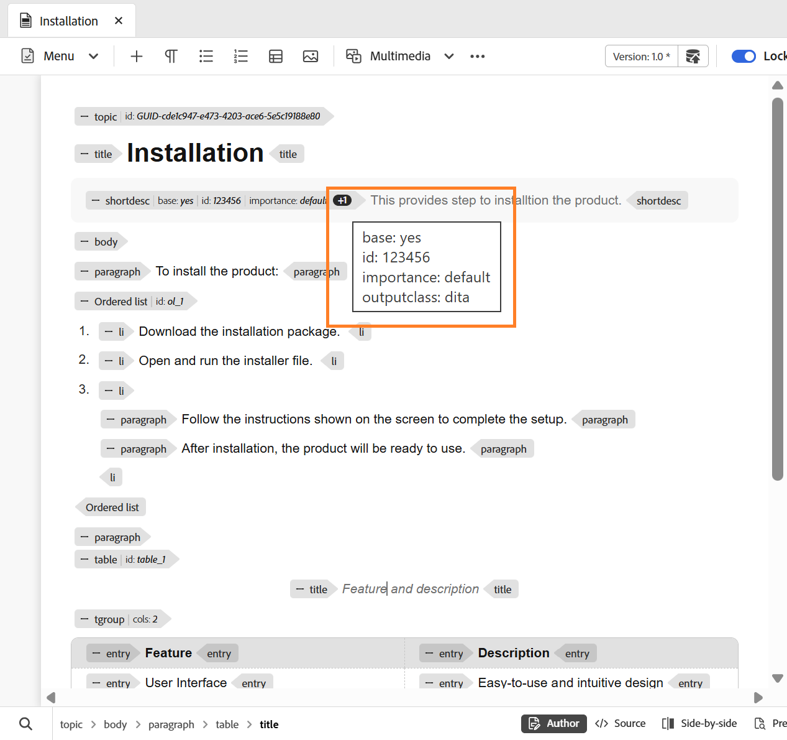

# 編輯器設定

>[!NOTE]
>
> 本文僅適用於新編輯器。 若要在您的環境中啟用此功能，請聯絡AEM Guides客戶成功團隊。

編輯器設定提供集中式設定面板，可讓您在個別作者層級自訂編輯器行為。 在編寫過程中提供更大的彈性、一致性和控制能力。

此集中式設定面板可讓您從單一位置管理重要編輯器偏好設定，減少分散或手動設定的需求。 您可以從標籤列上的&#x200B;**更多動作**&#x200B;存取編輯器設定。

{width="650"}

## 支援的組態選項

您可以根據您的偏好設定啟用或停用下列選項：

{width="350"}

- **不分行空格**：啟用此選項，以在編輯器中編輯不分行空格時顯示指示器。 它僅在DITA主題和DITA map的作者檢視中可見
- **XML註解**：可讓作者直接在[作者]模式中檢視、編輯和插入XML註解，以便在內容中更清楚顯示。 啟用後，作者可以在「作者」模式本身的內容中直接檢視、插入、編輯及刪除XML註解，更輕鬆為共同作業人員新增內容相關註解。 停用時，XML註解會隱藏在「作者」模式中，且無法從「作者」模式插入或修改，以確保不需要註解的使用者獲得更簡潔的撰寫體驗。 您可以使用`<!-- test comment -->`語法，繼續在來源模式中檢視及編寫XML註解。

  {width="650"}

- **標籤**：控制標籤在編輯器中的可見性。 啟用後，結構標籤會顯示在內容中，讓作者檢視及管理基礎DITA結構。 停用後，這些標籤會隱藏，以提供更乾淨、更聚焦的撰寫體驗。

  {width="650"}

  啟用&#x200B;**顯示標籤**&#x200B;設定時，您也可以啟用&#x200B;**顯示屬性**，以檢視及驗證與專案相關的屬性。 當元素具有三個以上關聯的屬性時，計數指示器就會出現。 將滑鼠指標暫留在該指標上，會顯示套用至該元素的完整屬性清單。

   {width="650"}

- **在編輯器中快速插入功能表**：可在以作者模式編輯時，直接在游標位置新增元素，而不需導覽至工具列。 也可以在&#x200B;**我的最愛**&#x200B;中設定常用元素，以便更快速地存取。 當您在Windows上按&#x200B;**Control + /**&#x200B;或在macOS上按游標位置上的&#x200B;**Command + /**&#x200B;時，可以直接在編輯器中使用快速插入功能表。

  {width="650"}

  您可以搜尋元素並將其新增至您的最愛，移除任何先前新增的元素，以及使用簡單的拖放方式來重新排列元素。 我的最愛包含您最常用的元素，當您從編輯器存取時，您在此設定的順序會反映在「快速插入」功能表中。

  以下是有關如何在新編輯器中使用快速插入功能表的短片。

  >[!VIDEO](https://video.tv.adobe.com/v/3491343)

