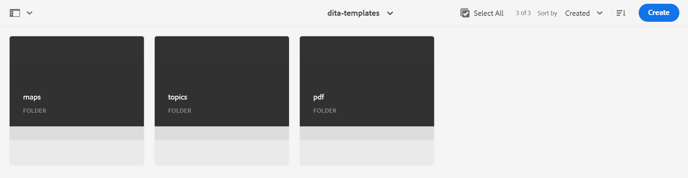

# 根據自訂範本建立地圖 {#id225VF0808MP}

您可以建立自訂對映範本，並使用它們來建立DITA對映，以及主題範本和對映範本中參照的對映範本

您可以參照自訂對應範本中的其他對應範本和主題範本。 參照的對映範本可參照各種對映範本、主題範本、主題、對映、影像、影片和其他資產。 自訂的對映範本可以幫助您輕鬆複製對映範本和整個參照的資料夾結構。 這些自訂範本對於建立和重新建立具有遞回結構和參照的多個對映特別有用。

>[!NOTE]
>
> 主題範本不會以遞回方式建立。 系統只會產生直接位於對映範本內的主題範本，而主題範本內的任何主題範本只會直接在父項中參照。

## 建立自訂範本

Adobe Experience Manager Guides可讓您從dita-templates資料夾建立自訂地圖和主題。 您可以使用這些自訂範本來建立地圖和主題。 您也可以將這些範本與作者共用，讓作者使用範本建立檔案。 使用這些範本，您可以讓作者保留範本資料夾中特定資源的個別副本。

>[!NOTE]
>
> 所有僅可在其中參照和維護的資源都必須放在範本資料夾之外。


您可以透過下列方式建立地圖和主題範本：
- [從編輯器建立自訂範本](#create-customized-templates-from-the-editor)
- [從Assets UI建立自訂範本](#create-customized-templates-from-the-assets-ui)


### 從編輯器建立自訂範本

**範本**&#x200B;功能存在於編輯器[介面的](./web-editor-left-panel.md)左側面板中，僅供系統管理員使用。 使用此面板，管理員可輕鬆建立和管理範本，然後供作者使用。 依照預設，範本分類在&#x200B;*對應*&#x200B;和&#x200B;*主題*&#x200B;型別範本下。

{width="300" align="left"}

依預設，您可以依標題檢視檔案。 當您將滑鼠停留在範本上時，您可以檢視檔案標題和檔案名稱作為工具提示。

>[!NOTE]
>
> 作為管理員，您還可以選擇在編輯器中檢視檔案清單。 選取&#x200B;**使用者偏好設定**&#x200B;中&#x200B;**編輯器檔案顯示設定**&#x200B;區段的&#x200B;**檔案名稱**&#x200B;選項。

執行以下步驟，從編輯器建立主題或對應範本：

1. 在編輯器中開啟&#x200B;**範本**&#x200B;面板，並選取&#x200B;**建立DITA範本**&#x200B;圖示。

   {width="500" align="left"}

1. 根據您要建立的範本型別，從下拉式功能表選擇&#x200B;**主題範本**&#x200B;或&#x200B;**對應範本**。
1. 如果您選取&#x200B;**主題範本**，則會顯示&#x200B;**新增主題範本**&#x200B;對話方塊。

   {width="300" align="left"}

   如果您選取&#x200B;**對應範本**，則會顯示&#x200B;**新增對應範本**&#x200B;對話方塊。

   {width="300" align="left"}

   若要先在&#x200B;**主題**&#x200B;或&#x200B;**對應**&#x200B;資料夾中建立資料夾，您也可以從下拉式清單中選取&#x200B;**資料夾**。

1. 在&#x200B;**新主題範本**/**新地圖範本**&#x200B;對話方塊中，提供&#x200B;**標題**，它會顯示在&#x200B;**範本**&#x200B;面板中。 根據標題自動建議範本的&#x200B;**Name**，但您可以提供不同的檔案名稱。
另外，從&#x200B;**範本**&#x200B;下拉式清單中選擇要建立的範本型別。

   >[!NOTE]
   >
   > 如果您的管理員已根據UUID設定啟用自動檔案名稱，則您將不會檢視「名稱」欄位。

1. 選取「**建立**」。

建立範本後，您需要將其新增到全域或資料夾層級的設定檔中。 新增範本後，您的作者將在主題/地圖建立程式中開始檢視新範本。

使用現有範本上的&#x200B;**選項**&#x200B;功能表，您可以選擇&#x200B;**編輯**&#x200B;或&#x200B;**複製**。 如果重複，則會保留範本的結構和型別\（屬於document\），您可以重複使用它來建立另一個範本。

{width="500" align="left"}

### 從Assets UI建立自訂範本

執行以下步驟，從Assets UI建立地圖或主題範本：

1. 在&#x200B;**Assets UI**&#x200B;中，導覽至dita-templates資料夾。

   {align="left"}

1. 如果要建立&#x200B;**主題**&#x200B;範本，請開啟&#x200B;**主題**&#x200B;資料夾。 如果要建立&#x200B;**對應**&#x200B;範本，請開啟&#x200B;**對應**&#x200B;資料夾。
1. 選取&#x200B;**建立\> DITA範本**。

   {width="300" align="left"}
1. 在Blueprint頁面上，選取&#x200B;**主題\>下一步**&#x200B;以建立主題範本。 否則，請選取&#x200B;**對應\>下一步**&#x200B;以建立對應範本。
1. 在[內容]頁面上，指定範本&#x200B;**Title**。
1. 指定檔案&#x200B;**名稱**。

   >[!NOTE]
   >
   > 檔案名稱必須具有.dita副檔名。

1. \(Optional\)新增說明。
1. 選取「**建立**」。

   主題範本建立的訊息隨即顯示。 然後，您可以開啟範本並進行編輯。 對於對應範本，您也可以新增主題範本、對應範本的參照，以及對應範本中的其他資產。


Assets UI中的&#x200B;**選項功能表**

若要使用Assets UI中的選項功能表建立地圖或主題範本，請執行以下步驟：

1. 選取目前範本資料夾中的&#x200B;**Map**&#x200B;或&#x200B;**Topic**&#x200B;資料夾。 例如，`dita-templates` 資料夾。
1. 從&#x200B;**選項**&#x200B;功能表，選取&#x200B;**建立地圖範本**&#x200B;或&#x200B;**建立主題範本**。

   **建立新地圖範本**&#x200B;或&#x200B;**建立新主題範本**&#x200B;對話方塊開啟。
1. 輸入新範本的標題和名稱。
1. 從&#x200B;**範本**&#x200B;下拉式清單中選擇要建立的範本型別。

對應範本建立的訊息隨即出現。 您可以將範本新增至全域或資料夾層級的設定檔。 然後，新範本會出現在主題或地圖建立程式中，您可以使用它來建立地圖或主題。

您的管理員也可以建立資料夾，並將其設定為您可建立和儲存範本的資料夾。

根據您的設定，瞭解如何設定自訂DITA範本資料夾路徑：
<details>
    <summary> 雲端服務 </summary>

瞭解如何在Cloud Services安裝與設定指南中[設定自訂DITA範本資料夾路徑](../install-guide/conf-template-tags-custom-dita-topic-template.md#configure-custom-dita-template-folder-path-id191lcf0095z)。
</details>

<details>
    <summary> 內部部署軟體</summary>

瞭解如何在On-premise Installation and Configuration Guide中[設定自訂DITA範本資料夾路徑](../cs-install-guide/conf-template-tags-custom-dita-topic-template.md#configure-custom-dita-template-folder-path-id191lcf0095z)。
</details>

## 傳遞範本中定義的標題

如果您想要將範本內使用的主題或地圖示題傳遞給使用該範本建立的DITA map，請在標題周圍使用大括弧。

範例

```XML
<pubtitle>
   <mainpubtitle outputclass="booktitle">
   {title}
   </mainpubtitle>
   <subtitle>Subtitle</subtitle>
</pubtitle>

The resultant DITA map with title "Rootmap1" will look like as follows:
<pubtitle>
   <mainpubtitle outputclass="booktitle">Rootmap1
   </mainpubtitle>
   <subtitle>Subtitle</subtitle>
</pubtitle>
```

>[!NOTE]
> 只有第一個出現的花括弧會取代為標題。

如果您未在標題周圍使用大括弧，則只會挑選第一個元素，且不會從範本中挑選標題的巢狀，如下所示：

```XML
<pubtitle> Rootmap1 </pubtitle>
```

>[!NOTE]
> 您也可以使用文字周圍的大括弧，將其巢狀結構從自訂範本傳遞至DITA map。

範例

```XML
<title>    
    <sub>        
        <b>{title}</b>    
    </sub>
</title>
```

## 使用地圖範本建立新地圖

>[!NOTE]
>
> 對應範本必須設定好並由您的管理員提供撰寫功能。 如需詳細資訊，請檢視「安裝與設定Adobe Experience Manager Guides as a Cloud Service」中的&#x200B;*「設定撰寫範本*」區段。

在&#x200B;**編輯器**&#x200B;中，執行下列步驟，使用自訂對應範本建立對應：

1. 在&#x200B;**編輯器**&#x200B;中，導覽至您要建立對應的資料夾。
1. 從資料夾的[選項]功能表中，選取&#x200B;**新增\> DITA Map**。

   {width="500" align="left"}
1. 顯示&#x200B;**新地圖**&#x200B;對話方塊。
1. 在&#x200B;**新增對應**&#x200B;對話方塊中，指定對應&#x200B;**標題**、檔案&#x200B;**名稱**，並選取您要使用的對映範本。

   例如，如果您已建立對應範本&#39;test-template&#39;，請選取它。

1. 選取「**建立**」。

   對應建立的訊息就會出現。

在&#x200B;**Assets UI**&#x200B;中，執行以下步驟來使用自訂地圖範本建立地圖：

1. 在&#x200B;**Assets UI中，**&#x200B;導覽至您要建立對應的資料夾。
1. 選取&#x200B;**建立\> DITA Map**。
1. 在Blueprint頁面上，選取您要使用的對應範本，然後選取&#x200B;**下一步**。 例如，如果您已建立對應範本&#39;test-template&#39;，請選取它。
1. 在[屬性]頁面上，指定對應&#x200B;**標題**。
1. 指定檔案&#x200B;**名稱**。

   >[!NOTE]
   >
   > 檔案名稱必須具有.ditamap副檔名。

1. 選擇 **建立**。對應建立的訊息就會出現。

## 使用自訂範本建立之DITA map的其他附註


對應會產生在範本資料夾內參照的所有資產。 地圖中引用的某些資產型別可能如下所示：

- 如果對應包含主題範本的參照，則會在該資料夾中建立一個副本，其階層與`dita-templates`資料夾中主題資料夾的階層相同。
- 如果對應包含對對應範本的參照，則會在該資料夾中建立其副本，其階層與`dita-templates`資料夾中的對應資料夾相同。
- 如果對應包含`dita-templates/topics`或`dita-templates/maps`資料夾外部之主題或對應的泛型參考，則只會參考該主題或對應，而不會建立副本。

  >[!NOTE]
  >
  > `dita-templates/topics`和`dita-templates/maps`是參考線中的預設路徑，且可設定。


  如果對應範本中有主題範本索引鍵定義，則會建立新索引鍵\（因此為新主題\），並在對應中參照。

- 如果在資料夾的相同層級建立另一個地圖或主題，則新建立的資產名稱會附加0、1、2等等。 您可以選擇開啟地圖進行編輯，或將地圖檔案儲存在存放庫中。

**上層主題：**&#x200B;[&#x200B;地圖編輯器簡介](map-editor.md)
