# DITAVAL編輯器 {#ditaval-editor}

DITAVAL檔案用於產生條件輸出。 在單一主題中，您可以使用元素屬性來新增條件，以條件化內容。 然後，您會建立DITAVAL檔案，在其中指定應擷取以產生內容的條件，以及應從最終輸出中排除哪些條件。

Adobe Experience Manager Guides可讓您使用DITAVAL編輯器輕鬆建立及編輯DITAVAL檔案。 DITAVAL編輯器會擷取您系統中定義的屬性（可做為條件使用），您可以使用這些屬性來建立或編輯DITAVAL檔案。 如需有關在Adobe Experience Manager中建立和管理條件的詳細資訊，請檢視Adobe Experience Manager檔案中的[管理標籤](https://experienceleague.adobe.com/docs/experience-manager-cloud-service/sites/authoring/features/tags.html?lang=en)區段。

以下各節涵蓋Experience Manager Guides中DITAVAL檔案可用的選項。

- [建立DITAVAL檔案](#create-ditaval-file)
- [編輯DITAVAL檔案](#edit-ditaval-file)
- [DITAVAl檔案編輯器檢視](#ditaval-editor-views)
- [在Assets UI中使用DITAVAL檔案](#working-with-ditaval-files-in-the-assets-ui)

## 建立DITAVAL檔案

執行以下步驟來建立DITAVAL檔案：

1. 在「存放庫」面板中，選取&#x200B;**新檔案**&#x200B;圖示，然後從下拉式功能表中選取&#x200B;**主題**。

   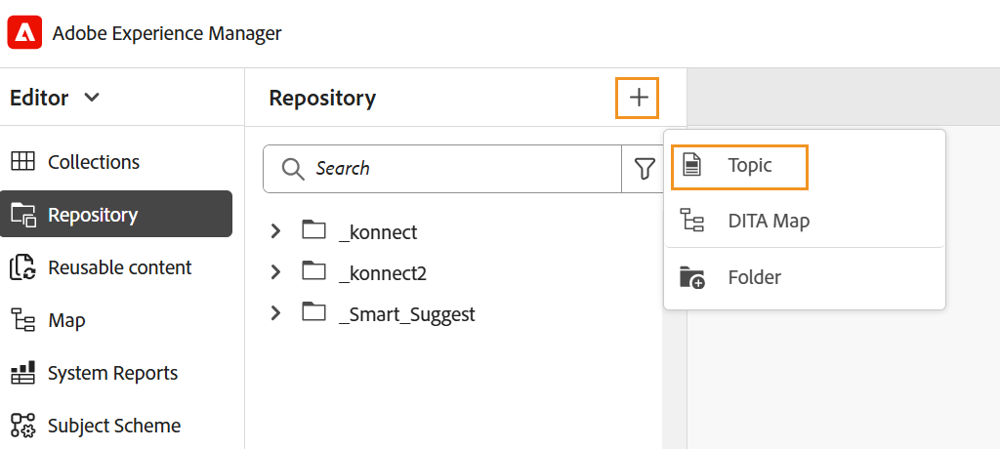{width="350" align="left"}

   您也可以從[Experience Manager Guides首頁](./intro-home-page.md)以及存放庫檢視中資料夾的選項功能表存取此選項。

2. 顯示&#x200B;**新主題**&#x200B;對話方塊。

3. 在&#x200B;**新主題**&#x200B;對話方塊中，提供下列詳細資料：
   - 主題的標題。
   - \(Optional\)*主題的檔案名稱。 會根據主題「標題」自動建議檔案名稱。 如果您的管理員已根據UUID設定啟用自動檔案名稱，則您將不會檢視「名稱」欄位。
   - 主題將依據的範本。 若為DITAVAL檔案，請從下拉式清單中選取&#x200B;**Ditaval**。
   - 您要儲存主題檔案的路徑。 依預設，存放庫中目前所選資料夾的路徑會顯示在「路徑」欄位中。

   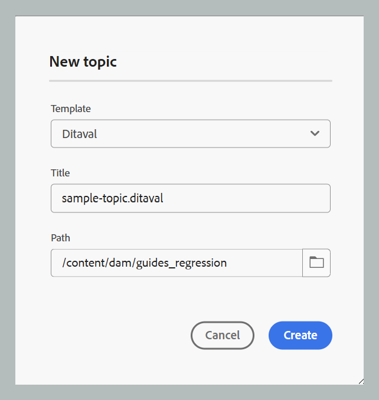{width="350" align="left"}

4. 選取「**建立**」。

主題是在指定的路徑中建立。 此外，主題也會在編輯器中開啟以進行編輯。

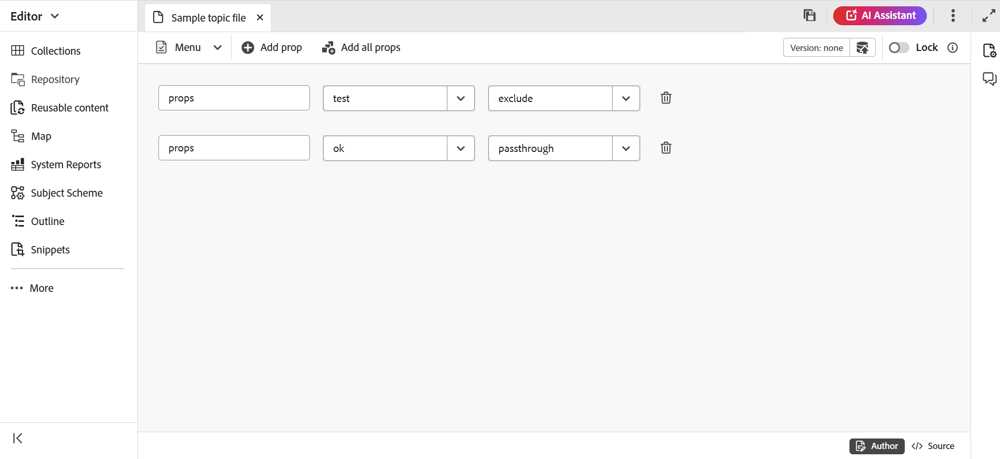{align="left"}

## 編輯DITAVAL檔案

當您建立DITAVAL主題時，它會在編輯器中開啟以進行編輯。 若要編輯現有的DITAVAL主題，請導覽至DITAVAL主題所在的資料夾或地圖，然後從&#x200B;**選項**&#x200B;功能表選取&#x200B;**編輯**。

DITAVAL編輯器可讓您使用編輯器工具列中的選項，執行下列多個工作。

### 編輯器工具列選項

#### 功能表下拉式清單

「選單」下拉式清單提供編輯動作、「尋找和取代」、「版本記錄」、「版本標籤」、「合併」、「建立稽核任務」、「追蹤變更」和「標籤」功能的存取權。
如需詳細資訊，請檢視[功能表下拉式清單選項](./web-editor-toolbar.md#menu-dropdown)

#### 新增屬性

在您的DITAVAL檔案中新增單一屬性。

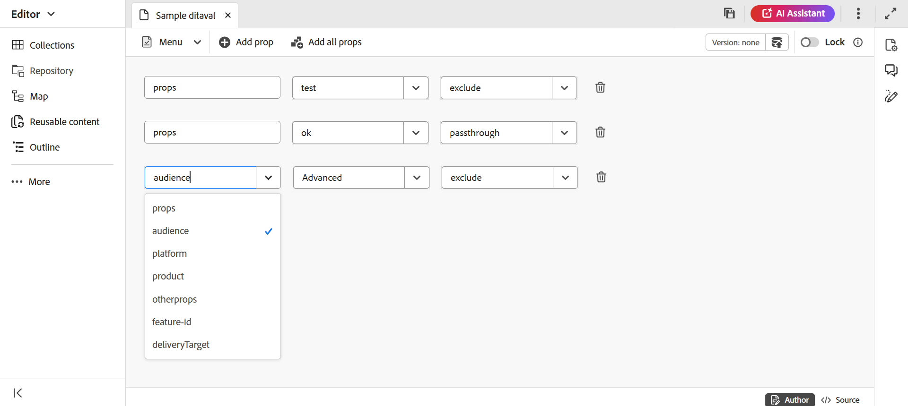{width="650" align="left"}

第一個下拉式清單列出可在DITAVAL檔案中使用的允許DITA屬性。

第二個下拉式清單會顯示為選取的屬性設定的值。 然後，下一個下拉式清單會顯示您可在選取的屬性上設定的動作。 動作下拉式清單中允許的值為 — `include`、`exclude`、`passthrough`和`flag`。 如需這些值的詳細資訊，請檢視OASIS DITA檔案中[prop](http://docs.oasis-open.org/dita/dita/v1.3/errata01/os/complete/part3-all-inclusive/langRef/ditaval/ditaval-prop.html#ditaval-prop)元素的定義。 如需屬性中新增之屬性的動作詳細資訊，請檢視屬性[的](#actions-for-property)動作。

#### 新增收入屬性

若要將特定修訂版本編號新增至XML格式的標籤，您可以使用「新增修訂版本prop」選項。 這會將rev屬性新增至標籤，其值在「值」欄位中定義，同時為該屬性選取動作。 此修訂屬性稍後可用於在產生輸出時根據指定的修訂版本編號來篩選相關的XML內容。

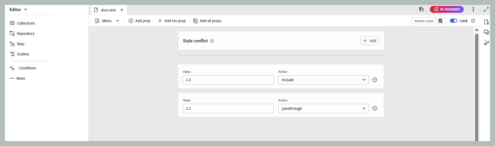{width="650" align="left"}

#### 新增所有Prop

如果您要按一下即可新增系統中定義的所有條件屬性或屬性，請使用「新增所有屬性」功能。 動作下拉式清單中允許的值為 — `include`、`exclude`、`passthrough`和`flag`。 這些動作的詳細資訊如下所述。

>[!NOTE]
>
> 如果DITAVAL檔案中已存在所有已定義的條件屬性，則無法新增更多屬性。 在此案例中，您會收到一則錯誤訊息。

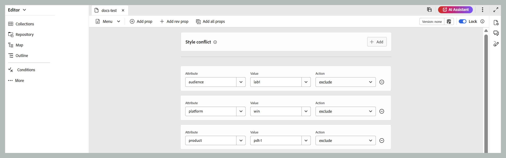{width="650" align="left"}

##### 屬性的動作

特定屬性主要有四個動作可供使用，如下所示：

**包含：**&#x200B;包含輸出中的內容。 除非另有設定，否則此為預設行為。

**排除：**&#x200B;從輸出中排除內容（如果特定屬性中的所有值都已排除）。

**通過：**&#x200B;將內容包含在輸出中，並保留屬性值作為輸出資料流的一部分，以供執行階段引擎進一步處理，例如根據個別使用者設定的執行階段篩選。

**新增標幟：**&#x200B;若要在輸出中標幟內容，您可以將標幟設定為檔案中所需屬性的動作。 您也可以使用&#x200B;**旗標樣式**&#x200B;下拉式清單套用不同的旗標樣式，如下面的程式碼片段所示。

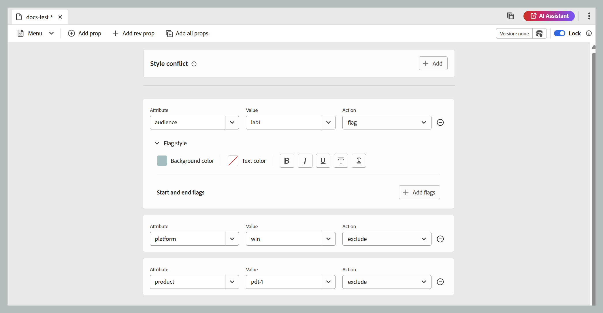{width="650" align="left"}

- **背景色彩**：從背景色彩中選取色相、飽和度、對比。 對應的十六進位值將會根據您的選擇自動更新。 您也可以使用下拉式選單來切換色域格式，以便在HEX、RGB和HSB之間選擇。

  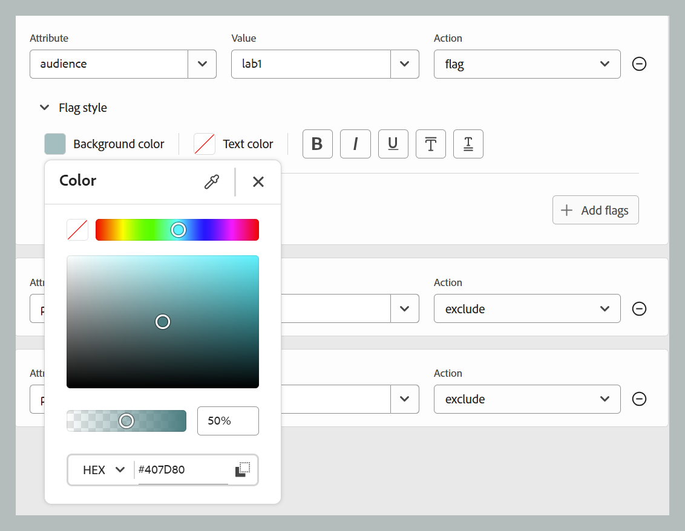{width="350" align="left"}

- **文字色彩**：從文字色彩中選取色相、飽和度、對比。 對應的十六進位值將會根據您的選擇自動更新。 您也可以使用下拉式選單來切換色域格式，以便在HEX、RGB和HSB之間選擇。

  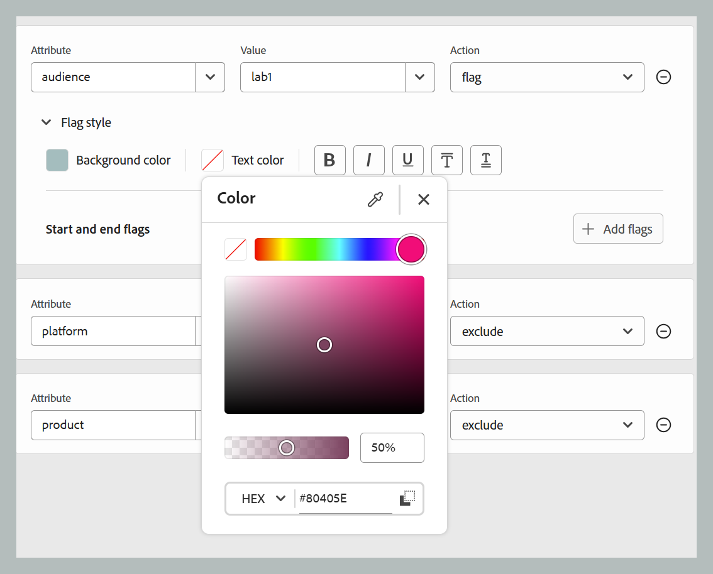{width="350" align="left"}

- **樣式選項**：您可以新增一些樣式選項，例如粗體、斜體、底線、上線、雙底線。

  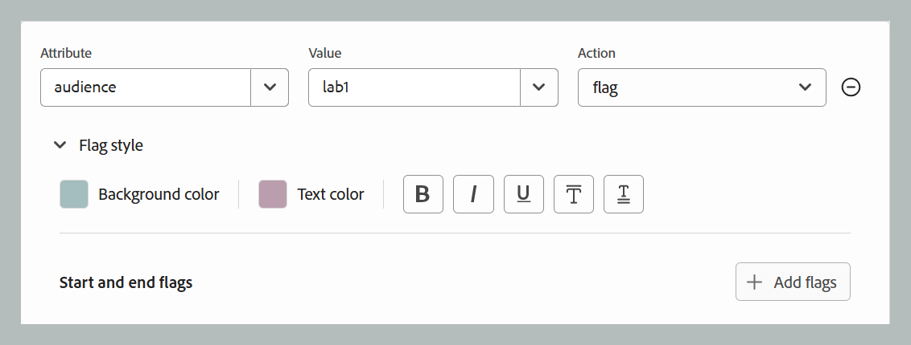{width="350" align="left"}

- **開始和結束旗標**：您可以使用&#x200B;**新增旗標**&#x200B;按鈕，將影像插入為開始和結束旗標。 若要選擇影像，請使用&#x200B;**瀏覽Assets**&#x200B;從「指南」存放庫中選擇，或使用&#x200B;**新增檔案**&#x200B;從您的本機系統上傳。 此外，您也可以為影像指定替代文字。

  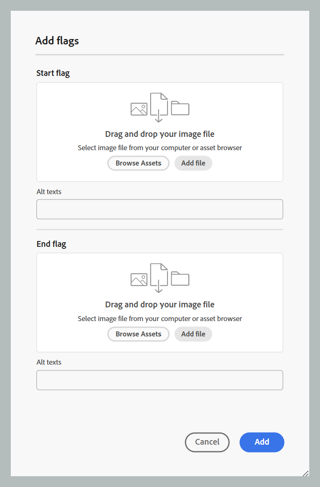{width="350" align="left"}

- **樣式衝突**：它解決當單一元素包含具有不同Flag樣式的多個屬性時發生的衝突。 在這種情況下，會選取樣式衝突屬性中定義的值，以有效地做為背景和文字顏色的預設值選擇器。

  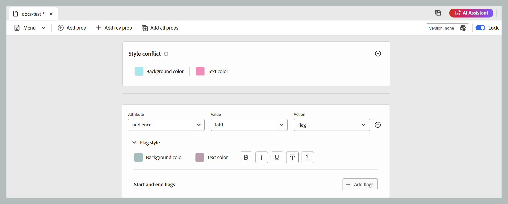{width="650" align="left"}

#### 版本資訊和另存為新版本

版本資訊和另存為新版本功能將版本追蹤和內容儲存結合為單一功能。
如需詳細資訊，請檢視[另存為新版本](./web-editor-toolbar.md#version-information-and-save-as-new-version)

#### 鎖定/解鎖

鎖定或解除鎖定目前的檔案。 鎖定檔案可讓您以獨佔方式寫入檔案。
如需詳細資訊，請檢視[鎖定解除鎖定檔案](./web-editor-toolbar.md#lockunlock)

### 儲存內容

完成編輯DITAVAL檔案後，在索引標籤列上選取&#x200B;**儲存**。

>[!NOTE]
>
> 如果您關閉檔案而不儲存，變更將會遺失。 如果您不想將變更提交至Adobe Experience Manager存放庫，請選取&#x200B;**關閉**，然後在&#x200B;**未儲存的變更**&#x200B;對話方塊中選取&#x200B;**關閉而不儲存**。

## DITAVAL編輯器檢視

Adobe Experience Manager Guides的DITAVAL編輯器支援以兩種不同的模式或檢視檢視DITAVAL檔案：

**作者**：   這是DITAVAL編輯器的典型「所見即所得」檢視。 您可以使用簡單使用者介面新增或移除屬性，該介面會在下拉式清單中顯示屬性、屬性和動作。 在「作者」檢視中，您有選項可按一下插入個別屬性，以及插入所有屬性。

您也可以將指標暫留在檔案名稱上，找到目前使用的DITAVAL檔案版本。

**Source**：   Source檢視會顯示構成DITAVAL檔案的基礎XML。 除了在此檢視中進行一般文字編輯外，作者也可以使用「智慧型目錄」新增或編輯屬性。

若要叫用智慧型錄，請將游標放在任何屬性定義的結尾並輸入&quot;&lt;&quot;。 編輯器將顯示您可以在該位置插入的所有有效XML元素清單。

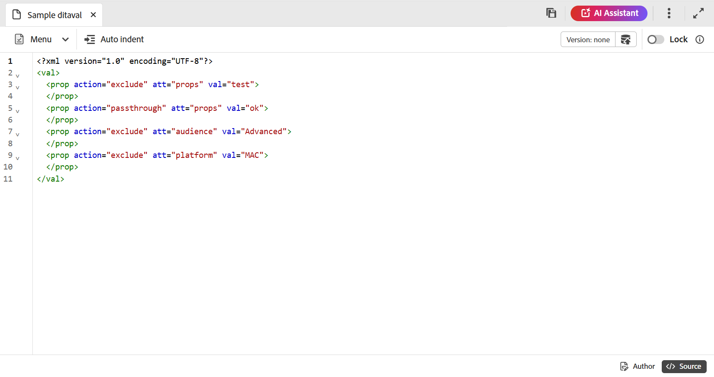

## 在Assets UI中使用DITAVAL檔案

您也可以從Assets UI建立DITAVAL檔案。 建立新DITAVAL主題的步驟如下：

1. 在Assets UI中，導覽至您要建立DITAVAL檔案的位置。

1. 選取&#x200B;**建立** \> **DITA主題**。

1. 在Blueprint頁面上，選取DITAVAL檔案範本，然後選取&#x200B;**下一步**。

1. 在[內容]頁面上，指定DITAVAL檔案的&#x200B;**標題**&#x200B;和&#x200B;**名稱**。

   >[!NOTE]
   >
   > 系統會根據檔案的標題自動建議名稱。 如果您要手動指定檔案名稱，請確定「名稱」不含任何空格、單引號或大括弧，且結尾為.ditaval。

1. 選取「**建立**」。

   「主題已建立」訊息便會顯示。

您可以選擇開啟DITAVAL檔案以在DITAVAL編輯器中編輯，或將主題檔案儲存在Adobe Experience Manager存放庫中。

執行以下步驟來編輯現有的DITAVAL檔案：

1. 在Assets UI中，導覽至您要編輯的DITAVAL檔案。

1. 若要取得檔案的獨佔鎖定，請選取該檔案，然後選取&#x200B;**簽出**。

1. 選取檔案並選取&#x200B;**編輯**，以在Adobe Experience Manager Guides DITAVAL編輯器中開啟檔案。

