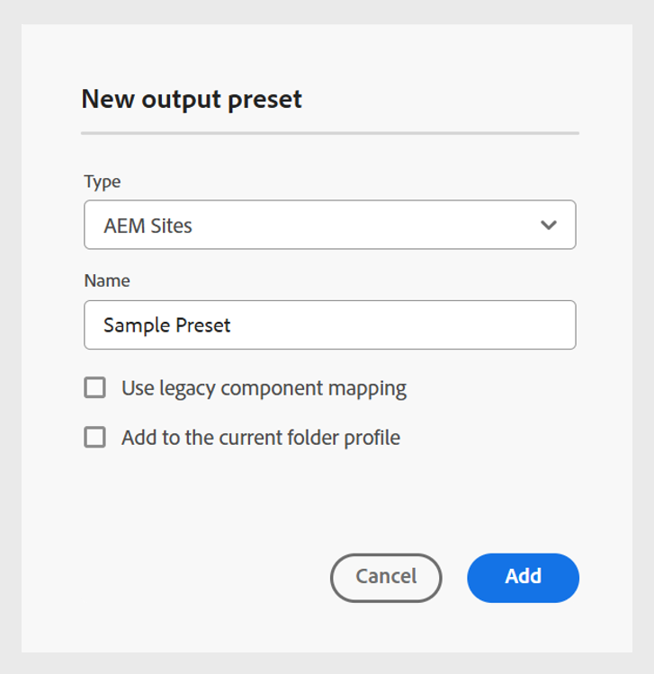
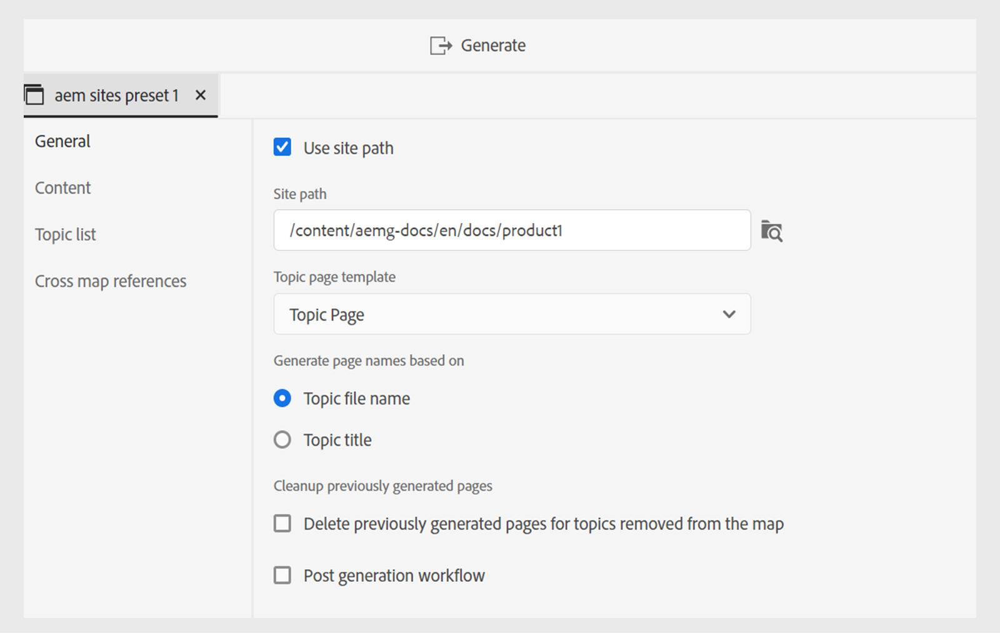
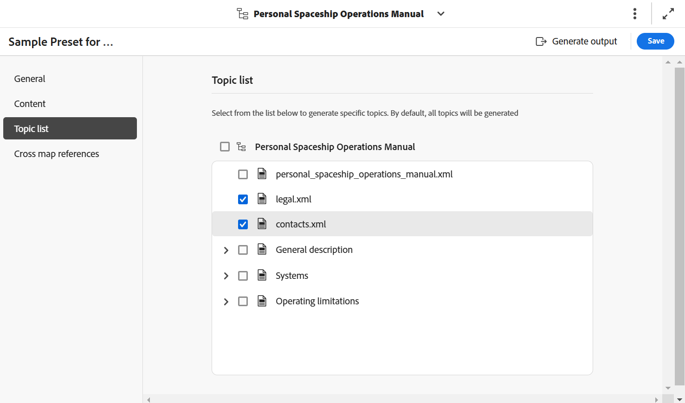
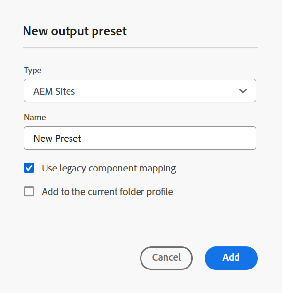
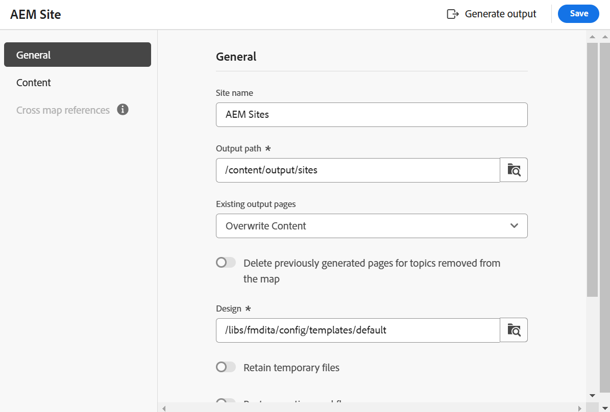
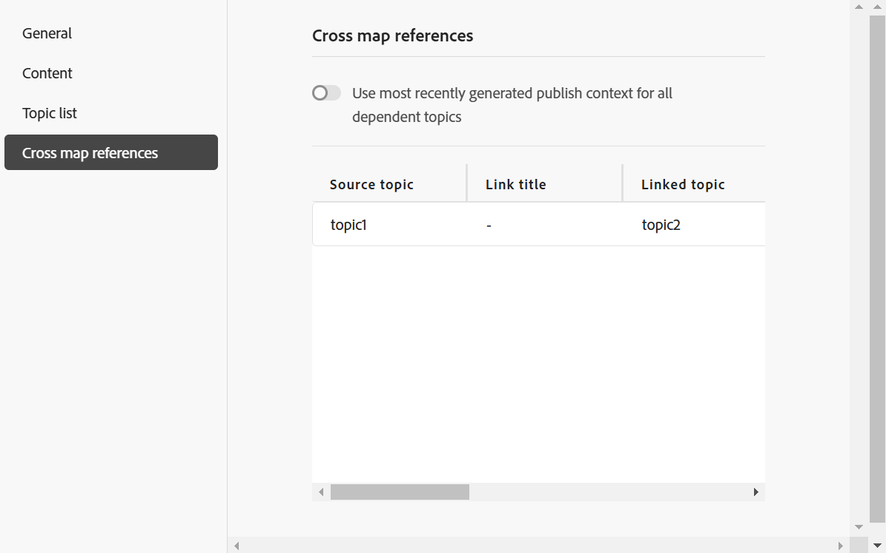

# 地圖主控台中的AEM Sites預設集

您可以從「地圖」控制檯建立AEM Sites預設集，並將其設定為產生AEM Sites輸出。 建立AEM Sites輸出的方式有兩種：

- [使用複合元件對應](#use-composite-component-mapping)
- [使用舊版元件對應](#use-legacy-component-mapping)

>[!TIP]
>
> 建議您使用Experience Manager Guides 2502發行版本及更新版本中提供的複合元件對應，以強化效能。

## 使用複合元件對應

相較於舊版元件對應，複合元件對應提供更快速且可擴充的發佈至AEM Sites。 隨附立即可用的可編輯範本，您可視需求使用AEM範本編輯器加以自訂。 範本運用WCM核心元件和專業`guides-components`的混合，以確保您的使用者在您的AEM Sites頁面上獲得最佳體驗。 您也可以使用複合元件對應方法來自訂現有的範本。

Experience Manager Guides為建立AEM Sites提供預先定義的範本。 這些範本可協助您確保內容版面配置與結構的一致性。
- [根據這些預先定義的範本建立首頁](../cs-install-guide/download-install-aem-sites-templates-cs.md#create-a-home-page-using-the-template)。
- 您可以[編輯主題範本](../cs-install-guide/download-install-aem-sites-templates-cs.md#package-installation)，並根據您的需求套用樣式。
- 您也可以[自訂現有的AEM Sites範本](../cs-install-guide/download-install-aem-sites-templates-cs.md#customize-existing-aem-sites-templates)。

**建立AEM Sites預設集**

執行以下步驟，使用複合元件對應來建立AEM Sites預設集：

1. [在對應主控台](./open-files-map-console.md)中開啟DITA map檔案。
1. 在&#x200B;**輸出預設集**&#x200B;面板中，選取+圖示以建立輸出預設集。
1. 從&#x200B;**新增輸出預設集**&#x200B;對話方塊的&#x200B;**型別**&#x200B;下拉式清單中選取&#x200B;**AEM Sites**。
1. 取消選取&#x200B;**使用舊版元件對應**&#x200B;選項。
1. 選取&#x200B;**新增至目前的資料夾設定檔**&#x200B;選項，以在目前的資料夾設定檔中建立輸出預設集。 表示資料夾設定檔層級的預設集。

   深入瞭解[管理全域和資料夾設定檔輸出預設集](./web-editor-manage-output-presets.md)。

1. 選取「**新增**」。

   隨即建立AEM Sites的預設集。

   {width="300" align="left"}

<!-----------------------
### Generate the AEM Sites output using the templates

Once, the preset is created, you can configure the various options available for AEM Sites output generation. Experience Manager Guides allows you to use the out of the box templates or add your own AEM Sites templates.

You can configure the Out-of-the-box Sites template  in two ways:

- In the **Sites** field, select the AEM sites where you want to publish your output.  For example, `AEMG Docs`.

    The **Publish path** and the **Topic page template** options are automatically set in the dropdown.  For example,  `AEMG-Docs-Site/en/docs/product1` and `Topic page` are set respectively. You can also choose the other options from the dropdown.

- Or, Select the **Use Sites path** option to select the complete Sites path, and then select a **Map page template**. 

    You can browse a predefined Sites path or specify a custom path even if the specified path has not been pre-created within the AEM Sites structure. In such cases, the system creates the necessary structure during the publishing process by using the selected map homepage template.

   For example, you can specify the path `/content/AEMG-Docs-Site/en/docs/product4` where the `product4`does not exist in the strcuture. In this case, the system automatically creates `product4` using the selected **Map page template** and publish the output within this newly created page. 
   
   The **Topic page template** is automatically set as `Topic Page`. However, you can choose to select other available options in the dropdown.

--->

### 複合元件對映的AEM Sites預設集設定

>[!NOTE]
>
> 在設定Experience Manager Guides的AEM Sites預設集之前，您的管理員需要使用範本建立AEM Sites結構。

- **內部部署軟體**：深入瞭解如何[下載並安裝內部部署軟體的AEM Sites範本](../install-guide/download-install-aem-sites-templates.md)。
- **Cloud Service**：進一步瞭解如何[下載並安裝適用於Cloud Service的AEM Sites範本](../cs-install-guide/download-install-aem-sites-templates-cs.md)。

在「對映」主控台中，複合元件對應的預設組態選項會整理在下列標籤下：

- 一般
- 內容
- 主題清單
- 交叉對應參考

{width="650" align="left"}

**一般**

**一般**&#x200B;索引標籤包含下列組態選項：

| AEM Sites選項 | 描述 |
| --- | --- |
| 使用網站路徑 | 使用此選項將您的內容發佈至Experience Manager網站。 |
| 網站路徑 | **如果您選取**&#x200B;使用網站路徑&#x200B;**選項**，就會出現此選項。 瀏覽預先定義的Experience Manager網站路徑，或指定您要發佈輸出的自訂路徑。 **使用Sites選項**&#x200B;可讓您指定整個發佈路徑，即使指定的路徑尚未在AEM Sites結構中預先建立。 在這種情況下，系統會在發佈程式期間使用選取的對應首頁範本建立必要的結構。 |
| 對應頁面範本 | **如果您選取**&#x200B;使用網站路徑&#x200B;**選項**，就會出現此選項。 選取您要套用至地圖首頁的範本。 |
| 網站 | 您要發佈內容的Experience Manager Sites名稱。 下拉式清單中的選項會根據AEM Sites中可用的網站清單填入。  選取&#x200B;**重新整理** 以擷取新的選項清單，並反映更新的資料。 |
| 發佈路徑 | AEM存放庫內儲存輸出的路徑。 「發佈路徑」會填入包含根據首頁範本建立之頁面的所有路徑。 DITA map的AEM Sites輸出會在此路徑下產生。  例如，如果您將網站指定為`AEMG-Docs`，並將發佈路徑指定為`aemg-docs-en/docs/product-abc.`，則會在`crx/de`中的`aemg-docs-en/docs/product-abc/`節點下產生AEM Sites輸出。 |
| 主題頁面範本 | 選取要套用至所有輸出主題的範本。 |
| 根據以下條件產生頁面名稱： | **主題檔案名稱**：使用DITA主題的檔案名稱來建立網站URL。  **主題標題**：使用DITA主題的標題來建立Experience Manager網站名稱。 |
| 清理先前產生的頁面 | - **刪除從對映中移除之主題先前產生的頁面**：如果DTIA對映的結構變更，您可以使用此選項來移除先前產生之主題頁面。 此功能僅適用於完整地圖發佈。  假設您已發佈DITA map，其中包含主題a.dita、b.dita和c.dita。 再次發佈對應之前，您已從對應移除b.dita主題。 現在，如果您已選取此選項，則會從AEM Sites輸出中移除與b.dita相關的所有內容，並且僅發佈a.dita和c.dita。  **注意**：有關已刪除頁面的資訊也會擷取到輸出產生記錄檔中。 如需有關存取記錄檔的詳細資訊，請[檢視並檢查記錄檔](generate-output-basic-troubleshooting.md#id1821I0Y0G0A__id1822G0P0CHS)。   **警告**：刪除主題時，已發佈網站的頁面會變成無法使用。 因此，在刪除主題之前，會顯示警告。 您必須確認以刪除它們。  - **刪除此路徑上其他來源建立的所有頁面**：如果您選取此選項，會刪除其他地圖、個別主題或任何其他來源在此路徑上發佈的所有頁面。 已發佈網站的頁面也會變得無法使用。 因此，在刪除主題之前，會顯示警告。 您必須確認以刪除它們。 |
| 貼文產生工作流程 | 選擇此選項時，會顯示新的「產生後工作流程」下拉式清單，其中包含AEM中設定的所有工作流程。 您必須選取要在輸出產生工作流程完成後執行的工作流程。 |

**內容**

**Content**&#x200B;索引標籤包含下列組態選項：

| AEM Sites選項 | 描述 |
| --- | --- |
| 使用基準線 | 如果您已經為選取的DITA map建立基準線，請選取此選項以指定要發佈的版本。  檢視[使用基準線](generate-output-use-baseline-for-publishing.md#id1825FI0J0PF)以取得詳細資料。 |
| 條件式篩選 | 選取下列其中一個選項：  **無**：如果您不想在發佈的輸出上套用任何條件，請選取此選項。 **使用DITAVAL**：選取DITAVal檔案以產生條件式內容。 您可以使用瀏覽對話方塊或輸入檔案路徑來選取多個DITAVal檔案。 使用檔案名稱附近的十字圖示可將其移除。 DITAVal檔案會依指定的順序計算，因此第一個檔案中指定的條件優先於後續檔案中指定的相符條件。 您可以透過新增或刪除檔案來維持檔案順序。 如果DITAVal檔案被移動到其他位置或被刪除，它不會自動從對映圖示板中刪除。 您必須更新位置，才能移動或刪除檔案。 您可以將滑鼠停留在檔案名稱上，檢視檔案儲存所在的AEM存放庫中的路徑。 您只能選取DITAVal檔案，如果您選取任何其他檔案型別，則會顯示錯誤。 **條件預設集**：從下拉式清單中選取條件預設集，以在發佈輸出時套用條件。 如果您已為DITA map檔案新增條件，則會顯示此選項。 條件設定可在DITA map主控台的「條件預設集」標籤中使用。 若要進一步瞭解條件預設集，請檢視[使用條件預設集](generate-output-use-condition-presets.md#id1825FL004PN)。 |
| 其他DITA-OT命令列引數 | 指定在產生輸出時要DITA-OT處理的其他引數。 如需有關DITA-OT支援的命令列引數的詳細資訊，請檢視[DITA-OT檔案](https://www.dita-ot.org/)。 |
| 中繼資料   檔案(Assets)屬性 | 選取您要當作中繼資料處理的屬性。 這些屬性是從DITA map或bookmap檔案的「屬性」頁面設定的。 您從下拉式清單中選取的屬性會顯示在&#x200B;**檔案屬性**&#x200B;欄位下。 選取屬性旁的十字圖示以將其移除。   **注意**：中繼資料屬性區分大小寫。  *如果您已選取「基準線」，則屬性的值會以所選「基準線」的版本為基礎。 *&#x200B;如果您尚未選取「基準線」，則屬性的值會以最新版本為基礎。  您也可以使用DITA-OT發行將中繼資料傳遞至輸出。 如需詳細資料檢視，請[使用DITA-OT](pass-metadata-dita-ot.md#id21BJ00QD0XA)將中繼資料傳遞至輸出。  **注意**：如果您尚未在[屬性]選項中定義`cq:tags`，則即使您已選取要發佈的基準線，`cq:tags`的值也會從目前的工作復本中挑選出來。 |
| 中繼資料   使用地圖屬性作為遞補 | 如果選取，為對映檔案定義的屬性也會複製到未定義此類屬性的主題中。 使用此選項時，請考量下列幾點：  *只能將字串、日期或長（單一和多值）屬性傳遞至AEM網站頁面。 *&#x200B;字串型別屬性的中繼資料值不支援任何特殊字元（例如`@, #, " "`）。 *此選項應與`Properties`選項搭配使用。 |

**主題清單**

**主題清單**&#x200B;索引標籤會顯示DITA map目前工作復本中的主題清單。 依預設，會包含所有主題。 您可以選取特定主題，並僅為其產生AEM Sites輸出。 例如，您已更新一些主題，因此您可以僅發佈這些主題，而非發佈整個DITA map。

 {align="left"}

>[!NOTE]
>
> 在&#x200B;**內容**&#x200B;標籤中選取基準線時，主題清單會顯示附加基準線中的主題及其版本。 此外，只有在地圖結構未發生變更時，才應使用主題清單中的增量發佈。 如果地圖結構/目錄變更，則整個地圖應發佈一次以更新目錄。

**交叉對應參考**

此清單包含的主題包含具有`scope =”peer”`的交叉對映參考。 您可以為其他DITA map中可用主題的交叉對映參照清單指定發佈內容，其中包含`scope=”peer”`。 如果您使用Experience Manager Guides (UUID)版本，此標籤就會出現。

如需詳細資訊，請參閱下方的[使用連結的主題](#working-with-linked-topics)區段。

設定之後，儲存對預設集所做的變更，並選取「**產生**」以產生對應地圖的AEM Sites。

>[!NOTE]
>
> 如果您是第一次將內容發佈至AEM網站，建議您在網站層級發佈頁面。 這可確保輸出在&#x200B;**Publish**&#x200B;執行個體上正確顯示，而不會造成任何CSS中斷。

## 使用舊版元件對應

使用舊版元件對應來建立AEM Sites預設集的步驟，與上述[複合元件對應](#use-composite-component-mapping)一節中概述的步驟相同。 不過，在建立預設集時，請確定您在&#x200B;**新增輸出預設集**&#x200B;對話方塊中選取&#x200B;**使用舊版元件對應**&#x200B;選項。

 {width="300" align="left"}

在「對應」控制檯中，舊版元件對應的預設設定選項會整理在下列標籤下：

- 一般
- 內容
- 交叉對應參考

{width="500" align="left"}

**一般**

**一般**&#x200B;索引標籤包含下列組態選項：

| AEM Sites選項 | 說明 |
| --- | --- |
| 網站名稱 | 儲存輸出至AEM存放庫的網站名稱。  AEM存放庫中的節點是以此處指定的名稱建立的。 如果您未指定「場地名稱」，則會以DITA map檔案名稱建立場地節點。  您在此指定的網站名稱也會當作瀏覽器標籤中的標題。  您也可以在設定網站名稱時使用變數。 |
| 輸出路徑 | AEM存放庫內儲存輸出的路徑。 產生最終輸出時，會組合場地名稱和輸出路徑。 例如，如果您將網站名稱指定為`user-guide`，並將輸出路徑指定為`/content/output/aem-guides`，則最終輸出會在`/content/output/aem-guides/user-guide`節點下產生。  您也可以在設定輸出路徑時使用變數。 |
| 現有的輸出頁面 | 選取&#x200B;**覆寫內容**&#x200B;選項，以覆寫現有頁面中的內容。 此選項只會覆寫存在於頁面內容和標題節點下方的內容。 此選項可啟用混合式發佈內容。 選取此選項可提供一個選項，讓您選取從已發佈輸出中刪除孤立頁面。 這也是建立AEM Sites輸出的&#x200B;*預設*&#x200B;選項。  選取&#x200B;**刪除並建立**&#x200B;選項，以在發佈期間強制刪除任何現有頁面。 此選項會刪除頁面節點，及其內容和其下的所有子頁面。 如果您已變更輸出預設集的設計範本，或想要移除目的地中已存在的任何額外頁面，請使用此選項。 |
| 為從地圖中移除的主題刪除先前產生的頁面 | 如果DTIA對映的結構變更，您可以使用此選項來移除先前為已移除主題產生的頁面。 此功能僅適用於完整地圖發佈。  假設您已發佈DITA map，其中包含主題a.dita、b.dita和c.dita。 再次發佈對應之前，您已從對應移除b.dita主題。 現在，如果您已選取此選項，則會從AEM Sites輸出中移除與b.dita相關的所有內容，並且僅發佈a.dita和c.dita。  **注意**：有關已刪除頁面的資訊也會擷取到輸出產生記錄檔中。 如需有關存取記錄檔的詳細資訊，請[檢視並檢查記錄檔](generate-output-basic-troubleshooting.md#id1821I0Y0G0A__id1822G0P0CHS)。   **警告**：刪除主題時，已發佈網站的頁面會變成無法使用。 因此，在刪除主題之前，會顯示警告。 您必須確認以刪除它們。 |
| 設計 | 選取您要用來產生輸出的設計範本。  如需有關如何使用自訂設計範本產生輸出的詳細資訊，請連絡您的發佈系統管理員。 |
| 貼文產生工作流程 | 選擇此選項時，會顯示新的「產生後工作流程」下拉式清單，其中包含AEM中設定的所有工作流程。 您必須選取要在輸出產生工作流程完成後執行的工作流程。 |
| 保留暫存檔 | 選取此選項可保留DITA-OT產生的暫存檔案。 如果您在透過DITA-OT產生輸出時發生錯誤，請選取此選項以保留暫存檔案。 然後，您可以使用這些檔案來疑難排解輸出產生錯誤。   產生輸出後，請選取&#x200B;**下載暫存檔** 圖示來下載包含暫存檔的ZIP資料夾。   **注意**：如果在產生期間新增檔案屬性，輸出暫存檔也會包含包含包含這些屬性的&#x200B;*metadata.xml*&#x200B;檔案。 |

**內容**

**Content**&#x200B;索引標籤包含下列組態選項：

| AEM Sites選項 | 描述 |
| --- | --- |
| 使用基準線 | 如果您已經為選取的DITA map建立基準線，請選取此選項以指定要發佈的版本。  檢視[使用基準線](generate-output-use-baseline-for-publishing.md#id1825FI0J0PF)以取得詳細資料。 |
| 條件式篩選 | 選取下列其中一個選項：  **無**：如果您不想在發佈的輸出上套用任何條件，請選取此選項。 **使用DITAVAL**：選取DITAVal檔案以產生條件式內容。 您可以使用瀏覽對話方塊或輸入檔案路徑來選取多個DITAVal檔案。 使用檔案名稱附近的十字圖示可將其移除。 DITAVal檔案會依指定的順序計算，因此第一個檔案中指定的條件優先於後續檔案中指定的相符條件。 您可以透過新增或刪除檔案來維持檔案順序。 如果DITAVal檔案被移動到其他位置或被刪除，它不會自動從對映圖示板中刪除。 您必須更新位置，才能移動或刪除檔案。 您可以將滑鼠停留在檔案名稱上，檢視檔案儲存所在的AEM存放庫中的路徑。 您只能選取DITAVal檔案，如果您選取任何其他檔案型別，則會顯示錯誤。 **條件預設集**：從下拉式清單中選取條件預設集，以在發佈輸出時套用條件。 如果您已為DITA map檔案新增條件，則會顯示此選項。 條件設定可在DITA map主控台的「條件預設集」標籤中使用。 若要進一步瞭解條件預設集，請檢視[使用條件預設集](generate-output-use-condition-presets.md#id1825FL004PN)。 |
| 中繼資料   檔案(Assets)屬性 | 選取您要當作中繼資料處理的屬性。 這些屬性是從DITA map或bookmap檔案的「屬性」頁面設定的。 您從下拉式清單中選取的屬性會顯示在&#x200B;**檔案屬性**&#x200B;欄位下。 選取屬性旁的十字圖示以將其移除。   **注意**：中繼資料屬性區分大小寫。  *如果您已選取「基準線」，則屬性的值會以所選「基準線」的版本為基礎。 *&#x200B;如果您尚未選取「基準線」，則屬性的值會以最新版本為基礎。  您也可以使用DITA-OT發行將中繼資料傳遞至輸出。 如需詳細資料檢視，請[使用DITA-OT](pass-metadata-dita-ot.md#id21BJ00QD0XA)將中繼資料傳遞至輸出。  **注意**：如果您尚未在[屬性]選項中定義`cq:tags`，則即使您已選取要發佈的基準線，`cq:tags`的值也會從目前的工作復本中挑選出來。 |
| 中繼資料   使用地圖屬性作為遞補 | 如果選取，為對映檔案定義的屬性也會複製到未定義此類屬性的主題中。 使用此選項時，請考量下列幾點：  *只能將字串、日期或長（單一和多值）屬性傳遞至AEM網站頁面。 *&#x200B;字串型別屬性的中繼資料值不支援任何特殊字元（例如`@, #, " "`）。 *此選項應與`Properties`選項搭配使用。 |

**交叉對應參考**

此清單包含的主題包含具有`scope =”peer”`的交叉對映參考。 您可以為其他DITA map中可用主題的交叉對映參照清單指定發佈內容，其中包含`scope=”peer”`。 如果您使用Experience Manager Guides (UUID)版本，此標籤就會出現。

如需詳細資訊，請參閱下方的[使用連結的主題](#working-with-linked-topics)區段。

## 使用連結的主題

Experience Manager Guides可讓您使用`peer @scope`建立主題參考。 然後，您可以從AEM Sites預設集定義這些參照的發佈內容，最後產生連結主題的輸出。

如需詳細資訊，請檢視[從其他地圖產生連結主題的輸出](../user-guide/generate-output-aem-site.md#generate-output-linking-topics-from-other-maps)。

執行下列步驟，指定交叉連結檔案的發佈內容：

1. 開啟&#x200B;**交叉對應參考**&#x200B;標籤。 若要檢視此標籤，請確定`<xrefs>`具有唯一識別碼。 如果沒有`<xrefs>`的唯一ID，系統會在編輯/儲存較舊內容時自動產生該ID。

   在下列情況下，您將無法檢視跨對應連結：
   - 對於4.6版之前建立的預設集，「互動參照」索引標籤會停用，且工具提示「**參考對映儀表板**」會出現。
   - 對於從對應儀表板建立的預設集，**請參考對應儀表板**&#x200B;工具提示出現。
   - 針對OOTB預設集，**請參閱對應儀表板**&#x200B;工具提示出現。
   - 對於全域預設集，請建立此全域預設集的本機副本，以設定交叉對映參照。

1. 隨即顯示主題及其參照的清單

   >[!NOTE]
   >
   >**交叉對應參考**&#x200B;索引標籤僅顯示使用`scope=”peer”`連結的主題。 對於具有`scope=”local”`的連結，您不需要指定發佈內容。

   依預設，所有連結的主題都會選取其最新的輸出預設集和地圖。 所有連結主題的發佈內容預設為`<Most recently generated>`對應。

   

1. 如果要使用地圖中每個相依檔案最近發佈的輸出，請選取&#x200B;**對所有相依主題使用最近產生的**&#x200B;發佈內容。
在發佈包含連結主題的地圖之前，您應該發佈選取為父對映的地圖。 如果含有已連結主題的地圖未發佈，則連結會在AEM Sites輸出中顯示為普通文字，而非超連結。
您應該為連結的主題選取相同型別的AEM Sites預設集。 例如，如果目前的AEM Sites預設集使用舊版元件對應，則選取連結主題的類似AEM Sites預設集。
1. 在「父對映」下拉式清單中，選取要與其輸出連結目前對映輸出的對映檔案。
選取對應檔案會在「父系對應UUID」欄中顯示對應的UUID。 與所選地圖相關的輸出預設集會列在「父地圖」的「預設集」清單中。 例如，地圖A中的主題1包含對主題2的參照。 主題2可以出現在單一或多個地圖中。 您可以選取上層地圖和特定的預設集，或每個連結最近發佈的輸出。

1. 如果同一主題在檔案中被參照多次，則您可以為每個執行個體新增不同的發佈內容。 這可提供更大的彈性並控制其內容。 例如，主題3同時存在於對映B和對映C中。主題1包含兩個對主題3的參照。 您可以選擇對應B作為第一個連結的父對應，選擇對應C作為第二個連結的父對應。

1. 在「父對映」的「預設集」下拉式清單中，選取您要與目前對映的輸出連結的輸出預設集。
   >[!NOTE]
   >
   > 目前地圖的其他AEM Sites預設集會出現在下拉式清單中。 如果您未選取預設集，則會出現警告圖示，且輸出產生會失敗。

1. 為所有來源主題選取必要的對映及其輸出預設集，並選取&#x200B;**產生**。

**父級主題：** [瞭解輸出預設集](generate-output-understand-presets.md)