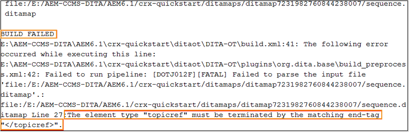

# 基本疑難排解 {#id1821I0Y0G0A}

使用Adobe Experience Manager Guides時，您在發佈或開啟檔案時可能會遇到錯誤。 此類錯誤可能位於DITA map、主題或Experience Manager Guides程式本身中。 本節提供如何存取及剖析輸出產生記錄檔中的資訊。 此外，如果您的DITA主題太大，您可能會檢視JSP編譯錯誤。 本節也提供如何解決JSP編譯錯誤的資訊。

## 檢視並檢查記錄檔 {#id1822G0P0CHS}

執行以下步驟來檢視及檢查輸出產生記錄檔：

1. 啟動輸出產生程式後，在DITA map主控台中選取&#x200B;**輸出**。

   **產生的輸出**&#x200B;的&#x200B;**一般**&#x200B;資料行會顯示圖示，以提供有關輸出產生成功或失敗的視覺提示。

   {width="300" align="left"}

   在上述熒幕擷圖中，第一個和第三個圖示顯示無法產生的輸出。 第二個圖示會顯示成功的輸出產生，但會有訊息。 最後一個是產生輸出成功，沒有訊息。

1. 在工作完成之後，選取&#x200B;**產生於**&#x200B;欄中的連結。

   日誌檔案會在新標籤中開啟。

   {align="left"}

1. 套用下列篩選器以反白標示記錄檔中的文字：
   - 嚴重：以粉紅色反白記錄檔中的嚴重錯誤。
   - 錯誤：以橘色醒目提示記錄檔中的錯誤。
   - 警告：以紫色醒目提示記錄檔中的警告。
   - 資訊：以藍色反白標示記錄檔中的資訊訊息。
   - 例外：以黃色醒目提示記錄檔中的例外。
1. 使用向上和向下導覽按鈕跳至記錄檔案中反白顯示的文字。

   或者，捲動記錄檔並檢查訊息。

## 在文字編輯器中複製並檢查記錄檔

執行以下步驟，在文字編輯器中複製並檢查輸出產生記錄檔：

1. 啟動輸出產生程式後，在DITA map主控台中選取&#x200B;**輸出**。

1. 在工作完成之後，選取&#x200B;**產生於**&#x200B;欄中的連結。

   日誌檔案會在新標籤中開啟。

1. 選取&#x200B;**複製記錄檔**&#x200B;按鈕。 記錄檔會複製到剪貼簿。
1. 開啟文字編輯器，並在編輯器中貼上記錄檔。

1. 捲動記錄檔並檢查訊息。

   下列資訊可協助您判斷DITA檔案或Experience Manager Guides處理序中是否有錯誤：

   - *與DITA map檔案相關的錯誤*：如果在DITA map檔案或DITA map中包含的任何其他檔案中找到錯誤，記錄檔將包含字串「BUILD FAILED」。 您可以檢查記錄檔中提供的資訊，以找出錯誤的檔案並修正問題。

   在以下記錄檔片段範例中，您可以檢視`BUILD FAILED`訊息以及錯誤原因。

   {width="650" align="left"}

   - *Experience Manager Guides相關錯誤*：您可以在記錄檔中識別的其他錯誤型別，與Experience Manager Guides處理序本身相關。 在此情況下，會成功剖析DITA map檔案，但輸出產生程式會因Experience Manager Guides中的某些內部錯誤而失敗。 對於這類錯誤，您必須尋求技術支援團隊的協助。

   在以下記錄檔片段範例中，您可以檢視`BUILD SUCCESSFUL`訊息，接著檢視其他技術錯誤。

   {width="650" align="left"}

## 解決JSP編譯錯誤

如果您的DITA主題太大，則可以在瀏覽器中檢視JSP編譯錯誤\(`org.apache.sling.api.request.TooManyCallsException`\)。 當您開啟主題進行編輯、稽核或發佈時，可能會出現此錯誤。

執行以下步驟以解決此問題：

1. 在「全域導覽」中，選取「工具」，然後選擇「作業」\>「Web主控台」。

   便會顯示「Adobe Experience Manager Web主控台組態」頁面。

1. 搜尋並選取&#x200B;*Apache Sling主要Servlet*&#x200B;元件。

   隨即顯示Apache Sling主要Servlet的可設定選項。

1. 根據您的需求，增加每個請求&#x200B;*引數的*&#x200B;呼叫數值。

**父級主題：**[&#x200B;輸出產生](generate-output.md)
