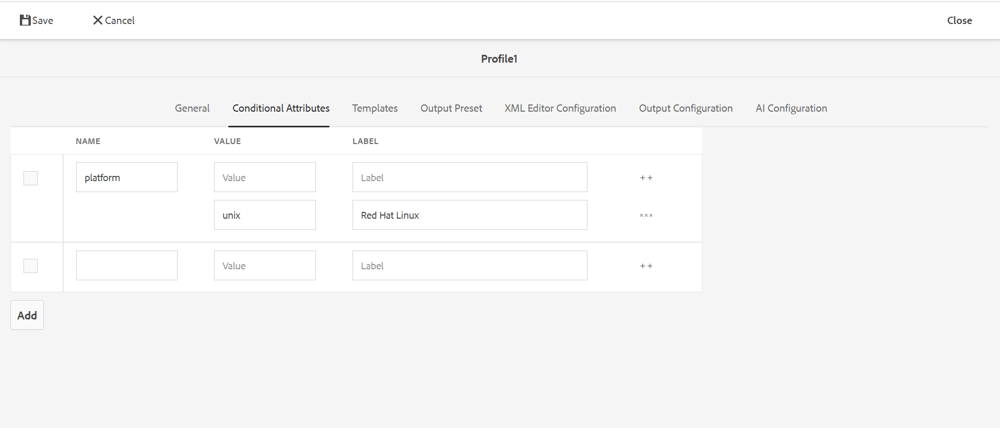

# 條件屬性分析 {#id1843I0HN0Y4}

在企業層級，確保您擁有標準的標籤系統極為重要。 標籤或條件屬性可以與存放庫中的數位資產相關聯，這有助於根據所選條件發佈輸出。 例如，您可以為Windows和Mac內容建立條件屬性。 然後，將這些屬性新增到主題中的相關內容。 發佈內容時，您可以選擇是要發佈Windows內容，還是隻發佈Mac內容。

Adobe Experience Manager Guides可讓您使用相關DITA屬性輕鬆建立及關聯條件屬性。 您可以在全域層級或檔案夾層級定義條件屬性。 全域定義的條件會在所有專案中顯示，而檔案夾特定的條件則只會顯示在指定檔案夾內建立的專案中。 內容作者可以使用這些條件屬性來條件化其DITA主題中的內容，或是他們建立或使用的對映。 然後，發佈者可以使用這些條件來建立條件預設集。 使用條件預設集，發佈者可以決定要在發佈的輸出中包含和排除哪個條件。

>[!NOTE]
>
> 您可以在您有權存取的「資料夾設定檔」中建立或編輯條件屬性。 如果您的系統管理員未授予您資料夾設定檔的存取權，則您無法在「資料夾設定檔」中建立或編輯條件屬性。

若要定義條件屬性，請執行下列步驟：

1. 選取頂端的Adobe Experience Manager標誌，然後選擇&#x200B;**工具**。

1. 在「工具」面板中，選取&#x200B;**參考線**。

1. 選取&#x200B;**資料夾設定檔**&#x200B;圖磚，然後選取資料夾設定檔。

   >[!NOTE]
   >
   > 您無法編輯全域設定檔。

1. 選取&#x200B;**條件屬性**&#x200B;標籤，然後選取&#x200B;**編輯**。

   隨即顯示「條件屬性」表格。

1. 選取「**新增**」。

1. 輸入屬性的&#x200B;**Name**、**Value**&#x200B;和&#x200B;**Label**。

   您可以儲存僅具有屬性名稱的設定檔。 但是，屬性只有在指定了值時才可以使用。 如果您同時指定屬性的 — 值和標籤，網頁編輯器仍只會顯示屬性的值。 標籤會在建立條件式預設集時顯示給發佈管理員。

   下列熒幕擷圖顯示值為`unix`且標籤為`Red Hat Linux`的`platform`屬性的定義。

   {width="800" align="left"}

1. 如果您想要為相同屬性新增更多值，請選取&#x200B;**+**&#x200B;圖示並輸入其他值和標籤。

1. 如果您想要新增更多屬性，請選取&#x200B;**新增**。

1. 選取&#x200B;**儲存**&#x200B;以儲存變更。

`platform`屬性儲存在系統中。 每當作者決定使用資料夾中DITA主題中的`platform`屬性時，他們就能在編輯器的「屬性」標籤中檢視值。

{width="350" align="left"}

**父級主題：**[&#x200B;輸出產生](generate-output.md)
