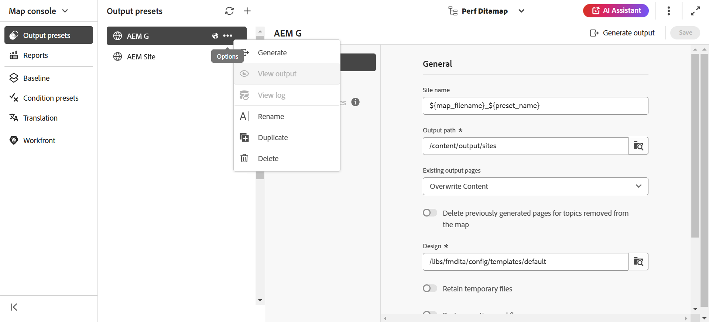
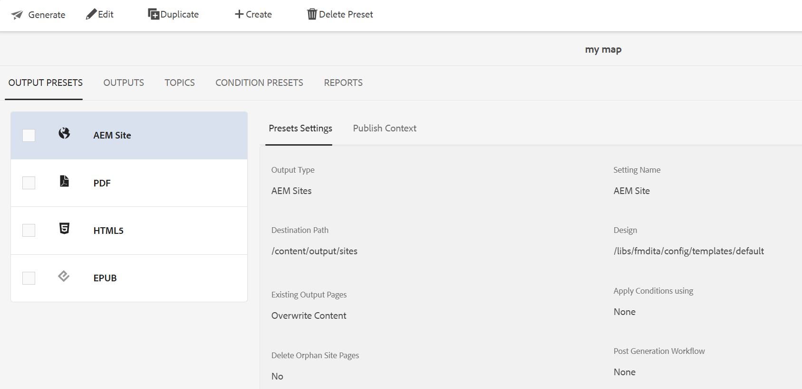

# 編輯、複製或刪除輸出預設集 {#id205BEH0K09Z}

您可以從「地圖」控制檯和「地圖」控制面板管理輸出預設集。 透過這兩種方式，您都能取得編輯、複製和刪除輸出預設集的選項，如下節所述。

## 使用地圖主控台

您可以直接將必要欄位變更為所需的預設集設定，以編輯所選的輸出預設集。

此外，您可以使用&#x200B;**選項**&#x200B;下拉式選單來複製或刪除輸出預設集，如下所示。

{width="800" align="left"}

## 使用地圖儀表板

您可以使用地圖圖示板編輯、複製和刪除輸出預設集，方法是從頂端列選取所需的標籤，如下所示。

{width="800" align="left"}

**父級主題：**[&#x200B;輸出產生](generate-output.md)
