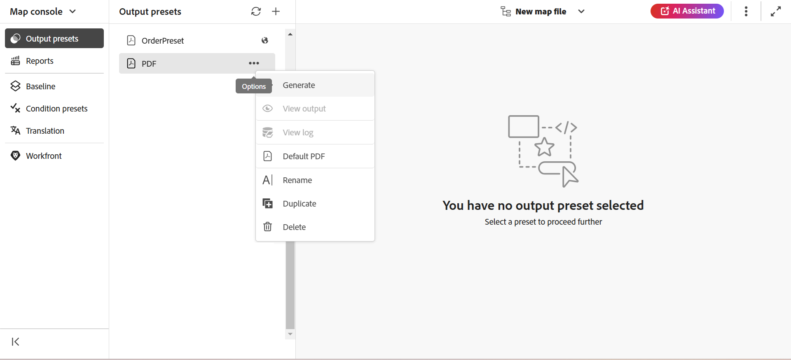

# 產生輸出

有兩種方法可產生DITA map的輸出：

- [從Map主控台產生DITA map的輸出](#generate-output-for-a-dita-map-from-the-map-console)
- [從Map儀表板產生DITA map的輸出](#generate-output-for-a-dita-map-from-the-map-dashboard)

## 從Map主控台產生DITA map的輸出

執行以下步驟，使用Map控制檯產生DITA map的輸出：

1. [在地圖主控台](./open-files-map-console.md)中開啟地圖檔案。
2. 顯示DITA map主控台，其中包含&#x200B;**可用於產生輸出的輸出預設集**&#x200B;清單。

3. 開啟您要用來產生輸出的預設集，然後選取&#x200B;**產生輸出**&#x200B;以開始產生程式。

   

   或者，將滑鼠停留在預設集上，然後從預設內容功能表中選取&#x200B;**產生**。

   

輸出產生完成後，請選取&#x200B;**檢視輸出**&#x200B;以檢視輸出。

畫面的右下角會顯示&#x200B;**Success**&#x200B;對話方塊。

如果輸出不成功，則會顯示以下錯誤訊息。

若要檢視錯誤記錄，請選取&#x200B;**解除**，將游標停留在選取的預設集索引標籤上，然後從預設集內容功能表選取&#x200B;**檢視記錄**。

## 從Map儀表板產生DITA map的輸出

執行以下步驟，使用「對映」圖示板產生DITA map的輸出：

1. 在Assets UI中，導覽至並選取您要發佈的DITA map檔案。

   DITA map主控台會出現，其中列出可用於產生輸出的輸出預設集。

1. 選取要用來產生輸出的一或多個輸出預設集。

   {align="left"}

1. 選取&#x200B;**產生**&#x200B;圖示以啟動輸出產生程式。

您可以在&#x200B;**輸出**&#x200B;索引標籤中檢視輸出產生要求的目前狀態。 如需詳細資訊，請檢視[檢視輸出產生工作的狀態](./generate-output-manage-process.md#view-the-status-of-the-output-generation-task)。

>[!IMPORTANT]
>
> 如果預設集的輸出產生程式在佇列中或進行中，則無法起始相同預設集的另一個輸出產生任務。

您也可以從Map主控台產生一或多個主題或整個DITA map的AEM Sites輸出。 如需詳細資訊，請檢視[產生知識庫輸出](web-editor-article-publishing.md#id218CK0U019I)。

## 使用`chunk`屬性合併DITA map中的不同主題

DITA map可以包含不同的主題型別，例如參照、概念和工作。 `chunk=to-content`屬性可讓您合併這些主題，以在AEM Sites上產生單頁輸出。 不過，若要正確發佈合併的主題，請確保您的管理員已在DITA設定檔中設定正確的XML目錄。

系統需要XML目錄中具有關鍵字`composite`的公用識別碼，才能正確識別並套用適當的DTD規則。
此設定預設會包含在標準XML目錄中。 不過，如果您使用自訂XML目錄，請確定您的管理員已將此公用ID新增至設定。 如果沒有它，合併的主題可能無法正確發佈。

如需如何在自訂DTD/XSD中使用公用ID和系統ID的詳細資訊，請檢視[整合DITA專門化](../cs-install-guide/dita-ot-specialization.md#integrate-dita-specialization-id211mb0e00xa)。

**父級主題：**[&#x200B;輸出產生](generate-output.md)
