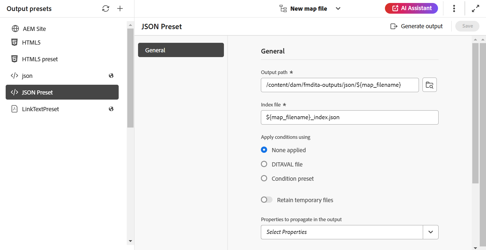

# JSON {#id231KK0180T4}

執行以下步驟，從Map主控台建立JSON預設集：

1. [在Map主控台](./open-files-map-console.md)中開啟DITA map檔案。

   您也可以從[概觀區段](./intro-home-page.md#overview)中的&#x200B;**最近使用的檔案** Widget存取對應檔案。 選取的對映檔案將會在地圖主控台中開啟。
1. 在&#x200B;**輸出預設集**&#x200B;索引標籤中，選取+圖示以建立輸出預設集。
1. 從&#x200B;**新增輸出預設集**&#x200B;對話方塊的「型別」下拉式清單中選取&#x200B;**JSON**。
1. 在&#x200B;**名稱**&#x200B;欄位中，提供此預設集的名稱。
1. 選取&#x200B;**新增至目前的資料夾設定檔**&#x200B;選項，以在目前的資料夾設定檔中建立輸出預設集。 表示資料夾設定檔層級的預設集。

   深入瞭解[管理全域和資料夾設定檔輸出預設集](./web-editor-manage-output-presets.md)。

1. 選取「**新增**」。

   會建立JSON預設集。

   {width="300" align="left"}

建立預設集後，您可以配置以下可在「一般」標籤下使用的預設集配置。

- 輸出路徑
- 索引檔案
- 使用\（如果條件為對映定義\）套用條件
- 使用基準線\（如果為地圖建立了基準線\）
- 保留暫存檔
- 要在輸出中傳播的屬性
- 貼文產生工作流程

如需詳細資訊，請參閱[JSON組態](#json-configuration)。

{width="800" align="left"}

## JSON設定

下列選項適用於JSON預設集：

>[!NOTE]
>
> 您也可以在編輯器中編輯JSON檔案。

| JSON選項 | 描述 |
| --- | --- |
| 輸出路徑 | AEM存放庫內儲存JSON輸出的路徑。 |
| 索引檔案 | 您可以為您為JSON輸出建立的索引檔案命名。 依預設，它會選取DITA map的檔案名稱並新增尾碼（如`map_filename_index.json`）。  您也可以在設定索引檔時使用變數。 如需有關使用變數的詳細資訊，請檢視[使用變數來設定目的地路徑、網站名稱或檔案名稱選項](generate-output-use-variables.md#id18BUG70K05Z)。 |
| 套用條件，使用 | 選取下列其中一個選項：   * **未套用任何專案**：如果您不想在發佈的輸出上套用任何條件，請選取此選項。 * **DITAVAL檔案**：選取DITAVAL檔案以產生個人化內容。 您可以使用瀏覽對話方塊或輸入檔案路徑來選取多個DITAVAL檔案。 使用檔案名稱附近的十字圖示可將其移除。 DITAVAL檔案會依指定的順序評估，因此第一個檔案中指定的條件優先於後續檔案中指定的相符條件。 您可以透過新增或刪除檔案來維持檔案順序。 如果DITAVAL檔案被移動到其他位置或被刪除，它不會自動從對映圖示板中刪除。 您必須更新位置，才能移動或刪除檔案。 您可以將滑鼠停留在檔案名稱上，檢視檔案儲存所在的AEM存放庫中的路徑。 您只能選取DITAVAL檔案，如果您已選取任何其他檔案型別，則會顯示錯誤。 * **條件預設集**：從下拉式清單中選取條件預設集，以在發佈輸出時套用條件。 如果您在DITA map主控台的「條件預設集」標籤中新增條件，則會顯示選項。 若要進一步瞭解條件預設集，請檢視[使用條件預設集](generate-output-use-condition-presets.md#id1825FL004PN)。 |
| 使用基準線 | 如果您已經為選取的DITA map建立基準線，請選取此選項以指定要發佈的版本。  檢視[使用基準線](generate-output-use-baseline-for-publishing.md#id1825FI0J0PF)以取得詳細資料。 |
| 保留暫存檔 | 選取此選項可保留DITA-OT產生的暫存檔案。 如果您在透過DITA-OT產生輸出時發生錯誤，請選取此選項以保留暫存檔案。 然後，您可以使用這些檔案來疑難排解輸出產生錯誤。   產生輸出後，請選取&#x200B;**下載暫存檔** 圖示來下載包含暫存檔的ZIP資料夾。   **注意**：如果在產生期間新增檔案屬性，輸出暫存檔也會包含包含包含這些屬性的&#x200B;*metadata.xml*&#x200B;檔案。 |
| 要在輸出中傳播的屬性 | 選取您要當作中繼資料處理的屬性。 這些屬性是從DITA map或bookmap檔案的「屬性」頁面設定的。 您從下拉式清單中選取的屬性會列在「屬性」欄位下方。  **附註**：您也可以定義自訂屬性，並使用DITA-OT發佈將中繼資料傳遞給輸出。 如需詳細資料檢視，[使用中繼資料](metadata-dita.md#id21BJ00QD0XA)。 |
| 貼文產生工作流程 | 選擇此選項時，會顯示新的「產生後工作流程」下拉式清單，其中包含AEM中設定的所有工作流程。 您必須選取要在輸出產生工作流程完成後執行的工作流程。  **注意**：如需建立自訂輸出後產生工作流程的詳細資訊，請參閱「安裝與設定Adobe Experience Manager Guides as a Cloud Service」指南中的&#x200B;_自訂輸出後產生工作流程_。 |

**父級主題：**[&#x200B;瞭解輸出預設集](generate-output-understand-presets.md)
