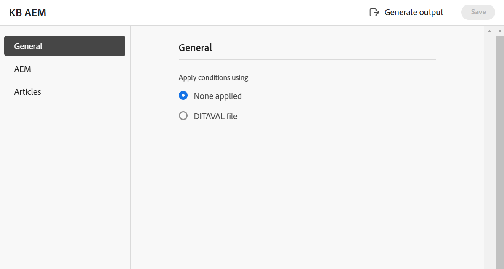

# 知識庫 {#knowledge-base}

執行以下步驟，從Map主控台建立&#x200B;**知識庫**&#x200B;預設集：

1. [在Map主控台](./open-files-map-console.md)中開啟DITA map檔案。

   您也可以從[概觀區段](./intro-home-page.md#overview)中的&#x200B;**最近使用的檔案** Widget存取對應檔案。 選取的對映檔案將會在地圖主控台中開啟。
1. 在&#x200B;**輸出預設集**&#x200B;索引標籤中，選取+圖示以建立輸出預設集。
1. 從&#x200B;**新增輸出預設集**&#x200B;對話方塊的「型別」下拉式清單中選取&#x200B;**知識庫**。
1. 在&#x200B;**目標**&#x200B;欄位中，選取產生輸出的目標。 可用的選項為；**Adobe Experience Manager**、**Salesforce**&#x200B;和&#x200B;**ServiceNow**。

   {width="350" align="left"}

1. 選取&#x200B;**新增至目前的資料夾設定檔**&#x200B;選項，以在目前的資料夾設定檔中建立輸出預設集。 表示資料夾設定檔層級的預設集。

   深入瞭解[管理全域和資料夾設定檔輸出預設集](./web-editor-manage-output-presets.md)。

1. 選取「**新增**」。

   會建立知識庫預設集。

## 知識庫組態{#knowledge-base-configuration}

知識庫預設集組態選項是在&#x200B;**一般**、**文章**&#x200B;和選取的目標(**AEM**/**ServiceNow**/**Salesforce**)標籤下組織。

{width="550" align="left"}

### 一般

**一般**&#x200B;標籤下有以下組態選項：

| 知識庫選項 | 描述 |
| --- | --- |
| 套用條件，使用 | 選取下列其中一個選項：   * **未套用任何專案**：如果您不想在發佈的輸出上套用任何條件，請選取此選項。 * **DITAVAL檔案**：選取DITAVAL檔案以產生個人化內容。 您可以使用瀏覽對話方塊或輸入檔案路徑來選取多個DITAVAL檔案。 使用檔案名稱附近的十字圖示可將其移除。 DITAVAL檔案會依指定的順序評估，因此第一個檔案中指定的條件優先於後續檔案中指定的相符條件。 您可以透過新增或刪除檔案來維持檔案順序。 如果DITAVAL檔案被移動到其他位置或刪除，它不會自動從預設集中刪除。 您必須更新位置，才能移動或刪除檔案。 您可以將滑鼠停留在檔案名稱上，檢視檔案儲存所在的Adobe Experience Manager存放庫中的路徑。 您只能選取DITAVAL檔案，如果您選取任何其他檔案型別，則會顯示錯誤。 * **條件預設集**：從下拉式清單中選取條件預設集，以在發佈輸出時套用條件。 如果您在DITA map主控台的「條件預設集」標籤中新增條件，則會顯示選項。 若要進一步瞭解條件預設集，請檢視[使用條件預設集](generate-output-use-condition-presets.md#id1825FL004PN)。 |
| 使用基準線 | 如果您已經為選取的DITA map建立基準線，請選取此選項以指定要發佈的版本。  檢視[使用基準線](generate-output-use-baseline-for-publishing.md#id1825FI0J0PF)以取得詳細資料。 |
| 貼文產生工作流程 | 選擇此選項時，會顯示新的「產生後工作流程」下拉式清單，其中包含Adobe Experience Manager中設定的所有工作流程。 您必須選取要在輸出產生完成後執行的工作流程。  **注意**：進一步瞭解如何在Cloud Services的安裝與設定指南中[自訂輸出後產生工作流程](../cs-install-guide/customize-workflows.md#id17A6GI004Y4)區段。 |

### 文章

此索引標籤會顯示對映的樹狀結構或階層檢視。 選擇您要發佈至知識庫的主題。 展開TOC節點並選擇要發佈的主題。

### Target - Adobe Experience Manager/ServiceNow/Salesforce

組態選項會根據您選取的目標而變更。

**Adobe Experience Manager**

針對&#x200B;**Adobe Experience Manager**&#x200B;顯示下列設定選項作為目標：

>[!NOTE]
>
>只有在管理員已設定Adobe Experience Manager知識庫預設集時，您才能使用此預設集。

| Adobe Experience Manager選項 | 描述 |
| --- | --- |
| 使用文章路徑 | 選取此選項可檢視包含知識庫範本之資料夾的&#x200B;**文章路徑**。 |
| 文章路徑 | 如果您選取&#x200B;**使用文章路徑**&#x200B;選項，就會顯示此欄位。 瀏覽並選取Adobe Experience Manager存放庫內的知識庫網站，此知識庫網站會儲存輸出。 |
| 網站 | 使用此欄位來選取必要的Adobe Experience Manager知識庫。 您可以在Adobe Experience Manager網站中設定知識庫，以根據許可權儲存內容。 此DITA map中的文章可發佈至這些知識庫。 |
| 類別 | 從下拉式清單中選取類別，即可在Adobe Experience Manager網站上發佈該類別中目錄的主題。 |
| 章節範本和文章範本 | 這些是用來組織輸出內容的結構元件。 這些範本已在Adobe Experience Manager網站範本中預先定義。 |
| 貼文產生工作流程 | 選擇此選項時，會顯示新的「產生後工作流程」下拉式清單，其中包含Adobe Experience Manager中設定的所有工作流程。 您必須選取要在輸出產生工作流程完成後執行的工作流程。 進一步瞭解如何在安裝與設定指南中[自訂輸出後產生工作流程](../install-guide/customize-workflows.md#id17A6GI004Y4)區段。 |

>[!TIP]
> 
>選取&#x200B;**重新整理**&#x200B;圖示，依照您選取的知識庫範本填入欄位中的個別範本。

**ServiceNow**

以下為&#x200B;**ServiceNow**&#x200B;的目標顯示組態選項：

| ServiceNow選項 | 描述 |
| --- | --- |
| 發佈設定檔 | 使用下拉式清單，從管理員設定的ServiceNow連線設定檔中選取。 若要深入瞭解管理員如何建立發佈設定檔，請在[左側面板](./web-editor-features.md#id2051EA0M0HS)區段中檢視&#x200B;**編輯器設定**&#x200B;功能說明。 |
| 知識庫 | 使用此欄位來選取必要的ServiceNow知識庫。 您可以在ServiceNow網站中設定知識庫，以根據許可權儲存內容。 此DITA map中的文章可發佈至這些知識庫。 |
| 類別和子類別 | 類別就像用來尋找及分類ServiceNow知識庫文章的階層樹狀結構。 新增類別和子類別，將目錄的主題和子主題發佈到ServiceNow網站上的該類別和子類別。 |

**Salesforce**

針對&#x200B;**Salesforce**&#x200B;顯示下列設定選項作為目標：

| Salesforce選項 | 描述 |
| --- | --- |
| 發佈設定檔 | 使用下拉式清單，從管理員設定的Salesforce連線設定檔中選取。 若要深入瞭解管理員如何建立發佈設定檔，請在[索引標籤列](./web-editor-features.md#tab-bar)區段中檢視&#x200B;**設定**&#x200B;功能說明。 |
| 記錄型別 | 根據您的使用者設定檔的可見度設定，使用下拉式清單從Salesforce中設定的記錄型別中進行選取。 「Salesforce記錄型別」是將物件多個記錄分為一種型別的方式。 它們定義出版物的組織方式。 例如，您可以選取常見問題集記錄型別，並根據常見問題集頁面版面配置和欄位進行發佈。 |
| 文章內容欄位 | 您可以擁有不同的欄位，並為每個記錄型別範本設定唯一的版面。 使用這些欄位來根據文章型別輸入特定資訊。 例如，您可以檢視常見問題集文章的標題、答案和方程式。 |
| 類別 | 從下拉式清單中選取類別，即可在Salesforce網站上發佈該類別中目錄的主題。 |

**其他選項**

您也可以在Salesforce和ServiceNow預設集中檢視下列選項：

| 選項 | 描述 |
| --- | --- |
| 從文章本文中移除主題標題。 | 選取此選項，從發佈輸出的文章中移除主題標題。 |
| 上傳為草稿 | 選取此選項以上傳主題，將其共用為草稿，然後才可供使用者使用。 |
| 上傳影像 | 如果您要將主題中的任何影像包含在發佈的輸出中，請選取此選項。 |
| 上傳連結的檔案 | 選取此選項可將連結在主題中的檔案包含在已發佈的輸出中。 |

**父級主題：** [瞭解輸出預設集](generate-output-understand-presets.md)
