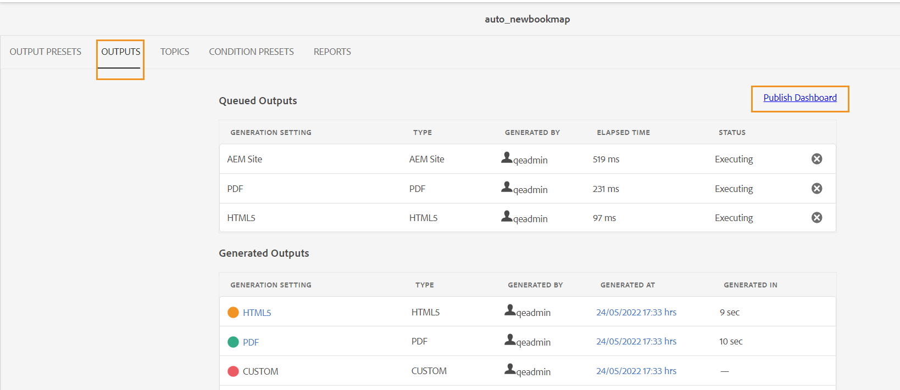

# 管理輸出產生程式

Adobe Experience Manager Guides可讓您對產生的輸出執行下列動作：

- [檢視輸出產生工作的狀態](#view-the-status-of-the-output-generation-task)
- [取消輸出產生任務](#cancel-an-output-generation-task)
- [刪除輸出任務](#delete-an-output-task)

## 檢視輸出產生工作的狀態

當您為地圖啟動輸出產生任務或重新產生所選主題後，Experience Manager Guides會將此任務傳送到輸出產生佇列。 此佇列會即時更新，顯示佇列中每個輸出產生工作的狀態。

1. 在Assets UI中，導覽至並開啟您要檢查輸出產生狀態的對應檔案。

1. 選取&#x200B;**輸出**。

   {width="800" align="left"}

   「輸出」頁面分為兩個部分：

   - **佇列輸出：**

     列出等待產生或正在產生程式中的輸出。 已排入佇列或進行中的工作會在預設集名稱前顯示一個藍色圖示。 您也可以找到用於已排入佇列之任務的輸出產生設定或預設集、型別、啟動任務的使用者、任務已排入佇列後的時間以及目前狀態。

     選取連結以存取&#x200B;**發佈儀表板**&#x200B;並檢視目前執行中的狀態。 發佈儀表板中提供所有作用中發佈任務的清單。 **佇列輸出**&#x200B;和&#x200B;**發佈儀表板**&#x200B;連結只有在輸出正在等待產生或正在產生過程中時才會顯示。 當輸出工作完成時，它們不會出現。如需有關發佈儀表板的詳細資訊，請檢視[使用發佈儀表板管理發布工作](generate-output-publish-dashboard.md#)。

   - **產生的輸出**

     列出已完成的輸出工作。 同樣地，這裡顯示的資訊與佇列輸出區段類似，但有一些差異。 您有輸出結果圖示和輸出產生時間形式的新資訊集。

     在此清單中，您可能會有已成功執行的任務、已使用訊息執行的任務或失敗的任務。 成功的工作會以綠色圖示顯示，包含訊息的工作會以橘色圖示顯示，而失敗的工作會以紅色圖示顯示。

     針對所有工作，發佈程式會建立記錄檔\(logs.txt\)，您可以透過在「產生時間」欄中選取連結來存取該記錄檔。 對於失敗或有訊息的工作，您可以檢查記錄檔，如[檢視一節中所述，並檢查記錄檔](generate-output-basic-troubleshooting.md#id1822G0P0CHS)。

     >[!NOTE]
     >
     > 當您選取所產生PDF輸出的連結時，系統會要求您下載PDF。

## 取消輸出產生任務

Experience Manager Guides可讓發佈者簡單輕鬆地取消任何進行中的發佈工作。 身為發行者，您可以從DITA map主控台或[發佈儀表板](generate-output-publish-dashboard.md#)取消進行中的發佈工作。

執行以下步驟，從DITA map主控台取消輸出產生工作：

1. 在Assets UI中，導覽至並開啟您要取消進行中輸出產生任務的對應檔案。

1. 選取&#x200B;**輸出**。

1. 在&#x200B;**佇列輸出**&#x200B;清單中，將指標暫留在您要取消的工作上。

1. 選取&#x200B;**取消此工作**&#x200B;圖示。

   {width="800" align="left"}

1. 在&#x200B;**確認取消**&#x200B;訊息提示上選取&#x200B;**是**。

   {width="800" align="left"}

   如果工作尚未開始，則會對工作執行取消命令。 對於正在取消的工作，「狀態」會設為「正在取消」。

   工作成功取消後，就會移至狀態為&#x200B;**已取消**&#x200B;的&#x200B;**產生的輸出**&#x200B;清單。 當您將滑鼠停留在已取消的任務上時，它會顯示已取消任務的使用者名稱。 在下列熒幕擷圖中，*HTML5*&#x200B;工作已取消。

   {width="800" align="left"}

## 刪除輸出任務

當您為DITA map產生多個輸出時，在一段時間內，此類map的已產生輸出清單會變得很長。 作為發行者，您可以從&#x200B;*產生的輸出*&#x200B;清單中移除過時的工作，以清除任何對應檔案的輸出歷史記錄。 請注意，不會從系統移除輸出，只會從&#x200B;*產生的輸出*&#x200B;清單移除產生的輸出專案。

執行以下步驟，從「產生的輸出」清單中移除輸出工作：

1. 在Assets UI中，導覽至並開啟您要刪除工作的對應檔案。

1. 選取&#x200B;**輸出**。

1. 在&#x200B;**產生的輸出**&#x200B;清單中，將指標暫留在您要刪除的工作上。

1. 選取刪除圖示。

   {width="800" align="left"}

1. 在&#x200B;**確認刪除**&#x200B;訊息提示上選取&#x200B;**是**。

   任務會從「產生的輸出」清單中刪除。

