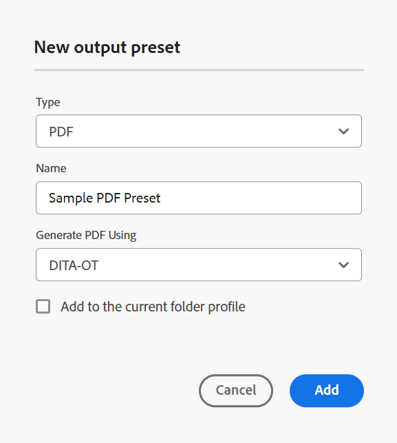
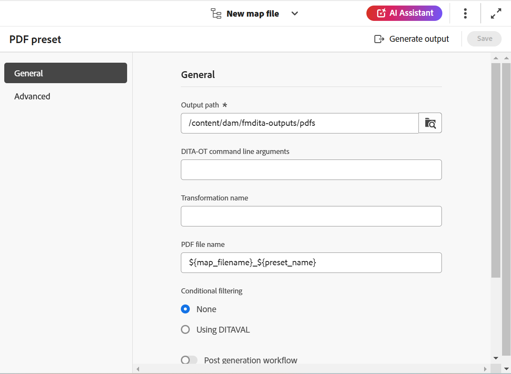

# 建立DITA-OT PDF輸出預設集 {#id205BE600HAH}

您可以使用兩種方式建立DITA-OT PDF輸出預設集：

- [從「對映」主控台建立DITA-OT PDF預設集](#create-the-dita-ot-pdf-preset-from-the-map-console)
- [從「對映」控制面板建立DITA-OT PDF預設集](#create-the-dita-ot-pdf-preset-from-the-map-dashboard)

## 從「對映」主控台建立DITA-OT PDF預設集

執行以下步驟，從「地圖」主控台建立PDF預設集：

1. [在Map主控台](./open-files-map-console.md)中開啟DITA map檔案。

   您也可以從[概觀區段](./intro-home-page.md#overview)中的&#x200B;**最近使用的檔案** Widget存取對應檔案。 選取的對映檔案將會在地圖主控台中開啟。
1. 在&#x200B;**輸出預設集**&#x200B;索引標籤中，選取+圖示以建立輸出預設集。
1. 從&#x200B;**新增輸出預設集**&#x200B;對話方塊的「型別」下拉式清單中選取&#x200B;**PDF**。
1. 在&#x200B;**名稱**&#x200B;欄位中，提供此預設集的名稱。
1. 在&#x200B;**使用**&#x200B;產生PDF欄位中，選取&#x200B;**DITA-OT**。
1. 選取&#x200B;**新增至目前的資料夾設定檔**&#x200B;選項，以在目前的資料夾設定檔中建立輸出預設集。 表示資料夾設定檔層級的預設集。

   深入瞭解[管理全域和資料夾設定檔輸出預設集](./web-editor-manage-output-presets.md)。

1. 選取「**新增**」。

   隨即建立PDF的預設集。

   {width="350" align="left"}

在地圖主控台中，DITA-OT的預設集組態選項會整理在地圖主控台的&#x200B;**一般**&#x200B;和&#x200B;**進階**&#x200B;標籤下。

{width="350" align="left"}

**一般**

**一般**&#x200B;索引標籤包含下列組態選項：

- 輸出路徑
- DITA-OT命令列引數
- PDF檔案名稱
- 條件式篩選\（如果條件已定義對應\）
- 使用基準線\（如果為地圖建立了基準線\）
- 貼文產生工作流程

**進階**

**進階**&#x200B;索引標籤包含下列組態選項：

- 啟用版本設定
- 保留暫存檔
- 檔案屬性

有關預設集組態選項的詳細資訊，請參閱[PDF預設集組態](#pdf-preset-configuration)區段。

## 從「對映」控制面板建立DITA-OT PDF預設集

執行以下步驟，從地圖控制面板建立PDF預設集：

1. 在Assets UI中，導覽至並選取DITA map，以在地圖控制面板中開啟它。
1. 請確定已選取&#x200B;**輸出預設集**&#x200B;索引標籤。
1. 在工具列中選取&#x200B;**建立**。

   隨即顯示新的輸出預設集建立表單。

1. 輸入PDF預設集所需的設定詳細資料。
1. 選取&#x200B;**完成**&#x200B;以儲存預設集設定。

## PDF預設集設定

視您是從「地圖」控制檯還是「地圖」儀表板設定預設集而定，設定選項會稍有不同。 有些選項僅適用於「地圖」儀表板，有些選項則同時適用於兩者。

如果相同組態有兩個不同的欄位標籤，則下表中會以&#x200B;**/**&#x200B;分隔。 第一個代表「地圖」主控台中的標籤，第二個代表「地圖」控制面板中的標籤。

例如，**輸出路徑/目的地路徑** — 這裡，**輸出路徑**&#x200B;是地圖主控台中使用的標籤，而&#x200B;**目的地路徑**&#x200B;是相同組態在地圖儀表板中使用的標籤。

| PDF選項 | 描述 |
| --- | --- |
| 輸出型別（*僅適用於Map儀表板*） | 您要產生的輸出型別。 若要產生PDF輸出，請選擇PDF選項。 |
| 設定名稱（*僅適用於Map儀表板*） | 為您正在建立的PDF輸出設定提供描述性名稱。 例如，您可以指定&#x200B;_內部客戶輸出_&#x200B;或&#x200B;_一般使用者輸出_。 |
| 使用產生PDF （*僅適用於地圖儀表板*） | 選取&#x200B;**DITA-OT**&#x200B;以產生PDF輸出。 如果您的管理員已設定此選項，請選取&#x200B;**FrameMaker Publishing Server**。 選取FMPS時，某些組態選項會有所不同。 此外，FMPS組態選項僅適用於Map儀表板。 |
| 輸出路徑/目的地路徑 | AEM存放庫內儲存PDF的路徑。  您也可以在設定目的地路徑時使用變數。 如需有關使用變數的詳細資訊，請檢視[使用變數來設定目的地路徑、網站名稱或檔案名稱選項](generate-output-use-variables.md#id18BUG70K05Z)。 |
| DITA-OT命令列引數 | 指定在產生輸出時要DITA-OT處理的其他引數。 如需有關DITA-OT支援的命令列引數的詳細資訊，請檢視[DITA-OT檔案](https://www.dita-ot.org/)。 |
| 轉換名稱 | 指定您要產生的輸出型別。 如果您想要使用自己的自訂外掛程式產生輸出（已整合在DITA-OT外掛程式中），則需要此專案。 例如，如果您要產生XHTML輸出，請指定`xhtml`。 如需DITA-OT中可用的轉換清單，請在OASIS DITA-OT使用手冊中檢視[DITA-OT轉換（輸出格式）](http://www.dita-ot.org/2.3/user-guide/AvailableTransforms.html)。 |
| PDF檔案名稱/檔案名稱 | 指定您要用來儲存PDF的檔案名稱。  您也可以在設定PDF檔案名稱時使用變數。 如需有關使用變數的詳細資訊，請檢視[使用變數來設定目的地路徑、網站名稱或檔案名稱選項](generate-output-use-variables.md#id18BUG70K05Z)。  **注意**：如果您未提供檔案名稱，則會使用DITA map的標題來產生最終PDF的檔案名稱。 如果地圖沒有標題，則會使用DITA map的檔案名稱來命名最終的PDF。 系統會使用系統中設定的規則來清除檔案名稱，以處理任何無效字元。 |
| 條件式篩選/套用條件，使用 | 選取下列其中一個選項：   * **未套用任何專案**：如果您不想在發佈的輸出上套用任何條件，請選取此選項。 * **DITAVal檔案**：選取DITAVal檔案以產生個人化內容。 您可以使用瀏覽對話方塊或輸入檔案路徑來選取多個DITAVal檔案。 使用檔案名稱附近的十字圖示可將其移除。 DITAVal檔案會依指定的順序計算，因此第一個檔案中指定的條件優先於後續檔案中指定的相符條件。 您可以透過新增或刪除檔案來維持檔案順序。 如果DITAVal檔案被移動到其他位置或被刪除，它不會自動從對映圖示板中刪除。 您必須更新位置，才能移動或刪除檔案。 您可以將滑鼠停留在檔案名稱上，檢視檔案儲存所在的AEM存放庫中的路徑。 您只能選取DITAVal檔案，如果您已選取任何其他檔案型別，則會顯示錯誤。 FrameMaker Publishing Server不支援多個DITAVAL檔案。 * **條件預設集**：從下拉式清單中選取條件預設集，以在發佈輸出時套用條件。 如果您在DITA map主控台的「條件預設集」標籤中新增條件，則會顯示選項。 若要進一步瞭解條件預設集，請檢視[使用條件預設集](generate-output-use-condition-presets.md#id1825FL004PN)。 |
| 執行後期產生工作流程 | 選擇此選項時，會顯示新的「產生後工作流程」下拉式清單，其中包含AEM中設定的所有工作流程。 您必須選取要在輸出產生工作流程完成後執行的工作流程。  **注意**：如需建立自訂輸出後產生工作流程的詳細資訊，請在[安裝與設定Adobe Experience Manager Guides as a Cloud Service]中檢視[自訂輸出後產生工作流程]。 |
| 使用基準線 | 如果您已經為選取的DITA map建立基準線，請選取此選項以指定要發佈的版本。  檢視[使用基準線](generate-output-use-baseline-for-publishing.md#id1825FI0J0PF)以取得詳細資料。 |
| 保留暫存檔 | 選取此選項可保留DITA-OT產生的暫存檔案。 如果您在透過DITA-OT產生輸出時發生錯誤，請選取此選項以保留暫存檔案。 然後，您可以使用這些檔案來疑難排解輸出產生錯誤。   產生輸出後，請選取&#x200B;**下載暫存檔** 圖示來下載包含暫存檔的ZIP資料夾。   **注意**：如果在產生期間新增檔案屬性，輸出暫存檔也會包含包含包含這些屬性的&#x200B;*metadata.xml*&#x200B;檔案。 |
| 檔案屬性 | 選取您要當作中繼資料處理的屬性。 這些屬性是從DITA map或bookmap檔案的「屬性」頁面設定的。 您從下拉式清單中選取的屬性會顯示在&#x200B;**檔案屬性**&#x200B;欄位下。 選取屬性旁的十字圖示以將其移除。   注意：您也可以使用DITA-OT發行將中繼資料傳遞至輸出。 如需詳細資料檢視，請[使用DITA-OT](pass-metadata-dita-ot.md#id21BJ00QD0XA)將中繼資料傳遞至輸出。 |

**父級主題：**[&#x200B;瞭解輸出預設集](generate-output-understand-presets.md)
