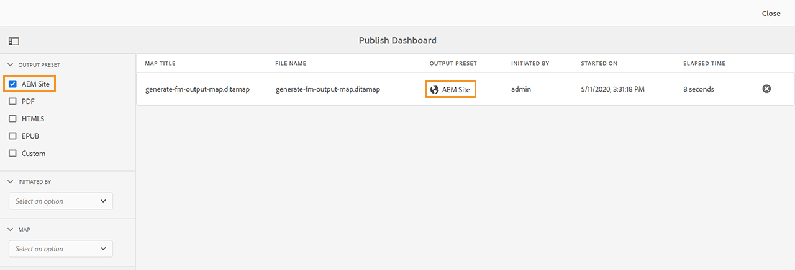

# 使用發佈儀表板管理發布任務 {#id205CC08305Z}

當您在系統上執行大量發佈作業時，幾乎不可能個別檢查每個DITA map以監視其發佈作業。 Adobe Experience Manager Guides可讓管理員和發佈者統一檢視系統中執行的所有發佈任務。 發佈儀表板中提供所有作用中發佈任務的清單。

「發佈」儀表板提供系統中目前執行的所有發佈任務的完整總覽。

{align="left"}

發佈儀表板包含下列詳細資訊：

- **對應標題** — 目前發佈或發佈佇列中的對應檔標題。

- **檔案名稱** - DITA map的檔案名稱。

- **輸出預設集** — 用來產生輸出的輸出預設集名稱。

- **啟動者** — 啟動發佈工作之使用者的使用者名稱。

- **開始日期** — 發佈工作開始日期和時間。

- **經過時間** — 從發佈作業在系統中執行以來的時間。

- **刪除圖示** — 取消或終止發佈工作。

發佈控制面板中的左側面板提供下列篩選選項：

- **輸出預設集** — 選取一或多個要檢視目前作用中發佈工作的輸出預設集。 在下列熒幕擷圖中，發佈工作經篩選，僅顯示使用AEM網站輸出預設集的工作：

  {align="left"}

- **起始者** — 從清單中選取使用者名稱，以顯示所選使用者起始的發佈工作。

- **對應** — 從清單中選取對應檔案，以顯示針對所選對應執行的發佈工作。

## 存取發佈控制面板

您可以直接從[Experience Manager Guides首頁](./intro-home-page.md)存取&#x200B;**發佈儀表板**。 開啟首頁，然後從左面板選取&#x200B;**發佈佇列**&#x200B;選項。

>[!NOTE]
>
> 只有管理員或發佈者可以存取發佈儀表板。

您也可以從Adobe Experience Manager **工具**&#x200B;頁面存取&#x200B;**發佈儀表板**。 若要使用此方法，請執行下列步驟：

1. 選取頂端的Adobe Experience Manager標誌，然後選取&#x200B;**工具**。

1. 從工具清單中選取&#x200B;**指南**。

1. 選取&#x200B;**發佈儀表板**&#x200B;圖磚。

   「發佈儀表板」會開啟，其中包含系統中所有作用中發佈任務的清單。

   如果您選取「檔案名稱」連結，則會顯示所選對映的DITA map儀表板。

   {align="left"}

>[!NOTE]
>
> 您也可以在從地圖儀表板產生輸出時，從&#x200B;**輸出**&#x200B;標籤存取發佈儀表板。 如需詳細資訊，請參閱[檢視輸出產生工作的狀態](generate-output-for-a-dita-map.md#viewing_output_history)。

## 取消發佈工作

執行以下步驟，取消發佈控制面板的輸出產生工作：

1. [存取發佈儀表板](#access-the-publish-dashboard)。

1. 從作用中的發佈工作清單中，選取您要取消之工作的刪除圖示。

   {align="left"}

1. 在&#x200B;**確認取消**&#x200B;訊息提示上選取&#x200B;**是**。

   只要工作保持作用中，就會接受取消指令，並嘗試取消。 工作一旦成功終止，就會從目前使用中的工作清單中移除工作。 任務狀態也會在DITA map儀表板中更新為「已取消」。 在下列熒幕擷圖中，*HTML5*&#x200B;任務已從發佈儀表板取消，其狀態也會在DITA map儀表板中變更。

   {align="left"}

**父級主題：**&#x200B;[&#x200B;輸出產生](generate-output.md)
