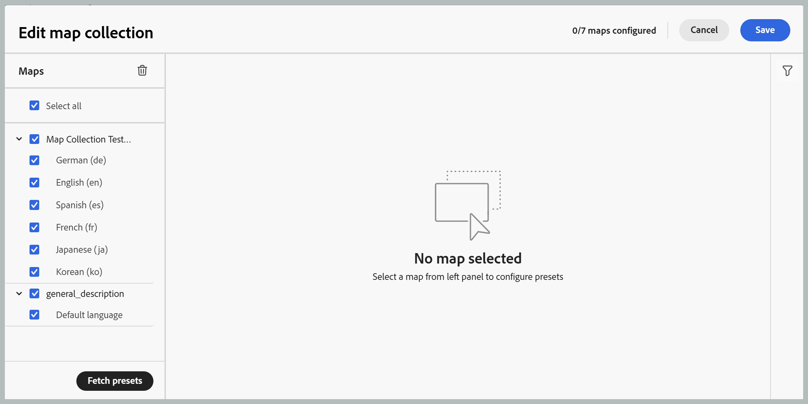
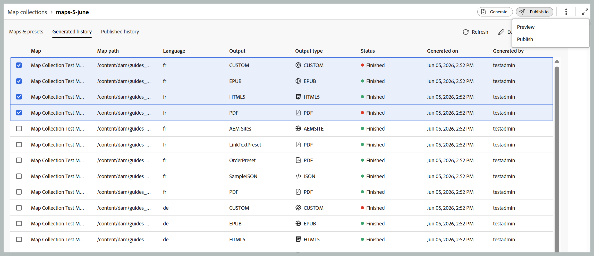

# 使用新的對應集合來產生輸出(Beta)

>[!IMPORTANT]
>
> Experience Manager Guides as a Cloud Service自2026.06.0版開始提供新的地圖集合。 請聯絡您的客戶成功團隊以啟用此功能。

Adobe Experience Manager Guides中的地圖集合可讓發佈專家將多個檔案整理到單一集合中、控制為每個檔案產生的輸出，以及從集中式儀表板有效率地批次產生和發佈輸出。 它還提供輸出產生進度的可見度，醒目提示自地圖上次發佈輸出以來所做的變更，並允許您在需要時重新發佈內容。

新的地圖集合合併了先前在舊地圖集合中散佈的功能，以及大量發佈到單一統一介面中的功能。 啟用後，您可以從一個位置管理地圖、預設集、層代歷史記錄、發佈歷史記錄、中繼資料和系列成員資格。

## 建立地圖集合併新增DITA地圖

若要建立地圖集合併將地圖新增至其中，請執行下列步驟：

1. 開啟Experience Manager Guides首頁並選取&#x200B;**新的地圖集合**。

   **對應集合**&#x200B;頁面隨即開啟。

   {width="650"}

1. 在&#x200B;**地圖集合**&#x200B;頁面上，選取右上方的&#x200B;**建立**，並為您的新地圖集合提供&#x200B;**名稱**。

   {width="350"}

1. 選擇 **建立**。

   成功訊息會在建立地圖集合時顯示。

1. 開啟您要新增地圖的所需地圖集合。

   

   當游標停留在地圖集合標題上時，您可以執行下列動作：

   - **產生歷程記錄**：將您直接導覽至[產生的歷程記錄]索引標籤，其中列出所有具有已定義預設集之產生輸出的對映。
   - **發佈歷程記錄**：直接導覽至[已發佈歷程記錄]索引標籤，列出已定義預設集之所有具有已發佈輸出的對映。
   - **重新命名**：重新命名地圖集合。

1. 選取&#x200B;**編輯集合**，然後選取&#x200B;**新增地圖**。

   

1. 選取所要的地圖並啟用&#x200B;**選取可用的翻譯**&#x200B;切換功能，以自動將該地圖的所有可用翻譯復本新增至地圖集合。 如果地圖沒有任何翻譯副本，則會將預設語言新增到地圖。

   

1. 選取「**新增**」。

   會列出對應檔案及其所有可用的轉譯副本。 對於沒有任何翻譯副本的地圖，會顯示預設語言。

   

1. 選取必要的對映，或所有列出的對映，然後選取&#x200B;**擷取預設集**&#x200B;按鈕，以擷取所選對映的可用預設集。

   您會看到選取之地圖的所有可用預設集清單，這些預設集分為兩個類別： **資料夾設定檔預設集**&#x200B;和&#x200B;**其他預設集**。 **資料夾設定檔預設集**&#x200B;對所有選取的地圖都是通用的，而&#x200B;**其他預設集**&#x200B;則為個別的地圖專用。 對於&#x200B;**其他預設集**&#x200B;下的預設集，對應的切換旁邊會顯示關聯的對應。

   

1. 視您的需求選取&#x200B;**啟用所有預設集**&#x200B;或&#x200B;**啟用所有資料夾設定檔預設集**。 您也可以使用右側的篩選圖示來縮小清單。 篩選器提供兩個篩選層級：**預設集型別**&#x200B;可縮小列出的預設集，而&#x200B;**地圖狀態**&#x200B;可從「地圖」面板選擇任何特定地圖。

   

1. 選取「**儲存**」。

您會取得所有所需地圖的清單，其中包括地圖示題、對應的檔案名稱、可用語言，以及已設定的預設集。

**地圖與預設集**&#x200B;索引標籤會根據下列欄位中特定語言的選定地圖顯示資訊：

- **預設集**：顯示在地圖檔案上設定的輸出預設集型別。
- **基準**：顯示輸出預設集所使用的基準。  如果未使用基準線，則會顯示連字型大小`-`。
- **自產生**&#x200B;以來已修改：表示是否會在產生後更新DITA map。 根據此資訊，您可以決定是否要發佈此DITA map的輸出。
- **自發佈後已修改**：指出是否在上次發佈後更新DITA map。 根據此資訊，您可以決定是否要重新發佈此DITA map的輸出。
- **上次產生時間**：顯示上次產生輸出的日期和時間。
- **上次發佈日期**：顯示上次發佈輸出的日期和時間。

**篩選選項**

以下是「地圖」和「預設集」頁面右側面板中的篩選選項：

- **自產生**&#x200B;後已修改：您可以選取[是]、[否]或[尚未產生]。 如果您選取「是」，則只有產生後修改過的對映才會顯示在「對映和預設集」標籤中。
- **發佈後已修改**：您可以選取[是]、[否]或[尚未產生]。 如果選取「是」，則只有發佈後修改過的地圖才會顯示在「地圖和預設集」標籤中。
- **預設集**：選取您要篩選掉對應檔案的預設集。 例如，如果您選擇&#x200B;*AEM網站*&#x200B;預設集，則只會顯示設定了&#x200B;*AEM網站*&#x200B;輸出預設集的地圖。
- **語言**：您可以選取任何可用的語言代碼，並在[地圖和預設集]索引標籤中僅顯示選取的語言。

  地圖和預設集索引標籤中的

## 使用地圖集合產生輸出

若要使用「對映收集」產生輸出，請執行下列步驟：

1. 開啟地圖集合。 您可以根據設定檢視各種輸出預設集，例如AEM Sites、PDF （包括原生PDF）、HTML5、EPUB和自訂預設集。

1. 若要產生選取對映的輸出，請選取必要的對映檔案和特定的預設集，然後選取&#x200B;**產生**。

   >[!IMPORTANT]
   >
   > 如果預設集或DITA map的輸出產生程式在佇列中或進行中，則無法針對相同的預設集或地圖啟動另一個輸出產生任務。

1. 產生輸出後，請瀏覽至&#x200B;**產生的歷程記錄**&#x200B;標籤，以檢視所有產生的對映清單。 您可以在&#x200B;**Status**&#x200B;資料行中追蹤產生進度，以指出產生正在執行還是已完成。

   

1. 選取&#x200B;**重新整理**&#x200B;以檢視產生程式的最新狀態。 「狀態」欄會更新，以反映每個對映及其相關預設集的目前狀態：

   - **已完成（綠色）**：已成功完成產生。
   - **已完成（紅色）**：產生已完成但發生錯誤。 您可以在記錄檔中檢視錯誤詳細資料。
   - **正在執行（藍色）**：產生目前正在進行中。

   

1. 您也可以選取&#x200B;**取消產生**&#x200B;圖示，取消輸出產生工作，直到工作狀態為正在執行為止。

   

1. 此外，您可以選取將游標停留在地圖名稱上時顯示的&#x200B;**開啟輸出**&#x200B;圖示，來檢視其輸出產生已完成的地圖的產生輸出，或選取相鄰的&#x200B;**記錄檔**&#x200B;圖示來檢視產生記錄檔。

   

## 使用對應集合發佈輸出

若要使用Map Collection發佈（如果已設定）輸出，請執行下列步驟：

1. 從&#x200B;**地圖和預設集**&#x200B;標籤或&#x200B;**產生的歷程記錄**&#x200B;標籤中選取所需的地圖，然後選取&#x200B;**發佈至**。
1. 選取您要發佈輸出的目標環境： **預覽**&#x200B;或&#x200B;**發佈**&#x200B;執行個體。

   

1. 切換至&#x200B;**已發佈的歷程記錄**&#x200B;標籤，以監視發佈工作的狀態。

   

1. 選取&#x200B;**重新整理**&#x200B;以檢視工作的最新狀態。
1. 一旦狀態變更為&#x200B;**成功**，請驗證所選目標執行個體中的已發佈內容。

## 設定中繼資料屬性

在地圖集合中，您可以大量設定DITA map的中繼資料屬性。 從&#x200B;**地圖和預設集**&#x200B;索引標籤中選取&#x200B;**設定中繼資料**&#x200B;圖示以開啟&#x200B;**資產中繼資料**&#x200B;頁面。 在&#x200B;**資產中繼資料**&#x200B;頁面上，收藏集中出現的所有地圖都會列在左側。

執行以下步驟來設定中繼資料屬性：

1. 您可以選擇要更新中繼資料的地圖。 依預設，會選取所有出現的DITA map。

1. 選取DITA map後，您可以檢視屬性，例如中繼資料、排程（停用）啟動、參照、檔案狀態等。

1. 更新中繼資料屬性。

1. 在上方選取「**儲存並關閉**」以儲存更新。
1. （選擇性）更新標籤時，您也可以在&#x200B;**儲存並關閉**&#x200B;下拉式清單中選取「附加」，將新標籤附加至現有清單。
1. 從&#x200B;**儲存並關閉**&#x200B;下拉式清單中選取&#x200B;**提交**。
您會針對從對應集合中選取的DITA map大量更新中繼資料屬性。

>[!NOTE]
> 
>在&#x200B;**檔案狀態**&#x200B;下拉式清單中，您只能選取所有選定DITA map都允許的檔案狀態。 若要深入瞭解，請檢視&#x200B;[**檔案狀態**](./web-editor-document-states.md)。

中繼資料屬性與檔案屬性同步。 更新後，您就可以從編輯器的&#x200B;**檔案屬性**&#x200B;面板中檢視這些檔案。

**父級主題：**&#x200B;[&#x200B;輸出產生](generate-output.md)
