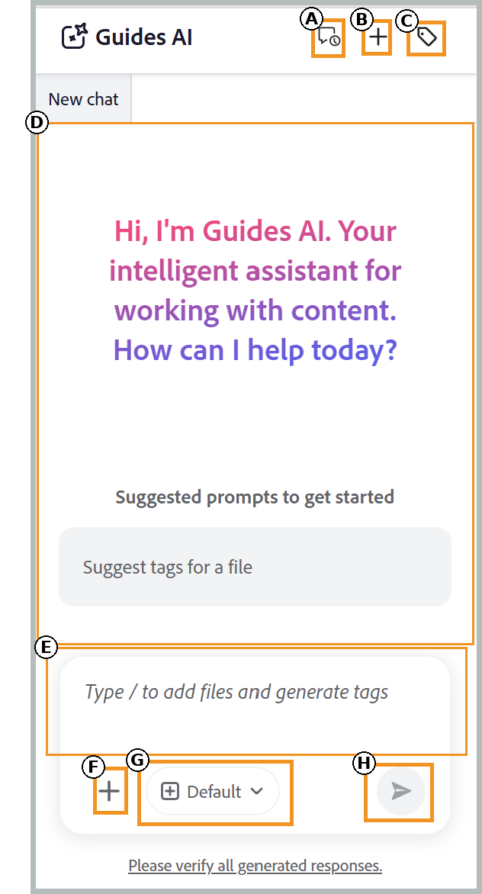
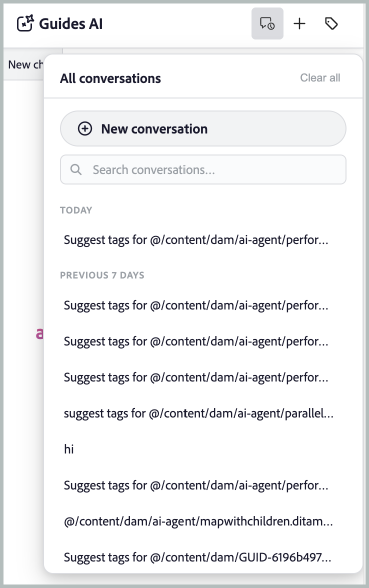
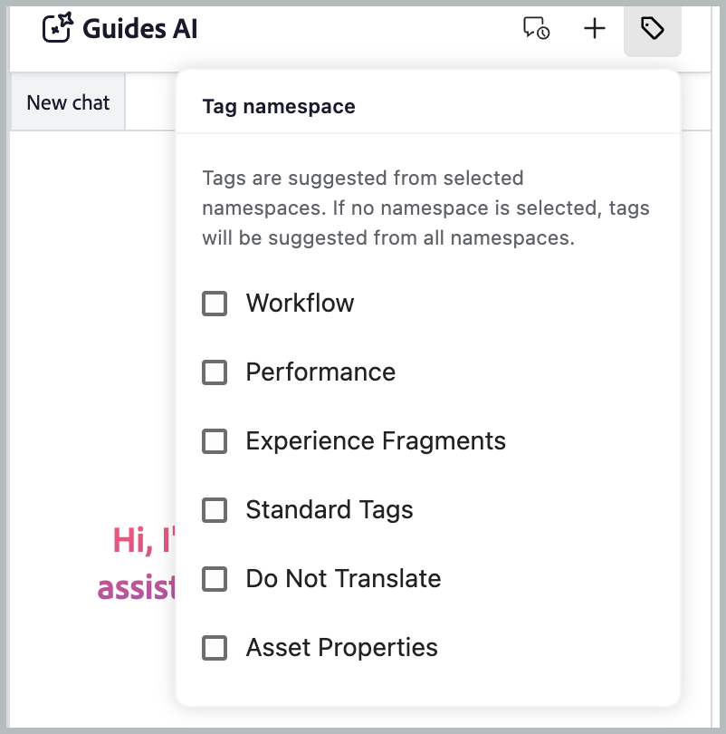
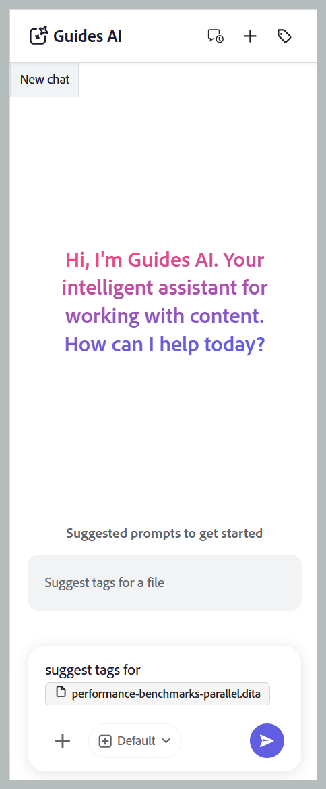
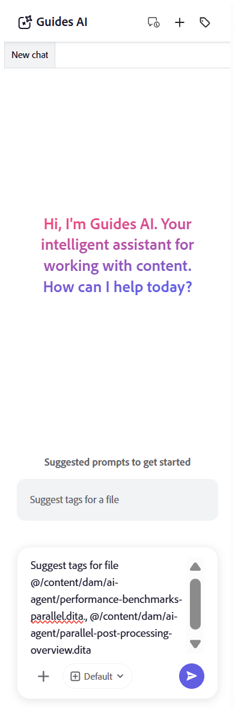
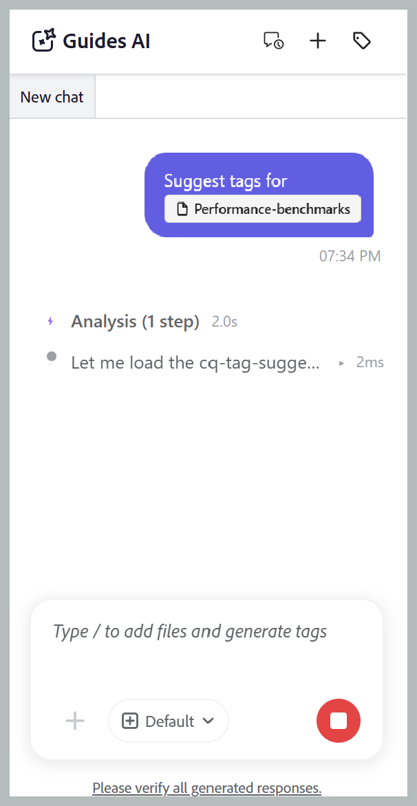
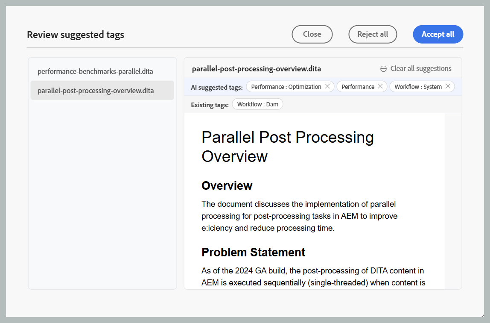
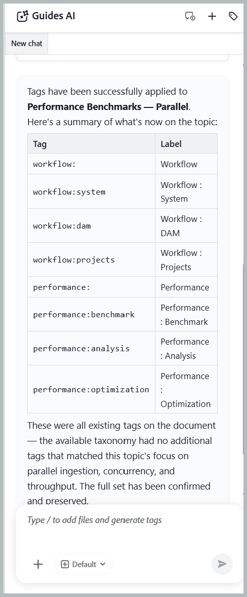

# 開始使用Guides AI

>[!NOTE]
>
> 自2026.08.0版開始，Experience Manager Guides as a Cloud Service中提供Guides AI。 請聯絡您的客戶成功團隊以啟用此功能。

Guides AI可讓您更快、更輕鬆、更一致地標籤內容。 使用Adobe CX Enterprise Co-worker的代理式智慧標籤技能，Guides AI會根據您組織的分類法分析您的內容並建議相關標籤，而非您手動閱讀內容以決定套用哪些標籤。 您可以透過檢視建議的標籤並在確認選擇之前選擇套用或拒絕這些標籤來保持控制，大幅減少手動操作，改善標籤準確性，並確保檔案中中繼資料一致。

## Guides AI面板

Guides AI面板提供您產生、檢閱和套用AI建議標籤所需的所有工具。

{width="650"}

Guides AI的下列元件可協助您新增檔案、設定標籤建議及管理智慧標籤工作流程：

- **(A)**&#x200B;交談記錄：檢視並重新開啟先前的交談，以檢視先前的標籤建議和動作。

  {width="350"}

- **(B)**&#x200B;新交談：針對不同的主題、地圖或檔案集，啟動新的標籤工作階段。
- **(C)**&#x200B;標籤名稱空間：選取Guides AI應從中產生標籤建議的分類名稱空間。 只會考慮來自所選名稱空間的標籤。

  {width="350"}

- **(D)**&#x200B;回應空間：檢閱AI產生的標籤建議，並選擇在套用標籤之前接受、拒絕或修改這些建議。
- **(E)**&#x200B;提示空間：輸入提示要求，以便為選取的內容產生標籤建議。
- **(F)**&#x200B;附加檔案或新增內容：從您的本機系統新增主題、地圖或外部檔案，以提供Guides AI應分析以取得標籤建議的內容。
- **(G)**&#x200B;模型：顯示用來分析內容及產生標籤建議的AI模型。 有多個OpenAI和Anthropic Claude模型可供選擇。 依預設，已選取&#x200B;**使用資訊清單預設值**&#x200B;選項，該選項使用為選取的助理設定的模型。
- **(H)**&#x200B;傳送：提交您的提示和附加內容，以產生AI支援的標籤建議。

## 使用智慧標籤技能將標籤套用至單一或多個主題

執行以下步驟，使用Guides AI將標籤套用至具有智慧標籤技能的單一或多個主題：

1. 登入Experience Manager Guides。
1. 在首頁上，從導覽列選取&#x200B;**Guides AI**。 請確定您的管理員已啟用Guides AI功能。
1. 使用下列其中一種方法，新增您要為其產生標籤建議的主題：

   - **使用建議的提示**：對於回應區域中的第一個聊天，請選取&#x200B;**檔案提示的建議標籤**。 提示會自動新增至提示空間。 選取`[file]`，然後從&#x200B;**選取檔案**&#x200B;對話方塊中的儲存庫或集合中選擇主題。 您可以從&#x200B;**選取檔案**&#x200B;對話方塊中選取一個主題。

     {width="650"}

   - **使用捷徑**：在提示欄位中輸入`/`，然後選擇&#x200B;**新增存放庫參考**&#x200B;以從存放庫選擇主題（或&#x200B;**從裝置新增檔案**&#x200B;以從您的電腦上傳主題），並輸入建議的提示&#x200B;*為檔案建議標籤*。

   - **拖放**：將單一主題或多個主題拖放至提示空間，然後輸入提示&#x200B;*檔案的建議標籤*。

     {width="650"}

   - **指定主題路徑**：針對相同或不同對映的多個主題，輸入`@`，後面接逗號分隔的路徑，然後輸入提示：*檔案的建議標籤*。

     {width="650"}

1. 選取&#x200B;**傳送**。

1. Guides AI會分析主題內容並產生標籤建議。

   {width="650"}

1. 檢閱建議的標籤，如下所示：

   >[!NOTE]
   >
   > 對於已包含標籤的主題，Guides AI會顯示現有的標籤。 這些標籤是唯讀的，無法修改或移除。

   - 若是單一主題，您只需&#x200B;**接受**&#x200B;要套用的建議，或是&#x200B;**拒絕**&#x200B;不需要的建議。

     {width="650"}

   - 若為多個主題：
     1. 選取&#x200B;**預覽**&#x200B;以檢閱AI產生的標籤建議。

        {width="650"}

     1. 檢閱每個主題的建議標籤，然後選擇下列其中一個動作：
        - **全部接受**&#x200B;以套用所有主題的所有建議標籤。
        - **拒絕所有**&#x200B;以捨棄所有主題的所有建議標籤。
        - **清除所有建議**&#x200B;以移除特定主題的所有建議標籤。
        - 選取標籤旁的&#x200B;**X**&#x200B;圖示，移除個別標籤建議。

          {width="650"}

1. 當您接受建議的標籤時，「智慧型標籤」技能會將AI產生的標籤新增至已套用至內容的標籤。

完成評論後， Guides AI會顯示套用至主題的標籤摘要，以及任何被拒絕的標籤建議。

{width="650"}

## 使用智慧標籤技能將標籤套用到地圖的多個主題

執行以下步驟，使用Guides AI以智慧標籤技能將標籤套用到地圖的多個主題：

1. 登入Experience Manager Guides。
1. 在首頁上，從導覽列選取&#x200B;**Guides AI**。 請確定您的管理員已啟用Guides AI功能。
1. 使用下列任一方法新增您要為其產生標籤建議的地圖（如主題中所述）：

   - **使用建議的提示**：對於回應區域中的第一個聊天，請選取&#x200B;**檔案提示的建議標籤**。 提示會自動新增至提示空間。 選取`[file]`，然後從&#x200B;**選取檔案**&#x200B;對話方塊中的存放庫或集合中選擇對應。

   - **拖放**：將地圖拖放至提示空間，然後輸入提示&#x200B;*檔案的建議標籤*。

   - **使用捷徑**：在提示欄位中輸入`/`，然後選擇&#x200B;**新增存放庫參考**&#x200B;以從存放庫選擇對應（或&#x200B;**從裝置新增檔案**&#x200B;以從您的電腦上傳對應），然後輸入建議的提示&#x200B;*為檔案建議標籤*。

     {width="650"}

1. 選取&#x200B;**傳送**。
訊息會指出選取的地圖包含多個主題。選取&#x200B;**選取主題**&#x200B;以選擇要標籤建議的主題。

   {width="650"}

1. 在&#x200B;**選取主題**&#x200B;對話方塊中，選取您要標籤建議的主題。\
   **選取主題**&#x200B;對話方塊提供下列內容：

   - **主題清單：**&#x200B;顯示所選地圖中的所有主題。 選取您要為其產生標籤建議的主題。
   - **預覽窗格：**&#x200B;顯示所選主題及其現有標籤的預覽。
   - **篩選器：**&#x200B;篩選主題以僅顯示已新增&#x200B;**個標籤**&#x200B;或未新增標籤&#x200B;**的主題**。

     {width="650"}

1. 選取&#x200B;**確認**。 Guides AI會分析所選的主題，並顯示為每個主題產生的標籤建議數量。
1. 選取&#x200B;**預覽**&#x200B;以檢閱AI產生的標籤建議。
1. 檢閱每個主題的建議標籤，然後選擇下列其中一個動作：
   - **全部接受**&#x200B;以套用所有主題的所有建議標籤。
   - **拒絕所有**&#x200B;以捨棄所有主題的所有建議標籤。
   - **清除所有建議**&#x200B;以移除特定主題的所有建議標籤。
   - 選取標籤旁的&#x200B;**X**&#x200B;圖示，移除個別標籤建議。

     >[!NOTE]
     >
     > 對於已包含標籤的主題，Guides AI會顯示現有的標籤。 這些標籤是唯讀的，無法修改或移除。

   {width="650"}

1. 當您接受建議的標籤時，智慧標籤技能會將AI產生的標籤新增到已套用至內容的標籤中。

完成評論後， Guides AI會顯示套用至每個主題的標籤摘要，以及任何已拒絕的標籤建議。

