# 瞭解存放庫介面

存放庫是集中式空間，可改善資料夾和檔案的可發現性。 它提供包含多個欄的資料夾和檔案的完整表格清單檢視，為所有檔案和資產提供內容詳細資訊。

此統一介面簡化了多項功能，包括建立新檔案或資料夾、編輯檔案、上傳資產以及使用強大的篩選選項搜尋檔案，從而確保效率和易用性。

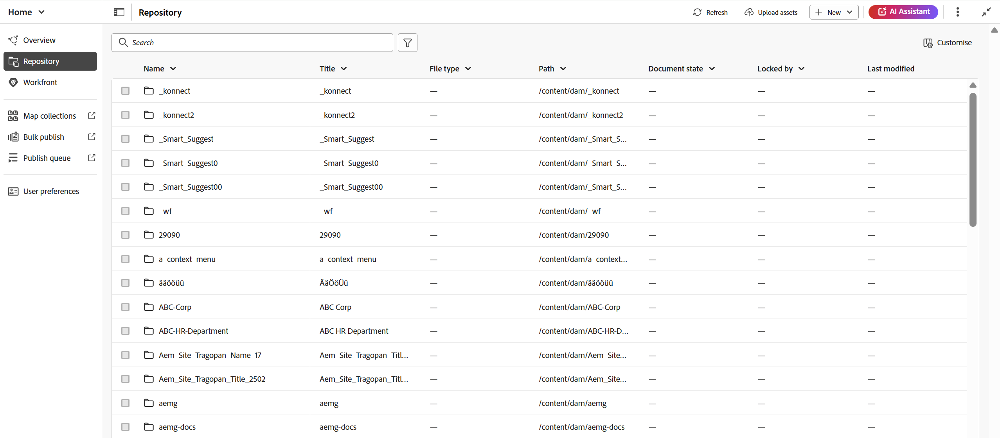{align="left"}

存放庫介面分為下列區段：

- 存放庫導覽列
- 存放庫的表格檢視

## 存放庫導覽列

存放庫導覽列位於存放庫介面的頂端，可讓您快速存取列出的基本動作。

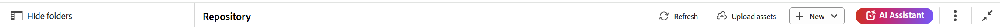{align="left"}

- **資料夾導覽面板**：顯示存放庫內資料夾的樹狀階層檢視，以順暢導覽。 此面板僅顯示資料夾層級的資訊。 從此處選取資料夾時，其內容、檔案和子資料夾會顯示在「存放庫」檢視中。 您可以使用下面反白顯示的圖示來顯示或隱藏此面板。

  {align="left"}

- **階層連結**：表示存放庫中的目前路徑，顯示通往您目前資料夾的資料夾階層。 您可以選取它以返回階層內的特定資料夾。

  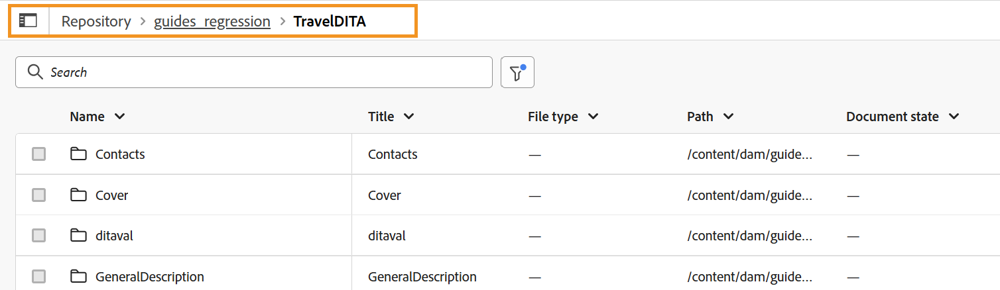{width="650" align="left"}

- **重新整理**：更新存放庫以反映最新的變更。
- **上傳Assets**：允許將資產直接上傳到目前的資料夾，如階層連結中反白顯示的內容。
- **新**：啟用在目前資料夾中建立新的主題、地圖和資料夾，如同階層連結中反白顯示的內容。
- **AI Assistant**：功能強大的AI導向工具，可透過智慧說明功能提升您的生產力。 [AI助理](./ai-assistant.md)功能目前僅適用於Adobe Experience Manager as Cloud Service。
- **其他動作**：提供其他選項的存取權。 選取此按鈕會開啟包含下列選項的功能表：
   - **Assets**：根據您的設定，將您帶往目的地。
      - **雲端服務**：如果您正在使用雲端服務，選取&#x200B;**Assets**&#x200B;選項會帶您前往AEM導覽頁面。
      - **內部部署軟體**：如果您正在使用Adobe Experience Manager Guides （4.2.1和更新版本），選取&#x200B;**Assets**&#x200B;選項會帶您前往Assets UI中的目前檔案路徑。
   - **Workspace設定**：帶您前往&#x200B;**Workspace設定**&#x200B;對話方塊。 如需詳細資料，請檢視[設定Workspace設定](../cs-install-guide/workspace-settings.md)。
- **展開檢視**：可讓您使用&#x200B;**展開**&#x200B;圖示展開頁面檢視。 在此檢視中，「頁首」列會隱藏，最大化內容空間。 若要返回標準檢視，請使用「結束展開的檢視」圖示。

## 存放庫的表格檢視

存放庫作為中央空間，提供所有資料夾和檔案的表格清單。 它提供下列功能：

- **自訂**：您可以使用存放庫檢視右上角的&#x200B;**自訂**&#x200B;選項來修改顯示的欄。 此選項可讓您顯示或隱藏任何欄，並且視需要重新排列欄。 **Name**&#x200B;或&#x200B;**Title**&#x200B;資料行是強制性的，無法同時停用。 其他欄位，例如&#x200B;**檔案型別**、**UUID**、**檔案狀態**、**鎖定者**、**建立於**，以及&#x200B;**修改於**，可視需要啟用或停用。 只要拖放即可重新排列它們。

  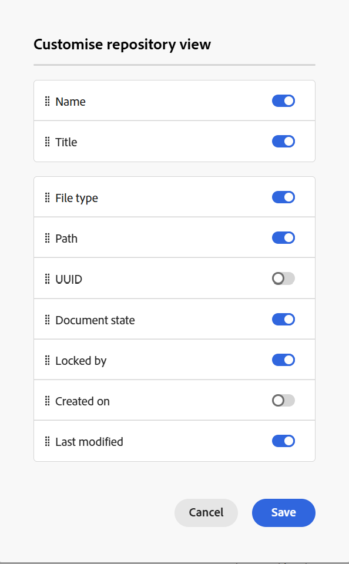{width="350" align="left"}

- **調整欄大小**：您可以從欄下拉式選單中選取選項，調整欄大小。

- **排序**：「名稱」、「標題」、「建立時間」和「上次修改時間」欄支援依遞增或遞減順序排序，可透過欄下拉式功能表存取。

- **正在編輯檔案**：

   - 您可以從清單中選取一個或多個檔案進行編輯。
   - 使用核取方塊選取所要的檔案後，「存放庫」檢視的右上角會顯示&#x200B;**編輯**&#x200B;選項。
   - 選取&#x200B;**編輯**&#x200B;會在編輯器介面中開啟選取的檔案，您可以在此開始編輯檔案。

     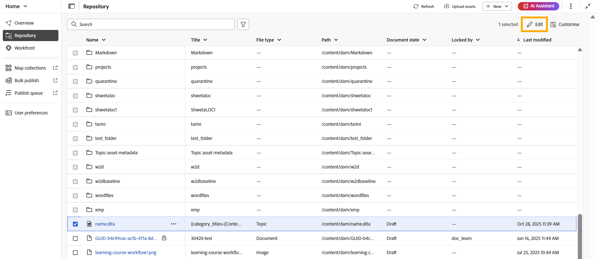{align="left"}

- 資料夾的&#x200B;**選項功能表**：您可以使用資料夾可用的&#x200B;**選項**&#x200B;功能表執行下列動作：

  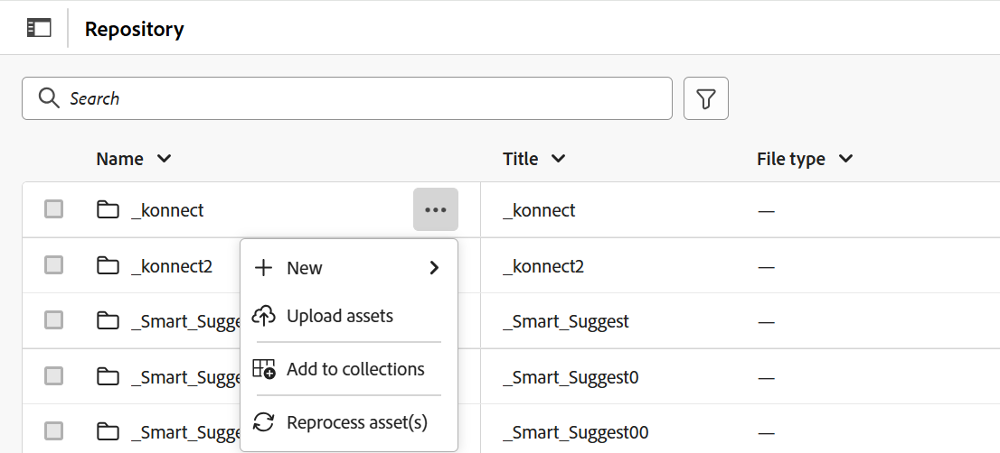{width="350" align="left"}

   - **新增**：建立新的DITA主題、DITA map或資料夾。
   - **上傳Assets**：將檔案從您的本機系統上傳至存放庫中選取的資料夾。
   - **新增至集合**：將選取的資料夾新增至我的最愛。 您可以選擇將其新增至現有或新的集合。
   - **重新處理資產**：觸發處理所有新建立和未處理的資產。

- **檔案的選項功能表**：您可以使用檔案的&#x200B;**選項**&#x200B;功能表執行下列動作：

  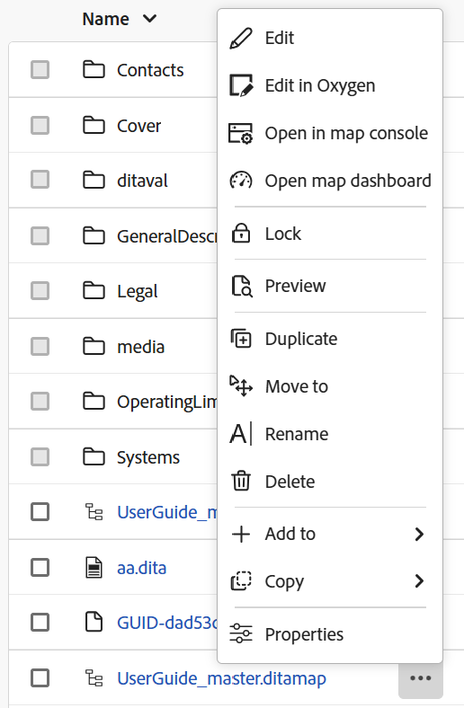{width="350" align="left"}

   - **編輯**：開啟檔案以進行編輯。
   - **在氧氣中編輯**：選取此選項可編輯氧氣聯結器外掛程式中選取的檔案。

     >[!NOTE]
     >
     >請聯絡您的客戶成功團隊，讓此功能在環境中啟用。 這不會當作現成支援的一部分啟用。 如需更多詳細資訊，請檢視《安裝與組態指南》中的[設定選項以在Oxyo ](../cs-install-guide/conf-edit-in-oxygen.md)中編輯。

   - **在對應主控台中開啟**：如果選取的檔案是DITA map，則此選項會開啟對應主控台。
   - **在地圖儀表板中開啟**：如果選取的檔案是DITA map，則此選項會開啟地圖儀表板。
   - **鎖定**：鎖定選取的檔案以進行編輯。
   - **預覽**：取得檔案（.dita、.xml、音訊、視訊或影像）的快速預覽，而不需要開啟它。
   - **複製**：使用此選項建立所選檔案的複製或復本。
   - **移至**：使用此選項將選取的檔案移至其他資料夾。
   - **重新命名**：使用此選項來重新命名選取的檔案。
   - **刪除**：使用此選項刪除選取的檔案。
   - **新增至**：選擇新增至集合或可重複使用的內容。
   - **複製**：複製檔案的UUID或完整路徑。
   - **屬性**：使用此項來開啟選取檔案的「屬性」頁面。
   - **下載為PDF**：使用選項來產生PDF輸出並下載。

### 搜尋和篩選體驗

**搜尋**&#x200B;選項主要依據&#x200B;**檔案標題**、**檔案名稱**&#x200B;和&#x200B;**內容**，協助從存放庫搜尋所需的檔案。 您可以在搜尋中使用任何一個、兩個或全部三個條件。 如果未選取任何條件，則結果將包含所有這三個條件的共同部分。

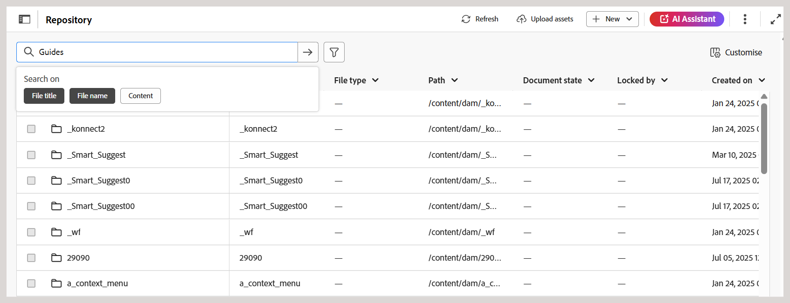{align="left"}

選取&#x200B;**篩選搜尋** \（\）圖示以開啟右側的「篩選」面板。

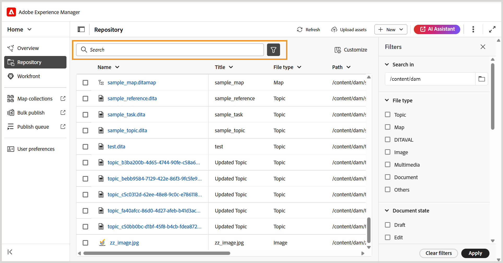{align="left"}

您有以下選項可篩選檔案並縮小搜尋範圍：

- **搜尋**：選取您要搜尋存放庫中檔案的路徑。

- **檔案型別**：您可以尋找所有&#x200B;**DITA主題**、**DITA Maps**、**DITAVAL檔案**、**影像檔案**、**多媒體**、**檔案**&#x200B;以及&#x200B;**JSON**。

- **鎖定者**：顯示使用者清單。 清單會以非同步方式分頁並載入，一次顯示一組有限的使用者，並在捲動或導覽時擷取更多內容。 這可改善載入速度和整體效能，尤其是在處理大量使用者時。

- **上次修改時間**：根據修改日期篩選內容。 從行事曆選取日期範圍，或選擇下列其中一個時間範圍選項：
   - 在上週
   - 在上個月
   - 在去年

- **標籤**：根據標籤篩選內容。

- **DITA元素**：根據各種DITA元素篩選內容。

套用所有必要的篩選器後，從「篩選器」面板的右下角選取&#x200B;**套用**。

根據選取的篩選器自訂的搜尋結果只會以&#x200B;**表格檔案清單**&#x200B;顯示（未顯示資料夾）。 您可以同時移除任何個別或多個篩選器，結果會重新整理以反映更新的選取範圍。

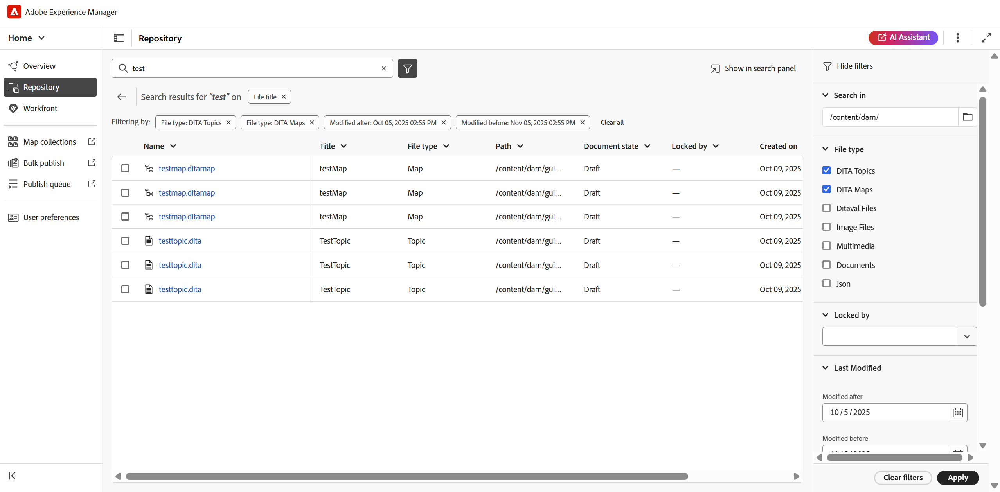{align="left"}

搜尋結果出現後，您可以選取多個檔案並使用&#x200B;**編輯**&#x200B;圖示在編輯器中開啟它們，或是透過&#x200B;**在搜尋面板中顯示**&#x200B;選項將搜尋結果傳送給編輯者，以處理所有結果。

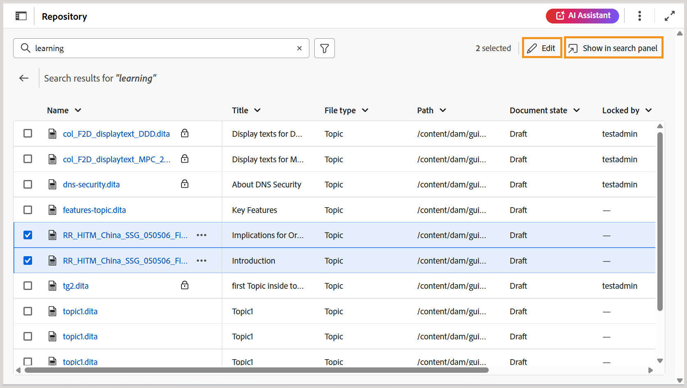{align="left"}

**顯示在搜尋面板中**

在存放庫中執行搜尋後，**在搜尋面板中顯示**&#x200B;選項將變為可用。 此功能可讓您在編輯器的&#x200B;**搜尋面板**&#x200B;中顯示所有搜尋結果。 如需詳細資訊，請檢視[搜尋面板](./search-panel-explorer.md)。

{align="left"}

