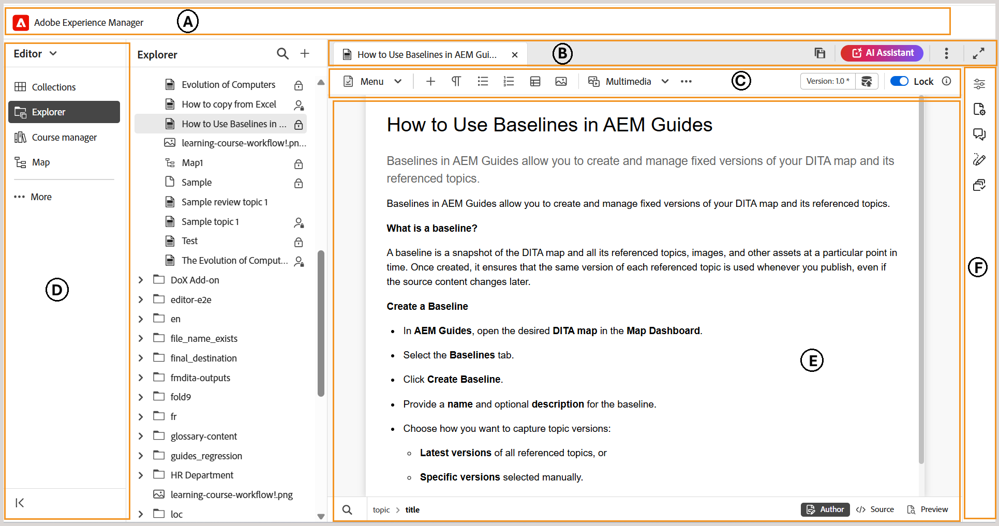

# 概觀

本文提供編輯器介面的概觀，以及Experience Manager Guides編輯器中可用的各種功能。

編輯器介面分為下列區段或區域：

- **(A)** [標頭列](./web-editor-header-bar.md)
- **(B)** [索引標籤列](./web-editor-tab-bar.md)
- **\(C\)** [工具列](./web-editor-toolbar.md)
- **(D)** [左側面板](./web-editor-left-panel.md)
- **(E)** [內容編輯區域](./web-editor-content-editing-area.md)
- **(F)** [右側面板](./web-editor-right-panel.md)