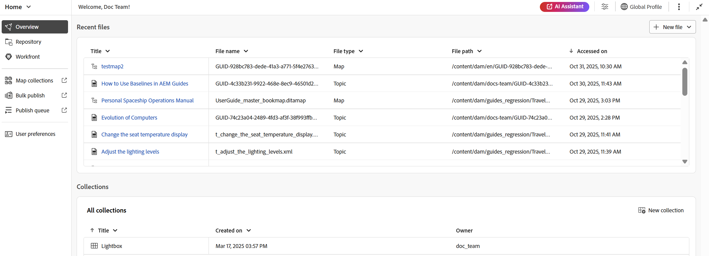
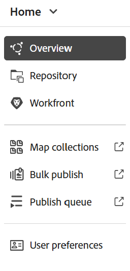
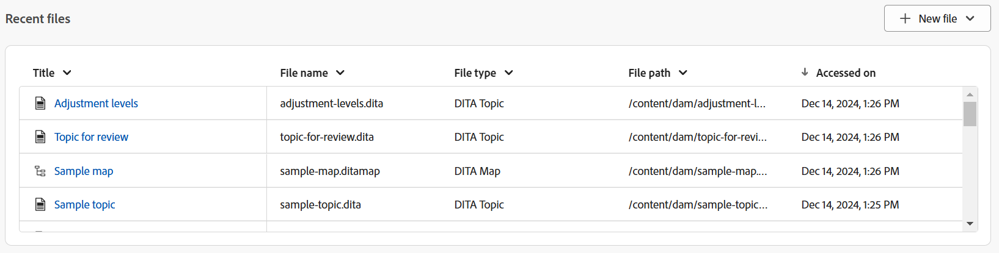
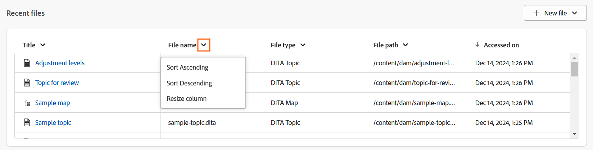
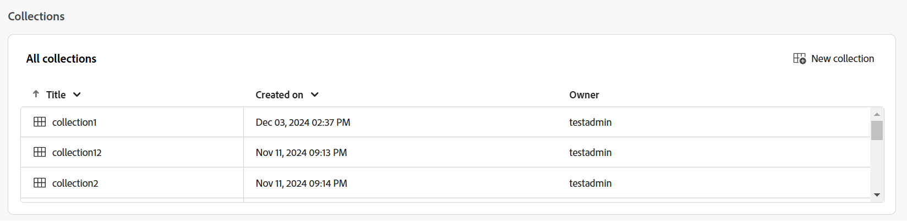
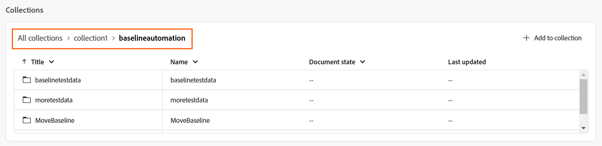
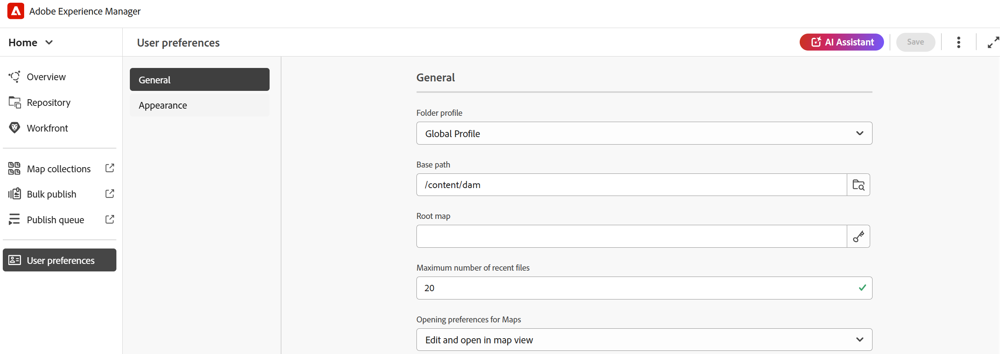
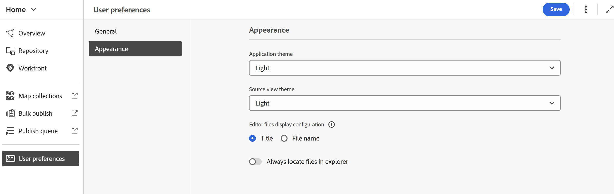

# Experience Manager Guides首頁體驗

首頁是您登入Experience Manager Guides時檢視的第一個畫面。 它為您提供統一且直覺的歡迎畫面體驗，包括您最近存取的檔案、集合等的快速檢視。

{align="left"}

Experience Manager Guides首頁分為下列區段：

- 標題列
- 導覽列
- 左側面板

## 標題列

標題列是顯示Adobe Experience Manager標誌的首頁頂端列(如果您使用Unified Shell做為Experience Manager Guides UI，則為Unified Shell)。 當您選取標誌時，它會將您導向Experience Manager導覽頁面。

{align="left"}

## 導覽列

導覽列會顯示一些工具，可用來切換導覽、自訂概觀版面以及調整頁面檢視。 它也會顯示目前使用的資料夾設定檔。

>[!NOTE]
>
> 如果使用Adobe Experience Manager Guides as a Cloud Service，導覽列中會顯示一個標示為&#x200B;**AI小幫手**&#x200B;的其他功能。

{align="left"}

導覽列中可用的功能說明如下：

- **導覽切換器**：可順暢導覽至其他頁面：
   - **首頁**：您登入Experience Manager Guides時檢視的預設頁面。
   - **編輯器**：簡單易用的網頁式編輯器，可讓您在Experience Manager Guides中建立和管理結構化檔案。 [瞭解編輯器介面](./web-editor.md)。
   - **地圖主控台**：為您提供專屬的工作區，以處理地圖管理與發佈的各個層面。 [瞭解地圖主控台介面](./map-console-overview.md)。
- **AI Assistant**：功能強大的AI導向工具，可透過智慧說明功能提升您的生產力。 此外，在編輯器介面中工作時，您可以利用AI Assistant的智慧型撰寫功能，透過對內容重複使用和最佳化的智慧型建議，讓您的撰寫流程更聰明、更快。

  [AI助理](./ai-assistant.md)功能目前僅適用於Adobe Experience Manager as Cloud Service。
- **自訂總覽區段**：可讓您隱藏或顯示Widget區段中的Widget。
- **使用中的資料夾設定檔**：顯示目前正在使用的資料夾設定檔。
- **其他動作**：提供其他選項的存取權。 選取此按鈕會開啟包含下列選項的功能表：

   - **Assets**：根據您的設定，將您帶往目的地。
      - **雲端服務**：如果您正在使用雲端服務，選取&#x200B;**Assets**&#x200B;選項會帶您前往AEM導覽頁面。

      - **內部部署軟體**：如果您正在使用Adobe Experience Manager Guides （4.2.1和更新版本），選取&#x200B;**Assets**&#x200B;選項會帶您前往Assets UI中的目前檔案路徑。
   - **Workspace設定**：帶您前往&#x200B;**Workspace設定**&#x200B;對話方塊。 如需詳細資料，請檢視[設定Workspace設定](../cs-install-guide/workspace-settings.md)。

     >[!NOTE]
     >
     > 在首頁上，Workspace設定的選項僅適用於雲端服務設定。 在內部部署設定中，首頁沒有更多動作選項。 不過，您仍然可以透過編輯器介面和Map主控台，導覽至「更多選項>設定」來存取相關設定。

- **展開檢視**：可讓您使用&#x200B;**展開**&#x200B;圖示展開頁面檢視。 在此檢視中，標題列會隱藏，最大化內容空間。 若要返回標準檢視，請使用&#x200B;**結束展開檢視**&#x200B;圖示。

## 左側面板

>[!NOTE]
>
> 左側面板中的存放庫僅適用於2025.11.0版以後的雲端服務設定。 對於內部部署設定，系統會繼續從編輯器介面存取存放庫。

左側面板可讓您快速存取概述、存放庫、對應集合、大量發佈、發佈佇列和使用者偏好設定功能。 您可以選取位於介面左下角的&#x200B;**展開**&#x200B;圖示來展開面板。 展開後，請使用&#x200B;**摺疊**&#x200B;圖示來摺疊面板。

{width="300" align="left"}

您在此面板上的檢視內容取決於您的使用者角色。 下表列出顯示在左側面板中的角色和個別區段。

- **管理員和發佈者**：能夠檢視面板中的所有區段。
- **作者**：可檢視發佈以外的所有區段。 作者無權存取對應集合、發佈佇列和大量發佈區段。
- **檢閱者**：僅能檢視[概觀]區段。 選取概述區段會顯示預設的空白狀態訊息或Workfront工作Widget，視是否已設定Adobe Workfront而定。

左側面板中可用的功能說明如下：

- [概觀](#overview)
- [存放庫](#repository)
- [對應集合](#map-collections)
- [大量發佈](#bulk-publish)
- [發佈佇列](#publish-queue)
- [使用者喜好設定](#user-preferences)

>[!NOTE]
>
> 此外，如果您的管理員已在系統中設定Adobe Workfront整合，則&#x200B;**Workfront**&#x200B;選項也會顯示在左側面板中。 瞭解Experience Manager Guides中的[Adobe Workfront整合](./workfront-integration.md)。

### 概觀

**概觀**&#x200B;就像個人化儀表板，用來提升生產力。 它提供不同的Widget，協助您維持井然有序的工作狀態。

Widget也提供排序和調整欄大小的選項。 若要檢視這些選項，請選取欄標題，這些選項就會顯示在清單中。

「介面工具集」區段中存在下列介面工具集：

- **最近的檔案**：小工具提供您最近開啟的檔案快照（您在編輯器中存取的檔案清單），以及重要檔案詳細資訊，包括標題、檔案名稱、檔案型別、檔案路徑和日期存取。

  {align="left"}

  您可以從欄下拉式選單中選取選項，以排序欄並調整欄大小。 依預設，資料會根據上次存取的日期和時間排序。

  {align="left"}

  從[使用者偏好設定](#user-preferences)，您可以設定此介面工具中可顯示的最大檔案數。 依預設，此限制設定為&#x200B;**20**。

  當您將游標停留在檔案上時，可以使用下列選項：

   - **在編輯器中開啟**：可讓您在編輯器中開啟檔案。 您也可以只要選取檔案來開啟檔案。
   - **釘選/取消釘選**：可讓您將一或多個檔案釘選到「最近使用的檔案」Widget。 釘選的檔案會顯示在Widget清單的最上方。 若要取消釘選檔案，請使用&#x200B;**取消釘選**&#x200B;選項。
   - **移除**：可讓您從「最近使用的檔案」Widget移除檔案。

  **從[新增檔案]下拉式功能表建立新檔案**

  **新檔案**&#x200B;下拉式功能表可讓您直接從&#x200B;**最近的檔案** Widget建立主題或DITA Map。 成功建立檔案後，您將被重新導向編輯器介面，您可以在其中處理檔案。

- **集合**：如果您處理一組檔案或資料夾，可以將它們新增至此Widget以快速存取。 新增後，您可以按標題以及其他關鍵詳細資訊（例如，所有者和建立日期）檢視檔案。 選取欄下拉式清單時，您可以檢視排序欄和調整欄大小的選項。

  {align="left"}

  所選集合的階層連結會顯示在「集合」Widget頂端。 您可以選取它以返回階層內的特定資料夾。

  {align="left"}

  當您將滑鼠游標停留在集合上並選取「更多」圖示時，可以使用下列選項：

   - **重新命名**：可讓您重新命名集合。
   - **刪除**：可讓您刪除集合。
   - **在Assets UI中檢視**：可讓您在Assets UI中開啟集合。

  您可以選取「系列」標題以開啟系列。 當您將滑鼠懸停在「集合」檔案上並選取「更多」圖示時，可以使用下列選項：

   - **在編輯器中開啟**：可讓您在編輯器中開啟檔案。 或者，您可以選取檔案標題來開啟檔案。
   - **在地圖主控台中開啟**：可讓您在地圖主控台中開啟地圖檔案。 （僅適用於DITA map檔案）。
   - **新增至集合**：可讓您將檔案新增至新的或現有的集合。
   - **從集合移除**：可讓您從集合清單移除檔案。
   - **在Assets UI中檢視**：可讓您在Assets UI中找出檔案。

  **從[新增系列]下拉式功能表建立新系列**

  **新集合**&#x200B;下拉式功能表可讓您建立新的集合，並將其新增至&#x200B;**集合** Widget。

>[!NOTE]
>
> 此外，如果您的管理員已在系統中設定Adobe Workfront整合，則&#x200B;**您的工作** Widget也會顯示在「Widget」區段中。 進一步瞭解Experience Manager Guides中的[Adobe Workfront整合](./workfront-integration.md#working-with-the-your-tasks-widget)。

### 存放庫

存放庫是輕鬆探索資料夾和檔案的集中樞紐。 它提供所有檔案和資料夾的完整表格清單檢視，及其內容詳細資訊。 透過此統一介面，您可以順暢地瀏覽檔案，並使用強大的篩選選項執行搜尋，確保效率和增強體驗。 深入瞭解[存放庫](./home-page-repository-view.md)。

### 對應集合

Experience Manager Guides可讓您使用名為&#x200B;**地圖集合**&#x200B;的儀表板，組織內容以供發佈。 若要使用此功能，請從左側面板選取&#x200B;**對應集合**。 這會帶您進入&#x200B;**Assets UI**&#x200B;中的「對應集合」頁面，您可以[使用對應集合來產生輸出。](./generate-output-use-map-collection-output-generation.md)

### 大量發佈

大量啟動功能可讓您快速輕鬆地啟動內容，從製作到發佈執行個體。 若要使用此功能，請從左側面板選取&#x200B;**大量發佈**。 這會帶您進入Assets UI中的「大量啟用集合」頁面，您可在此建立和管理[已發佈內容的大量啟用](./conf-bulk-activation.md)。

### 發佈佇列

當您在系統上執行大量發佈作業時，幾乎不可能個別檢查每個DITA map以監視其發佈作業。 Experience Manager Guides可讓管理員和發佈者統一檢視系統中執行的所有發佈任務。

若要使用此功能，請從左側面板選取&#x200B;**發佈佇列**。 這會帶您進入Assets UI中的「發佈」儀表板頁面，您可在其中使用發佈儀表板[管理](./generate-output-publish-dashboard.md)發佈任務。

### 使用者偏好設定

「使用者」偏好設定可供所有作者使用。 您可以使用偏好設定來配置下列設定：

- **一般**：「一般」標籤可讓您設定下列設定：

  {align="left"}

   - **資料夾設定檔**：資料夾設定檔控制與條件屬性、編寫範本、輸出預設集和編輯器設定相關的各種設定。 預設會顯示全域設定檔。 此外，如果您的管理員在系統中設定了資料夾設定檔，則這些資料夾設定檔也會顯示在「資料夾設定檔」清單中。
   - **基底路徑**：根據預設，當您從編輯器存取Experience Manager Guides存放庫時，您會看到來自/content/dam位置的資產。 您的工作資料夾很可能是/content/dam/資料夾內的幾個資料夾。 您可以設定工作資料夾的「基礎」路徑和「存放庫」檢視，然後將來自該位置的內容顯示在前面。 這可以縮短存取工作資料夾的時間。 此外，當您在主題中插入任何參照或媒體檔案時，檔案瀏覽位置會以在「基底」路徑中設定的資料夾開始。
   - **選取根對應**：選取DITA map檔案來解析索引鍵參考或字彙表專案。 選取的根對映解析關鍵參照的優先順序最高。 如需詳細資訊，請檢視[解析金鑰參考](./map-editor-other-features.md)。
   - **最近使用的檔案數上限**：使用此欄位，設定[最近使用的檔案]小工具中所顯示檔案的最大限制。
   - **開啟Map的偏好設定**：您可以在此處選取系統開啟DITA map檔案時將遵循的預設行為。

- **外觀**：「外觀」標籤提供您選取應用程式主題和內容編輯區域來源檢視的選項。 使用此標籤來設定下列設定：

  {align="left"}

   - **應用程式主題和Source檢視**：您可以從應用程式和來源檢視的淺色或深色主題中進行選擇。 在淺色主題的情況下，工具列和面板會使用淺灰色背景。 在深色佈景主題的情況下，工具列和面板會使用黑色背景。 選取&#x200B;**使用裝置**&#x200B;佈景主題，讓Experience Manager Guides根據裝置的佈景主題選取淺色和深色佈景主題。

     在所有主題中，內容編輯區域會在「作者」檢視中以白色背景顯示。

   - **編輯器檔案顯示組態**：選取編輯器中檢視檔案的預設方式。 您可以在「作者」檢視中，依照各個面板的標題或檔案名稱來檢視檔案清單。 依預設，檔案會依編輯器的標題顯示。

   - **永遠在檔案總管中尋找檔案**：選取此選項，以在編輯器中編輯檔案時，顯示檔案在存放庫中的位置。

  >[!NOTE]
  >
  >從2025.11.0版開始，設定&#x200B;**永遠尋找存放庫中的檔案**&#x200B;重新命名為&#x200B;**永遠尋找檔案總管**。 對於內部部署設定，在Experience Manager Guides 5.1版發行前，它仍可在存放庫中永遠尋找檔案中使用。
