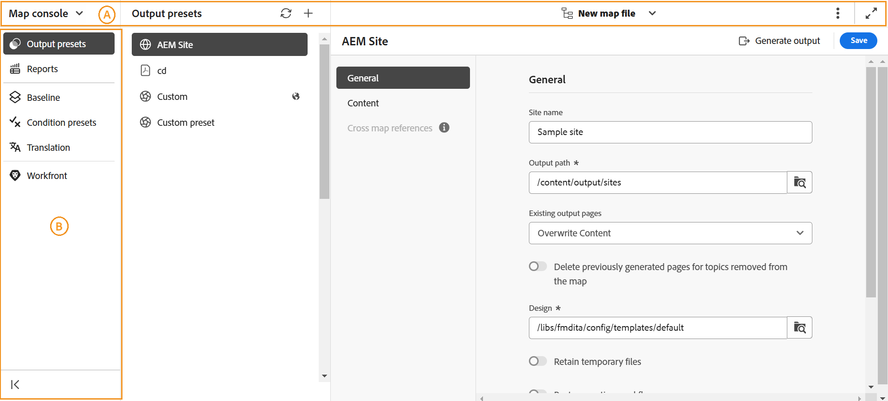

# 地圖主控台概觀

Adobe Experience Manager Guides提供專用的主控台，稱為&#x200B;**地圖主控台**，可簡化所有地圖管理和發佈工作。 此集中式介面可讓您選擇在單一位置產生輸出、翻譯內容、存取報表等，藉此提升地圖相關活動的生產力和正確性。

{align="left"}

地圖主控台介面主要分為兩個區段 — **導覽列**&#x200B;和&#x200B;**左側面板**。

{align="left"}

- (**A**) **導覽列**：導覽列會顯示切換導覽、調整頁面檢視以及顯示所選地圖檔案名稱的工具。

  導覽列中可用的功能說明如下：

   - **導覽切換器**：可順暢導覽至其他頁面 — 編輯器或首頁：
   - **選取的對應檔**：顯示目前選取的對應檔名稱。 您可以在編輯器中開啟該檔案，或為「對應」主控台選擇不同的對應檔案。
   - **更多動作**：提供可瀏覽至&#x200B;**Assets UI**&#x200B;和&#x200B;**設定**&#x200B;的選項。 如需詳細資訊，請參閱[瞭解編輯器功能](./web-editor-features.md#tab-bar)檔案的&#x200B;**更多動作**&#x200B;區段。
   - **展開檢視**：可讓您使用&#x200B;**展開**&#x200B;圖示展開頁面檢視。 在此檢視中，標題列會隱藏，最大化內容空間。 若要返回標準檢視，請使用&#x200B;**結束展開檢視**&#x200B;圖示。

  >[!NOTE]
  >
  > 如果使用Adobe Experience Manager Guides as a Cloud Service，導覽列中會顯示額外功能[AI小幫手](./ai-assistant.md)。

- (**B**) **左側面板**：左側面板可讓您快速存取產生輸出、建立及管理報告、基準線、條件預設集、內容轉譯，以及Workfront （若已設定）功能。

  如需更多詳細資料，請參閱下方的[對應主控台功能](#map-console-features)區段。

## 對應主控台功能

當您[在Map主控台](./open-files-map-console.md)中開啟DITA map檔案時，下列功能可在[左側]面板中使用。

**產生輸出**

透過地圖主控台，您可以透過DITA-OT、原生PDF發佈和FMPS有效率地產生各種格式的輸出，包括AEM Sites、PDF、HTML5、EPUB、JSON和自訂輸出。 您可以為整個DITA map產生輸出，也可以只選擇性地發佈已更新的幾個主題。 您也可以使用基準線發佈功能，選擇性地發佈DITA map或主題的特定版本。

如需詳細資訊，請檢視[輸出產生](./generate-output.md)。

**報告建立與管理**

在組織設定中，您想要先驗證技術檔案的整體完整性，然後再開始處理或即時推送檔案。 在多使用者和大型環境中，這樣的需求變得更加重要。 透過地圖主控台，您可以存取Experience Manager Guides報表，這些報表可提供存放庫中內容整體健康狀況，以及說明檔案過程中如何使用內容的實用深入分析。

如需更多詳細資料，請在Experience Manager Guides[&#128279;](./reports-intro.md)中檢視報告。

**基準線**

Experience Manager Guides提供基線功能，可讓您建立主題和資產的版本，然後用於發佈或翻譯。 您也可以同時發佈同一DITA map的多個輸出預設集。

瞭解如何[在Experience Manager Guides](./web-editor-baseline.md)中建立和管理基準線。

**條件預設集**

Experience Manager Guides可讓您定義DITA主題中的屬性，並使用條件預設集來指定在最終輸出中屬性會發生什麼情況。 例如，您可以在內容中新增屬性為1.0版和2.0版，並使用條件預設集來包含1.0版的1.0版並排除2.0版。同樣地，您可以將屬性新增為OS Windows和OS Linux至您的內容，然後根據作業系統包含或排除最終輸出的相關內容。

深入瞭解[條件預設集](./generate-output-use-condition-presets.md)。

**內容翻譯**

Experience Manager Guides隨附強大的功能，可讓您將內容翻譯成多種語言。 Experience Manager Guides同時支援人工和機器翻譯工作流程。

在地圖主控台中，您可以存取開始翻譯工作流程所需的所有選項。 如需詳細資訊，請檢視[翻譯內容](./translation.md)。

**Workfront**

Map主控台也提供Workfront功能，可讓您直接從Experience Manager Guides處理Adobe Workfront工作。

瞭解Experience Manager Guides[&#128279;](./workfront-integration.md)中的Adobe Workfront整合。

只有管理員已在您的Experience Manager Guides執行個體中設定&#x200B;**Adobe Workfront**&#x200B;整合，您才能存取此功能。
