# 地圖編輯器功能 {#id1942D0S0IHS}

地圖編輯器中的工具列與主題編輯器類似。 切換左側面板、儲存對映、建立新版對映、還原/重做上次操作以及刪除選取的元素等基本操作在兩個編輯器中都很常見。 如需這些作業如何運作的詳細資訊，請檢視[瞭解編輯器功能](web-editor-features.md#)區段。

您在編輯器工具列中檢視的選項是根據「地圖編輯器」檢視。 地圖編輯器中提供四個檢視：

- [版面配置](#layout-view)
- [作者](#author-view)
- [來源](#source-view)
- [預覽](#preview)

以下各節涵蓋「對映編輯器」的不同檢視中可用的工具列選項：

## 版面配置檢視

當您開啟地圖進行編輯時，它會開啟「地圖編輯器」的「版面」檢視。 「版面配置」檢視以樹狀檢視顯示對應階層，並可讓您在對應中組織主題。

>[!NOTE]
>
> 「配置圖」檢視只會顯示存在於對映中的參照。 如果任何參照被破斷，則在參照的左側會顯示一個小型十字元號

「版面」檢視的工具列上提供下列選項：

**主題參考** - 

顯示主題搜尋對話方塊。 瀏覽至您要插入的主題/地圖檔案，並選擇&#x200B;**選取**&#x200B;以將其新增到地圖。

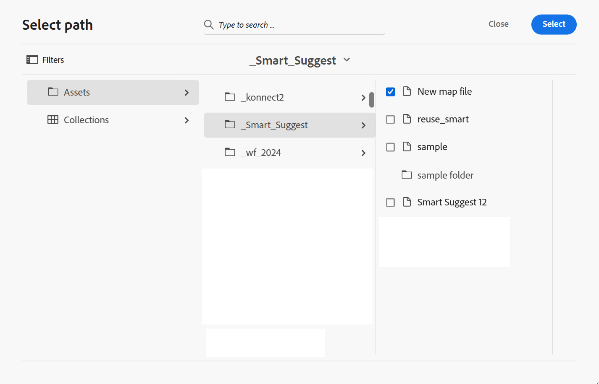{align="left"}

**主題群組** - 

插入`topicgroup`元素。 如需群組主題的詳細資訊，請檢視OASIS DITA語言規格中的[主題群組](https://docs.oasis-open.org/dita/v1.0/langspec/topicgroup.html)檔案。

**金鑰定義** - 

顯示「插入索引鍵」對話方塊。 使用此對話方塊來定義您要在對應中使用的任何索引鍵定義。

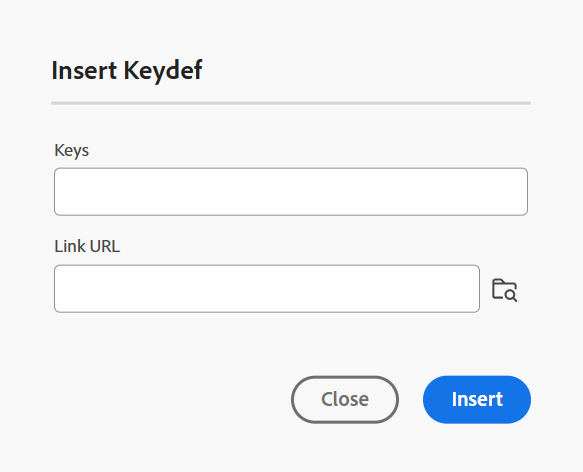{width="300" align="left"}

**插入在前/插入在後** -  / 

顯示「插入元素」對話方塊。 選取您要插入對映中的元素。 視作業而定，新元素會插入到對映中目前元素之前或之後。

**插入前置內容** - 

當您開啟書籤進行編輯時，此圖示就會顯示。 您可以將元件插入書的開頭，例如目錄、索引和表格清單。

**插入背景內容** - 

當您開啟書籤進行編輯時，此圖示就會顯示。 您可以在書籍的結尾插入元件，如索引、字彙表和插圖清單。

**將選取的專案向左/向右移動** -  / 

選取向左箭頭，將主題移至階層中的左側。 這基本上是在階層中將個別主題提升一個層級。 例如，在選取子主題時選取向左箭頭，使其成為其上主題的同層級主題。 同樣地，如果您選取向右箭頭，該主題會向右推，使其成為其上方主題的子項。

**將選取的專案上/下移**  - / 

選取向上或向下箭頭圖示，在階層中向上或向下移動主題。

>[!NOTE]
>
> 您也可以拖放參照，在地圖中移動參照。

**鎖定/解除鎖定**

取得對應檔案的鎖定，然後解除鎖定。 如果您在對應檔案中有未儲存的變更，則在解除鎖定時，系統會提示您儲存對應檔案。 變更會儲存在對映檔案的目前版本中。

**合併** - 

如需有關合併相同或不同檔案不同版本內容的詳細資訊，請在編輯器中檢視[合併](web-editor-features.md#menu-dropdown)。

**版本記錄** - 

檢查使用中主題上的可用版本和標籤，並從編輯器本身恢復為任何版本。

**版本標籤** - 

顯示版本標籤管理對話方塊。 從下拉式清單中選取版本。 選擇您要套用至所選版本的標籤，並選取&#x200B;**新增標籤**&#x200B;以新增該標籤。

**顯示檔案名稱**

顯示主題標題的檔案名稱。

>[!NOTE]
>
> 將指標暫留在主題標題上時，會顯示檔案路徑。

**顯示行號**

顯示或隱藏每個主題的行號。 行號會根據階層中的層級而顯示。

**顯示核取方塊**

顯示或隱藏每個主題的核取方塊。 您可以使用核取方塊來選取主題，並使用「選項」選單執行各種工作。

配置檢視中的&#x200B;**選項功能表**

除了組織對映檔案中的主題外，您還可以使用選項選單執行以下動作，該選單出現在將滑鼠懸停在檔案上或在版面檢視的編輯器內按一下滑鼠右鍵時：

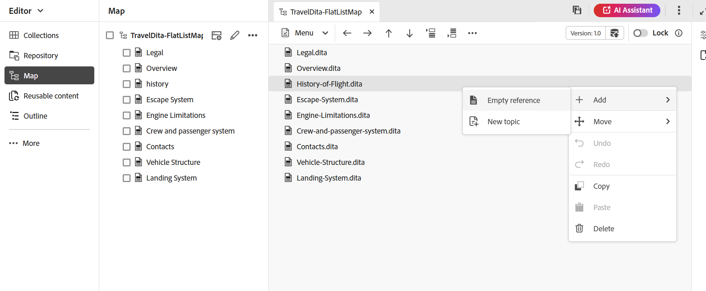{width="650" align="left"}

- **新增**：您可以選擇從地圖編輯器新增主題或空白參照：
   - **空白參考**：此選項可讓您在DITA map中新增空白參考。 您可以稍後連按兩下插入的空白參照，然後新增主題詳細資訊。
   - **新主題**：當您選擇從功能表建立新主題時，您會看到&#x200B;**新主題**&#x200B;對話方塊。 在&#x200B;**新主題**&#x200B;對話方塊中，提供所需的詳細資訊，並選取&#x200B;**建立**。
- **移動**：您可以選擇在階層中上下左右移動主題。 您也可以從存放庫面板將主題或地圖拖放至在「地圖編輯器」中開啟的地圖。
- **還原**：還原配置檢視中的上一個作業。
- **取消復原**：取消復原[配置]檢視中的最後一個作業。
- **複製**：從對應檔複製選取的參考。

  >[!NOTE]
  >
  > 您可以顯示，然後選取核取方塊以複製多個參照。

- **貼上**：將複製的參考貼到階層中的目前位置。
- **刪除**：從對應檔中刪除選取的參照。

  >[!NOTE]
  >
  > 您可以顯示，然後選取核取方塊以刪除多個參照。

**根據條件篩選器檢視主題**

如果您已在主題上套用任何條件，則會在主題右側顯示篩選圖示。 將指標暫留在篩選圖示上時，您會看到套用的條件及其屬性值。

## 作者檢視

**作者**&#x200B;檢視可讓您在編輯器中編輯您的DITA map。 這會顯示地圖編輯器的WYSIWYG檢視，而且在「作者」檢視中顯示的部分圖示會與在「版面」檢視中顯示的部分圖示相同。

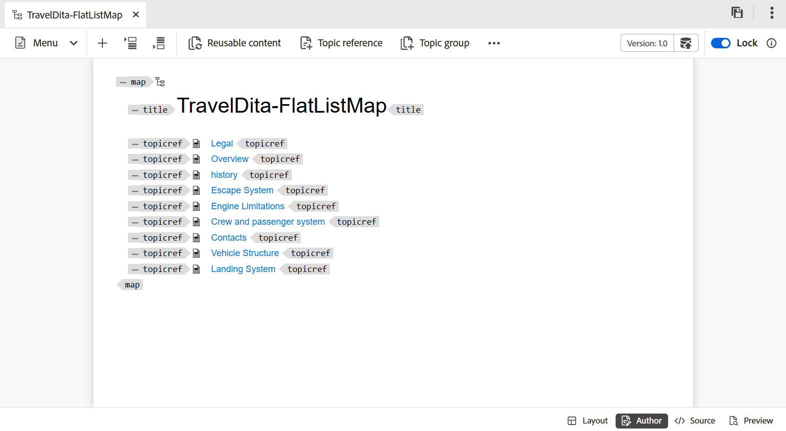{align="left"}

此外，您可以檢視下列圖示，並從「作者」檢視執行相關工作：

**插入在前/插入在後** -  / 

顯示&#x200B;**在之前插入元素或**&#x200B;在之後插入元素」對話方塊。 選取您要插入對映中的元素。 視作業而定，新元素會插入到對映中目前元素之前或之後。

**元素** - 

顯示&#x200B;**插入專案**&#x200B;對話方塊。 選取您要插入的元素。 您可以使用鍵盤捲動元素清單，然後按Enter鍵插入所需元素。 或者，您可以選取元素以將其插入對映中。

<!-----------------------------------------------------------

**Relationship table** - 

Inserts a relationship table in the map.

Perform the following steps to work with relationship tables in the Basic Map Editor:

1.  In the Assets UI, navigate to the DITA map in which you want to create the relationship table.

1.  Select the DITA map to open it in DITA map console.

1.  Select the **Topics** tab to view a list of topics available in the DITA map.

    >[!TIP]
    >
    > The Topics tab gives you an option to download the map file with its dependents. For more details, view [Export a DITA map file](authoring-download-assets.md#id218UBA00IXA).

1.  In the main toolbar, select **Edit**.

    The map file is opened in the Advanced Map Editor.

1.  Select **Reltable** from the toolbar.

    {width="650" align="left"}

1.  Drag-and-drop topics from the topic list to the Reltable editor.

    >[!NOTE]
    >
    > You can add topics from any folder in the References rail.

    {width="550" align="left"}

1.  To add a header to your relationship table, click **Add Relheader**.

1.  To add a column to your relationship table, click **Add a Column**.

    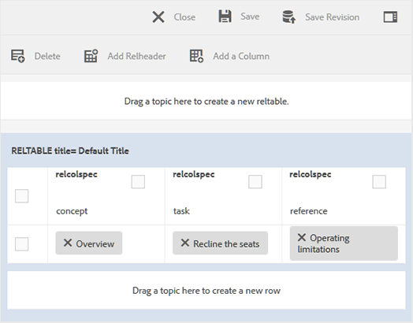{width="550" align="left"}

1.  Click **Save**.

You can also perform the following actions from the relationship table editor:

**Delete rows or columns**

If you want to delete a column from your table, select the checkbox in the column header and click Delete. If you want to remove a row from table, select the checkbox in the first column of the respective row and click Delete.

**Delete a topic**

If you want to delete a topic from your table, click the cross icon next to the topic.

**Delete the relationship table**

If you want to delete the relationship table, click anywhere outside the relationship table and click Delete. For details, view [Work with relationship tables in the Map Editor](map-editor-basic-map-editor.md).
----->

**可重複使用的內容** - 

顯示&#x200B;**重複使用內容**&#x200B;對話方塊。 使用此對話方塊插入要在地圖中重複使用的內容。

**重新整理導覽標題屬性** - 

可讓您讓參照檔案的`@navtitle`屬性與`title`元素保持同步。 您可以將不同型別的檔案（例如主題、工作、參照或子對映）加入對映。 其中大多數支援`@navtitle`屬性，此屬性可控制檔案名稱在地圖或目錄中的顯示方式。 如果檔案包含`@navtitle`屬性，則會更新對應中相同檔案的`@navtitle`屬性。 如果`@navtitle`屬性不存在，則會將`@navtitle`屬性新增至該參考檔案，並且其`title`也會更新以顯示`@navtitle`。

>[!NOTE]
>
> 您的管理員可以使用設定屬性，選擇在地圖編輯器工具列中顯示或隱藏此按鈕。 當檔案新增至地圖時，它們也可以啟用自動新增`@navtitle`屬性。 如需更多詳細資料，請在[安裝與設定Adobe Experience Manager Guides as a Cloud Service]中檢視[預設包含@navtitle屬性](../cs-install-guide/auto-add-navtitle.md)*。

**標籤**

顯示或隱藏XML標籤。 這些標籤可作為指示元素邊界的視覺提示。 在此模式中，如果要插入主題/地圖參照，則請在標籤之前或之後拖放所需的檔案。 在「標籤檢視」模式中不會顯示水準條。

**追蹤變更** - 

您可以啟用「追蹤變更」模式，以追蹤對映檔案中所做的所有更新。 啟用追蹤變更後，所有插入和刪除動作都會擷取到檔案中。 如需詳細資訊，請在編輯器中檢視[追蹤變更](web-editor-features.md#track-changes)。

**建立稽核任務** - 

您可以直接從「編輯器」建立目前主題的稽核任務或對應檔案。 開啟您要建立稽核工作的檔案，並選取&#x200B;**建立稽核工作**&#x200B;以啟動稽核建立程式。 請依照[簡介中的指示檢閱](review.md#)以取得詳細資訊。

## Source檢視

此檢視可讓您以原始格式編輯內容，完整控制結構和格式。

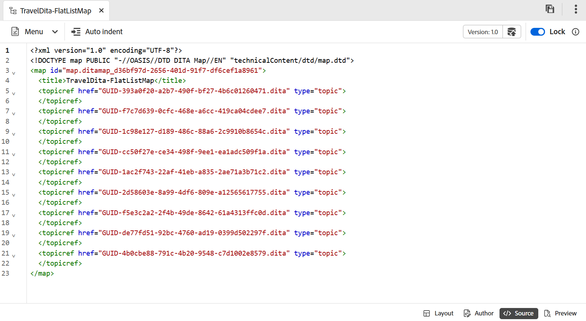{align="left"}

在此檢視中，工具列提供&#x200B;**功能表**&#x200B;下拉式清單下可用的基本內容編輯和插入選項，包括「剪下」、「複製」、「還原」、「重做」、「刪除」、「尋找和取代」、「版本標籤」、「合併」、「另存為新版本」、「鎖定和解除鎖定」。

## 預覽

「預覽」模式會呈現最終輸出中顯示的內容，讓您在發佈之前先檢閱版面配置和格式。

除了能夠檢視每個主題檔案在地圖中的位置之外，最好以一個連續的流程來檢視地圖內容。 「預覽對映」功能可讓您按一下即可檢視對應檔案的整個內容。 您不需要產生對應檔案的輸出，就能檢視發佈後整個對應的外觀。 您只需存取對映的預覽，所有主題和子對映都會以書籍的形式呈現。

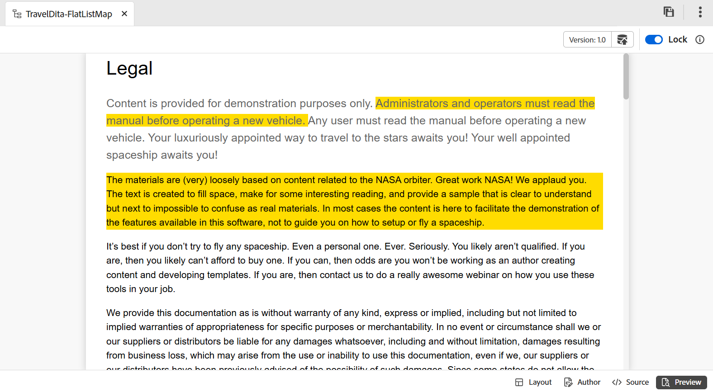{align="left"}

>[!NOTE]
>
> 在「預覽」模式下，工具列中沒有任何內容編輯或插入選項可用。 您無法編輯此檢視中的內容。 不過，您可以使用&#x200B;**另存為新版本**&#x200B;和&#x200B;**鎖定**&#x200B;或&#x200B;**解除鎖定**&#x200B;功能。

您可以在預覽模式中執行下列其他工作：

- 在主題上按一下滑鼠右鍵，然後選取&#x200B;**編輯**，開啟主題以在新的索引標籤中編輯。

  >[!NOTE]
  >
  > 如果您沒有編輯許可權，主題將以唯讀模式開啟。

- 在地圖樹狀結構中選取主題標題\（位於左側面板\），跳至所需主題。

- 地圖預覽中的目前主題也會在地圖樹中反白顯示。

**預覽地圖檔案的其他方式**

您可以從以下位置存取地圖的預覽：

- **Assets UI**：在Assets UI中，導覽至地圖位置、選取地圖檔案，然後在工具列中選擇&#x200B;**預覽地圖**。 地圖的預覽會顯示在新的標籤中。 您可以在預覽模式中檢視所有主題的內容。 在此檢視中，您無法編輯任何主題。

  >[!NOTE]
  >
  > 如果&#x200B;*預覽地圖*&#x200B;選項在主工具列中看不到，它可能已移到&#x200B;**更多**&#x200B;工具列功能表下。

- **地圖編輯器**：在地圖編輯器中，從選項功能表選取&#x200B;**預覽**&#x200B;以檢視目前地圖的預覽。

  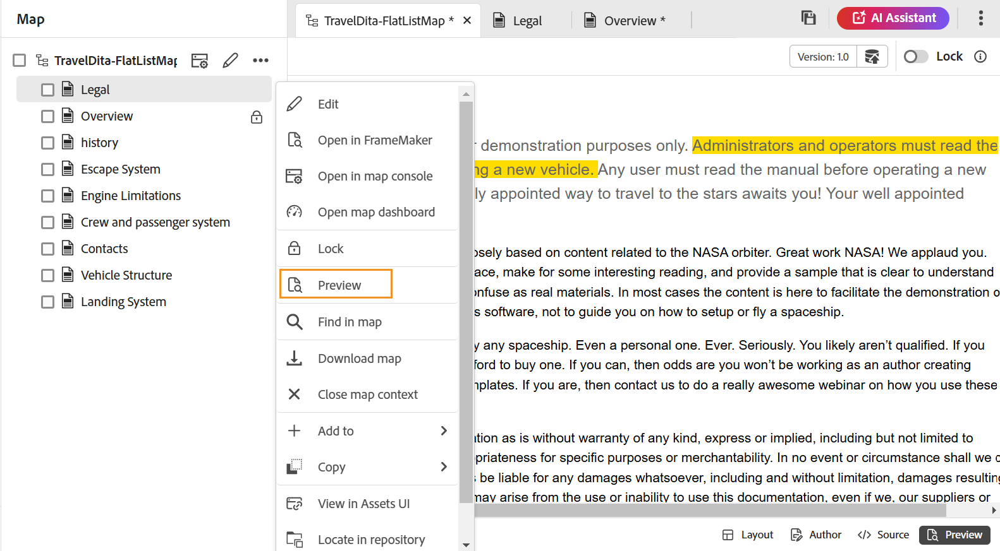{width="650" align="left"}

  地圖預覽會顯示在快顯方塊中。

  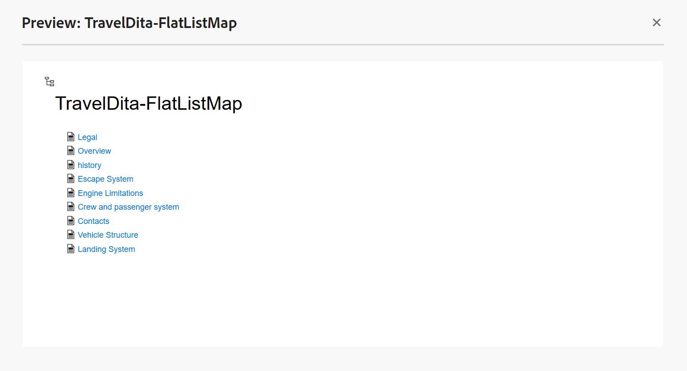{width="500" align="left"}

**對應屬性**

顯示「對應屬性」對話方塊，您可以在此設定對應的屬性和中繼資料資訊。

## 透過DITA map編輯主題 {#id17ACJ0F0FHS}

編輯個別主題不會為作者提供完整的內容。 對於主題在DITA map中的放置位置，作者將沒有相關資訊。 如果沒有這些內容相關資訊，作者就很難建立內容。

Experience Manager Guides可讓作者在編輯器中開啟DITA map，並檢視主題在地圖中的位置。 這可協助作者瞭解主題在地圖中的確切放置位置，並建立更相關的內容。 此外，如果有多位作者在一個專案中工作，他們可以知道在地圖中可以使用的所有主題，並視需要重複使用內容。

若要透過DITA map編輯主題，請執行下列步驟：

1. 在「存放庫」面板中，瀏覽並開啟要編輯的DITA map檔案。

   對應檔案會在「對應」檢視中開啟。

>[!NOTE]
>
> 您也可以使用Assets UI來開啟DITA map檔案。 導覽至包含您要編輯之主題的DITA map檔案，並在主工具列中選取&#x200B;**編輯主題**&#x200B;以啟動編輯器。

1. 選取任何主題連結，在編輯器中開啟以進行編輯。

   您可以在編輯器中開啟多個主題，而每個主題都會在編輯器的新標籤中開啟。 即使您的DITA map包含子對映，子對映中的主題也會在新的標籤中開啟以進行編輯。 如果您想要檢視子地圖下的主題，可以選取並展開子地圖。

   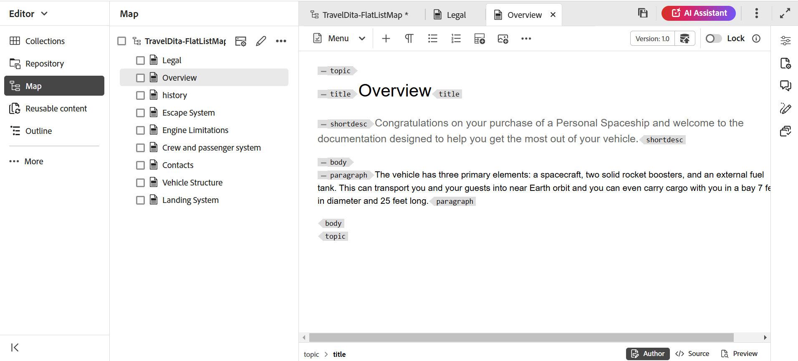{align="left"}

   如果您選取對映檔案，會在編輯器的新標籤中開啟對映。

1. 編輯完主題後，您可以執行下列動作：

   - 您可以個別儲存。 如果您關閉而不儲存主題，則會檢視一個對話方塊，提示您儲存未儲存的主題：

     {width="300" align="left"}

     您可以選擇儲存所有選取的主題或取消選取您不想儲存的主題。

   - 您可以使用&#x200B;**另存為新版本**&#x200B;選項來解除鎖定主題。 當您儲存主題版本時，會建立新版本，且也會釋放鎖定。

     建議在解除鎖定檔案之前儲存變更。  儲存變更時，會驗證XML檔案。

   - 您也可以從&#x200B;**另存為新版本**&#x200B;對話方塊檢視主題的進度。 解除鎖定檔案時，會顯示成功訊息。

   - 如果管理員已啟用關閉時解除鎖定檔案的選項，則每當關閉鎖定的檔案時，系統都會提示您儲存檔案。 啟用此選項後，當您關閉含有已變更檔案的編輯器時，會顯示需要儲存的鎖定檔案清單。 鎖定的檔案會顯示一個鎖定圖示：

     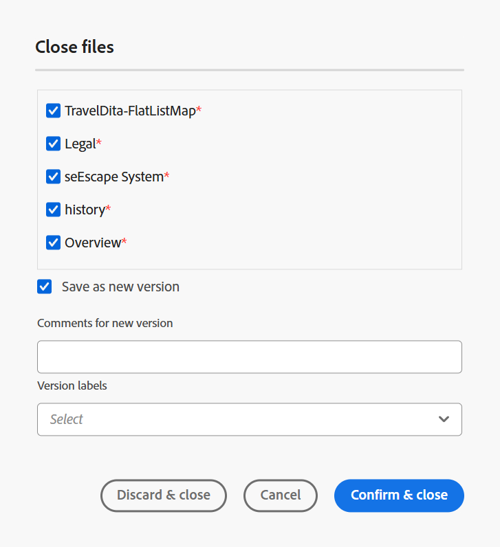{width="350" align="left"}

## 地圖編輯器中的右側面板

右側面板會顯示地圖編輯器的「版面」檢視中的「內容屬性」和「地圖屬性」 。

**內容屬性**

「內容」屬性面板包含目前地圖中所選主題型別、其連結URL及其屬性的相關資訊。 如需詳細資訊，請在編輯器中檢視[內容屬性](web-editor-features.md#right-panel)。

- **其他屬性**&#x200B;如果管理員已建立屬性的設定檔，您將會取得這些屬性及其設定的值。 使用內容屬性面板，您可以選擇這些屬性，並將其指派給主題中的相關內容。 您也可以在&#x200B;**顯示屬性**&#x200B;下指派管理員設定的屬性。 為元素定義的屬性會顯示在「配置圖」和「大綱」檢視中。 這可協助您快速檢視地圖中定義特定屬性的所有主題。 例如，所有具有`audience`屬性的主題皆定義為`US`。

  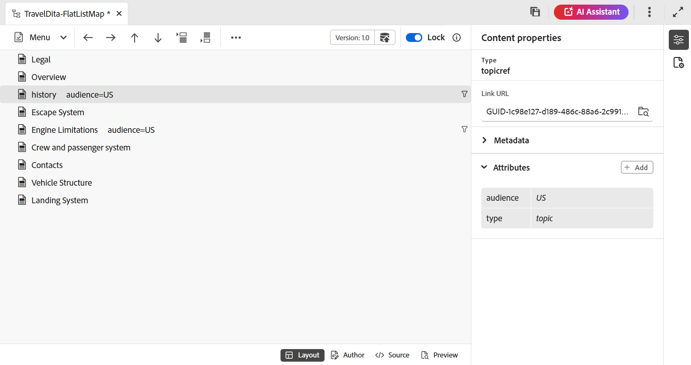{width="650" align="left"}

  如需詳細資訊，請檢視[顯示屬性](../cs-install-guide/workspace-settings.md#display-attributes)。

- **中繼資料**&#x200B;使用中繼資料，您可以設定中繼資料資訊。 您可以定義導覽標題、連結文字、簡短說明和關鍵字。

如需有關標準主題屬性和中繼資料的詳細資訊，請檢視OASIS DITA語言規格中的[topicref](https://docs.oasis-open.org/dita/v1.2/os/spec/langref/topicref.html)檔案。

**父級主題：** [地圖編輯器簡介](map-editor.md)
