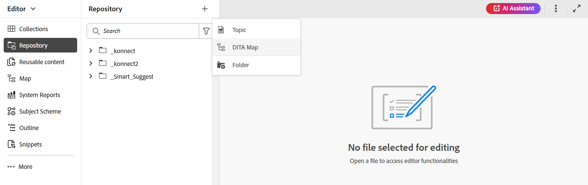
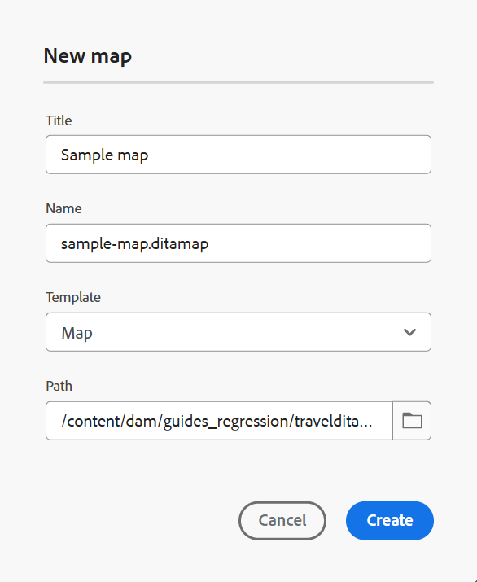
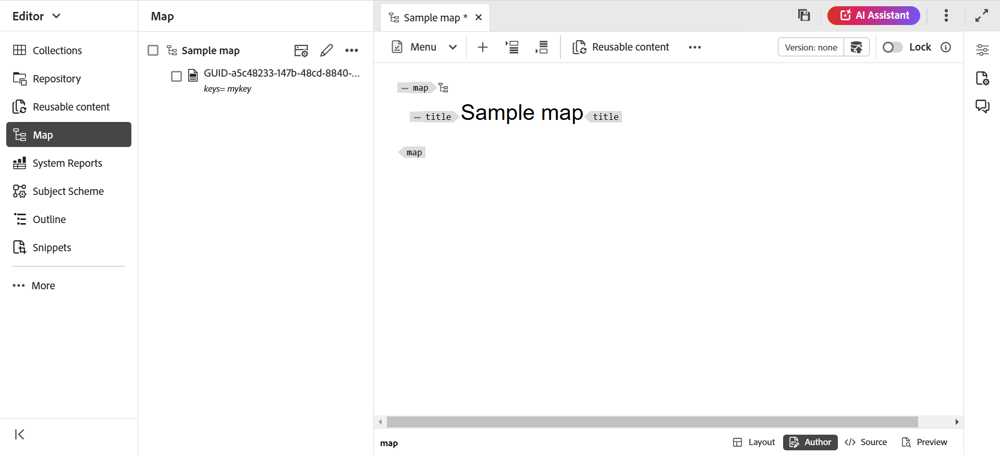
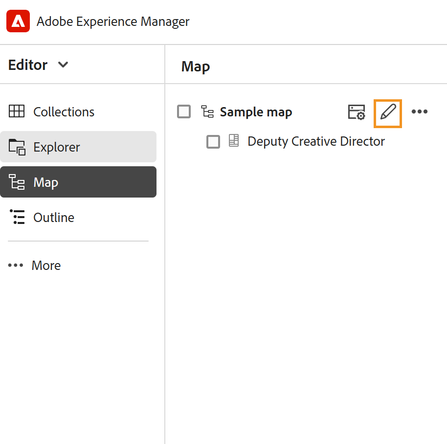
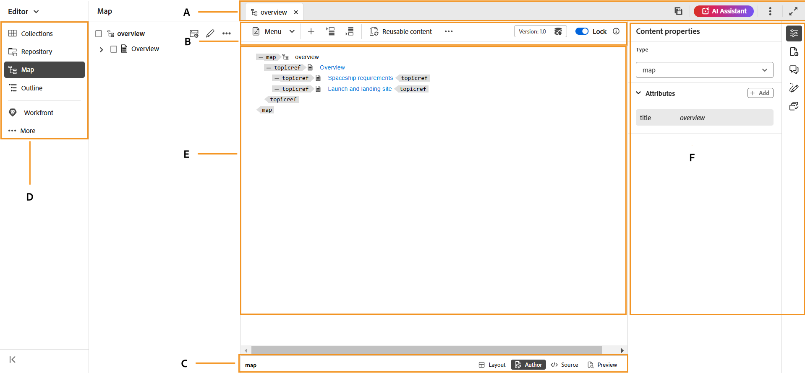
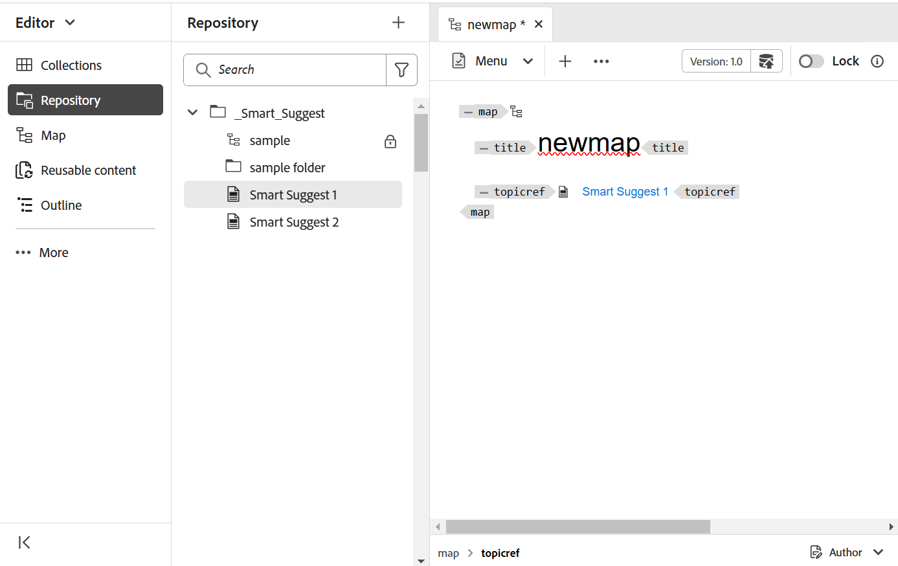
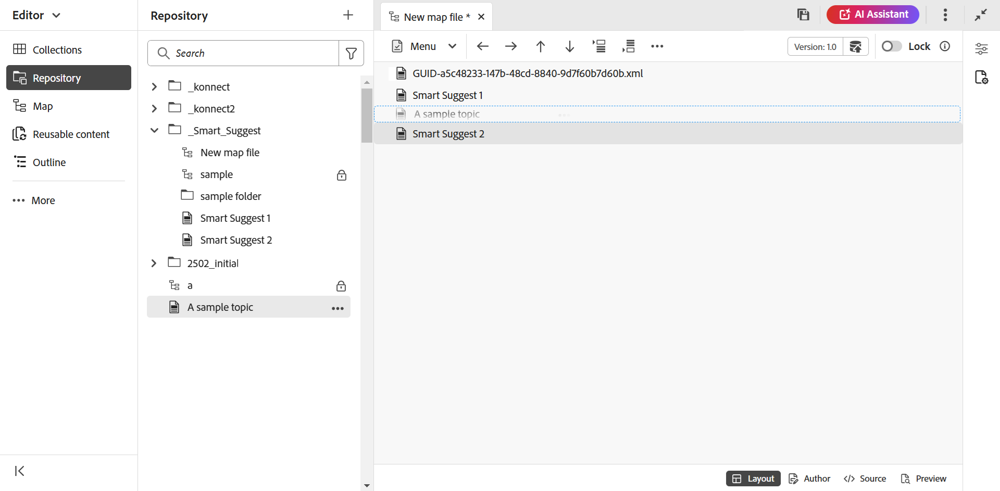
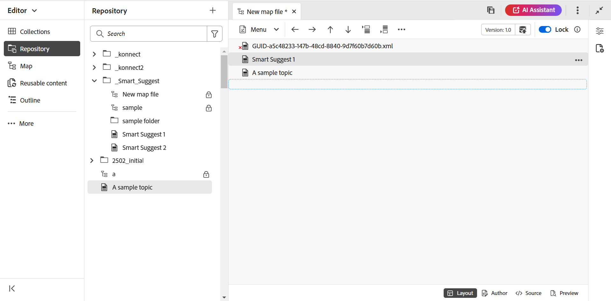
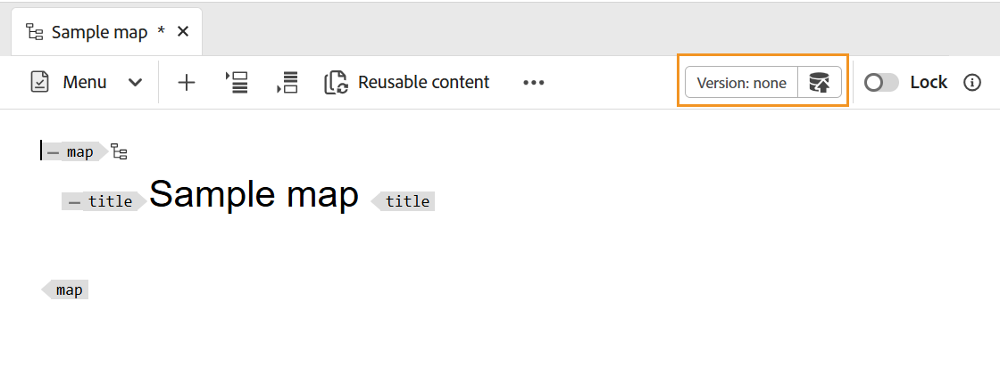

# 建立地圖 {#id176FEN0D05Z}

Adobe Experience Manager Guides提供兩個現成可用的地圖範本 — DITA map和Bookmap。 您也可以建立自己的地圖範本，並與作者共用這些範本，以建立地圖檔案。

執行以下步驟來建立對應：

1. 在「存放庫」面板中，選取&#x200B;**新增檔案**&#x200B;圖示，然後從下拉式功能表中選取&#x200B;**DITA Map**。

   {align="left"}

   您也可以從[Experience Manager Guides首頁](./intro-home-page.md)以及存放庫檢視中資料夾的選項功能表存取此選項。

2. 顯示&#x200B;**新地圖**&#x200B;對話方塊。

3. 在&#x200B;**新對應**&#x200B;對話方塊中，提供下列詳細資料：
   - 地圖的標題。
   - \(Optional\)*對應的檔案名稱。 會根據主題「標題」自動建議檔案名稱。 如果您的管理員已根據UUID設定啟用自動檔案名稱，則您將不會檢視「名稱」欄位。
   - 主題將依據的範本。 對應檔案可用的選項為&#x200B;**Bookmap**、**Map**&#x200B;和&#x200B;**主體配置**。
   - 您要儲存地圖檔案的路徑。 依預設，存放庫中目前所選資料夾的路徑會顯示在「路徑」欄位中。

   {width="300" align="left"}

4. 選取「**建立**」。

會在指定的路徑建立對應。 此外，對應會在「對應編輯器」中開啟以進行編輯。

{align="left"}

## 將主題新增至地圖檔案

除了直接從編輯器編輯對應檔案外，您也可以在對應中開啟主題檔案以編輯編輯器。 您可以將主題新增至地圖檔案。

執行以下步驟，從「對映」主控台將主題新增至對映檔案：

1. 在「存放庫」檢視中，導覽至並開啟您要編輯的對映檔案。
1. 選取&#x200B;**編輯**&#x200B;圖示。

   {width="450" align="left"}

1. 對應檔案會在對應編輯器中開啟。 如果您已開啟新的地圖檔案，則編輯器中只會顯示地圖的標題。

   {align="left"}

   - **A** - \（*索引標籤列*\）：這與編輯器的索引標籤列類似。 在編輯器中檢視[索引標籤列](./web-editor-features.md#tab-bar)以取得詳細資料。

   - **B** - \(*Toolbar*\)這是可讓您使用對應檔案的工具列。 如需透過工具列可用的功能的詳細資訊，請檢視地圖編輯器工具列中的[可用功能](#features-available-in-the-map-editors-toolbar)。

   - **C** - \（*地圖檢視*\）：可讓您在版面配置、作者、Source和預覽之間切換地圖編輯器。 **配置**&#x200B;檢視可讓您在DITA map中組織主題。 這會提供地圖的樹狀結構或階層檢視。 **作者**&#x200B;檢視可讓您在地圖編輯器中編輯主題。 這也會提供地圖檔案的WYSIWYG檢視。 **Source**&#x200B;檢視可讓您使用對應檔的基礎XML。 「預覽」可為您提供地圖檔案中所有主題和子地圖的整合檢視。

   - **D** - \（*左側面板*\）：提供左側面板的存取權，可讓您存取集合、存放庫、地圖、大綱和其他功能。 您可以選取「展開/摺疊」圖示來展開或摺疊它。 如需有關左側面板中可用功能的詳細資訊，請在編輯器中檢視[左側面板](./web-editor-features.md#left-panel)。

   - **E** - \（*中間區域*\）：對應內容編輯區域。

   - **F** - \（*右側面板*\）：提供屬性面板的存取權。 您可以檢視所選主題或地圖的內容屬性和地圖屬性。 如需此面板中可用功能的詳細資訊，請在編輯器中檢視[右側面板](web-editor-features.md#right-panel)。

1. 在左側面板中，切換至&#x200B;**存放庫**&#x200B;檢視。

1. 在Adobe Experience Manager存放庫中，導覽至包含您要新增之主題或子地圖的資料夾。

1. 在&#x200B;**存放庫**&#x200B;檢視中選取主題或地圖檔案，並將它拖放到\(middle\)地圖內容編輯區域中。

   主題會新增至地圖中。

   {align="left"}

1. 若要新增後續主題或子地圖，請拖放主題或子地圖至地圖中的必要位置。

   建置地圖檔案時，請考慮以下幾點：

   - 檔案會新增至地圖編輯區域中虛線矩形列出現的位置。 在下列熒幕擷圖中，將在&#x200B;*智慧型建議1*&#x200B;與&#x200B;*智慧型建議2*&#x200B;主題之間新增&#x200B;*範例主題*&#x200B;主題。

     {align="left"}

   - 若要取代主題，請將新主題拖放至要取代的主題上方。 若將其拖放到，表示該主題將被拖放其上的主題取代。

   - 如果您將子地圖新增至DITA map，則該子地圖會在DITA map中顯示為連結。 若要檢視子地圖的所有主題，請按Ctrl+按一下子地圖連結。 子地圖的內容會顯示在新的標籤中。 同樣地，若要從DITA map開啟主題，請按Ctrl+按一下主題連結，該連結會在新標籤中開啟。

   - 您可以使用快捷鍵CTRL+Z和CTRL+Y或它們各自的圖示來復原或重做地圖中的任何變更。

   - 若要變更主題的位置，請選取主題\（藉由選取主題圖示\），然後將其拖放到地圖檔案中的所需位置。 在下列熒幕擷圖中，主題&#x200B;*智慧型建議1*&#x200B;正移至&#x200B;*A範例主題*&#x200B;之後。

     {align="left"}

   - 若要檢查地圖檔案的屬性，請在地圖編輯區域的任意位置按一下滑鼠右鍵，然後從內容功能表中選擇&#x200B;**屬性**。 根據您的Adobe Experience Manager版本，您可以檢視屬性，例如中繼資料、排程\(de\)啟用、參考、檔案狀態等。

1. 選取「**儲存**」。

## 從Assets UI建立地圖

您也可以從Assets UI建立對應檔案，然後在對應編輯器中開啟該檔案以進行編輯。

執行以下步驟，從Assets UI建立地圖：

1. 在Assets UI中，導覽至您要建立地圖檔案的位置。

1. 選取&#x200B;**建立** \> **DITA對應**。

1. 在Blueprint頁面上，選取您要使用的對應範本型別，然後選取&#x200B;**下一步**。

   >[!NOTE]
   >
   > 在對應檔案中參照主題的方式取決於對應範本。 例如，如果您選取「對應」範本，則主題參照\(`topicref`\)會用來參照主題。 若是Bookmap，主題參考是使用DITA中的`chapter`元素所建立。

   {align="left"}

1. 在[屬性]頁面上，指定對應&#x200B;**標題**。

1. \（選用\）指定檔案&#x200B;**名稱**。

   如果您的管理員已根據UUID設定設定自動設定檔案名稱，則您將不會檢視指定檔案名稱的選項。 系統會自動為檔案指定以UUID為基礎的檔案名稱。

   如果檔案命名選項可用，也會根據您對映的標題自動建議名稱。 如果您要手動指定對應檔案名稱，請確定檔案名稱不含任何空格、單引號或大括弧，且結尾為`.ditamap`。

1. 選取「**建立**」。

   便會顯示「已建立對應」訊息。

   您從Assets UI或編輯器建立的每個新對應檔案都會獲得唯一對應ID。 此外，新地圖也會儲存為DAM中的最新工作副本。 除非儲存新建立對映的修訂版本，否則不會在「版本記錄」中檢視任何版本號碼。 如果您開啟地圖進行編輯，版本資訊會顯示在地圖檔案之索引標籤的右上角：

   {align="left"}

   新建立的地圖的版本資訊顯示為&#x200B;*none*。 儲存新版本時，會為其指定版本編號1.0。如需有關儲存新版本的詳細資訊，請檢視[另存為新版本](web-editor-features.md#save-as-new-version)。

   您可以選擇在設定的對應編輯器中開啟對應以進行編輯，或將對應檔案儲存在Adobe Experience Manager存放庫中。

   >[!NOTE]
   >
   > 若要使用「進階地圖編輯器」，請存取編輯器中的地圖檔案。 如果您的管理員已將「進階對應編輯器」設定為對應檔案中的預設編輯器，則對應檔案會直接在「進階對應編輯器」中開啟以進行編輯。 檢視&#x200B;*在安裝和設定Adobe Experience Manager Guides as a Cloud Service中，將進階地圖編輯器設定為預設值*&#x200B;區段。

### 從Assets UI將主題新增至地圖檔案

執行以下步驟，從Assets UI將主題新增至地圖檔案：

1. 在Assets UI中，導覽至您要編輯的地圖檔案。

   >[!NOTE]
   >
   > 確認您尚未啟用資產選取模式。

1. 若要取得對應檔的獨佔鎖定，請選取對應檔，然後選取頂端的&#x200B;**簽出**&#x200B;選項。

   >[!NOTE]
   >
   > 一旦您擁有對應檔案的獨佔鎖定，其他使用者將無法編輯對應。 但是，他們能夠處理對應檔案中的主題。 如果您的管理員已將您的編輯器設定為在編輯之前鎖定檔案，則您將無法編輯該檔案，直到您將其鎖定為止。

1. 選取地圖檔案後，選取&#x200B;**編輯主題**。

   {align="left"}

   或者，您也可以從對應檔案的動作功能表中選取&#x200B;**編輯主題**&#x200B;選項：

   {align="left"}

   將在編輯器中開啟對應檔案以進行編輯。 若要將主題新增至對映檔案，請依照[將主題新增至對映檔案](#add-topics-to-a-map-file)中的步驟(4-8)執行。

**父級主題： [地圖編輯器簡介](map-editor.md)
