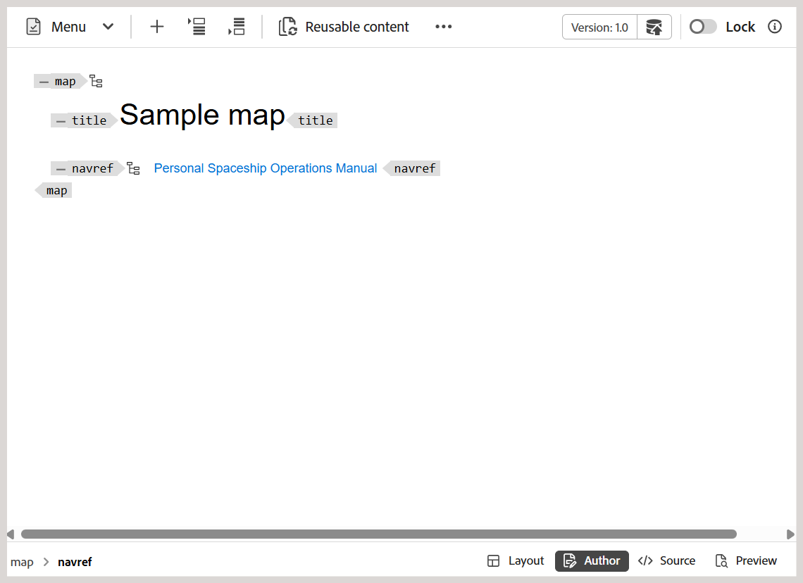

# 地圖編輯器中的其他功能 {#id1942D0T0HUI}

地圖編輯器中的部分常見功能包括：

## 解析關鍵參考 {#id176GD01H05Z}

DITA內容索引鍵參照，或`conkeyref`是將部分內容從一個主題插入另一個主題的機制。 此機制使用索引鍵來找出要重複使用的內容，而非直接內容參考機制。 如需在DITA中直接和間接參考的詳細資訊，請在OASIS DITA語言規格中檢視&#x200B;*DITA定址*。

如果DITA主題有關聯的關鍵參照，則需要先解析這些參照，才能預覽、編輯或檢閱主題。

主要參考會根據根對映集來解析，其優先順序如下：

1. 使用者偏好設定
1. 地圖檢視面板
1. 資料夾設定檔

在「使用者偏好設定」中選取的根目錄對映解析關鍵參照的優先順序最高，其次是「對映檢視」面板和「資料夾設定檔根目錄對映」。 因此，如果在「使用者偏好設定」中未設定對映，則會使用在「對映檢視」面板中開啟的對映。 如果未在「對映檢視」面板中開啟對映，則會使用「資料夾設定檔」中的對映集來解析關鍵參照。

金鑰參照可以儲存在DITA map檔案或單獨的DITA檔案中。 在Experience Manager Guides中，您可以在專案層級或作業階段層級指定關鍵參照。 如果已經為使用者作業階段定義了根對應，則會用來解析金鑰。 否則，會使用該資料夾的預設根對應。 如果未設定預設的根對應，則會向使用者反白缺少的關鍵參照。

透過定義要在下列位置使用的DITA map，有數種方法可解析DITA主題中的關鍵參照：

**專案屬性** — 您可以在[專案屬性]區段中建立專案時，定義根對映以解析索引鍵參考。

此根目錄對應將適用於與該專案關聯的所有資產\（資料夾和子資料夾\）。 對於在多個專案中參考的內容，會維護按字母順序排列的專案清單，並使用與第一個專案關聯的預設根對應。 您也可以從清單中選擇要用於解析關鍵參照的DITA map。

**主題預覽** — 在主題預覽模式中，選取工具列中的「金鑰解析度」圖示，並選取要用於金鑰參照的DITA檔案。

**主題編輯檢視** — 編輯DITA主題時選取「關鍵解析度」圖示，並選取要用於解析關鍵參考的DITA檔案。

## 新增導覽參考

`navref`元素在DITA map內使用，以包含來自其他DITA map的導覽參照。 這可讓作者重複使用導覽結構（例如共用功能表或連結），而不會將參照的地圖的實際內容合併到輸出中。

>[!NOTE]
>
> `navref`元素僅供地圖結構中的導覽使用。 它不會參與產生的DITA map輸出，且不會在「對映」檢視、「報表」、「基準線」、「轉譯」和「預覽」中進行處理和顯示。

若要將導覽參照新增至對映，請執行下列步驟：

1. 開啟要新增導覽參照的DITA map檔案。

   對應檔案會在對應編輯器中開啟。
1. 切換至「作者」檢視，並將游標置於導覽參考的有效位置。
1. 從工具列選取&#x200B;**元素**&#x200B;選項。
1. 在&#x200B;**插入專案**&#x200B;對話方塊中，選取&#x200B;**navref**。

   
1. 顯示&#x200B;**選取路徑**&#x200B;對話方塊。 選取要包含在地圖中作為導覽參考的地圖檔案，然後選擇&#x200B;**選取**。

所選地圖檔案的導覽參考會新增至指定位置。 此外，參考地圖的標題會顯示在「作者」檢視和「版面」檢視中。

*作者檢視*

*配置檢視*

**上層主題：**[&#x200B;地圖編輯器簡介](map-editor.md)
