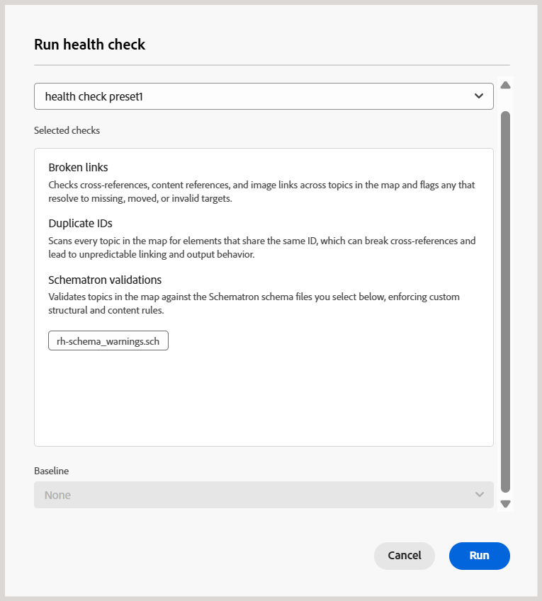
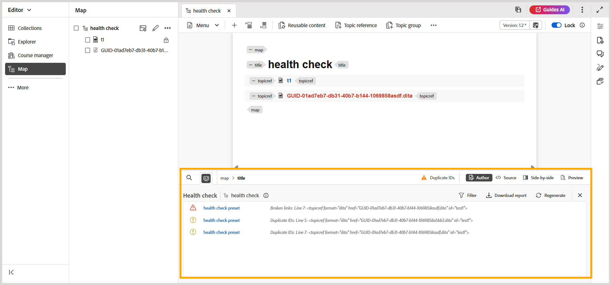

# 地圖編輯器中的其他功能 {#id1942D0T0HUI}

地圖編輯器中的部分常見功能包括：

## 解析關鍵參考 {#id176GD01H05Z}

DITA內容索引鍵參照，或`conkeyref`是將部分內容從一個主題插入另一個主題的機制。 此機制使用索引鍵來找出要重複使用的內容，而非直接內容參考機制。 如需在DITA中直接和間接參考的詳細資訊，請在OASIS DITA語言規格中檢視&#x200B;*DITA定址*。

如果DITA主題有關聯的關鍵參照，則需要先解析這些參照，才能預覽、編輯或檢閱主題。

主要參考會根據根對映集來解析，其優先順序如下：

1. 使用者偏好設定
1. 地圖檢視面板
1. 資料夾設定檔

在「使用者偏好設定」中選取的根目錄對映解析關鍵參照的優先順序最高，其次是「對映檢視」面板和「資料夾設定檔根目錄對映」。 因此，如果在「使用者偏好設定」中未設定對映，則會使用在「對映檢視」面板中開啟的對映。 如果未在「對映檢視」面板中開啟對映，則會使用「資料夾設定檔」中的對映集來解析關鍵參照。

金鑰參照可以儲存在DITA map檔案或單獨的DITA檔案中。 在Experience Manager Guides中，您可以在專案層級或作業階段層級指定關鍵參照。 如果已經為使用者作業階段定義了根對應，則會用來解析金鑰。 否則，會使用該資料夾的預設根對應。 如果未設定預設的根對應，則會向使用者反白缺少的關鍵參照。

透過定義要在下列位置使用的DITA map，有數種方法可解析DITA主題中的關鍵參照：

**專案屬性** — 您可以在[專案屬性]區段中建立專案時，定義根對映以解析索引鍵參考。

此根目錄對應將適用於與該專案關聯的所有資產\（資料夾和子資料夾\）。 對於在多個專案中參考的內容，會維護按字母順序排列的專案清單，並使用與第一個專案關聯的預設根對應。 您也可以從清單中選擇要用於解析關鍵參照的DITA map。

**主題預覽** — 在主題預覽模式中，選取工具列中的「金鑰解析度」圖示，並選取要用於金鑰參照的DITA檔案。

**主題編輯檢視** — 編輯DITA主題時選取「關鍵解析度」圖示，並選取要用於解析關鍵參考的DITA檔案。

## 新增導覽參考

`navref`元素在DITA map內使用，以包含來自其他DITA map的導覽參照。 這可讓作者重複使用導覽結構（例如共用功能表或連結），而不會將參照的地圖的實際內容合併到輸出中。

>[!NOTE]
>
> `navref`元素僅供地圖結構中的導覽使用。 它不會參與產生的DITA map輸出，且不會在「對映」檢視、「報表」、「基準線」、「轉譯」和「預覽」中進行處理和顯示。

若要將導覽參照新增至對映，請執行下列步驟：

1. 開啟要新增導覽參照的DITA map檔案。

   對應檔案會在對應編輯器中開啟。
1. 切換至「作者」檢視，並將游標置於導覽參考的有效位置。
1. 從工具列選取&#x200B;**元素**&#x200B;選項。
1. 在&#x200B;**插入專案**&#x200B;對話方塊中，選取&#x200B;**navref**。

   
1. 顯示&#x200B;**選取路徑**&#x200B;對話方塊。 選取要包含在地圖中作為導覽參考的地圖檔案，然後選擇&#x200B;**選取**。

所選地圖檔案的導覽參考會新增至指定位置。 此外，參考地圖的標題會顯示在「作者」檢視和「版面」檢視中。

*作者檢視*

*配置檢視*

## 在地圖上執行健康狀態檢查

快顯選單中的「執行健康狀態檢查」選項可讓您在選取的對應上執行健康狀態檢查，以在發佈之前擷取中斷連結、重複ID和Schematron驗證失敗等問題。

>[!NOTE]
>
> 此功能預設為啟用。 如果您不想在環境中使用此功能，請聯絡您的客戶成功團隊。

健康狀態檢查預設集定義了哪些檢查可以執行，由管理員在資料夾設定檔層級建立和管理。 如需詳細資訊，請檢視[建立和管理健康狀態檢查預設集](../install-conf-guide/conf-health-check-preset.md)。

執行以下步驟以對映執行健康狀態檢查：

1. 在編輯器中開啟對應。
1. 在[選項]功能表中，選取&#x200B;**執行健康狀態檢查**選項。
   
1. 隨即顯示「執行狀況檢查」對話方塊。 選取您要執行的健康狀態檢查預設集。 只有針對資料夾設定檔設定的預設集可供選取。

   選取預設集，在對話方塊中載入定義的檢查。

   
1. *選擇性*&#x200B;選取基準線。 如果您不想使用基準線，請選取&#x200B;**無**。
1. 選取&#x200B;**執行**。

您也可以從&#x200B;**健康狀態檢查報告**&#x200B;面板對地圖執行健康狀態檢查。 對此，請在地圖檢視中開啟地圖，然後選取&#x200B;**健康狀態檢查報告**&#x200B;圖示。

>[!NOTE]
>
>此選項只會在尚未執行健康情況檢查的地圖上顯示。 如果已在地圖上執行健康狀態檢查，則選取&#x200B;**健康狀態檢查報告**&#x200B;圖示會開啟現有的報告。

在面板中，選取&#x200B;**執行健康狀態檢查**。

這會開啟相同的&#x200B;**執行健康狀態檢查**&#x200B;對話方塊，您可以在其中選取健康狀態檢查預設集和基準線，以在地圖上執行健康狀態檢查，如上述步驟所述。

## 在編輯器中使用健康情況檢查報告

當您執行地圖的健康情況檢查時，報告會在&#x200B;**健康情況檢查報告**&#x200B;面板中開啟，如下所示：

### 健康狀態檢查報告面板選項

健康狀態檢查報告面板中有以下選項：

- **對應名稱**：產生報表的對應名稱。
- **資訊圖示**：選取此選項可檢視用來產生報表的預設集名稱、對應版本和基準線（如果有的話）。
- **篩選器**：將報表縮小為特定規則，例如只檢視「中斷連結」結果。 篩選器只會列出在目前報表中產生結果的規則型別。
- **下載報告**：下載報告。
- **重新產生**：再次執行健康狀態檢查。

### 健康情況檢查結果

所選檢查產生的每個結果都會列出以下詳細資訊：
- **嚴重性**：結果的嚴重性等級，例如Error、Warning、Info或Fatal。
- **健康狀態檢查預設集名稱**：用來產生報告的健康狀態檢查預設集名稱
- **規則名稱**：產生結果的規則，例如「中斷的連結」或「重複識別碼」。
- **行號**：檔案中發生問題的行。
- **資產**：發現問題的檔案。

選取結果，以在問題持續存在的確切行處開啟對應的檔案。

>[!NOTE]
>
>中斷的連結結果會在作者模式中開啟檔案。 重複的ID和Schematron驗證結果會在Source模式下開啟檔案。

### 重新產生報告

修正問題後，在工具列中選取「**重新產生**」以再次執行健康狀態檢查並確認問題已解決。 在顯示的&#x200B;**重新產生**&#x200B;對話方塊中，選取要包含在重新產生報表中的檢查。

>[!NOTE]
>
> 健康情況檢查報告是特定於產生這些報告的使用者的。 如果多位使用者針對相同地圖產生報表，每位使用者都會檢視自己的結果。 但是，管理員始終可以存取針對該地圖產生的最新報告。

### 下載報表

選取&#x200B;**下載報告**，以XLS格式下載報告，其中包含每個結果的詳細資訊。

**上層主題：**[&#x200B;地圖編輯器簡介](map-editor.md)
