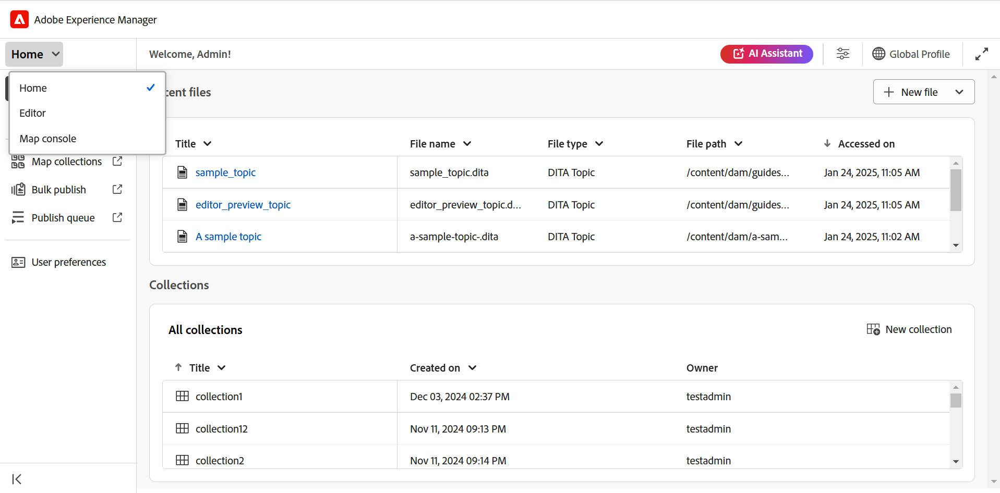
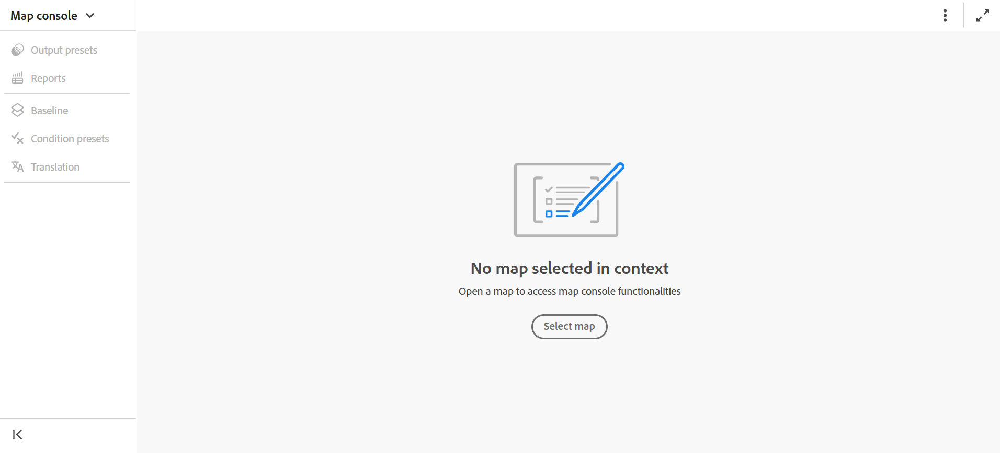
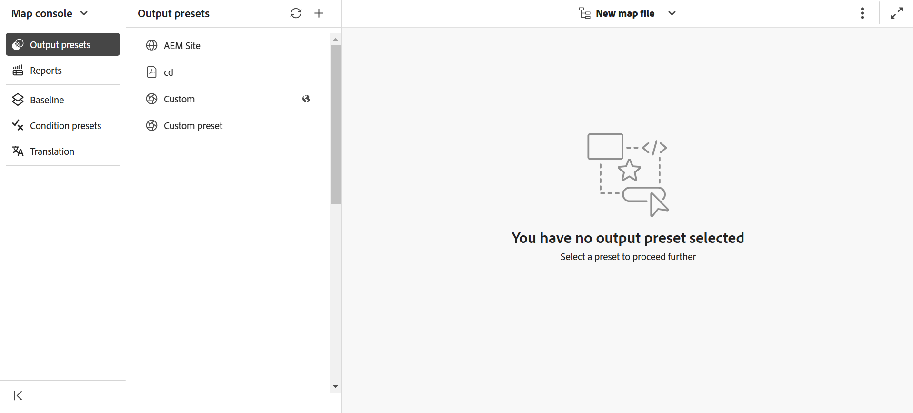
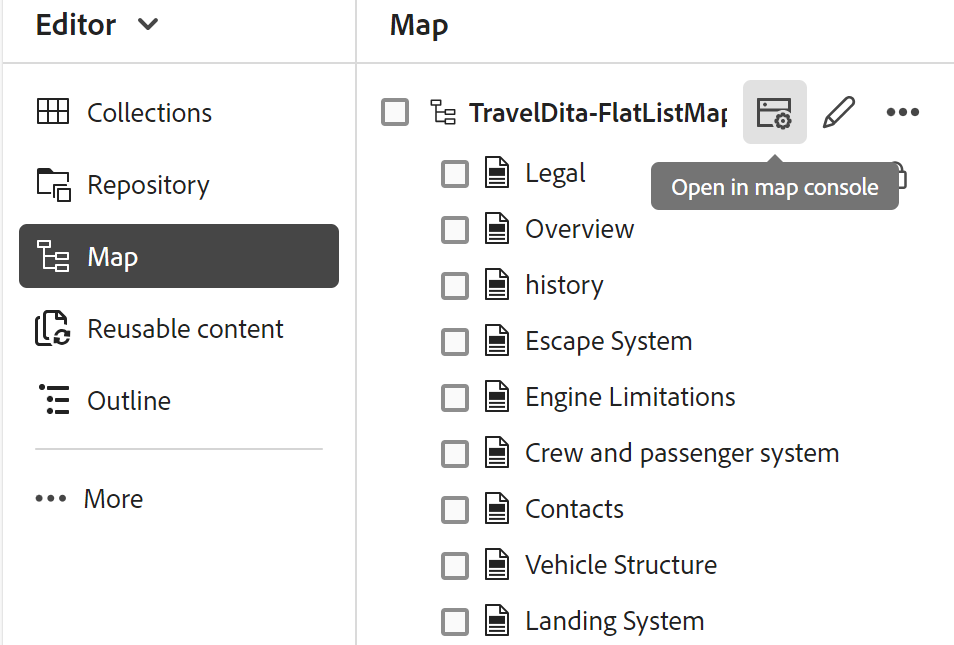

# 在地圖控制檯中開啟檔案

執行以下步驟，在Map主控台中開啟DITA map檔案：

1. 從首頁開啟&#x200B;**地圖主控台**。

   {width="800"align="left"}

2. 由於未選取對映檔案，因此系統會提示您選取一個對映檔案以使用對映管理和發佈功能。

   

3. 選擇&#x200B;**選取map**，並選取DITA map檔案所在的路徑。

   對應檔案會在Map主控台中開啟。 依預設，已選取&#x200B;**輸出預設集**&#x200B;索引標籤。

   {width="800"align="left"}

   >[!NOTE]
   >
   >  在地圖主控台中開啟的地圖會與編輯器中的地圖檢視同步。

## 從編輯器開啟對應檔案

您也可以從編輯器在「對應」主控台中開啟現有的對映檔案。

1. 瀏覽至「儲存庫」檢視中的DITA map檔案並加以選取。

   對應檔案會在「對應」檢視中開啟。

2. 選取&#x200B;**在地圖主控台中開啟**&#x200B;圖示。

   對應檔案會在Map主控台中開啟。

   {align="left"}
