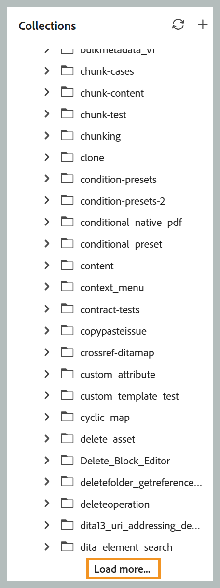
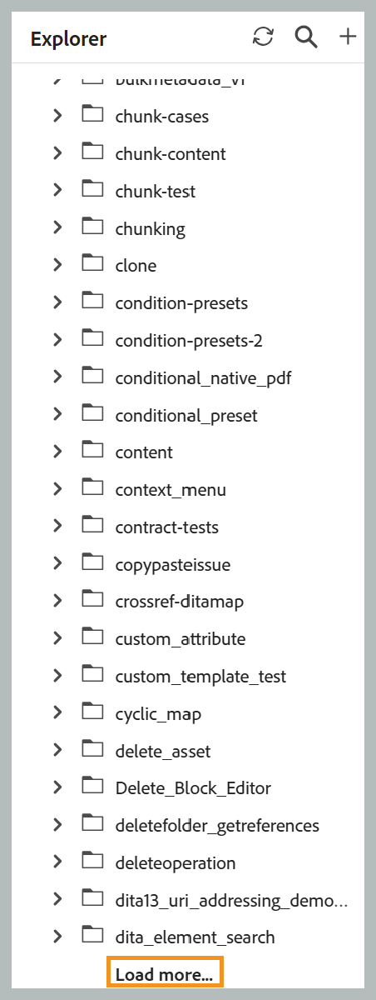
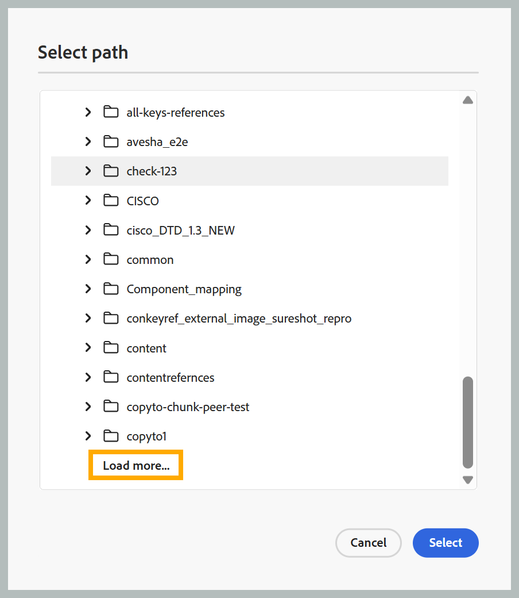

## 檔案和資料夾的分頁載入

>[!NOTE]
>
> 此功能預設為啟用。 若要加以停用，請聯絡您的客戶成功團隊。

Experience Manager Guides使用分頁API來載入檔案和資料夾。 資料夾不是一次載入所有內容，而是以批次方式逐步載入，當您捲動或選取&#x200B;**載入更多**&#x200B;選項時，會自動擷取其他資產。

排序是在伺服器端執行，因此套用排序順序會擷取最新排序的結果，而非重新排序瀏覽器中已載入的資料。 重新命名、刪除、新增和移動等常見操作不會再重新載入整個資料夾。 相反地，他們只會更新受影響的專案或重新整理結果的第一個頁面。 *永遠在Explorer*&#x200B;中尋找檔案功能也不再可用。 對於任何資產，您仍然可以使用內容功能表在Explorer中尋找檔案。

以下各節將說明每個選項如何套用於不同的介面、面板和對話方塊。

### 主存放庫表格

- **瀏覽**：使用無限捲動。 資產的第一批次最初載入；後續批次會在您捲動時自動附加。 切換資料夾會清除目前清單，並從新選取的資料夾載入資產。
- **重新命名**：就地；沒有資料夾重新整理。
- **刪除**：根資料夾會重新整理以顯示第一批資產。
- **新增**：新檔案已插入到（目前資料夾的）頂端。 檔案狀態、鎖定狀態、檔案型別、建立日期和其他詳細資料等其他中繼資料會從單一批次背景要求中擷取，並在一段時間後自動填入。
- **移動**：將檔案移至使用中資料夾時，會在頂端新增檔案；將檔案移出使用中資料夾，會將資料夾重新整理為其第一批資產。
- **重新整理按鈕**：重新載入作用中的資料夾，顯示第一批資產。
- **排序**：顯示具有無限捲動的第一個排序頁面。
- **資料夾導覽面板**：開啟資料夾會載入第一批資產，並為後續的批次附加&#x200B;**載入更多**&#x200B;選項。

  資料夾導覽面板的{width="650"}

### 集合

- 新增檔案會將其插入資料夾頂端，而不重新整理資料夾。
- 開啟資料夾會載入第一批資產，並為後續的批次附加&#x200B;**載入更多**&#x200B;選項。

  集合{width="650"}的分頁

### 總管

- **根資料夾**：無限捲動。 資產的第一批最初載入；後續批次會在您捲動時自動附加。
- **子資料夾**：展開資料夾會載入第一批資產，並為後續的批次附加&#x200B;**載入更多**&#x200B;選項。

  總管{width="650"}的頁面

- **重新命名**：不重新整理資料夾，就位進行。
- **刪除**：根資料夾會重新整理以顯示第一批資產。
- **新增或複製**：新檔案會顯示在資料夾頂端。
- **移動**：在不相關的資料夾之間移動會將來源資料夾重新整理為其第一批資產，並在目的地頂端新增專案（如果尚未開啟目的地，則會載入該目的地的第一批資產）。
- **重新整理**： Explorer面板標題中的新重新整理按鈕會重新載入根層級，顯示第一批資產。

### 搜尋面板

- 瀏覽搜尋結果使用無限捲動。 資產的第一批最初載入；後續批次會在您捲動時自動附加。

### 範本面板

- 根層級只會顯示&#x200B;**對應**&#x200B;和&#x200B;**主題**&#x200B;類別。 展開子資料夾會載入第一批資產，並為後續批次附加&#x200B;**載入更多**&#x200B;選項。

### 選取路徑對話方塊

- 每個資料夾節點都會載入第一批資產，並附加&#x200B;**載入更多**&#x200B;選項供後續批次使用。

  選取路徑對話方塊的{width="650"}

- 當對話方塊開啟並導覽至特定目標路徑時，樹狀結構會自動從根展開至目標。 沿著路徑載入的資料夾具有較大的頁面大小，而目標資料夾載入的標準批次大小。