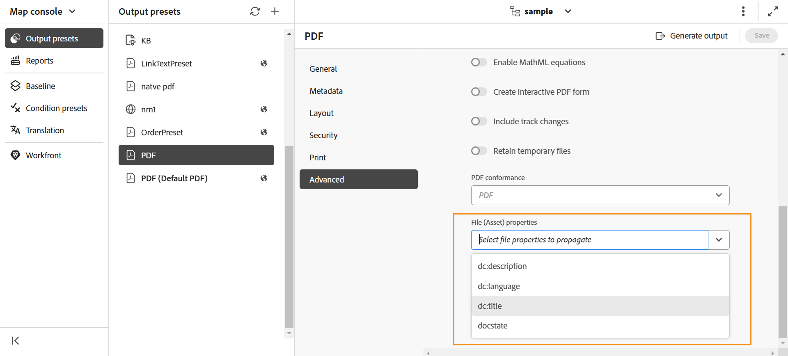
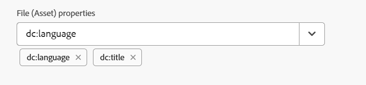

# 使用DITA-OT將中繼資料傳遞至輸出 {#id21BJ00QD0XA}

中繼資料是輸出的其他資訊。 在Adobe Experience Manager Guides中，您可以傳遞現有的中繼資料或建立自訂中繼資料標籤。 您可以使用DITA-OT發佈將中繼資料傳遞至AEM、PDF、HTML5、EPUB和自訂格式輸出。

有兩種方法可使用DITA-OT將中繼資料傳遞給輸出：

- [使用地圖主控台](#using-map-console)
- [使用地圖儀表板](#using-map-dashboard)

## 使用地圖主控台

執行以下步驟，使用DITA-OT發佈將中繼資料傳遞至輸出：

1. [在對應主控台](./open-files-map-console.md)中開啟DITA map檔案，您想要將中繼資料傳遞至DITA-OT。
1. 選取並開啟您要將中繼資料欄位傳遞到的輸出預設集。 例如，選取「PDF輸出預設集」。 確定它是使用&#x200B;**DITA-OT**&#x200B;選項建立的。
1. 從&#x200B;**檔案屬性**&#x200B;下拉式清單中，選取您要傳遞至DITA-OT發佈的中繼資料。

   {align="left"}

   「屬性」下拉式清單會同時列出自訂和預設屬性。 例如，在上述熒幕擷圖中，`dc:description`、`dc:language`、`dc:title`和`docstate`為預設屬性。

   >[!NOTE]
   >
   > 這些屬性是從下列位置可用的metadataList檔案中挑選的： `/libs/fmdita/config/metadataList`。 依預設，此檔案中有四個屬性 — `dc:description`、`dc:language`、`dc:title`和`docstate`。

   此檔案可覆蓋於： `/apps/fmdita/config/metadataList`。

   若要傳遞您已為其定義值的自訂屬性，請檢視[在DITA-OT PDF輸出中使用AEM中繼資料](https://experienceleaguecommunities.adobe.com/t5/xml-documentation-discussions/use-aem-metadata-in-dita-ot-pdf-output/td-p/411880)。

1. 選取的屬性會列在下拉式清單下方。

   {width="300" align="left"}

1. 選取右上方的&#x200B;**儲存**&#x200B;以儲存變更。
1. 選取&#x200B;**產生輸出**。

選取的中繼資料屬性會傳遞至使用DITA-OT產生的輸出。

>[!NOTE]
>
> 自2502年Experience Manager Guides發行版本開始，已棄用透過DITA-OT命令列傳遞根對應中繼資料引數的功能。 但是，為了避免任何中斷，`Config.Manager`中已新增屬性，以啟用或停用該功能。  如需詳細資訊，請檢視[設定輸出產生設定](../cs-install-guide/conf-output-generation.md#configure-the-dita-ot-command-line-arguement-field-on-the-dita-map-dashboard)。

## 使用地圖儀表板

如果使用&#x200B;**Assets UI**，請執行下列步驟，以使用DITA-OT發佈將中繼資料傳遞給輸出：

1. 在&#x200B;**Assets UI**&#x200B;中，導覽至並選擇您要傳送中繼資料至DITA-OT的DITA map檔案。
1. 選取並編輯您要將中繼資料欄位傳遞到的輸出預設集。 例如，選取「PDF輸出預設集」。
1. 在選取的輸出預設集中選取&#x200B;**DITA-OT**&#x200B;選項。

   {align="left"}

1. 從屬性下拉式清單中選取您要傳遞至DITA-OT發佈的中繼資料。

   「屬性」下拉式清單會同時列出自訂和預設屬性。 例如，在上述熒幕擷圖作者中，是自訂屬性，而`dc:description`、`dc:language`、`dc:title`和`docstate`是預設屬性。

   >[!NOTE]
   >
   > 這些屬性是從下列位置可用的metadataList檔案中挑選的： `/libs/fmdita/config/metadataList`。 依預設，此檔案中有四個屬性 — `dc:description`、`dc:language`、`dc:title`和`docstate`。

   此檔案可覆蓋於： `/apps/fmdita/config/metadataList`。

   若要傳遞您已為其定義值的自訂屬性，請檢視[在DITA-OT PDF輸出中使用AEM中繼資料](https://experienceleaguecommunities.adobe.com/t5/xml-documentation-discussions/use-aem-metadata-in-dita-ot-pdf-output/td-p/411880)。

1. 從&#x200B;**屬性**&#x200B;下拉式清單中，選取必要的自訂和預設屬性。 例如，選取`author`、`dc:title`和`dc:description`。 這些是在我們建立檔案後建立的標準`metadata/properties`。 選取的屬性會列在下拉式方塊下方。

   {width="300" align="left"}

1. 選取左上方的&#x200B;**完成**&#x200B;以儲存變更。
1. 產生輸出。

選取的中繼資料屬性會傳遞至使用DITA-OT產生的輸出。

**父級主題：**[&#x200B;輸出產生](generate-output.md)
