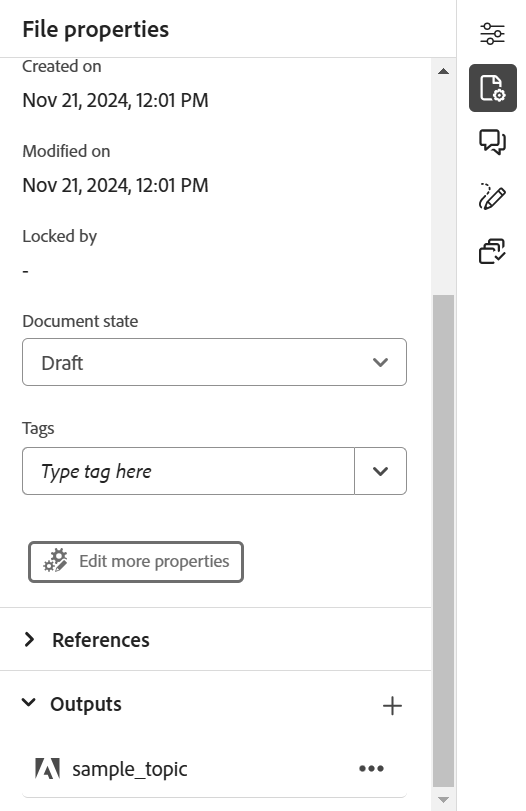

# 發佈Adobe Experience Manager Sites頁面

Experience Manager Sites頁面是指在Adobe Experience Manager網站上發佈的內容。 Experience Manager Guides可讓您將獨立主題發佈至網站頁面。

此功能可讓您發佈主題及其元素，而不需建立DITA map和輸出預設集。 您可以輕鬆更新主題、重新發佈Sites頁面，並在不同網頁中重複使用它。 使用此功能，您可以輕鬆發佈獨立文章或行銷內容。

若要產生「網站」頁面，請執行下列步驟：

1. 在編輯器中開啟主題，然後從右側面板中選取&#x200B;**檔案屬性**。
1. 從&#x200B;**輸出**&#x200B;區段中選取圖示&#x200B;**新輸出圖示**。
1. 選取&#x200B;**網站頁面**。
1. 在&#x200B;**產生網站頁面**對話方塊中，填入下列詳細資料：
   ![在[產生網站]頁面中新增路徑與範本詳細資料](images/aem-sites-page-generate.png){width="500" align="left"}

   * **路徑**：瀏覽並選取您要發佈Sites頁面的資料夾路徑。
   * **標題**：輸入Sites頁面的標題。 依預設，標題會填入主題的標題。 您可以編輯它。 此標題用於產生Sites頁面的名稱。
   * **名稱**：輸入Sites頁面的名稱。 依預設，名稱會填入主題標題，且不允許的字元（例如空格和特殊字元）會取代為「_」。 例如，*sample_sites_page*。 您可以編輯它。 此名稱用於產生「網站」頁面的URL。
   * **頁面範本**：選取網站頁面範本，以建立您的網站頁面。 您可以在所選路徑上的資料夾中檢視範本。 您的管理員也可以上傳自訂範本。

   * 您也可以選取不同的條件來發佈內容。 選取下列其中一個選項：

      * **無**：如果您不想在發佈的輸出上套用任何條件，請選取此選項。
      * **使用DITAVAL**：選取DITAVAL檔案以產生個人化內容。 您可以使用瀏覽對話方塊或輸入檔案路徑來選取DITAVAL檔案。
      * **使用屬性**：您可以在DITA主題中定義條件屬性。 然後，選取條件屬性以發佈相關內容。

     >[!NOTE]
     > 
     >只有在主題中定義了條件屬性時，才會啟用條件。

1. 選取&#x200B;**產生**&#x200B;以發佈網站頁面。
1. 您可以在&#x200B;**檔案屬性**&#x200B;的&#x200B;**輸出**&#x200B;區段下，檢視主題的「網站」頁面。 Sites頁面會根據其發佈的日期和時間顯示，最新的頁面為第一個頁面。

   {width=300 align="left"}的網站頁面

   *檢視主題的Sites頁面並重新發佈。*

發佈Sites頁面後，您也可以在任何Adobe Experience Manager網站上使用。

## Experience Manager Sites的選項選單

您也可以從&#x200B;**選項**&#x200B;功能表為Experience Manager Sites執行下列動作：

* **產生**：重新發佈Sites頁面，以使用DITA主題的最新內容更新它。 當您在不變更路徑、名稱、標題、範本和條件的情況下重新產生輸出時，網站頁面只會以最新內容更新。

* **複製**：複製網站頁面。 您可以變更路徑、名稱、標題及範本。 複製Sites頁面時，您也可以選取不同的條件。

* **移除**：從輸出清單移除網站頁面。 確認提示隨即出現。 一旦您確認，網站頁面就會從&#x200B;**輸出**&#x200B;清單中移除。 但是，「網站」頁面不會永久刪除。

* **檢視**：檢視網站頁面編輯器。 您也可以進行變更並儲存。
