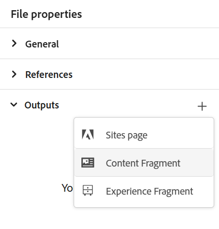
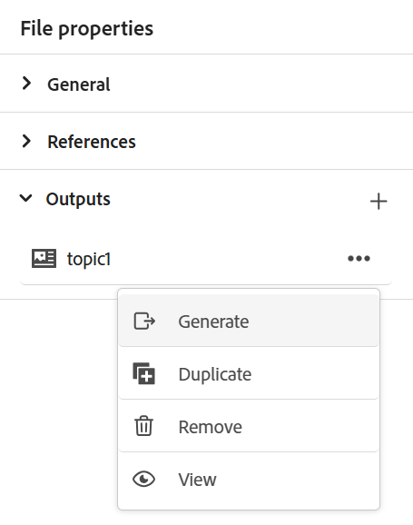

# 發佈內容片段

內容片段是Adobe Experience Manager中的分散式內容片段。 它們是以內容模型為基礎的結構化內容。 內容片段是純內容，沒有設計或版面配置資訊。 可獨立於Adobe Experience Manager支援的管道之外獨立編寫和管理這些管道。 內容片段為模組化，其中內容會劃分為較小的元件。

Experience Manager Guides可讓您將主題或其元素發佈至內容片段。

>[!NOTE]
>
>您只能在主題中選擇已定義ID屬性的元素。

若要建立內容片段，請執行以下步驟：

1. 在Adobe Experience Manager Assets中建立[內容片段模型](https://experienceleague.adobe.com/docs/experience-manager-65/assets/content-fragments/content-fragments-models.html?lang=zh-Hant)。
1. 建立一個資料夾，您想在其中儲存根據內容片段模式建立的內容片段。 例如，「stock-content-fragments」。
1. 編輯資料夾的屬性（例如「stock-content-fragments」）並新增資料夾的路徑，其中包含雲端設定中的內容片段模式。
例如，在雲端設定中新增`/conf/we-retail`。 此設定將所有內容片段模式與資料夾連線。\
   {width="650" align="left"}
   *在資料夾屬性中新增雲端設定，以將其與片段模型連線。*

1. 若要產生內容片段，請從主題&#x200B;**檔案屬性**&#x200B;的&#x200B;**輸出**&#x200B;區段中，選取&#x200B;**新輸出** 。
1. 選取&#x200B;**內容片段**。\
    {width="300" align="left"}

   *從主題*&#x200B;的檔案屬性加入新的內容片段。

1. 在「**產生內容片段**」對話方塊中，在「**一般**」和「**對應**」標籤下填入下列詳細資料。

   **一般**&#x200B;標籤
   ![在[以內容片段形式發佈]對話方塊中新增片段模型和對應詳細資料](images/generate-content-fragment.png)
   *新增路徑、名稱、標題和條件篩選，將主題或其元素發佈為內容片段。*

   * **路徑**：瀏覽並選取您要發佈內容片段的資料夾路徑。 如果您選取現有的內容片段，這會覆寫對應欄位的內容。
   * **Title**：輸入內容片段的標題。 依預設，標題會填入主題的標題。 您可以編輯它。 此標題用於產生內容片段的名稱。
   * **名稱**：輸入內容片段的名稱。 依預設，名稱會填入主題的標題，而空格會取代為「_」。 例如，*sample_content_fragment*。 您可以編輯它。  此名稱用於產生內容片段的URL。

   * 您可以選取不同條件來建立內容片段變體。 選取下列其中一個選項：

     >[!NOTE]
     > 
     > 只有在主題中定義了條件屬性時，才會啟用條件。

      * **無**：如果您不想在發佈的輸出上套用任何條件，請選取此選項。
      * **使用DITAVAL**：選取DITAVAL檔案，以在產生的輸出中包含或排除特定內容。 您可以使用瀏覽對話方塊或輸入檔案路徑來選取DITAVAL檔案。
      * **使用屬性**：您可以在DITA主題中定義條件屬性。 然後，選取條件屬性以發佈相關內容。

   **對應**&#x200B;索引標籤

   ![在[以內容片段形式發佈]對話方塊中新增片段模型和對應詳細資料](images/content-fragment-mapping.png)

   *選取內容片段模式，並新增對應詳細資訊，以發佈主題或其元素做為內容片段。*

   * **模式**：選取您要用來建立內容片段的內容片段模式。 模型會從您已在Experience Manager Guides伺服器上設定的資料夾中選取。
   * **對應**：您可以檢視已套用ID屬性的主題元素。 將主題元素拖曳至內容片段模式中顯示的欄位。
若有現有內容片段，右側會填入已發佈的內容片段內容。 如有必要，可以用主題內容覆寫這些內容。 您也可以選取&#x200B;**復原**&#x200B;以還原對應變更。

     >[!NOTE]
     >
     > 如果您使用的是4.4或更早版本，請從下拉式清單中選取對應。 它會從&#x200B;*contentFragmentMapping.json*&#x200B;檔案中挑選對應。  您的管理員可以在&#x200B;*contentFragmentMapping.json*&#x200B;檔案中新增對應。 進一步瞭解如何在安裝及設定指南中[建立主題與內容片段之間的對應](../cs-install-guide/conf-content-fragment-mapping-cs.md)。

1. 選取&#x200B;**產生**&#x200B;以發佈內容片段。

1. 您可以在&#x200B;**檔案屬性**&#x200B;的&#x200B;**輸出**&#x200B;區段下檢視主題的內容片段。

   {width="300" align="left"}的內容片段

   *檢視主題的內容片段並重新發佈。*

發佈內容片段後，您也可以在任何Adobe Experience Manager網站中使用這些片段。

## 內容片段的「選項」選單

您也可以從&#x200B;**選項**&#x200B;功能表為內容片段執行下列動作：

* **產生**：重新發佈內容片段，以使用DITA主題的最新內容加以更新。 當您重新產生輸出時，您可以變更內容片段的路徑、名稱、標題、模式和對應。 您也可以在再生輸出時選取不同的條件。

* **重複**：重複內容片段。 您可以變更路徑、名稱、標題、模型與對應。 當您複製內容片段以建立內容片段變體時，也可以選取不同的條件。

* **移除**：從輸出清單移除內容片段。 確認提示隨即出現。 確認後，內容片段會從&#x200B;**輸出**&#x200B;清單中移除。

  >[!NOTE]
  >
  > 此動作不會從內容片段中刪除任何內容。

* **檢視**：檢視內容片段編輯器。 您也可以進行變更並儲存。