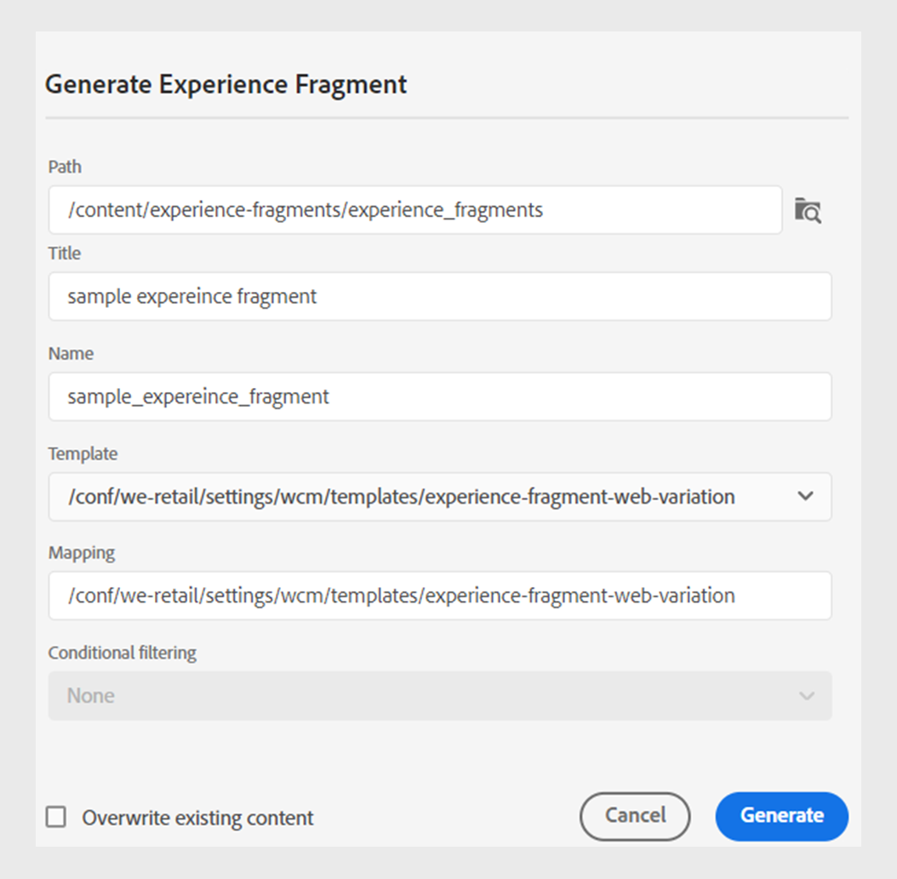

# 發佈體驗片段

體驗片段是Adobe Experience Manager中的模組化內容片段。 這些內容區塊是以範本為基礎，並封裝內容及其版面。 這些可重複使用的內容片段可讓內容建立者跨越Experience Manager支援的多個管道，組合併提供一致、可擴充的體驗。 此功能可協助您有效率地輕鬆建立一致的行銷體驗，例如電子報、促銷橫幅和客戶口碑。

Experience Manager指南可讓您將主題或其元素發佈到體驗片段。 您可以在主題與其體驗片段中的元素之間建立JSON型對應。 然後，使用對應將主題或其元素發佈到體驗片段。 然後，您可以在任何Experience Manager網站中使用體驗片段，或透過體驗片段支援的API擷取詳細資料。

若要產生體驗片段，請執行以下步驟：

1. 在體驗片段中建立資料夾。 使用此資料夾來儲存您根據體驗片段範本建立的體驗片段。 例如， *sales-experience-fragments*.
1. 選取資料夾，然後選取 **屬性** 圖示加以檢視。
1. 編輯資料夾的屬性(例如 *sales-experience-fragments*)。

   * **標題**：檢視或編輯資料夾標題。

   * **允許的範本**：包含可新增為Experiencefragment子頁面的範本清單。 若要新增允許的範本，請指定規則運算式，以擷取 **允許的範本** 欄位。
例如：
     `/libs/cq/experience-fragments/components/experiencefragment/template`

     如果您沒有為資料夾定義允許的範本，則預設會從父資料夾或範本資料夾中挑選範本。
   * **可排序**：可讓您變更資料夾內資產的順序。
     {width="650" align="left"}
     *在資料夾屬性中新增雲端設定，以將其與片段範本連線。*
1. 若要產生體驗片段，請選取 **新輸出**  從 **輸出** 中的區段 **檔案屬性** 主題的。
1. 選取 **體驗片段**.\
   {width="300" align="left"}

   *從主題的檔案屬性新增體驗片段*.

   >[!NOTE]
   >
   > 您也可以從發佈體驗片段 **存放庫檢視**. 選取您要發佈為體驗片段的主題。 然後，從 **選項** 功能表，選取 **發佈為** > **體驗片段**.

1. 在 **產生體驗片段** 對話方塊中，填入下列詳細資訊：
   {width="500" align="left"}

   *新增路徑、範本和對映詳細資訊，將主題或其元素發佈為體驗片段。 您可以覆寫現有的體驗片段。*

   * **路徑**：瀏覽並選取您要發佈體驗片段的資料夾路徑。 您也可以選取現有的體驗片段並重新發佈。
   * **標題**：輸入體驗片段的標題。 依預設，標題會填入主題的標題。 您可以編輯它。 此標題用於產生體驗片段的名稱。
   * **名稱**：輸入體驗片段的名稱。 依預設，名稱會填入主題的標題，而空格會取代為「_」。 例如， *sample_experience_fragment*. 您可以編輯它。 此名稱用於產生體驗片段的URL。
   * **範本**：選取您要用來建立體驗片段的體驗片段範本。 系統會從您已在屬性中設定的資料夾中挑選範本。
   * **對應**：它會從 *experienceFragmentMapping.json* 檔案並加以顯示。

     您的管理員可以在以下位置新增對應： *experienceFragmentMapping.json* 檔案。  進一步瞭解如何 [建立主題和體驗片段之間的對應](../cs-install-guide/conf-experience-fragment-mapping-cs.md) 安裝及設定指南中的。

   * 您也可以選取不同的條件來發佈內容。  選取下列其中一個選項：

      * **無**：如果您不想對發佈的輸出套用任何條件，請選取此選項。
      * **使用DITAVAL**：選取DITAVAL檔案以產生個人化內容。 您可以使用瀏覽對話方塊或輸入檔案路徑來選取DITAVAL檔案。
      * **使用屬性**：您可以在DITA主題中定義條件屬性。 然後，選取條件屬性以發佈相關內容。

     >[!NOTE]
     > 
     >只有在主題中定義了條件屬性時，才會啟用條件。

   * 選取 **覆寫現有內容** 核取方塊（若您的體驗片段已經存在且您想要覆寫它）。 如果您未勾選核取方塊，且Experience Manager片段已存在，體驗指南會顯示錯誤。
1. 按一下 **產生** 以發佈體驗片段。
1. 您可以檢視下的主題體驗片段 **輸出** 中的區段 **檔案屬性**. 體驗片段會根據其發佈的日期和時間顯示，最新的會顯示為第一個體驗片段。

   {width=300 align=&quot;left&quot;}

   *檢視主題目前的體驗片段並重新發佈。*

發佈體驗片段後，您也可以在任何Adobe Experience Manager網站上使用。

## 體驗片段的選項選單

您也可以從以下對體驗片段執行以下操作 **選項** 功能表：

* **產生**：重新發佈體驗片段，以DITA主題的最新內容加以更新。 當您重新產生輸出時，您無法變更體驗片段的路徑、名稱、標題和範本。 不過，您可以在再生輸出時選取不同的條件。

* **複製**：複製體驗片段。 您可以變更路徑、名稱、標題及範本。 您也可以在複製體驗片段時選取不同的條件。

* **移除**：從輸出清單中移除體驗片段。 確認提示隨即出現。 在您確認後，體驗片段會從 **輸出** 清單。 但不會從資料夾中刪除體驗片段。

* **檢視**：檢視體驗片段編輯器。 您也可以進行變更並儲存。

