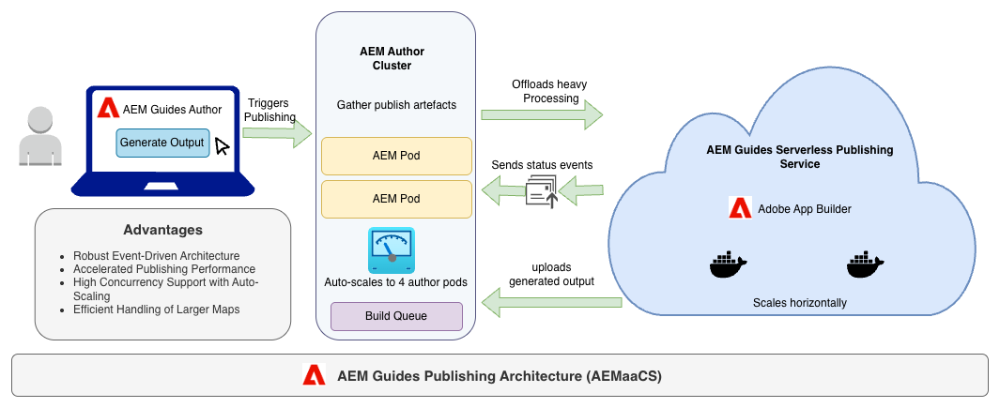

# 常見問題

以下是常見問題的解答清單，提供Adobe Experience Manager Guides如何管理發布工作流程、擴展行為和基礎架構效能的詳細深入分析。 適合使用Experience Manager Guides進行大規模發佈的企業使用者、管理員和檔案團隊使用。 此圖表說明Experience Manager Guides發佈架構的整體工作流程。

{align="left"}

## Experience Manager Guides每天可以執行多少個發佈請求？

Experience Manager Guides每天可處理的發佈要求數目，取決於內容的大小和型別。 根據設定，系統允許每個處理器核心有一個發佈工作。 在目前的設定中，可同時執行20個發佈工作(每個2個Pod×10個核心)。

當生產環境自動擴展時，當pod擴展到4時，此數量可以增加到40個同時發佈的工作。

## 排入佇列之前，可同時執行多少發佈要求？

- 最小（預設）：20個發佈工作（2個pod）
- 最大（縮放）：40個發佈工作（4個pod）

此數目可能會因整體伺服器負載而異。 如果其他背景Sling工作正在執行，則會共用處理核心，可能會將並行度降至20個以下。

## 執行多個發佈請求是否會影響其他應用程式功能，例如編輯.dita檔案？

可能會對效能造成一些影響，但通常影響很小。 大部分繁重處理作業會在IO執行階段（無伺服器發佈服務）發生，而AEM執行個體主要執行相依性產生和狀態輪詢的I/O操作。 因此，AEM中的CPU使用率持續偏低，編寫/編輯體驗基本上不受影響。

## Experience Manager Guides如何管理大型檔案和圖形，例如超過500 KB的SVG或.dita檔案？

所有大型檔案都會壓縮並儲存在JCR （Java內容存放庫）中。 IO執行階段會在起始發佈前擷取完整的zip套件。 即使處理多個大型檔案（例如，每個500 KB），由於最佳化的封裝和平行I/O處理，因此這也不會大幅影響下載或傳輸速度。

## Experience Manager Guides使用的發佈基礎結構和設定是什麼？

Experience Manager Guides使用容器化、無伺服器的微服務進行發佈。 發佈服務的每個新版本都會以Docker映像的形式發佈，並自動部署在Adobe的雲端環境中。 此設計可確保：

- 客戶不需進行專門的基礎建設維護
- 自動縮放以處理發佈需求
- 快速更新，停機時間最短

## 如果發佈佇列或管理系統因超載而當機，其他AEM功能是否會受到影響？

不需要，Experience Manager Guides是建置容錯架構。 如果發佈佇列體驗過載，則會自動重試請求，並且pod會自動調整規模以處理額外負載。 超出特定臨界值時，會套用負載節流以維持穩定性。 其他應用程式領域（製作、檢閱、資產管理）則不受影響。

## 是否有監視工具或記錄存取權來識別Experience Manager Guides何時處於高負載（類似Jenkins監視）？

否，目前您無權存取內部監控工具。 對於Adobe內部團隊，可使用以下方式完成監控：

- 記錄檔和錯誤追蹤的Splunk
- 用於檢查pod層級效能和縮放行為的Kubernetes (K8s) CLI

如果發現效能降低，客戶應聯絡Adobe支援以開始調查和分析。

## 將發佈要求傳送至微服務前會進行什麼處理？

當您從Map主控台的「預設集」索引標籤觸發發佈要求時，就會出現下列步驟：

1. 系統會接受要求，並驗證基準和條件預設集。
2. AEM會彙總所有合格DITA資產和相依性。
3. 這些資產會整合至郵遞區號套件中。
4. 無伺服器發佈服務會啟動Docker容器、下載資產、執行發佈操作，並將產生的輸出成品放回Experience Manager Guides。

此工作流程可確保可靠、獨立且可擴充的發佈執行。

## 地圖在微服務容器上開始發佈之前需要多久的時間，以及定義這個時間的因素為何？

發佈要求通常需要幾分鐘才會分派至微服務容器。 此初始時間用於AEM中的相依性彙總。

在無伺服器發佈服務收到請求後，發佈時間總計會根據：

- DITA map的大小
- 主題和媒體資產數量
- 條件式內容和格式化規則的複雜性

較大或較複雜的地圖可能會以等比例花較長的時間發佈。

## Experience Manager Guides是否可優先處理佇列中的發佈請求（而非先來、先得）？

目前，所有發佈工作一律平等，並遵循先來先得(FCFS)模式。 目前沒有可用的優先順序機制。

但是，在未來的版本中，優先順序邏輯（例如，根據工作大小或業務重要性）可作為佇列最佳化增強功能的一部分引入。

## Experience Manager Guides如何處理發佈請求的自動縮放功能？

Experience Manager Guides發佈基礎結構支援根據負載自動縮放。 當發佈需求增加時：

- 其他Pod （容器）會自動旋轉。
- 每個Pod可同時處理多個發佈工作。
- 負載降低後，Pod就會縮小規模，以最佳化成本與效能。

這可確保高可用性、一致的效能，以及在尖峰負載期間最短的佇列時間。

## 如果發佈工作失敗或逾時，會發生什麼情況？

如果發佈要求因暫時性問題（例如網路中斷、服務逾時）而失敗：

- 會根據發佈服務中設定的重試邏輯自動重試。
- 記錄檔和錯誤訊息會在後端擷取，以供診斷之用。
- 您可以檢視失敗狀態，並視需要從Map主控台手動重試發佈。

## 您可以監視或追蹤發佈工作的進度嗎？

是，Experience Manager Guides會在Map主控台的「預設集」標籤中提供即時工作狀態更新，包括：

- 工作開始和完成時間
- 目前階段（壓縮、分派、發佈或上傳結果）
- 錯誤通知（如果有）

這可協助您瞭解工作進度，並識別可能的延遲。

## 哪些最佳實務可以改善Experience Manager Guides中的發佈效能？

若要確保最佳發佈速度，請遵循下列最佳實務：

- 避免不必要的大型影像檔案或未參考的主題
- 使用基準線來限制發佈的範圍
- 讓DITA map階層易於管理且井然有序
- 排程在非尖峰時段的大量發佈
- 有效使用條件篩選器來減少處理負載

